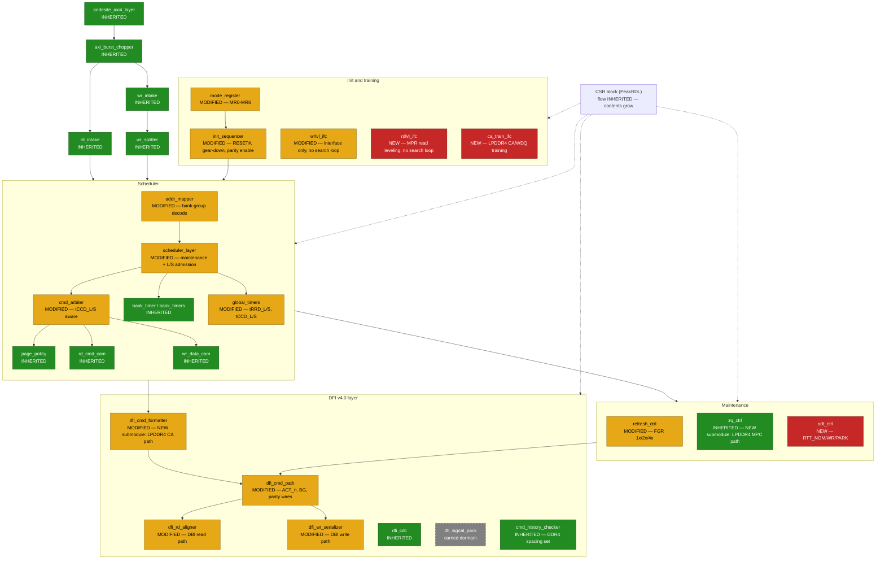

<!-- RTL Design Sherpa Documentation Header -->
<table>
<tr>
<td width="80">
  
</td>
<td>
  <strong>RTL Design Sherpa</strong> · <em>Learning Hardware Design Through Practice</em> 
  
    <a href="https://github.com/sean-galloway/RTLDesignSherpa">GitHub</a> ·
    <a href="https://github.com/sean-galloway/RTLDesignSherpa/blob/main/docs/DOCUMENTATION_INDEX.md">Documentation Index</a> ·
    <a href="https://github.com/sean-galloway/RTLDesignSherpa/blob/main/LICENSE">MIT License</a>
  
</td>
</tr>
</table>

---

<!-- End Header -->

# Block Diagram

## The whole controller, marked against scoria

Read this figure first. The colour of each block tells you the size of this
project: green blocks are scoria's, used as-is; amber blocks change in named,
bounded ways; red blocks are new. One grey block is carried dormant — present
in the RTL, unexercised at this design point, with the waking condition named
in Chapter 3.1.

### Figure 2.1: andesite block diagram, with inheritance marking

: Figure 2.1: andesite DDR4/LPDDR4, inherited (green), modified (amber), new (red), dormant (grey)

**Source:** [01_block_diagram.mmd](../assets/mermaid/01_block_diagram.mmd) — the fence above
and the `.mmd` file carry the same source; the doc pipeline renders it to PNG
at build time. The layout is split into host, scheduler, maintenance, init and
training, and DFI subgraphs rather than drawn wide.

## Reading the figure

**The front end is entirely green.** The AXI4 interface — read and write
intakes, the write-data CAM's front side, the burst chopper, the FSM-free
split/aggregate — is untouched by the move to DDR4. Nothing about DDR4 or
LPDDR4 reaches the host side.

**The scheduler is green in structure, amber at the edges.** The FR-FCFS
arbiter mechanism, the per-(rank,bank) bank timers and the page policy are
inherited. What turns amber is bank-group awareness: the address mapper grows
the BG decode, the arbiter and the global timers learn the long/short pairs,
and the scheduler keeps admitting maintenance traffic the way scoria's does —
request/grant, never preempt (family doctrine 2).

**Important:** one inherited detail must be inherited *including its fix*.
scoria's `global_timers` inherited pumice's next-state-function fix (pumice
ISSUE-018: readiness flags published one cycle late, which permitted tCCD and
tRTW violations). andesite inherits the fixed form the same way; a fresh
implementation of the same block from the same description would reintroduce
the bug.

**The amber maintenance block is refresh, for FGR.** `refresh_ctrl` turns
amber because DDR4's fine-granularity refresh (1x/2x/4x, selected in MR3)
adds a density dimension on top of the mechanism scoria landed with TASK-001
(elastic refresh, TCR, ZQCS placement — the policy base andesite keeps, Ch
3.4). `zq_ctrl` stays green for DDR4 — DDR4 keeps `ZQCS`/`ZQCL` exactly as
scoria issues them — with a red submodule for LPDDR4, whose calibration rides
the MPC command.

**The red blocks are three, and all three are bounded.** `odt_ctrl` is new
because dynamic ODT has no scoria counterpart. `rdlvl_ifc` and
`ca_train_ifc` are new because read leveling and LPDDR4 CA/WDQ training have
none. All three are interfaces with telemetry; none contains a search loop.

**The grey block is `dfi_signal_pack`, carried dormant.** The pack stage
stays a registered pipeline; its DFI 4.0 frequency-ratio variants go
unexercised at this design point. The waking conditions for it and
`powerdown_ctrl` are named in Chapter 3.1.

## What the figure deliberately omits

The PHY, because DFI is the boundary. Any training-search state machine,
because the searches live in firmware per the D2 precedent. The DDR5-oriented
signals of DFI v4.x, because andesite does not implement them. Each absence
is named somewhere in this book so it reads as a decision rather than an
oversight.
