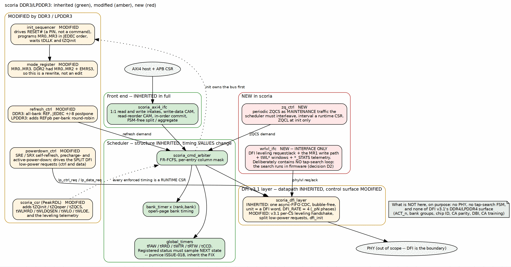

<!-- RTL Design Sherpa Documentation Header -->
<table>
<tr>
<td width="80">
  
</td>
<td>
  <strong>RTL Design Sherpa</strong> · <em>Learning Hardware Design Through Practice</em> 
  
    <a href="https://github.com/sean-galloway/RTLDesignSherpa">GitHub</a> ·
    <a href="https://github.com/sean-galloway/RTLDesignSherpa/blob/main/docs/DOCUMENTATION_INDEX.md">Documentation Index</a> ·
    <a href="https://github.com/sean-galloway/RTLDesignSherpa/blob/main/LICENSE">MIT License</a>
  
</td>
</tr>
</table>

---

<!-- End Header -->

# Block Diagram

## The whole controller, marked against pumice

Read this figure first. The colour of each block tells you the size of this
project: green blocks are pumice's, used as-is; amber blocks change in named,
bounded ways; red blocks are new, and there are two.

### Figure 2.1: scoria block diagram, with inheritance marking

**Source:** [01_block_diagram.dot](../assets/graphviz/01_block_diagram.dot)

## Reading the figure

**The front end is entirely green.** The AXI4 interface — 1:1 read and write
intakes, the write-data CAM, the read-reorder CAM, in-order commit, and the
FSM-free split/aggregate — is untouched by the move to DDR3. Nothing about
DDR3 or LPDDR3 reaches the host side.

**The scheduler is green in structure, and its timing *values* change.** The
FR-FCFS arbiter, the per-(rank,bank) bank timers and the global timers are
inherited. What changes is the numbers they enforce, and those are runtime CSRs
rather than structure.

**Important:** one inherited detail must be inherited *including its fix*.
pumice's `global_timers` published readiness flags one cycle late — registered
status sampled the current state instead of the next — so the flags alone
permitted violations of tCCD and tRTW. That was pumice ISSUE-018, and the fix
was to compute one next-state function and feed both the counter and its status
flop from it. scoria inherits the fixed form. A fresh implementation of the same
block from the same description would reintroduce the bug.

**The amber blocks are the four the standards change:** the init sequencer, the
mode-register block, refresh, and power-down — plus the CSR block, which grows
to hold the new timings.

**The red blocks are the two new ones**, and both are deliberately small: a ZQ
controller that issues periodic `ZQCS` as maintenance traffic, and a
write-leveling interface that contains no search loop.

## What the figure deliberately omits

The PHY, because DFI is the boundary. A tap-search state machine, because
decision D2 puts the search in firmware. And DFI v3.1's DDR4/LPDDR4 signals,
because scoria does not implement them. The note in the figure says so, so that
their absence reads as a decision rather than an omission.
