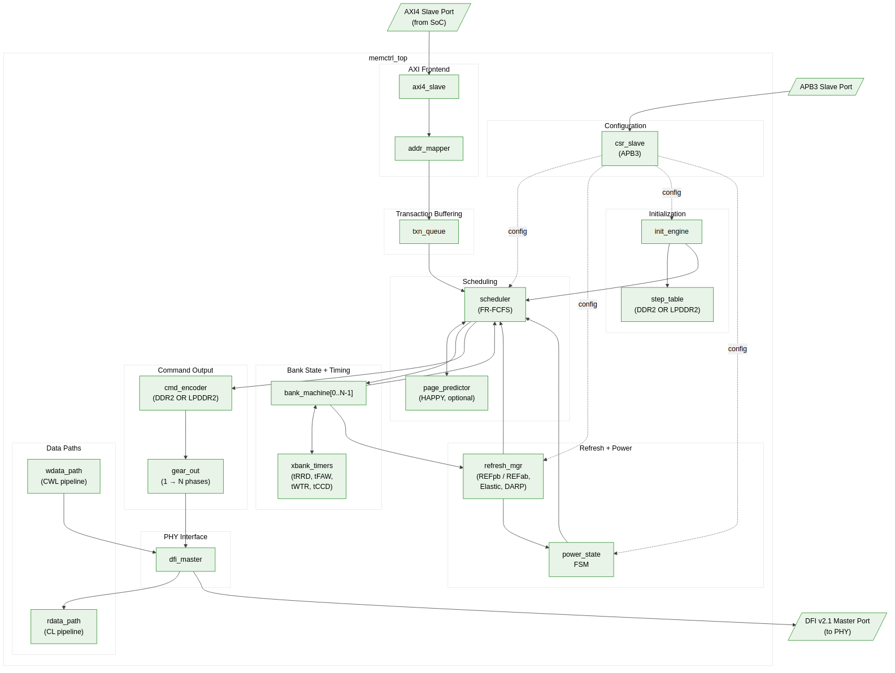

<!-- RTL Design Sherpa Documentation Header -->
<table>
<tr>
<td width="80">
  
</td>
<td>
  <strong>RTL Design Sherpa</strong> · <em>Learning Hardware Design Through Practice</em> 
  
    <a href="https://github.com/sean-galloway/RTLDesignSherpa">GitHub</a> ·
    <a href="https://github.com/sean-galloway/RTLDesignSherpa/blob/main/docs/DOCUMENTATION_INDEX.md">Documentation Index</a> ·
    <a href="https://github.com/sean-galloway/RTLDesignSherpa/blob/main/LICENSE">MIT License</a>
  
</td>
</tr>
</table>

---

<!-- End Header -->

# Block Diagram

## Top-Level Block Diagram

The controller's top-level data and control flow is shown below. AXI4 traffic
enters at top-left into `axi_frontend_macro`, which decodes addresses and
pushes per-direction slot records into its CAMs. The
`command_scheduler_macro` queries the CAMs each cycle and picks the next
command. The `dfi_v21_interface_macro` formats the chosen command into DFI
v2.1 wires. The `data_path_macro` runs in parallel, moving W beats out and
returning R beats in alignment with the scheduled commands.

**Source:** [01_block_diagram.mmd](../assets/mermaid/01_block_diagram.mmd)

## Data Flow Summary

**Write path:**
1. AXI master issues an AW transaction; `axi_intake` accepts and staging W
   beats land in `w_buf`.
2. `addr_mapper` translates the flat AXI address into (rank, bank, row, col).
3. `wr_cmd_cam` accepts the slot record with (rank, bank, row, len, slot
   metadata).
4. `scheduler` queries wr/rd CAMs against per-(rank,bank) `act_ready` /
   `rdwr_ready` from `xbank_timers` and global windows from `global_timers`;
   picks the next CMD (ACT, WR/WRA, PRE, REF, MRS, NOP).
5. `dfi_cmd_formatter` encodes the CMD into DFI cs_n / ras_n / cas_n /
   we_n / address / bank wires; closed-page policy uses WRA (auto-precharge).
6. `dfi_signal_pack` aggregates the per-phase DFI control bus.
7. CWL cycles after WR, `wr_beat_sequencer` pulls W beats from `w_buf` via
   `beat_pull`, packs them into DFI_RATE beats per DFI cycle, and drives
   `dfi_wrdata` / `dfi_wrdata_en` / `dfi_wrdata_mask`.
8. `wr_beat_sequencer` emits `b_complete` to `wr_cmd_cam` on retire;
   `axi_intake.b_fifo` returns the B-response to the AXI master.

**Read path:**
1. AXI master issues an AR transaction; `axi_intake` accepts.
2. Address mapping identical to write path; `rd_cmd_cam` accepts the slot
   record.
3. `scheduler` issues ACT, then RD / RDA via `dfi_cmd_formatter`.
4. `rd_cl_aligner` drives `dfi_rddata_en` `t_rddata_en` cycles after the
   RD command; captures `dfi_rddata` beats for the burst.
5. `rd_cl_aligner` streams DRAM-beat-wide `rd_inject_*` handshakes to
   `axi_intake.R-emit`, which tags them with the original AXI ID and
   returns on the R channel.
6. The `wr2rd_forward` snarf path bypasses the DRAM for reads that hit an
   in-flight write on the same line.

**Refresh path:**
1. `refresh_ctrl`'s tREFI counter elapses, incrementing the
   `refresh_pending` accumulator (JEDEC max 8 postponed).
2. When `refresh_pending` exceeds the soft threshold, refresh becomes
   highest-priority in the scheduler.
3. For REFab: scheduler waits for all banks idle (via `xbank_timers`),
   then issues REF; per-bank counters reset.
4. (LPDDR2 REFpb under DARP planned for v2.)

**Init / power path:**
1. On cold reset, `init_sequencer` asserts `init_busy_o`; scheduler
   blocks AXI traffic.
2. `init_sequencer` executes the memtype-specific step table, driving
   CKE / RESET_N and issuing MR-write strobes into `mode_register`.
   `mode_register` propagates live CL / CWL / BL / AL to the data path.
3. On completion, `init_busy_o` deasserts; scheduler begins servicing
   AXI traffic.
4. Power-down / self-refresh entry is managed by `powerdown_ctrl`'s
   FSM (Active / APD / SR / DPD), with SR-entry coordinated with
   `refresh_ctrl`.

Detailed per-module behavior follows in Chapter 3.
