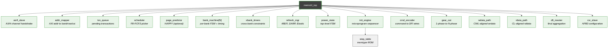

<!-- RTL Design Sherpa Documentation Header -->
<table>
<tr>
<td width="80">
  <a href="https://github.com/sean-galloway/RTLDesignSherpa">
    
  </a>
</td>
<td>
  <strong>RTL Design Sherpa</strong> · <em>Learning Hardware Design Through Practice</em><br>
  <sub>
    <a href="https://github.com/sean-galloway/RTLDesignSherpa">GitHub</a> ·
    <a href="https://github.com/sean-galloway/RTLDesignSherpa/blob/main/docs/DOCUMENTATION_INDEX.md">Documentation Index</a> ·
    <a href="https://github.com/sean-galloway/RTLDesignSherpa/blob/main/LICENSE">MIT License</a>
  </sub>
</td>
</tr>
</table>

---

<!-- End Header -->

# Module Hierarchy

The controller is decomposed into **16 leaf FUBs grouped under 5 macros**.
Each FUB is independently verified at the unit level; each macro is verified
as an integration unit. See [FUB Breakdown](05_fub_breakdown.md) for the
per-FUB role descriptions and [Chapter 3](../ch03_architecture/) for the
behavioral details.

## Hierarchy Tree



**Source:** [02_module_hierarchy.mmd](../assets/mermaid/02_module_hierarchy.mmd)

## Three-Tier Organization

```
SoC level
└── ddr2_lpddr2_core_macro          ← outermost macro the SoC instantiates
    ├── command_scheduler_macro     ← "what command to issue this cycle"
    ├── data_path_macro             ← "move bytes between AXI and DFI"
    └── dfi_v21_interface_macro     ← "translate to DFI v2.1 wires"

axi_frontend_macro                  ← parallel; lives next to core_macro
                                      under the top-of-tree integration
```

The `axi_frontend_macro` is intentionally outside `ddr2_lpddr2_core_macro`
so it can be reused by a different DFI version (v3/v4/v5/v6) controller
without changes — only the `dfi_v21_interface_macro` swap is needed for
DFI version changes.

## FUB Groupings

| Macro                          | FUBs                                                                                                                       |
|--------------------------------|----------------------------------------------------------------------------------------------------------------------------|
| `axi_frontend_macro`           | `axi_intake`, `addr_mapper`, `wr_cmd_cam`, `rd_cmd_cam`, `wr2rd_forward`                                                   |
| `command_scheduler_macro`      | `scheduler`, `xbank_timers`, `global_timers`, `refresh_ctrl`, `powerdown_ctrl`, `mode_register`, `init_sequencer`          |
| `data_path_macro`              | `wr_beat_sequencer`, `rd_cl_aligner`                                                                                       |
| `dfi_v21_interface_macro`      | `dfi_cmd_formatter`, `dfi_signal_pack`                                                                                     |
| `ddr2_lpddr2_core_macro`       | (wraps `command_scheduler_macro` + `data_path_macro` + `dfi_v21_interface_macro`)                                          |

Chapter 3 follows the function-group ordering (one section per
architectural layer, with module names hyperlinked to their MAS chapters).

## Memtype-Conditional Logic

Two FUBs contain memtype-conditional logic that is selected at elaboration:

- **`dfi_cmd_formatter`** — JEDEC truth table is DDR2-specific in v1; an
  LPDDR2 variant (CA-bus packed) will be selected at elaboration by
  `MEMTYPE` in a future revision.
- **`init_sequencer`** — its step table is loaded from either
  `ddr2_init_steps_pkg` or `lpddr2_init_steps_pkg`.
- **`powerdown_ctrl`** — handles Self-Refresh (DDR2) or Deep Power Down
  (LPDDR2) entry sequences.

Synthesis dead-code-eliminates the unused paths. The same RTL source
supports both targets.

## Strict-Flop Output Convention

Every FUB output port is the Q of a dedicated flop. No combinational
output drivers. This adds one register stage per macro boundary but
guarantees hierarchical timing closure and clean lint coverage. See
commit 97a91fb8 for the refactor that established this.

## What Changed vs Early SWAG

The SWAG proposed ~17 modules in a flat hierarchy. The implementation
diverged: see [FUB Breakdown § Divergence](05_fub_breakdown.md#divergence-from-the-early-swag)
for the full SWAG → reality mapping. Notably:

- **Removed**: `txn_queue`, `page_predictor`, `bank_machine`, `odt_ctrl`
  (absorbed into CAMs, scheduler, xbank_timers, dfi_cmd_formatter
  respectively)
- **Added**: `wr_cmd_cam`, `rd_cmd_cam`, `wr2rd_forward`, `mode_register`,
  `global_timers`
- **Introduced**: 5-macro grouping for synthesis hierarchy
