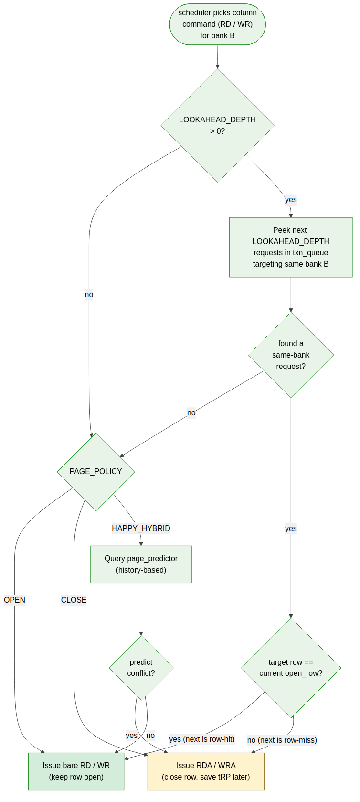
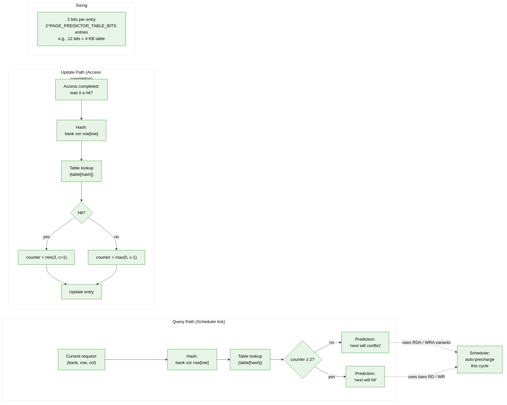

<!-- RTL Design Sherpa Documentation Header -->
<table>
<tr>
<td width="80">
  
</td>
<td>
  <strong>RTL Design Sherpa</strong> · <em>Learning Hardware Design Through Practice</em> 
  
    <a href="https://github.com/sean-galloway/RTLDesignSherpa">GitHub</a> ·
    <a href="https://github.com/sean-galloway/RTLDesignSherpa/blob/main/docs/DOCUMENTATION_INDEX.md">Documentation Index</a> ·
    <a href="https://github.com/sean-galloway/RTLDesignSherpa/blob/main/LICENSE">MIT License</a>
  
</td>
</tr>
</table>

---

<!-- End Header -->

# Scheduler and Page Predictor

This section covers two tightly-coupled modules: the FR-FCFS scheduler that picks the next request to issue, and the optional HAPPY page predictor that informs the scheduler's auto-precharge decisions.

## `txn_queue`

### Purpose

Hold pending memory transactions with the metadata the scheduler needs to make priority decisions.

### Entry Format

Each slot in the queue carries:

| Field        | Width                       | Purpose                                      |
|--------------|-----------------------------|----------------------------------------------|
| `valid`      | 1                           | Slot occupied                                |
| `axi_id`     | `AXI_ID_WIDTH`              | Originating AXI transaction ID               |
| `is_write`   | 1                           | Write (1) vs read (0)                        |
| `bank`       | `$clog2(NUM_BANKS)`         | Target bank                                  |
| `row`        | `ROW_WIDTH`                 | Target row                                   |
| `col`        | `COL_WIDTH`                 | Target starting column                       |
| `burst_len`  | 8                           | AXI len + 1 (max 256)                        |
| `row_hit`    | 1                           | Cached at insert                             |
| `age`        | `$clog2(AGE_MAX)`           | Saturating age counter                       |
| `state`      | 2                           | `{PENDING, ISSUED, COMPLETING}`              |

### Depth

`TXN_QUEUE_DEPTH` (default 16; parameterizable 4–64).

### Behavior

- New entries are inserted by `axi4_slave` via `addr_mapper`.
- `row_hit` is computed at insert time by querying the relevant bank machine's current `open_row` register. Caching this avoids per-cycle recomputation in the scheduler.
- `age` increments every cycle and saturates at `AGE_MAX` (default 256).
- The scheduler reads the entire queue snapshot each cycle to choose the next issue candidate.
- Entries transition `PENDING → ISSUED` when the scheduler picks them, then `→ COMPLETING` when the corresponding data beats are flowing, then deallocate when complete.

---

## `scheduler`

### Purpose

Pick the next request to issue and dispatch its corresponding DRAM command. Implements FR-FCFS with characterization knobs for page policy and refresh prioritization.

### Inputs

- Queue snapshot (all entries' metadata)
- Per-bank state from each `bank_machine` (idle / activating / active / precharging)
- Refresh request from `refresh_mgr` with priority level
- Init-in-progress signal (pauses normal scheduling)
- Page predictor signal (when HAPPY enabled)

### Outputs

- `issue_valid` — 1 when a command is being issued this cycle
- `issue_op` — `{ACT, RD, RDA, WR, WRA, PRE, PREA, REF, REFPB, MRS, ZQCS, ZQCL, NOP}`
- `issue_bank`, `issue_row`, `issue_col`, `issue_axi_id` — operands

### Priority Function

Evaluated each cycle (descending priority):

1. **Init in progress** — block all normal traffic; init commands take a parallel path.
2. **Critical refresh** (`refresh_pending ≥ critical_threshold`) — REF / REFpb wins all ties.
3. **Soft refresh** (`refresh_pending ≥ soft_threshold`) — boost refresh above row-misses but allow row-hits.
4. **Row-hit ready columns** — same bank's open row matches request row; bank machine accepts column command.
5. **Age-ordered FCFS among row-hits** — oldest wins.
6. **Row-miss requests** — bank needs PRE then ACT first.
7. **Idle (NOP)**.

### Strict In-Order Mode

For systems that require deterministic, in-order issue — real-time / safety-critical / formally-verifiable timing targets — the scheduler can be forced into a first-ready FIFO mode. Two routes:

**Runtime debug switch (recommended).** When `SCHEDULER_MODE = OOO` is synthesized (the default), setting `SCHED_TUNING.force_inorder = 1` collapses the priority function to first-ready FIFO at runtime. The OoO comparator logic is still in silicon but its outputs are masked. Switching is a single CSR write, takes effect at the next configuration quiet point, and is fully reversible.

**Build-time omission.** Setting `SCHEDULER_MODE = INORDER` at elaboration omits the FR-FCFS comparator logic entirely, saving area. Once chosen, the design cannot switch back to OoO at runtime — `SCHED_TUNING.force_inorder` becomes a tied-high observation bit. Pick this only if the area savings are critical and OoO will never be needed.

In either form, the in-order behavior is:

- Only the **first-ready filter** survives. The scheduler still skips requests whose target bank is blocked by timing constraints (otherwise it would waste cycles on requests that can't issue), but it does not reorder requests for row-hit benefit.
- **Row-hit prioritization is disabled.** Requests are considered strictly in `txn_queue` arrival order.
- **Age-based ties become moot** — the queue is already age-ordered by construction.
- **Refresh priority still applies** (the refresh path is a JEDEC requirement, not a performance choice).
- **HAPPY and lookahead are unaffected at elaboration** but can be independently disabled via runtime CSR (`SCHED_TUNING.happy_enable = 0`, `SCHED_TUNING.lookahead_active = 0`). For pure first-ready FIFO with neither, set all three CSR bits.
- **AXI per-ID ordering is honored regardless.** The change here is only at the DRAM-issue layer, not at the AXI completion layer.

Trade-off: in-order mode reduces sustained bandwidth on streaming workloads typically 10–25% (the cost of not reordering row-conflicts behind row-hits), but issue latency becomes deterministic and the design is much easier to formally verify. The runtime-switchable form is preferred for shipping designs because it preserves debug flexibility at the cost of the silicon area for the unused OoO logic.

### Auto-Precharge Decision: Lookahead + Page Policy

The decision to issue a column command as bare RD / WR (keep row open) versus the auto-precharge variant RDA / WRA (close row in flight) follows a two-stage rule. Lookahead runs first; the page policy is the fallback when lookahead is inconclusive.

#### Stage 1: Lookahead

If `LOOKAHEAD_DEPTH > 0`, the scheduler peeks the next `LOOKAHEAD_DEPTH` pending entries in `txn_queue` that target the same bank as the current command:

- If a same-bank pending request is found AND its target row equals the current `open_row`, the next access is a guaranteed row-hit. Issue the bare RD / WR so the row stays open.
- If a same-bank pending request is found AND its target row differs, the next access is a guaranteed row-conflict. Issue RDA / WRA so the precharge happens in flight (saves an explicit PRE command + tRP later).
- If no same-bank pending request is found within `LOOKAHEAD_DEPTH`, fall through to Stage 2.

When the transaction queue is deep — which is the common case for streaming / DMA workloads — lookahead provides an **exact** auto-precharge decision rather than a predicted one. The `LOOKAHEAD_DEPTH ∈ {0, 1, 2, 4}` parameter sweeps lookahead window size against comparator cost during characterization (covered in §5).

#### Stage 2: Page Policy Fallback

Triggered when lookahead is disabled (`LOOKAHEAD_DEPTH = 0`) or inconclusive (no same-bank request in the queue, typical of shallow-queue or bursty CPU traffic). Dispatched per `PAGE_POLICY`:

- **`OPEN`** — issue bare RD / WR. Rows stay open until evicted by a row-conflict or refresh. Best for streaming workloads where lookahead is usually conclusive anyway, so the OPEN fallback rarely fires.
- **`CLOSE`** — issue RDA / WRA. Always close on every access. Best for random access without temporal locality.
- **`HAPPY_HYBRID`** — query the `page_predictor` with the current request's row address. If the predictor says "next access to this bank will conflict," issue RDA / WRA; otherwise issue bare RD / WR. Recommended for bursty mixed workloads where neither lookahead nor a fixed policy is reliable.

#### Why Both

Lookahead is **provably correct** when the queue contains a same-bank request: we know exactly what the next access will be. HAPPY (and the simple OPEN / CLOSE policies) operate without that information.

The two mechanisms are complementary:

- **Deep queue, repetitive locality** (streaming, DMA): lookahead almost always resolves; the page-policy choice barely matters.
- **Shallow queue, sporadic access** (bursty CPU traffic, multi-tenant): lookahead frequently misses; the page-policy choice dominates.

`LOOKAHEAD_DEPTH` is a characterization knob in its own right — see §5.

**Source:** [10_lookahead_auto_pre.mmd](../assets/mermaid/10_lookahead_auto_pre.mmd)

### Issue Slot Allocation

One command issue per MC clock cycle. Multi-cycle LPDDR2 commands are handled inside the `cmd_encoder`, so the scheduler still sees them as a single issue.

---

## `page_predictor` (HAPPY hybrid, optional)

### Purpose

Predict whether the next access to a bank will hit the currently open row or conflict with it. Synthesized only when `PAGE_POLICY == HAPPY_HYBRID`.

### Algorithm

Address-bit-based two-level predictor following Ghasempour et al. (2015):

- Table indexed by hash of `bank` and a small selection of row-address bits
- Each entry: 2-bit saturating counter (hit-likely vs conflict-likely)
- Update on access completion: was the next access a hit or a conflict?
- Query at scheduler decision time: "for the request I'm about to issue, will the next access to this bank be a hit?"

### HAPPY Predictor Architecture

**Source:** [09_happy_predictor.mmd](../assets/mermaid/09_happy_predictor.mmd)

### Storage

Total storage: `2 × 2^PAGE_PREDICTOR_TABLE_BITS` bits.

- For `PAGE_PREDICTOR_TABLE_BITS = 12` (default): 8 Kbit (about 1 KB)
- For `PAGE_PREDICTOR_TABLE_BITS = 8`: 512 bit
- For `PAGE_PREDICTOR_TABLE_BITS = 16`: 128 Kbit (around 16 KB; large but rarely needed)

### Reset Behavior

All entries reset to "weakly hit-likely" (binary `01`) so the controller starts in open-page-like behavior. The predictor adapts to workload over the first few hundred accesses.

### Observability

A debug output exposes the rolling prediction accuracy (% correct) per bank, which the SoC can read via CSR. This is critical for tuning during bring-up and for the characterization sweep.
