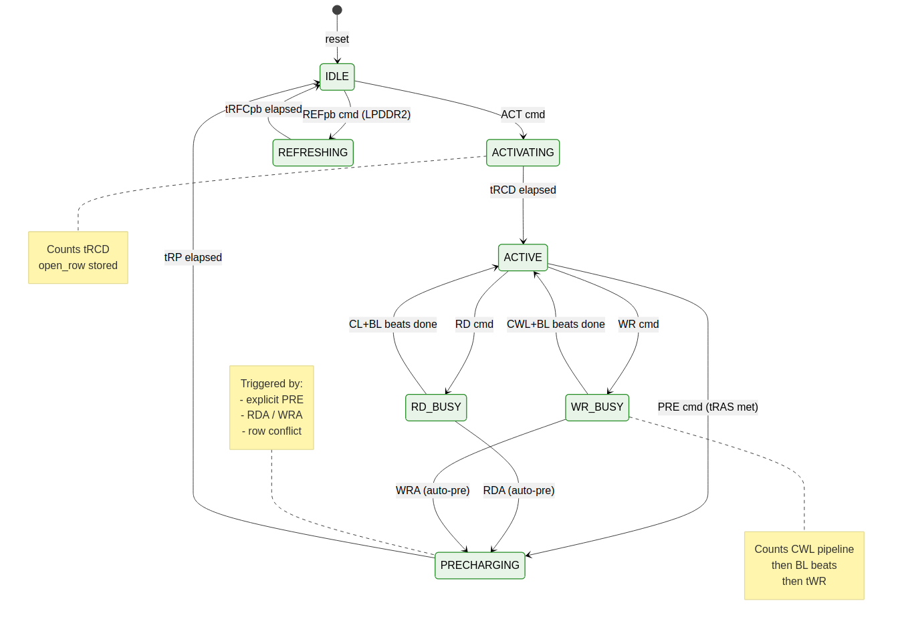

<!-- RTL Design Sherpa Documentation Header -->
<table>
<tr>
<td width="80">
  
</td>
<td>
  <strong>RTL Design Sherpa</strong> · <em>Learning Hardware Design Through Practice</em> 
  
    <a href="https://github.com/sean-galloway/RTLDesignSherpa">GitHub</a> ·
    <a href="https://github.com/sean-galloway/RTLDesignSherpa/blob/main/docs/DOCUMENTATION_INDEX.md">Documentation Index</a> ·
    <a href="https://github.com/sean-galloway/RTLDesignSherpa/blob/main/LICENSE">MIT License</a>
  
</td>
</tr>
</table>

---

<!-- End Header -->

# Bank Machines and Cross-Bank Timers

Per-bank state machines enforce JEDEC timing locally; a shared cross-bank timer pool enforces the constraints that span banks.

## `bank_machine`

### Purpose

One FSM instance per bank. Enforces per-bank JEDEC timing constraints; tracks open-row state.

### Instantiation

`NUM_RANKS × NUM_BANKS` instances — one FSM per (rank, bank) pair. For the default (`NUM_RANKS=1`, `NUM_BANKS=8`) this is 8 instances; for a 2-rank DIMM with 8-bank devices it is 16; for a 4-rank configuration it is 32. The (rank, bank) tuple is the bank machine's index; all per-bank state (`open_row`, timing counters, `last_ref_age`) is independent across ranks because JEDEC tracks every rank's banks separately.

### FSM States

| State          | Description                                       |
|----------------|---------------------------------------------------|
| `IDLE`         | Bank closed; ready to accept ACT                  |
| `ACTIVATING`   | Counting tRCD; row is being opened                |
| `ACTIVE`       | Row open; ready for RD / WR                       |
| `RD_BUSY`      | Read in progress; counting CL for data return     |
| `WR_BUSY`      | Write in progress; counting CWL + tWR window      |
| `PRECHARGING`  | Counting tRP                                      |
| `REFRESHING`   | Counting tRFCpb (per-bank refresh)                |

### FSM Diagram

**Source:** [03_bank_machine_fsm.mmd](../assets/mermaid/03_bank_machine_fsm.mmd)

### Per-Bank Registers

| Register          | Width                   | Purpose                                       |
|-------------------|-------------------------|-----------------------------------------------|
| `open_row`        | `ROW_WIDTH`             | Valid in `{ACTIVE, RD_BUSY, WR_BUSY}`         |
| `t_rcd_cnt`       | small                   | tRCD down-counter (loaded on ACT issue)       |
| `t_ras_cnt`       | small                   | tRAS down-counter                              |
| `t_rp_cnt`        | small                   | tRP down-counter                               |
| `t_rc_cnt`        | small                   | tRC down-counter                               |
| `t_wr_cnt`        | small                   | tWR down-counter                               |
| `t_rfcpb_cnt`     | small                   | tRFCpb down-counter                            |
| `last_ref_age`    | wider                   | Cycles since last refresh (for DARP / OLDEST_FIRST) |

All counters saturate at zero.

### Outputs to Scheduler

- `state` — current FSM state
- `open_row` — row register (valid when state ∈ active set)
- `accepts_act` — combinational: 1 when state == IDLE and t_rp_cnt == 0
- `accepts_rd`, `accepts_wr` — 1 when state == ACTIVE and constraints met
- `accepts_pre` — 1 when state == ACTIVE and t_ras_cnt == 0
- `accepts_ref` — 1 when state == IDLE
- `last_ref_age` — exposed to refresh manager

### Refresh Handshake Interface

In addition to the scheduler-side signals above, each bank machine exposes a dedicated **refresh handshake** pair to the `refresh_mgr`:

| Signal         | Direction          | Purpose                                                                 |
|----------------|--------------------|-------------------------------------------------------------------------|
| `refresh_req`  | refresh_mgr → bank | Refresh manager wants to issue REF; bank should drain to a quiescent state |
| `refresh_gnt`  | bank → refresh_mgr | Bank acknowledges it is in IDLE (or REFRESHING for a per-bank refresh) and the controller may proceed |

The handshake is the explicit version of "wait for all banks idle." The refresh manager asserts `refresh_req` to all bank machines; each bank machine, on completing its current activity and landing in IDLE, asserts `refresh_gnt`. The refresh manager waits until **all** bank-machine grants are high (for REFab) or the **selected** bank's grant is high (for REFpb) before issuing the actual sequence. When the refresh manager deasserts `refresh_req`, the bank machine drops `refresh_gnt` and resumes normal operation.

The handshake gives the refresh manager deterministic acknowledgment timing rather than relying on a race-prone "wait for state == IDLE" poll.

### Inputs from Cross-Bank Timers

The cross-bank timer pool feeds blocking signals:

- `xbank_blocks_act` — tRRD or tFAW prevents new ACT
- `xbank_blocks_wr_after_rd` — tCCD or tWTR prevents WR after recent RD
- `xbank_blocks_rd_after_wr` — tWTR prevents RD after recent WR data beat

These gate the per-bank `accepts_*` signals.

### Auto-Precharge Handling

RDA / WRA commands trigger an automatic transition `RD_BUSY → PRECHARGING` (or `WR_BUSY → PRECHARGING`) without a separate PRE command from the scheduler. Internal book-keeping handles the timing.

---

## `xbank_timers`

### Purpose

Enforce cross-bank timing constraints. Implemented as a single shared module rather than per-bank to share the FIFO buffer for tFAW.

### Tracked Constraints

| Constraint | Description                                                        |
|------------|--------------------------------------------------------------------|
| `tRRD`     | Minimum gap between any two ACT commands                           |
| `tFAW`     | At most 4 ACTs in any rolling tFAW window                          |
| `tWTR`     | Write-to-read column-to-column on different banks                  |
| `tCCD`     | Column-to-column (any column command to any other)                 |

### Implementation

| Constraint | Storage                                                            |
|------------|--------------------------------------------------------------------|
| `tRRD`     | Single saturating down-counter loaded on any ACT issue             |
| `tFAW`     | 4-entry FIFO of recent ACT timestamps; new ACT blocked if oldest is younger than (now − tFAW_cycles) |
| `tCCD`     | Small down-counter loaded on any RD / WR issue                     |
| `tWTR`     | Down-counter loaded on the last WR data beat completion            |

### Outputs

- Per-bank `blocks_act` / `blocks_rdwr` signals that the bank machines AND into their respective `accepts_*` outputs.

### Why Shared Rather Than Per-Bank

Cross-bank constraints are global: a single tRRD counter can be checked by all banks simultaneously, and the tFAW FIFO needs to see all recent ACTs across all banks. Replicating these per bank would be wasteful.

### Per-Rank vs. Cross-Rank Scope

When `NUM_RANKS > 1`, each cross-bank constraint must be evaluated at the correct scope:

| Constraint | Scope                  | Rationale                                                                 |
|------------|------------------------|---------------------------------------------------------------------------|
| `tRRD`     | per-rank               | tRRD limits how fast a single device can stagger ACTs; different ranks have independent activate stagger budgets |
| `tFAW`     | per-rank               | tFAW is a device-local thermal/power limit; each rank has its own 4-ACT rolling window |
| `tCCD`     | global (all ranks)     | The DQ bus is shared across ranks; column commands to different ranks still share the data window |
| `tWTR`     | global (all ranks)     | Same reason — data-bus turnaround applies regardless of rank              |
| `tRTW`     | global (all ranks)     | Same reason — data-bus turnaround applies regardless of rank              |
| `tRTRS`    | cross-rank only        | Rank-to-rank read switching delay (1 cycle DDR2/3); applies when consecutive RDs target different ranks |
| `tCS`      | cross-rank only        | Chip-select setup; only relevant when switching ranks mid-burst           |

The implementation therefore has a per-rank tRRD counter (`NUM_RANKS` copies) and a per-rank tFAW FIFO (`NUM_RANKS` copies, 4 entries each), with the global tCCD / tWTR / tRTW counters shared as before. Two additional cross-rank counters (`tRTRS_cnt`, `tCS_cnt`) are added when `NUM_RANKS > 1` and gate `accepts_rd` / `accepts_wr` whenever the candidate's rank differs from the most recent rank seen on the data bus.
