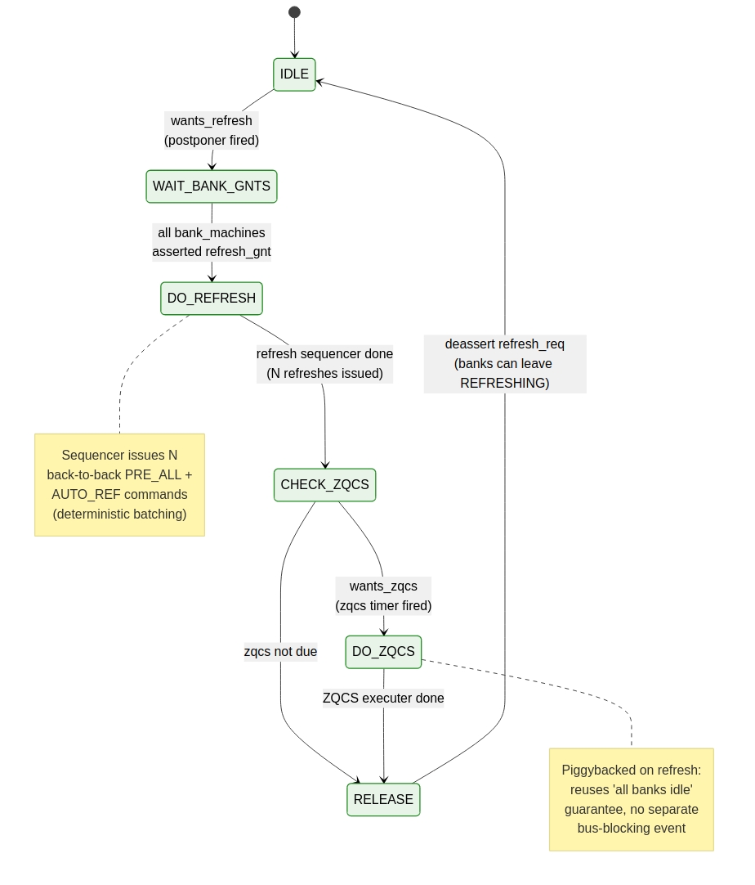
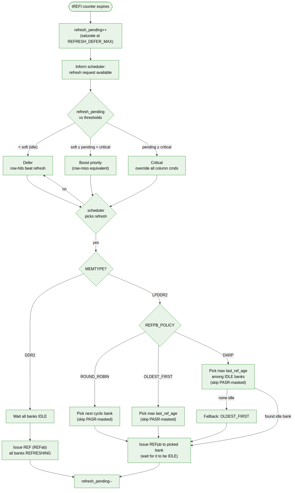

<!-- RTL Design Sherpa Documentation Header -->
<table>
<tr>
<td width="80">
  
</td>
<td>
  <strong>RTL Design Sherpa</strong> · <em>Learning Hardware Design Through Practice</em> 
  
    <a href="https://github.com/sean-galloway/RTLDesignSherpa">GitHub</a> ·
    <a href="https://github.com/sean-galloway/RTLDesignSherpa/blob/main/docs/DOCUMENTATION_INDEX.md">Documentation Index</a> ·
    <a href="https://github.com/sean-galloway/RTLDesignSherpa/blob/main/LICENSE">MIT License</a>
  
</td>
</tr>
</table>

---

<!-- End Header -->

# Refresh Manager

The refresh manager owns tREFI timing, refresh request queuing, the choice between REFab and REFpb, and the DARP-based per-bank refresh scheduling policy.

## `refresh_mgr`

### Purpose

Issue REF / REFpb commands on schedule. Honor the PASR mask. Implement Elastic-Refresh deferral up to `REFRESH_DEFER_MAX × tREFI`. Implement DARP-style idle-bank-first per-bank refresh scheduling for LPDDR2.

### Internal State

| Element                  | Description                                          |
|--------------------------|------------------------------------------------------|
| `t_refi_cnt`             | Central tREFI down-counter                           |
| `postpone_cnt`           | Down-counter from `REFRESH_DEFER_MAX − 1` to 0 (postponer batch)  |
| `refresh_owed`           | Non-saturating counter of refreshes still owed (deterministic; replaces saturating `refresh_pending`) |
| `t_zqcs_cnt`             | ZQCS interval counter (cycles between periodic ZQCS) |
| `wants_zqcs`             | One-cycle pulse when periodic ZQCS is due            |
| `pasr_bank_mask[NUM_RANKS]` | Per-rank `NUM_BANKS`-bit mask (set via CSR; mirrors each rank's MR16/17). LPDDR2 PASR is a per-rank construct because each rank has its own mode-register file. |
| `pasr_seg_mask[NUM_RANKS]` | Per-rank segment mask (set via CSR)                |
| `last_ref_cycle[R][B]`   | Per-(rank, bank) timestamp (lives in each `bank_machine`) |
| `round_robin_rank`       | Cyclic rank pointer for REFab dispatch; advanced after each refresh issue so all ranks are serviced fairly |

### Postponer Behavior (Deterministic Batching)

The postponer is a deterministic countdown that gathers `REFRESH_DEFER_MAX` deadlines, then triggers exactly that many back-to-back refreshes via the sequencer.

`t_refi_cnt` decrements from `tREFI_cycles` to zero each cycle. On reaching zero:

1. `postpone_cnt` decrements (from `REFRESH_DEFER_MAX − 1` down to 0)
2. Reload `t_refi_cnt = tREFI_cycles`
3. When `postpone_cnt` reaches 0, emit a one-cycle `wants_refresh` pulse, reload `postpone_cnt = REFRESH_DEFER_MAX − 1`, and add `REFRESH_DEFER_MAX` to `refresh_owed`

The sequencer (next subsection) then drains `refresh_owed` to zero by issuing that many back-to-back REF / REFpb commands.

**Why deterministic, not saturating.** Earlier revisions used a saturating `refresh_pending` counter that silently dropped refresh deadlines when the system stayed bandwidth-starved past 8× tREFI. JEDEC requires the controller to catch up on all missed refreshes; saturation is technically out-of-spec. The deterministic postponer counts exact refresh events over time and never drops.

Setting `REFRESH_DEFER_MAX = 1` disables batching (every tREFI fires one refresh; equivalent to no postponer).

### Temperature-Compensated Refresh (LPDDR2)

LPDDR2 part reports a temperature classification in MR4 which the SoC reads via CSR. The CSR sideband programs a `tREFI_scale` factor (1x, 0.5x, 0.25x); `tREFI_cycles` is scaled accordingly. Higher temperature → shorter tREFI → more frequent refresh.

### Controller-Level Refresh FSM

The refresh manager hosts a small top-level FSM that orchestrates the bank-grant handshake, the refresh sequencer, and the (piggybacked) periodic ZQCS:

**Source:** [11_refresh_controller_fsm.mmd](../assets/mermaid/11_refresh_controller_fsm.mmd)

State transitions:

- **IDLE** — waits for `wants_refresh` from the postponer
- **WAIT_BANK_GNTS** — asserts `refresh_req` to all bank machines (REFab) or the selected bank (REFpb); waits for the required `refresh_gnt` signals
- **DO_REFRESH** — runs the refresh sequencer that issues `REFRESH_DEFER_MAX` back-to-back PRE_ALL+AUTO_REF cycles, decrementing `refresh_owed` per issue
- **CHECK_ZQCS** — if `wants_zqcs` is asserted (periodic ZQCS due), transition to DO_ZQCS; otherwise go to RELEASE
- **DO_ZQCS** — execute ZQCS sequence (PRE_ALL → tRP → ZQCS command → wait tZQCS)
- **RELEASE** — deassert `refresh_req`; bank machines drop their grants and resume

### Periodic ZQCS Piggybacked on Refresh

Periodic ZQ Short Calibration is required for long-running silicon to compensate for thermal drift in DRAM impedance. Earlier revisions of this document put ZQCS only in the init engine step table — meaning ZQCS ran exactly once at boot and never again. That is incorrect for systems that operate for hours or longer.

**Design**: a separate `t_zqcs_cnt` counter triggers `wants_zqcs` at the rate set by `ZQCS_FREQ_HZ` (default 1 Hz). The FSM checks `wants_zqcs` at the end of a refresh sequence and runs ZQCS while the banks are still in the refresh handshake. This piggybacks on the "all banks idle" guarantee that refresh already provides — no separate bus-blocking event is needed for ZQCS.

ZQCS frequency is independent of refresh frequency. Setting `ZQCS_FREQ_HZ = 0` disables periodic ZQCS entirely (init-only behavior, for short-running systems or systems where ZQCS is managed externally).

### Temperature-Compensated Refresh (LPDDR2)

LPDDR2 part reports a temperature classification in MR4 which the SoC reads via CSR. The CSR sideband programs a `tREFI_scale` factor (1x, 0.5x, 0.25x); `tREFI_cycles` is scaled accordingly. Higher temperature → shorter tREFI → more frequent refresh.

---

### Refresh Decision Flow

**Source:** [06_refresh_decision.mmd](../assets/mermaid/06_refresh_decision.mmd)

## REFab Path (DDR2 or LPDDR2 fallback)

1. Pick the target rank `r = round_robin_rank` (advanced post-issue).
2. Assert `refresh_req` to **all** bank machines on rank `r`.
3. Wait for all bank machines on rank `r` to assert `refresh_gnt` (each does so on reaching IDLE).
4. Issue REF command via the scheduler with `CS_n[r] = 0` and all other ranks deselected.
5. Load `tRFCab_cnt` in all bank machines on rank `r`; all transition to `REFRESHING`. Other ranks continue normal operation.
6. Decrement `refresh_owed`. If `refresh_owed > 0`, advance `round_robin_rank` and the sequencer issues another back-to-back PRE_ALL+AUTO_REF cycle (to the next rank).
7. When `refresh_owed == 0`, deassert `refresh_req`; bank machines drop their grants and resume.

REFab blocks all banks **on the targeted rank** for tRFCab cycles per refresh; with batching, `REFRESH_DEFER_MAX` refreshes run back-to-back, each on the next rank in round-robin order. This is the DDR2 default and the LPDDR2 fallback when many banks need refresh simultaneously. For `NUM_RANKS=1` this collapses to the original single-rank flow.

**Why per-rank rather than all-rank REFab.** Driving REF with all `CS_n[*] = 0` would force every rank into `REFRESHING` simultaneously, wasting bandwidth on ranks that aren't yet due. The round-robin per-rank dispatch keeps the unused ranks available for normal column commands during the multi-rank-batched refresh window.

## REFpb Path (LPDDR2, default)

The REFpb path selects one bank at a time, leaving the others available. Selection policy is parameterized.

### Bank Selection Policy

Controlled by `REFPB_POLICY`. The selection space is the full **(rank, bank)** product set across all ranks:

| Policy            | Selection rule                                                        |
|-------------------|-----------------------------------------------------------------------|
| `ROUND_ROBIN`     | Cyclic through (rank, bank) tuples, skipping per-rank PASR-masked banks |
| `OLDEST_FIRST`    | Max `last_ref_age` among non-masked (rank, bank) tuples               |
| `DARP` (default)  | Max `last_ref_age` among **idle** non-masked (rank, bank) tuples; if none idle, fall back to `OLDEST_FIRST` |

Per-rank PASR masks are honored independently — bank 3 of rank 0 may be masked while bank 3 of rank 1 is active, and DARP will only pick from the unmasked tuples.

### DARP Rationale

DARP (Chang et al., HPCA 2014) wins over `ROUND_ROBIN` because real workloads have uneven bank activity. The cyclic baseline picks the next bank in sequence regardless of whether it's idle; if that bank happens to be open with a pending column command, the refresh blocks it. DARP picks among the idle banks instead, preserving column-command parallelism.

### REFpb Issue Sequence

1. Pick the target bank per `REFPB_POLICY`.
2. Assert `refresh_req` to the **selected** bank only.
3. Wait for that bank's `refresh_gnt` (it asserts on reaching IDLE; PRE if necessary — but DARP minimizes this).
4. Issue REFpb command via scheduler.
5. Load `tRFCpb_cnt` in that bank → state `REFRESHING`.
6. Other banks remain in their current states and continue to service column commands.
7. Decrement `refresh_owed`.
8. When `refresh_owed == 0`, deassert `refresh_req` for the selected bank; it drops its grant and resumes.

---

## Refresh Priority to Scheduler

With deterministic batching, the refresh manager exposes a binary priority to the scheduler:

| Condition                       | Effect                                                              |
|---------------------------------|---------------------------------------------------------------------|
| `wants_refresh == 0`            | No request; column commands flow normally                           |
| `wants_refresh == 1`            | High priority: scheduler asserts `refresh_req` immediately on the next cycle |

The scheduler always honors `wants_refresh` because the postponer has already absorbed the bandwidth flexibility (up to `REFRESH_DEFER_MAX` × tREFI worth of deferral before any refresh issues). Once the postponer fires, the refresh must complete to keep up with JEDEC's catch-up requirement.

Bandwidth flexibility is concentrated in the deferred-batch window rather than being smeared across a soft-threshold curve. This produces deterministic refresh latency profiles, preferred for real-time-sensitive systems.

---

## Self-Refresh Coordination

The refresh manager and the power-state FSM coordinate during self-refresh entry / exit:

- The power-state FSM requests self-refresh entry; the refresh manager signals when no auto-refresh is currently in progress.
- During self-refresh, the DRAM handles its own refresh internally; the controller's tREFI counter is paused.
- On self-refresh exit, the refresh manager observes the SR-exit completion signal from the power-state FSM and resumes tREFI counting.

## PASR Update Protocol

The PASR mask is written by the SoC via CSR. The refresh manager treats the mask as advisory until the next self-refresh entry. The Linux PASR Framework (LWN.net) documents the typical update pattern: the kernel writes the mask when it allocates / frees DRAM regions; the controller propagates the mask to the DRAM via MR16/17 writes on the next opportunity (typically during the SR-entry sequence).
