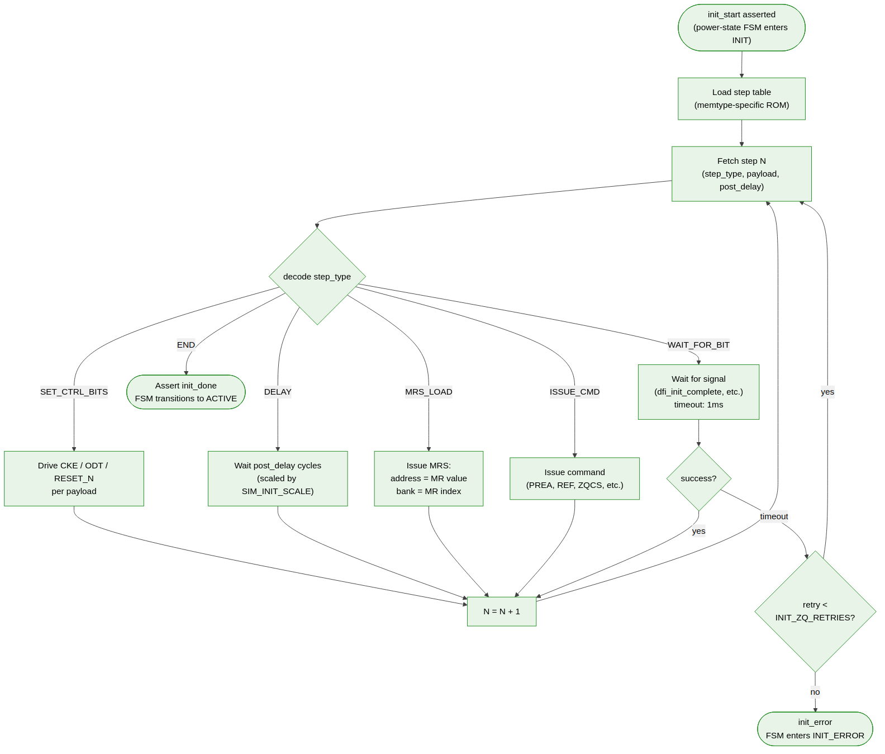
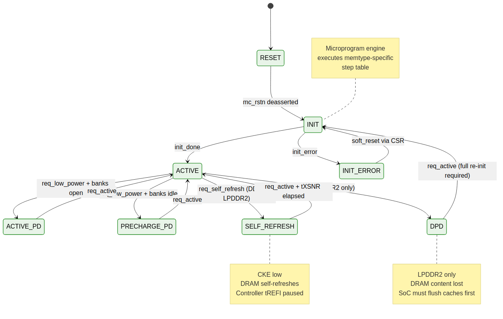

<!-- RTL Design Sherpa Documentation Header -->
<table>
<tr>
<td width="80">
  
</td>
<td>
  <strong>RTL Design Sherpa</strong> · <em>Learning Hardware Design Through Practice</em> 
  
    <a href="https://github.com/sean-galloway/RTLDesignSherpa">GitHub</a> ·
    <a href="https://github.com/sean-galloway/RTLDesignSherpa/blob/main/docs/DOCUMENTATION_INDEX.md">Documentation Index</a> ·
    <a href="https://github.com/sean-galloway/RTLDesignSherpa/blob/main/LICENSE">MIT License</a>
  
</td>
</tr>
</table>

---

<!-- End Header -->

# Init Engine and Power State

This section covers the cold-boot initialization engine and the top-level power-state FSM that owns transitions between Active, power-down, and self-refresh / deep-power-down modes.

## `init_engine` and Step Tables

### Purpose

Sequence the cold-boot initialization: CKE control, MR and EMR loads, ZQ calibration. Implemented as a small microprogram sequencer reading a memtype-specific step table ROM.

### Microprogram Instruction Format

Each step in the table is a fixed-width record:

| Field           | Width   | Purpose                                                |
|-----------------|---------|--------------------------------------------------------|
| `step_type`     | 4       | Opcode: `SET_CTRL_BITS`, `DELAY`, `MRS_LOAD`, `ISSUE_CMD`, `WAIT_FOR_BIT`, `END` |
| `payload_bank`  | 3       | Used by MRS and ISSUE_CMD                              |
| `payload_addr`  | 16      | MR address / value, or command address                 |
| `post_delay`    | 24      | Cycles to wait after step completes (scaled by `SIM_INIT_SCALE` in sim) |

### Step Tables

Two compile-time-included Verilog packages:

- **`ddr2_init_steps_pkg.sv`** — DDR2 cold-init sequence
- **`lpddr2_init_steps_pkg.sv`** — LPDDR2 cold-init sequence

The engine reads its table sequentially. On encountering `END`, asserts `init_done`.

### Init Sequence Outlines

See §6.2 for the full step lists. Summary:

- **DDR2:** 13 steps — power-up wait, CKE high, NOP, PRECHARGE all, EMRS(2/3) defaults, EMRS(1) enable DLL, MRS reset DLL, PRECHARGE all, AUTO REFRESH × 2, MRS final config, EMRS(1) OCD default, EMRS(1) OCD exit, END.
- **LPDDR2:** 13 steps — tINIT1 CKE low, tINIT2 CKE high, tINIT3 NOP, MR63 reset, tINIT5 wait, MR10 ZQ + wait for done, MR1 BL/WRAP/BT, MR2 RL/WL, MR3 drive strength, MR4 read for temp class, MR16 PASR bank mask, MR17 PASR segment mask, END.

### Outputs

| Signal           | Width   | Purpose                                              |
|------------------|---------|------------------------------------------------------|
| `init_done`      | 1       | Asserted after `END`                                 |
| `init_error`     | 1       | Asserted on step failure (timeout, ZQ failure)       |
| `init_step_dbg`  | 8       | Current step number (for bring-up observability)     |

### Init Engine Flowchart

**Source:** [05_init_engine_flow.mmd](../assets/mermaid/05_init_engine_flow.mmd)

### SIM_INIT_SCALE

Real init sequences include multi-microsecond delays (200 µs power-up wait, etc.) that are impractical to simulate at cycle granularity. The `SIM_INIT_SCALE` parameter scales delays during simulation: a value of 1 uses real values; a value of 1000 divides all delays by 1000. Silicon builds always use SIM_INIT_SCALE = 1.

### Restart on Warm Reset

The engine restarts from step zero on warm-reset deassertion. Cold reset (DRAM content lost) and warm reset (CKE gated only) take the same code path; the step table is identical. This simplifies the FSM and avoids subtle bring-up bugs.

### Error Handling

If a `WAIT_FOR_BIT` step times out (e.g., ZQ done never asserts), the engine retries up to 3 times before raising `init_error` and halting. The SoC can clear via CSR and re-issue `init_start`.

### MR Value Configurability

MR and EMR values are CSR-configurable before `init_start` is asserted, with sensible defaults baked into the step table. The step table references named CSRs (`MR0`, `MR1`, etc.), not literals, so the SoC can override `CL`, `BL`, `WL`, and PASR masks without rebuilding the controller.

---

## `power_state` (Top-Level FSM)

### Purpose

Own the top-level power-state transitions. Coordinate with the init engine, refresh manager, and scheduler when entering / exiting low-power states.

### FSM States

| State            | Description                                          |
|------------------|------------------------------------------------------|
| `RESET`          | `mc_rstn` asserted                                   |
| `INIT`           | `init_engine` running                                |
| `ACTIVE`         | Normal operation                                     |
| `ACTIVE_PD`      | Active Power-Down (CKE low, rows kept open)          |
| `PRECHARGE_PD`   | Precharge Power-Down (CKE low, all banks idle)       |
| `SELF_REFRESH`   | DDR2 self-refresh (CKE low, internal refresh)        |
| `SR_LP2`         | LPDDR2 self-refresh (same role, different exit FSM)  |
| `DPD`            | LPDDR2 Deep Power Down (content lost, requires re-init) |

### Power State Diagram

**Source:** [04_power_state_fsm.mmd](../assets/mermaid/04_power_state_fsm.mmd)

### Transitions

Transitions are driven by SoC requests via CSR:

- `req_low_power` — request entry into APD or PRECHARGE_PD
- `req_self_refresh` — request entry into SR
- `req_dpd` — request entry into DPD (LPDDR2 only)
- `req_active` — wake up to ACTIVE

The FSM defers entry until the refresh manager signals that no auto-refresh is in progress.

### Step Tables for Power Transitions

Power-state transitions reuse the microprogram engine pattern:

- `sr_entry_steps_pkg.sv` — common entry sequence (drain pending, CKE low)
- `sr_exit_steps_pkg.sv` — common exit sequence (CKE high, wait tXSNR, resume)
- `dpd_entry_steps_pkg.sv` — LPDDR2 DPD entry
- `dpd_exit_steps_pkg.sv` — LPDDR2 DPD exit (which re-runs the full init sequence)

### DPD Entry Constraints

Deep Power Down loses all DRAM content. The controller does not enforce that the SoC has flushed dirty caches before requesting DPD — that's the SoC's responsibility. The controller simply executes the transition. Misuse will cause data corruption, which is the price of the deepest-sleep mode.

### Self-Refresh Exit Latency

JEDEC requires a self-refresh-exit-to-next-command latency `tXSNR` (~200 ns for DDR2). The power-state FSM honors this with an internal counter; the scheduler is gated until the counter expires.

### Power-State Observation

Current state is exposed in the `STATUS` CSR (bits [7:4]), and the recent transition history (last 8 transitions) is exposed in `STATUS_HISTORY` for bring-up debugging.
