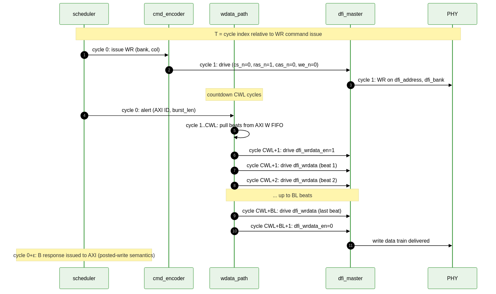
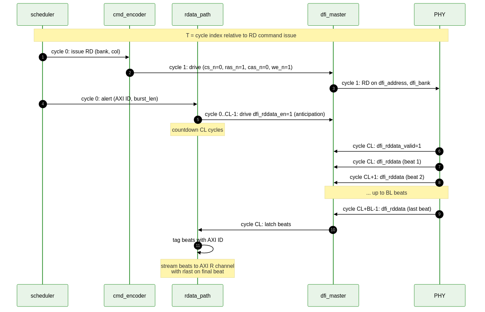

<!-- RTL Design Sherpa Documentation Header -->
<table>
<tr>
<td width="80">
  
</td>
<td>
  <strong>RTL Design Sherpa</strong> · <em>Learning Hardware Design Through Practice</em> 
  
    <a href="https://github.com/sean-galloway/RTLDesignSherpa">GitHub</a> ·
    <a href="https://github.com/sean-galloway/RTLDesignSherpa/blob/main/docs/DOCUMENTATION_INDEX.md">Documentation Index</a> ·
    <a href="https://github.com/sean-galloway/RTLDesignSherpa/blob/main/LICENSE">MIT License</a>
  
</td>
</tr>
</table>

---

<!-- End Header -->

# Write and Read Data Paths

The write and read data paths bridge the AXI W / R channels and the DFI wrdata / rddata sub-interfaces with the JEDEC-required CWL / CL timing alignment.

## `wdata_path`

### Purpose

Stream AXI W beats onto the DFI write-data bus with correct CWL alignment relative to the issued WR command.

### Inputs

- AXI W channel beats (after `axi4_slave` accepts them into the internal FIFO)
- Issued WR command notification from `scheduler` (includes AXI ID and burst length)
- CWL value from `csr_slave` (programmed at init)
- `WRPHASE` parameter from elaboration

### Outputs

- `dfi_wrdata` — write data, driven on the correct phase
- `dfi_wrdata_en` — driven high CWL cycles after the WR command for the burst duration
- `dfi_wrdata_mask` — byte mask, driven from inverted AXI strobes (DFI convention: 1 = mask, 0 = write)

### Behavior

1. On WR command issue, the scheduler tags the AXI ID and burst length.
2. The write-data path begins a CWL-cycle countdown.
3. After CWL cycles, the path pulls beats from the AXI W FIFO matching the tagged ID and drives them onto `dfi_wrdata` for the burst duration.
4. `dfi_wrdata_mask` is computed from the AXI `strb` field with bit inversion (AXI: 1 = byte enable; DFI: 1 = mask).
5. After the last beat, `dfi_wrdata_en` deasserts.

### Write Command Pipeline

**Source:** [07_wr_pipeline.mmd](../assets/mermaid/07_wr_pipeline.mmd)

### B-Response Generation

A B-channel response is generated when the WR command is **scheduled**, not when the data commits to the DRAM array. This matches AXI4 posted-write semantics and decouples B latency from DRAM-side delays.

### Write Cancellation

Not supported. Once a WR is committed by the scheduler, it must drain. The AXI master must not retract a posted write.

---

## `rdata_path`

### Purpose

Sample DFI rddata with correct CL alignment relative to the issued RD command, and stream the beats back on the AXI R channel with the correct ID and burst tagging.

### Inputs

- DFI `rddata`, `rddata_valid` — driven by the PHY
- Issued RD command notification from `scheduler` (AXI ID, burst length)
- CL value from `csr_slave`
- `RDPHASE` parameter

### Outputs

- AXI R channel — `rdata`, `rid`, `rresp`, `rlast`, `rvalid`

### Behavior

1. On RD command issue, the scheduler tags the AXI ID and burst length.
2. The read-data path begins a CL-cycle countdown.
3. After CL cycles, the path samples `rddata` and `rddata_valid` for the burst duration.
4. Valid beats are tagged with the original AXI ID and streamed onto the AXI R channel.
5. `rlast` is asserted on the final beat of each AXI transaction.

### Read Command Pipeline

**Source:** [08_rd_pipeline.mmd](../assets/mermaid/08_rd_pipeline.mmd)

### Out-of-Order Completion

The path supports out-of-order R-channel completion across AXI IDs (when `AXI_OOO_ACROSS_IDS` is enabled). Within an ID, ordering is preserved.

### Read Error Handling

If the burst's underlying PHY reports an issue (e.g., uncorrected parity error — though DDR2 / LPDDR2 don't have CA parity), `rresp` is set to `SLVERR` for the affected beats. In v1 of this controller, all reads return `OKAY`.

### Read Data Capture Timing

`CL` is programmed via CSR at init. The path uses the programmed value directly; it does not learn CL from the PHY. This works because LPDDR2 init sequence has the controller program MR2 with the desired CL / CWL values, and the same value is mirrored in CSR.

### Stale Read Suppression

If the AXI R channel is back-pressured for an extended period, the path will eventually report a timeout. The default timeout is 1024 cycles; configurable via CSR. The timeout indicates a downstream consumer is stuck, which is typically a system-level bug rather than a controller bug.
