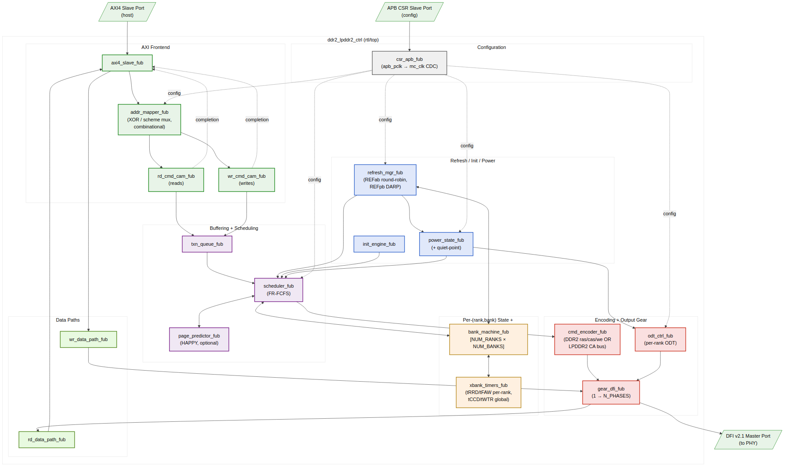
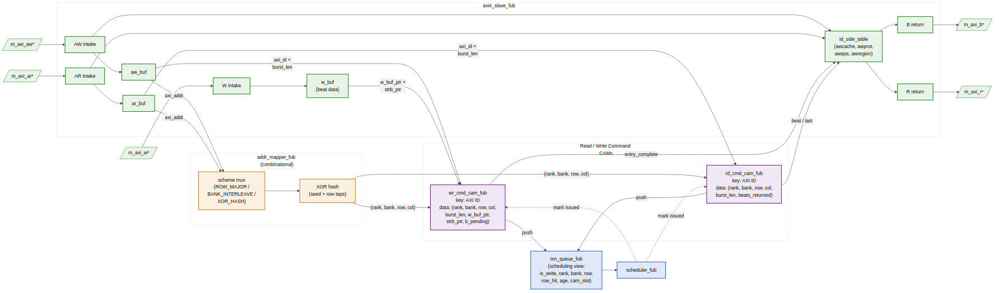
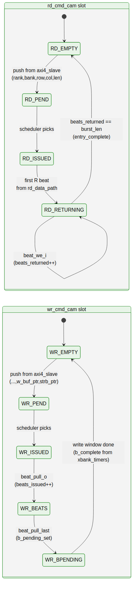

<!-- RTL Design Sherpa Documentation Header -->
<table>
<tr>
<td width="80">
  
</td>
<td>
  <strong>RTL Design Sherpa</strong> · <em>Learning Hardware Design Through Practice</em> 
  
    <a href="https://github.com/sean-galloway/RTLDesignSherpa">GitHub</a> ·
    <a href="https://github.com/sean-galloway/RTLDesignSherpa/blob/main/docs/DOCUMENTATION_INDEX.md">Documentation Index</a> ·
    <a href="https://github.com/sean-galloway/RTLDesignSherpa/blob/main/LICENSE">MIT License</a>
  
</td>
</tr>
</table>

---

<!-- End Header -->

# Architecture and Datapath

This chapter is the implementation-level architectural orientation: the top-level FUB stitching, the read/write datapath flow, and the clocking topology. Per-FUB detail is in §2.

## Top-Level FUB Topology

The controller's top is `ddr2_lpddr2_ctrl.sv` — a pure structural integration of leaf FUBs. The 18 leaf FUBs are partitioned into 7 functional groups (see HAS §2.5 for the SWAG-level group description; this section is the wire-level topology view).

**Source:** [01_top_fub_topology.mmd](../assets/mermaid/01_top_fub_topology.mmd)

The salient property: there is exactly **one** stage where AXI-layer concepts (burst, ID, write strobe) cross into DRAM-layer concepts (rank, bank, row, column). That stage is `addr_mapper` → `{rd,wr}_cmd_cam`. Upstream of `addr_mapper` everything is AXI; downstream of the CAMs everything is DRAM.

## Read / Write Datapath: AXI → addr-hash → CAM

The user-facing entry point is `axi4_slave_fub`. From the slave, the read and write paths share `addr_mapper` (one cycle) and then split into two separate CAMs:

**Source:** [02_axi_to_cam_datapath.mmd](../assets/mermaid/02_axi_to_cam_datapath.mmd)

### Why Two CAMs, Not One

The CAM split happens here, not at the scheduler, because read and write CAMs hold **different metadata** and have **different lifetimes**:

| CAM            | Key      | Data                                                       | Cleared on             |
|----------------|----------|------------------------------------------------------------|------------------------|
| `wr_cmd_cam`   | AXI ID   | (rank, bank, row, col, burst_len, **w_buf_ptr**, **strb_ptr**) | B-channel response push |
| `rd_cmd_cam`   | AXI ID   | (rank, bank, row, col, burst_len, **rid_counter**, **expected_beats**) | last R beat of the burst |

A single unified CAM would either carry both metadata sets (wasteful) or force an awkward "is_write" predicate on every lookup. Keeping the CAMs separate also means the read and write paths can be sized independently — the read path typically deeper because read latency is longer; the write path can be shallower because write completion is fire-and-forget.

The two CAMs have visibly different lifecycles — note in particular that the write side stays "alive" through the post-issue write window (waiting on `b_complete` from `xbank_timers`) while the read side just counts beats:

**Source:** [03_cam_lifecycles.mmd](../assets/mermaid/03_cam_lifecycles.mmd)

### Why the XOR Happens Before the CAM

Address XOR / hash (`addr_mapper`) **must** happen before the CAM push because the CAM stores the post-decode (rank, bank, row, col) tuple — not the raw AXI address. Two reasons:

1. **Stable CAM key data.** The CAM is queried by the scheduler in the (rank, bank) dimension — for example, "do any pending writes target rank 0 bank 3, row R?" Storing the post-decode tuple makes this a direct comparison; storing the raw AXI address would force the scheduler to re-XOR on every match.

2. **Address-mapping scheme is per-controller, not per-burst.** The `ADDR_MAP_TUNING.scheme_or` field is global to the controller. If we stored raw addresses, a runtime scheme change (which can happen at any quiet point) would force a CAM walk to re-decode every entry. Storing the decoded tuple means a scheme change only affects **new** AXI bursts — old in-flight bursts continue with their decoded address. This matches the quiet-point semantics in HAS §6.3.

The `addr_mapper` is **combinational** — no pipeline stage between AXI intake and CAM push — so the timing budget for the XOR network is one cycle minus the AXI register-slice slack. See `ch02_blocks/03_addr_mapper.md` for the timing breakdown.

### Why the AXI-side metadata stays in `axi4_slave_fub`

Some AXI fields (`awcache`, `awprot`, `awqos`, `awregion`, `bid`/`rid`) never need to cross into DRAM-layer state. These are held in small **side tables** inside `axi4_slave_fub`, indexed by the same AXI ID that keys the CAMs. The CAM holds the *DRAM* state; the side table holds the *AXI* state. On B/R completion, the CAM produces the completion signal and the side table produces the response metadata; the two are joined at the AXI return port.

This split keeps the CAM narrow (16 ID slots × ~36 bits in the default config) and pushes the AXI-specific clutter into the FUB that already owns the protocol.

## Clocking Topology

Two external clocks; one CDC.

| Clock         | Frequency Range | Drives                                                |
|---------------|-----------------|-------------------------------------------------------|
| `mc_clk`      | 100–500 MHz     | All DRAM-layer FUBs: scheduler, bank machines, refresh, init, power, cmd_encoder, gear_dfi, odt_ctrl, data paths, and `axi4_slave` |
| `apb_pclk`    | 25–100 MHz      | CSR slave only                                        |

`csr_apb_fub` owns the single CDC between `apb_pclk` and `mc_clk`. CSR overrides are handed off across this CDC into a quiet-point staging register; the actual override-application happens at the next quiet point on `mc_clk`. Quiet-point detection is in `power_state_fub` (no commands in flight, no refresh in progress).

There is **no CDC** in the AXI4 datapath — `axi4_slave_fub` runs in the `mc_clk` domain. If the SoC's AXI master is on a different clock, an external clock converter is required upstream of the controller.

## DFI Phase / Gear Topology

The DFI v2.1 master interface is `N_PHASES`-deep. The MC clock drives one frame of `N_PHASES` DFI cycles per MC clock cycle. The `gear_dfi_fub` rewinds scheduler-issued commands and AXI data beats into the right per-phase slot per `WRPHASE` / `RDPHASE`. The scheduler does not see the phase dimension — its issue rate is one command per MC clock; the gear absorbs all of the phase-level scheduling.

The block diagrams and FSM diagrams referenced inline above are in `assets/mermaid/` (TBD; placeholders until the per-block detail in §2 is complete).
