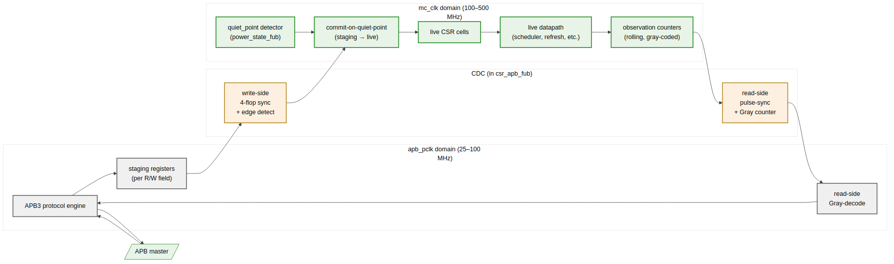

<!-- RTL Design Sherpa Documentation Header -->
<table>
<tr>
<td width="80">
  
</td>
<td>
  <strong>RTL Design Sherpa</strong> · <em>Learning Hardware Design Through Practice</em> 
  
    <a href="https://github.com/sean-galloway/RTLDesignSherpa">GitHub</a> ·
    <a href="https://github.com/sean-galloway/RTLDesignSherpa/blob/main/docs/DOCUMENTATION_INDEX.md">Documentation Index</a> ·
    <a href="https://github.com/sean-galloway/RTLDesignSherpa/blob/main/LICENSE">MIT License</a>
  
</td>
</tr>
</table>

---

<!-- End Header -->

# Clocks and Reset

## Clock Domains

| Clock         | Frequency      | Polarity | Domain Members                                                |
|---------------|----------------|----------|---------------------------------------------------------------|
| `mc_clk`      | 100–500 MHz    | Posedge  | All DRAM-layer FUBs, `axi4_slave`, data paths                  |
| `apb_pclk`    | 25–100 MHz     | Posedge  | `csr_apb_fub` only                                            |

The DFI v2.1 interface is driven on `mc_clk` (the controller side of DFI is always controller-clock; the DFI PHY runs at the DRAM clock and the gear mapping is the gear FUB's responsibility).

## Reset Topology

| Reset           | Polarity     | Type                              | Domain     |
|-----------------|--------------|-----------------------------------|------------|
| `mc_rst_n`      | Active-low   | Async assert, sync deassert       | `mc_clk`   |
| `apb_presetn`   | Active-low   | Async assert, sync deassert       | `apb_pclk` |

Each reset has its own 2-flop synchronizer for the deassert edge, instantiated in the FUB that owns the domain:

- `mc_rst_n` sync — in `power_state_fub`
- `apb_presetn` sync — in `csr_apb_fub`

Both synchronizers are clear-on-async-assert, hold-during-async-low. No reset-glitch filter is in the controller — the SoC's PMU is expected to drive a clean reset.

## CDC

Exactly one CDC in the controller: APB → MC for CSR overrides and MC → APB for CSR readback. Both are handled in `csr_apb_fub`. The two directions use different mechanisms:

- **APB → MC** (write side): 4-flop synchronizer per register field, with a per-field `apb_write_strobe` edge-detect on the MC side to latch the new value into the staging register. Staging held until next quiet point.
- **MC → APB** (read side): per-counter pulse synchronizers feed Gray-coded saturating counters; APB reads sample the Gray code and decode locally. The MC-side counters never wrap synchronously between reads.

**Source:** [04_clocks_cdc.mmd](../assets/mermaid/04_clocks_cdc.mmd)

## Quiet Points

A **configuration quiet point** is the only safe moment to propagate CSR overrides from staging registers into the live datapath. Quiet points are defined by:

- `txn_queue_fub` is empty *or* all pending entries are in `PENDING` state (no `ISSUED`/`COMPLETING`)
- `refresh_mgr_fub` is in IDLE (not WAIT_BANK_GNTS, DO_REFRESH, DO_ZQCS)
- `power_state_fub` is in ACTIVE (not transitioning)
- No DFI command is in flight (the encoder's per-phase pipeline has drained)

When all four hold, `power_state_fub` asserts `quiet_point`. Override-staging in `csr_apb_fub` watches this signal and commits all queued overrides in one MC-clock edge.

Software triggers quiet-point drain via `CTRL.config_apply`. The CSR slave returns `STATUS.config_settled` when commit is complete.

## Reset Sequence

On power-on:

1. `mc_rst_n` and `apb_presetn` are asserted (both low). PHY drives `dfi_init_complete = 0`.
2. SoC deasserts `apb_presetn`. `csr_apb_fub` comes out of reset; CSRs are R/W-able. Software loads timing CSRs (MR0..MR3, timings, address-map scheme, refresh tuning).
3. SoC deasserts `mc_rst_n`. All DRAM-layer FUBs come out of reset. Controller idles in **POST_RESET** state.
4. Software writes `CTRL.init_start = 1`. `init_engine_fub` walks the per-memtype step table, driving `dfi_reset_n`, MR loads, ZQCAL, etc.
5. On completion, `init_engine_fub` asserts `irq_init_done` (one cycle) and `STATUS.init_done = 1`. Controller transitions to ACTIVE.
6. AXI traffic from the host is honored.

The minimum gap between `apb_presetn` and `mc_rst_n` deassertion is 16 `mc_clk` cycles (the synchronizer chain depth). Software does not need to wait — the controller stalls at POST_RESET until both resets are released.
