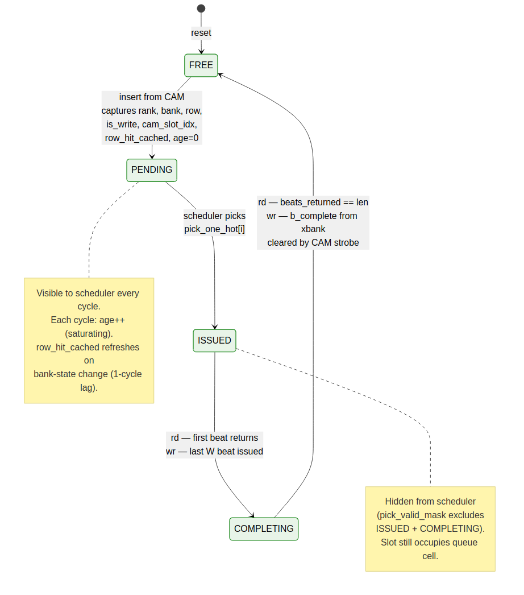

<!-- RTL Design Sherpa Documentation Header -->
<table>
<tr>
<td width="80">
  <a href="https://github.com/sean-galloway/RTLDesignSherpa">
    
  </a>
</td>
<td>
  <strong>RTL Design Sherpa</strong> · <em>Learning Hardware Design Through Practice</em><br>
  <sub>
    <a href="https://github.com/sean-galloway/RTLDesignSherpa">GitHub</a> ·
    <a href="https://github.com/sean-galloway/RTLDesignSherpa/blob/main/docs/DOCUMENTATION_INDEX.md">Documentation Index</a> ·
    <a href="https://github.com/sean-galloway/RTLDesignSherpa/blob/main/LICENSE">MIT License</a>
  </sub>
</td>
</tr>
</table>

---

<!-- End Header -->

# Transaction Queue (`txn_queue_fub`)

**Module:** `txn_queue_fub.sv`
**Location:** `rtl/fub/`
**Category:** FUB
**Parent:** `ddr2_lpddr2_ctrl`
**Status:** Draft v0.1

> Architectural context: HAS §3.2 `txn_queue`. This block-level MAS section is the implementation detail: entry format, port arrangement, insert/clear paths, `row_hit_cached` coherency, backpressure, storage choice.

---

## Purpose

`txn_queue_fub` is the **scheduling view** of in-flight DRAM transactions. It is the data structure the scheduler reads every MC clock to pick the next command. The queue is not the source of truth for AXI metadata or beat tracking — that lives in `rd_cmd_cam` and `wr_cmd_cam`. The queue carries *only* the fields the scheduler's priority function needs, plus a reverse pointer back to the CAM slot.

The split exists because the scheduler's read path is the hottest in the design: every cycle it touches every entry in parallel. Making the entry narrow (~32 bits, see below) keeps the parallel-comparator fan-in manageable. The CAMs carry the wider per-burst metadata (`w_buf_ptr`, `strb_ptr`, `beats_returned`, etc.) which is only touched on insert, on scheduler pick, and on per-beat completion — never in the per-cycle scheduling loop.

---

## Relationship to the CAMs

Each entry in `txn_queue` reflects exactly one slot in `rd_cmd_cam` or `wr_cmd_cam`. The `cam_slot_idx` field is the reverse pointer:

```
txn_queue[q].cam_slot_idx ──► (is_write ? wr_cmd_cam[cam_slot_idx] : rd_cmd_cam[cam_slot_idx])
```

When the scheduler picks `txn_queue[q]`, it issues an "mark issued" strobe to the corresponding CAM using `cam_slot_idx` (see `scheduler`, §2.7). When the CAM signals entry-complete (read: last beat returned; write: B-channel quiet point reached), it strobes back to clear `txn_queue[q]`.

The queue and CAMs are sized independently:

| Structure       | Default depth | Reason                                                       |
|-----------------|---------------|--------------------------------------------------------------|
| `txn_queue`     | 16            | Scheduling pool — depth bounded by parallel-comparator cost  |
| `rd_cmd_cam`    | 16            | One slot per pending read                                    |
| `wr_cmd_cam`    | 16            | One slot per pending write                                   |

In the default 16+16+16 configuration, the queue is the bottleneck — at most 16 transactions can be queued for scheduling at any time, regardless of how many slots are free in each CAM individually. The CAMs are not allowed to oversubscribe the queue (the `axi4_slave_fub` push path stalls on `txn_queue` full, not on CAM-full). The two CAMs *can* be sized larger than the queue if the read-path and write-path have very different burst-completion latencies — but that's not v1.

---

## Synthesis Parameters

| Parameter           | Source            | Effect                                                       |
|---------------------|-------------------|--------------------------------------------------------------|
| `TXN_QUEUE_DEPTH`   | top (default 16)  | Number of parallel-readable entries                          |
| `AGE_MAX`           | top (default 256) | Age counter saturation; per-entry `clog2(AGE_MAX) = 8` bits   |
| `ROW_WIDTH`         | top               | Width of the `row` field                                     |
| `NUM_RANKS`         | top               | Width of the `rank` field                                    |
| `NUM_BANKS`         | top               | Width of the `bank` field                                    |

---

## Entry Format

Each slot carries the **scheduling view** — the minimum metadata the scheduler's priority function needs.

| Field               | Width                       | Description                                                |
|---------------------|-----------------------------|------------------------------------------------------------|
| `valid`             | 1                           | Slot occupied                                              |
| `state`             | 2                           | `{FREE, PENDING, ISSUED, COMPLETING}` (see lifecycle below) |
| `is_write`          | 1                           | Picks rd vs wr CAM for the reverse pointer                  |
| `rank`              | `$clog2(NUM_RANKS)`         | Target rank (1-2 bits)                                     |
| `bank`              | `$clog2(NUM_BANKS)`         | Target bank (3 bits for NB=8)                              |
| `row`               | `ROW_WIDTH`                 | Target row (14 bits default)                               |
| `row_hit_cached`    | 1                           | Cached at insert; refreshed on bank-state change           |
| `age`               | `$clog2(AGE_MAX)`           | Saturating age counter (8 bits default)                    |
| `cam_slot_idx`      | `$clog2(CAM_DEPTH)`         | Reverse pointer to `rd_cmd_cam` or `wr_cmd_cam` slot (4 bits) |
| **Total per slot**  | **~32 bits**                | (default: NR=1, NB=8, ROW=14, AGE_MAX=256, CAM=16)        |

Total queue storage at depth 16: **~64 bytes** (16 × 32 b). This is distributed flops — no SRAM macro. Even at depth 64 it's 256 bytes, still trivially distributed.

**Fields *not* in the queue entry** (these stay in the CAM):

- `col_start`, `burst_len` — only consulted at issue time (Stage 4 of scheduler), not every cycle
- `axi_id` — opaque to the scheduler; only the CAM and `axi4_slave_fub` need it
- `w_buf_ptr`, `strb_ptr`, `beats_returned`, `beats_issued` — beat-level tracking, not scheduling

At issue time, the scheduler reads `col_start` and `burst_len` via the `cam_slot_idx` reverse pointer — a single read from the CAM's lookup port. This is one cycle slower than carrying them in the queue, but it keeps the queue narrow.

---

## Entry Lifecycle



**Source:** [06_txn_queue_entry_state.mmd](../assets/mermaid/06_txn_queue_entry_state.mmd)

Four states tracked per slot:

| State          | Visible to scheduler? | Counts toward queue depth? | Notes                                          |
|----------------|------------------------|----------------------------|-------------------------------------------------|
| `FREE`         | No                     | No                         | Empty slot, available for insert                |
| `PENDING`      | Yes (eligible)         | Yes                        | Scheduler is searching for this entry           |
| `ISSUED`       | No (masked out)        | Yes                        | Picked by scheduler; column command in flight   |
| `COMPLETING`   | No (masked out)        | Yes                        | Last beat / write-window draining                |

The scheduler's `pick_valid_mask` (see §2.7 Stage 2) explicitly excludes `ISSUED` and `COMPLETING` so the same entry can never be picked twice. The mask is `(state == PENDING)`.

`ISSUED → COMPLETING` is the same edge in both rd and wr cases but triggered by different signals:

- **Read**: first R beat returns from DFI → `rd_data_path_fub` strobes `entry_transition_completing` via the CAM.
- **Write**: last W beat is pushed to DFI write data → `wr_data_path_fub` strobes the same edge.

The `COMPLETING → FREE` edge is driven by the CAM's `entry_complete_o` strobe (see §2.4 and §2.5). The queue does not own completion-detection logic; it follows the CAM.

---

## Ports

### Insert (from CAMs)

| Signal              | Direction | Width             | Description                                          |
|---------------------|-----------|-------------------|------------------------------------------------------|
| `ins_valid_i`       | input     | 1                 | New entry to push                                    |
| `ins_ready_o`       | output    | 1                 | Queue has a free slot                                |
| `ins_is_write_i`    | input     | 1                 |                                                      |
| `ins_rank_i`        | input     | `$clog2(NR)`      | from `addr_mapper`                                   |
| `ins_bank_i`        | input     | `$clog2(NB)`      |                                                      |
| `ins_row_i`         | input     | `ROW_WIDTH`       |                                                      |
| `ins_cam_slot_i`    | input     | `$clog2(CAM_DEPTH)` | Reverse pointer                                    |

`row_hit_cached` is **not** an insert port — it's computed inside this FUB at insert time by querying `bank_state_i[ins_rank][ins_bank].open_row` (see "Insert Path" below). This keeps the insert-time row-hit computation local to the queue.

### Parallel Read (to scheduler — every cycle)

| Signal                                  | Direction | Width                         | Description                          |
|-----------------------------------------|-----------|-------------------------------|--------------------------------------|
| `q_entries_o[TXN_QUEUE_DEPTH-1:0]`      | output    | per entry-format table        | Live snapshot of all slots, parallel |

This is a wide bus — at the default `TXN_QUEUE_DEPTH = 16` and ~32 bits per entry, it's a 512-bit bus. The scheduler reads it combinationally; there's no read-port arbitration because there's only one reader.

### Bank-State Watchpoint (from bank machines)

| Signal                              | Direction | Width                | Description                                                    |
|-------------------------------------|-----------|----------------------|----------------------------------------------------------------|
| `bank_state_i[NR][NB]`              | input     | per bank_machine     | Live bank state (used at insert for row_hit_cached)            |
| `bank_open_row_changed_i[NR][NB]`   | input     | NR×NB                | One-cycle strobe when a bank's open row changes                |
| `bank_new_open_row_i[NR][NB]`       | input     | NR×NB × ROW_WIDTH    | New open-row value, valid the cycle after the strobe           |

The `_changed` + `_new_open_row` pair is what drives the per-entry `row_hit_cached` refresh path (see "Row-Hit Cache Coherency" below).

### Scheduler Pick (from scheduler)

| Signal                  | Direction | Width                              | Description                                          |
|-------------------------|-----------|------------------------------------|------------------------------------------------------|
| `pick_one_hot_i`        | input     | `TXN_QUEUE_DEPTH`                  | One-hot vector of which slot the scheduler picked    |
| `pick_strobe_i`         | input     | 1                                  | Pick happened this cycle                             |

On `pick_strobe_i`, the indicated slot transitions `PENDING → ISSUED`.

### CAM Completion (from CAMs)

| Signal                       | Direction | Width                       | Description                                                |
|------------------------------|-----------|-----------------------------|------------------------------------------------------------|
| `entry_transition_i`         | input     | 2                           | `01 = ISSUED → COMPLETING`, `10 = COMPLETING → FREE`        |
| `entry_transition_slot_i`    | input     | `$clog2(TXN_QUEUE_DEPTH)`   | Slot index that's transitioning                            |
| `entry_transition_strobe_i`  | input     | 1                           | Transition strobe                                          |

### Backpressure Output

| Signal                  | Direction | Width  | Description                                                       |
|-------------------------|-----------|--------|-------------------------------------------------------------------|
| `q_high_water_o`        | output    | 1      | High when occupancy ≥ `SCHED_TUNING.txn_queue_high_water`         |
| `q_full_o`              | output    | 1      | All slots are non-FREE                                            |
| `q_occupancy_o`         | output    | `$clog2(DEPTH+1)` | Current occupancy (number of slots not in FREE state)  |

`q_high_water_o` drives the AXI backpressure path in `axi4_slave_fub` — `awready` / `arready` deasserts when the queue is near full. `q_full_o` is the hard backpressure (no inserts accepted).

---

## Insert Path

When `axi4_slave_fub` has decoded a new burst and pushed it to either CAM, the CAM in turn pushes to this queue:

```
cycle T:   CAM push from axi4_slave  →  ins_valid asserted, ins_ready asserted
cycle T:   queue selects free_slot via priority encoder over (state == FREE)
cycle T:   row_hit_cached_init = (bank_state[ins_rank][ins_bank].state == ACTIVE
                                 AND bank_state[ins_rank][ins_bank].open_row == ins_row)
cycle T+1: free_slot.{is_write, rank, bank, row, row_hit_cached, cam_slot_idx} latched
cycle T+1: free_slot.state = PENDING, age = 0
```

The insert is a **two-cycle latency** from CAM push to first scheduler visibility, but the queue can accept one new insert per cycle (the comparator network for `free_slot` finds the next available slot combinationally; the latch is registered).

`row_hit_cached_init` is the only nontrivial computation at insert time. It's a single comparison: does the target bank's open row match the inserted row? If the bank is IDLE, it's automatically 0 (no row is open). If the bank is in the middle of a row change (ACTIVATING or PRECHARGING), it's also 0 — the cached value will be refreshed in the next cycle when the bank settles via the watchpoint path below.

---

## Row-Hit Cache Coherency

The `row_hit_cached` field is computed at insert (above) and **refreshed** any time a bank's open row changes.

The refresh path:

```
cycle T:   bank_machine[r,b] transitions ACTIVE → ACTIVE-on-new-row
           (via PRE then ACT)  OR  IDLE → ACTIVE (via ACT)
cycle T:   bank_machine[r,b] strobes bank_open_row_changed[r][b] = 1
           and presents bank_new_open_row[r][b] = R_new
cycle T+1: txn_queue refresh path:
           for each slot i:
             if entries[i].state in {PENDING}
                AND entries[i].rank == r AND entries[i].bank == b:
               entries[i].row_hit_cached = (entries[i].row == R_new)
```

The refresh is broadcast-parallel: all `TXN_QUEUE_DEPTH` entries are checked in parallel (their `(rank, bank)` matches are computed; the matching set has its `row_hit_cached` recomputed). The refresh fires for `ISSUED` and `COMPLETING` entries too, but those are masked out by the scheduler anyway — refreshing them is harmless and cheaper than gating.

**Why a one-cycle lag is acceptable.** In the cycle the bank state changes, the scheduler may still observe stale `row_hit_cached`. The worst outcome is the scheduler picks an entry as a "row hit" that isn't, or vice versa. The bank_machine catches this — `accepts_rd` / `accepts_wr` are gated on the current open_row, so the scheduler can't issue an *incorrect* column command. It would issue a bare RD/WR when an RDA/WRA was warranted (or vice versa), costing at most one extra PRE later. This is the trade documented in scheduler §2.7.

The synchronous broadcast (rather than asynchronous combinational re-eval) keeps the scheduler's Stage-1 path off the bank_machine state machines. If we tried to make this combinational, the Stage-1 critical path would route through every bank machine's open_row register, every queue entry's row comparator, and every priority mask — easily 8-10 LUT levels, ruining the timing budget.

---

## Age Counter Saturation

Every cycle, every `PENDING` entry's `age` increments by 1. The counter saturates at `AGE_MAX - 1`. Concretely with `AGE_MAX = 256`:

- New entry: age = 0
- After 1 cycle: age = 1
- After 255 cycles: age = 255
- After 256+ cycles: age = 255 (saturated)

The scheduler's age priority encoder treats saturated entries equally — once an entry has been waiting "long enough," it has maximum priority and ties break by slot index. In normal traffic, ages rarely saturate; in pathological cases (a row-conflict victim behind a stream of row-hits) saturation provides the anti-starvation guarantee.

The runtime override `SCHED_TUNING.age_max_runtime` clips the effective saturation point lower than the build-time `AGE_MAX` — useful for characterization sweeps to shorten the saturation timescale without rebuilding.

**Increment gating.** Age does *not* increment when `state` is `ISSUED` or `COMPLETING`. Those entries are out of the scheduling pool; aging them further would skew the priority for any subsequent entries that get re-queued (which doesn't currently happen in v1, but the gate is cheap insurance).

---

## Storage Choice

At the default `TXN_QUEUE_DEPTH = 16`, total storage is ~64 bytes. Distributed flops are the right answer — an SRAM macro would have higher access latency and the macro overhead is significant for so little data.

The crossover point where SRAM becomes attractive is around `TXN_QUEUE_DEPTH ≥ 64` (256 bytes), and even then only if the scheduler can be re-architected to issue from a partial snapshot rather than the full queue. Currently, the scheduler reads all entries in parallel — SRAM ports can't deliver that. So in v1 we cap at distributed flops; the parameter range is `4 … 64`.

For depth = 64, the entry bus is 64 × 32 = 2048 bits — wide but routable on 7-series. Stage-1 priority comparators scale linearly with depth (16 → 64 is 4× the comparators), and the age priority encoder tournament grows by log₂(4) = 2 levels. The critical-path budget in §2.7 absorbs this at the 200 MHz target; at 500 MHz the scheduler will need flop insertion as noted.

---

## CSR Hooks

| CSR field                          | Source signal                         | Use case                                          |
|------------------------------------|---------------------------------------|---------------------------------------------------|
| `STATUS.txn_queue_occ` (R)         | `q_occupancy_o`                       | Live occupancy                                    |
| `OBS_TXN_QUEUE_DEPTH_MAX` (R)      | High-water-mark register              | Peak occupancy since last read (HAS §6.3)         |
| `OBS_TXN_QUEUE_DEPTH_AVG` (R)      | Rolling time-average                  | Time-averaged occupancy                            |
| `STATUS.txn_queue_full_pulses` (R) | Counter — number of times `q_full_o` asserted | Hard-backpressure event counter             |
| `SCHED_TUNING.txn_queue_high_water` (R/W) | Threshold for `q_high_water_o` | Software-tunable soft-backpressure point          |

The `_high_water` threshold defaults to `TXN_QUEUE_DEPTH - 2` so AXI has a few-burst headroom before hard backpressure. Software can tune it lower for tighter latency control.

---

## Verification Notes (cocotb test plan)

| Scenario                                                                       | What it proves                                          |
|--------------------------------------------------------------------------------|---------------------------------------------------------|
| Single insert, single pick, single clear                                       | Smoke: FREE → PENDING → ISSUED → COMPLETING → FREE      |
| Insert at full speed (1 per cycle) until full                                  | Insert throughput; `q_full_o` asserts on the 17th       |
| Bank-state change while N entries target that (rank, bank)                     | Broadcast row-hit refresh works on all matching slots   |
| Bank-state change *during* a pick on the same slot                             | Pick is honored; refresh applies to next cycle's view   |
| Age saturation across all queue slots                                          | All saturate at `AGE_MAX - 1`; tie-break by slot index  |
| `age_max_runtime = 16`, age saturates earlier than `AGE_MAX`                   | Runtime clip works                                      |
| Insert + pick + complete in the same cycle (different slots)                    | The four ports are non-conflicting                      |
| `txn_queue_high_water = 8`; AXI backpressure asserts at occupancy 8            | Soft backpressure threshold                             |
| `q_full_o` blocks CAM push; CAM stalls AXI                                    | Hard backpressure path                                  |
| Insert with `is_write = 0` and `is_write = 1` interleaved                      | Reverse-pointer routing to correct CAM                  |
| `entry_transition` with `slot` out-of-range (illegal)                          | Assertion fires; entry untouched                        |
| Reset during mid-life: all slots clear, no spurious completions emitted        | Reset behavior                                          |

---

## Open Questions / Future Work

- Should the queue allow **re-queue** of a `COMPLETING` entry that fails (e.g., a DFI rddata timeout)? Currently the CAM owns failure-recovery; if it decides to retry, it would have to push a new queue entry. A "re-queue without losing age" path would be cheaper but adds complexity. Defer to v2.
- Should `cam_slot_idx` be **wider** than `$clog2(CAM_DEPTH)` to allow over-sized CAMs? Currently sized to match the smaller of the two CAM depths. If the rd-CAM grows to 32 and wr-CAM stays at 16, the field width adapts at elaboration; this is fine but the field is technically over-provisioned for write entries. Not worth fixing in v1.
- The broadcast `row_hit_cached` refresh fires for `ISSUED` / `COMPLETING` entries too. These are masked at the scheduler anyway. The gate would save a few comparator switches but no flops — drop the gate optimization. Document the decision and move on.
