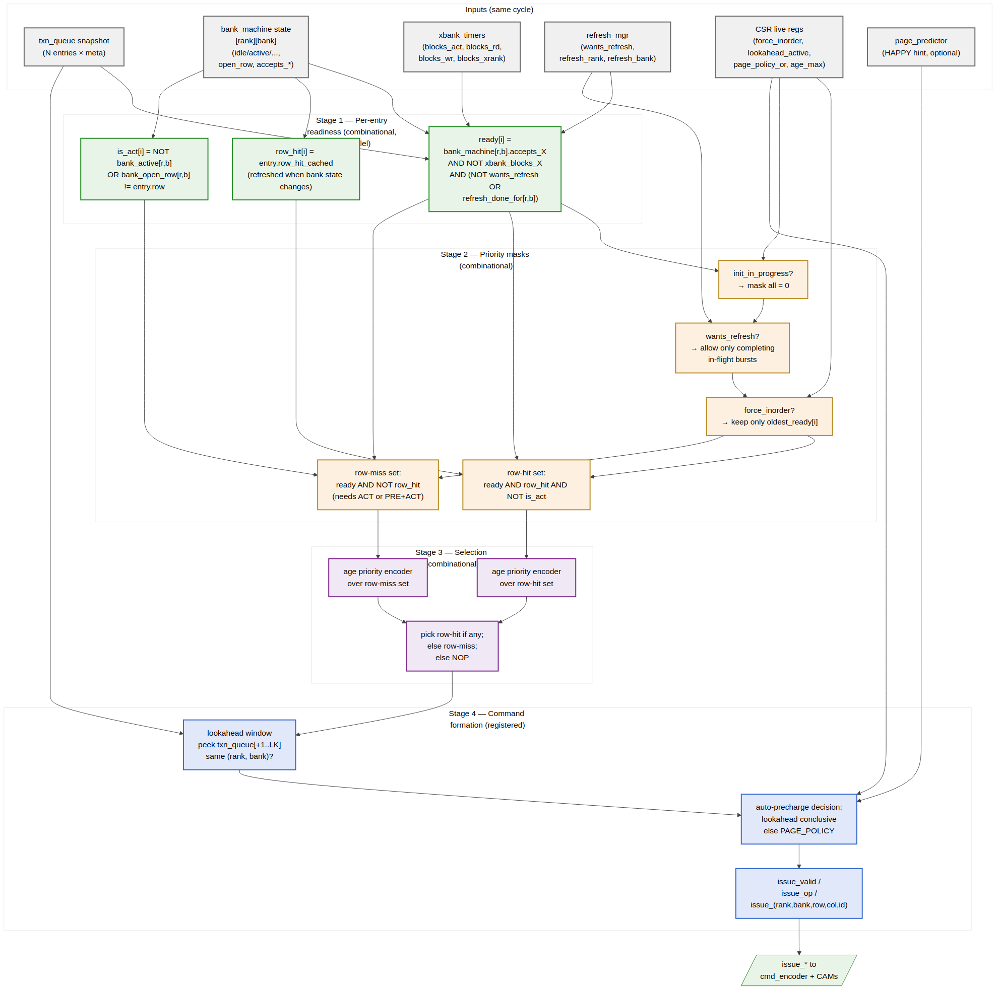

<!-- RTL Design Sherpa Documentation Header -->
<table>
<tr>
<td width="80">
  <a href="https://github.com/sean-galloway/RTLDesignSherpa">
    
  </a>
</td>
<td>
  <strong>RTL Design Sherpa</strong> · <em>Learning Hardware Design Through Practice</em><br>
  <sub>
    <a href="https://github.com/sean-galloway/RTLDesignSherpa">GitHub</a> ·
    <a href="https://github.com/sean-galloway/RTLDesignSherpa/blob/main/docs/DOCUMENTATION_INDEX.md">Documentation Index</a> ·
    <a href="https://github.com/sean-galloway/RTLDesignSherpa/blob/main/LICENSE">MIT License</a>
  </sub>
</td>
</tr>
</table>

---

<!-- End Header -->

# Scheduler (`scheduler`)

**Module:** `scheduler.sv`
**Location:** `rtl/fub/`
**Category:** FUB
**Parent macro:** `command_scheduler_macro`
**Status:** v2 implemented (CLOSE / OPEN / HAPPY_HYBRID page policies;
W/R round-robin arbitration; outputs strict-flop registered)

> Architectural context: HAS §3.2 (priority function, refresh / init priority).
> This block-level MAS section is the implementation view.
>
> **v2 vs v1:**
> - **Page policy is now selectable** via the `PAGE_POLICY` parameter
>   (CLOSE / OPEN / HAPPY_HYBRID). v1 was CLOSE only.
> - **HAPPY_HYBRID** consults [`page_predictor`](08_page_predictor.md)'s
>   per-bank hint to decide auto-precharge per command.
> - **W/R arbitration** is now round-robin (toggle on every issue) instead
>   of strict W-then-R. Prevents read starvation under bursty write.
>
> **Implementation notes:**
> - **No standalone `txn_queue` or `bank_machine`** — absorbed into CAMs +
>   `xbank_timers`. Scheduler reads CAM match buses + per-(rank, bank)
>   ready arrays.
> - **No CAM query bus driven** — scheduler uses CAM snapshots
>   (`wr_snap_*` / `rd_snap_*`) to pick a slot and use its decoded
>   (rank, bank, row, col) directly.
> - **No lookahead** — one CMD per cycle from the current match.

---

## Purpose

`scheduler` is the central command issue engine. Every MC clock cycle it:

1. Snapshots the wr/rd CAM match-query, `xbank_timers` ready arrays,
   and `global_timers` window OK signals.
2. Picks a slot (CLOSE always; OPEN/HAPPY prefers row-hit).
3. Decides the **initial state** based on policy + bank state.
4. Walks through PRE → ACT → RD/WR via the column-op FSM.

## Page-Policy Decision Table

At slot pick time, the scheduler's initial FSM state is:

| `PAGE_POLICY`     | Bank state     | Open row vs req row | Initial state |
|-------------------|----------------|---------------------|---------------|
| CLOSE             | (any)          | (any)               | S_NEED_ACT    |
| OPEN              | IDLE           | n/a                 | S_NEED_ACT    |
| OPEN              | ACTIVE         | match (hit)         | S_NEED_RDWR   |
| OPEN              | ACTIVE         | mismatch (miss)     | S_NEED_PRE    |
| HAPPY_HYBRID      | (same as OPEN — predictor only changes the `ap` bit in S_NEED_RDWR) | | |

## Column-Op Selection (S_NEED_RDWR)

| `PAGE_POLICY`     | Predictor hint     | OP for WR | OP for RD |
|-------------------|--------------------|-----------|-----------|
| CLOSE             | (ignored)          | WRA       | RDA       |
| OPEN              | (ignored)          | WR        | RD        |
| HAPPY_HYBRID      | `predict_open=1`   | WR        | RD        |
| HAPPY_HYBRID      | `predict_open=0`   | WRA       | RDA       |

`evt_ap_o` is driven high together with `evt_wr_o`/`evt_rd_o` when the
issued op was WRA/RDA; this tells [`xbank_timers`](10_xbank_timers.md) to
transition the bank to PRECHARGING instead of ACTIVE after tWR/tRTP.

## W/R Arbitration

Round-robin: an `r_arb_prefer_rd` toggle flips on every successful issue
(in S_DONE). When both W and R have pending slots, the toggle picks which
goes first. When only one direction has pending, that one wins.

## FSM States

```
S_IDLE   → S_NEED_PRE | S_NEED_ACT | S_NEED_RDWR   (by policy + bank state)
S_NEED_PRE   → S_NEED_ACT     (after PRE handshake)
S_NEED_ACT   → S_NEED_RDWR    (after ACT handshake)
S_NEED_RDWR  → S_DONE         (after RD/WR/RDA/WRA handshake)
S_DONE       → S_IDLE         (mark_issued pulse; toggle W/R preference)
```

Issue rate is **one command per MC clock**. The scheduler does not see
the DFI multi-phase dimension — `dfi_signal_pack` absorbs it.

The block is the **single hardest synthesis-timing FUB** in the design — the
parallel match-line into per-entry readiness, then into priority encoders,
is what sets the MC clock frequency ceiling. All outputs are strict-flop
registered.

---

## Synthesis Parameters

| Parameter                 | Source                          | Effect on this FUB                                                |
|---------------------------|---------------------------------|-------------------------------------------------------------------|
| `SCHEDULER_MODE`          | top                             | `"OOO"` synthesizes the full FR-FCFS comparator network; `"INORDER"` synthesizes only the first-ready FIFO path (smaller area, no row-hit reordering). |
| `TXN_QUEUE_DEPTH`         | top (default 16)                | Number of parallel readiness comparators                          |
| `LOOKAHEAD_DEPTH_MAX`     | top (default 4)                 | Width of the lookahead window peek into `txn_queue`               |
| `PAGE_POLICY`             | top                             | Picks which Stage-4 auto-precharge decoder is synthesized          |
| `NUM_RANKS`, `NUM_BANKS`  | top                             | Width of the bank-state input matrix                              |
| `AGE_MAX`                 | top (default 256)               | Width of per-entry age counter (clog2(AGE_MAX))                   |

The `"INORDER"` synthesis variant is a different decoder tree, not a runtime gate of the OoO tree. The runtime `SCHED_TUNING.force_inorder` bit is honored *only* when `SCHEDULER_MODE == "OOO"` was synthesized (the bit becomes a tied observation in `INORDER` builds, per HAS §3.2).

---

## Interface

### Inputs

| Signal                                        | Direction | Width                         | Description                                                  |
|-----------------------------------------------|-----------|-------------------------------|--------------------------------------------------------------|
| `mc_clk`, `mc_rst_n`                          | input     | 1, 1                          | MC clock + async-assert / sync-deassert reset                |
| `q_entries_i[TXN_QUEUE_DEPTH-1:0]`            | input     | per HAS §3.2                  | Live queue snapshot: per entry `{valid, is_write, rank, bank, row, col, burst_len, row_hit_cached, age, state, cam_slot_idx}` |
| `bank_state_i[NUM_RANKS][NUM_BANKS]`          | input     | per `bank_machine_fub`        | Per-(rank, bank): `state`, `open_row`, `accepts_act/rd/wr/pre/ref` |
| `xbank_blocks_i`                              | input     | struct                        | `blocks_act_per_rank[NR]`, `blocks_xrank_rd`, `blocks_xrank_wr` |
| `refresh_wants_i`                             | input     | 1                             | One-bit "refresh due now" from `refresh_mgr_fub`             |
| `refresh_done_for_i[NUM_RANKS][NUM_BANKS]`    | input     | NR×NB                         | Per-(rank, bank) "refresh handshake granted" from `refresh_mgr_fub` |
| `init_in_progress_i`                          | input     | 1                             | From `init_engine_fub` — blocks all normal traffic           |
| `predict_hit_i[NUM_RANKS][NUM_BANKS]`         | input     | NR×NB                         | HAPPY predictor output (tied 0 when `PAGE_POLICY != HAPPY_HYBRID`) |
| `cfg_force_inorder_i`                         | input     | 1                             | `SCHED_TUNING.force_inorder` runtime override                |
| `cfg_lookahead_active_i`                      | input     | 4                             | `SCHED_TUNING.lookahead_active`                              |
| `cfg_page_policy_or_i`                        | input     | 2                             | `REFRESH_TUNING.page_policy_or`                              |
| `cfg_happy_enable_i`                          | input     | 1                             | `SCHED_TUNING.happy_enable`                                  |

### Outputs

| Signal                  | Direction | Width                | Description                                                              |
|-------------------------|-----------|----------------------|--------------------------------------------------------------------------|
| `issue_valid_o`         | output    | 1                    | A command is being issued this cycle                                     |
| `issue_op_o`            | output    | 4                    | One of `{NOP, ACT, RD, RDA, WR, WRA, PRE, PREA, REF, REFPB, MRS, ZQCS, ZQCL}` |
| `issue_rank_o`          | output    | `$clog2(NR)`         | Target rank                                                              |
| `issue_bank_o`          | output    | `$clog2(NB)`         | Target bank                                                              |
| `issue_row_o`           | output    | `ROW_WIDTH`          | Target row (for ACT) or open-row pass-through (for RD/WR)                |
| `issue_col_o`           | output    | `COL_WIDTH`          | Target column (for RD/WR)                                                |
| `issue_axi_id_o`        | output    | `AXI_ID_WIDTH`       | Originating AXI ID (passed to the CAM for completion routing)            |
| `issue_cam_slot_o`      | output    | clog2(CAM_DEPTH)     | Index into `rd_cmd_cam` or `wr_cmd_cam` to mark "issued"                  |
| `issue_is_write_o`      | output    | 1                    | Picks `wr_cmd_cam` vs `rd_cmd_cam` for the mark-issued strobe            |
| `predict_query_o`       | output    | struct               | (rank, bank, row) query to `page_predictor_fub` for stage-4 auto-pre     |
| `dbg_inorder_active_o`  | output    | 1                    | (debug) High when current cycle picked the in-order path                  |
| `dbg_refresh_blocking_o`| output    | 1                    | (debug) High when `wants_refresh` reduced the candidate pool              |

---

## Decision Pipeline

The decision is a single MC-clock-cycle combinational pipeline broken into four conceptual stages, finishing in a registered output. Stages 1–3 are combinational; Stage 4 latches the final command into output flops.



**Source:** [05_scheduler_priority_pipeline.mmd](../assets/mermaid/05_scheduler_priority_pipeline.mmd)

### Stage 1 — Per-Entry Readiness (combinational, N parallel comparators)

For each of `TXN_QUEUE_DEPTH` entries, in parallel:

```
ready[i] = q_entries[i].valid
         AND  (q_entries[i].state == PENDING)
         AND  bank_machine[r,b].accepts_X
         AND  NOT xbank_blocks_X
         AND  ( NOT refresh_wants
                OR  bank_machine[r,b].in_refresh_done_set )

is_row_hit[i] = q_entries[i].row_hit_cached
                ( cached at queue insert; refreshed when bank_machine[r,b]
                  state changes — see "Cache Coherency" below )

needs_act[i]  = NOT bank_active[r,b]
                OR  bank_open_row[r,b] != q_entries[i].row
```

Where `X` is `rd` if `is_write == 0`, `wr` if `is_write == 1`. `r = q_entries[i].rank`, `b = q_entries[i].bank`.

`ready[i]` answers "could I issue *some* command for this entry this cycle without violating any per-bank or cross-bank timer?" `is_row_hit[i]` answers "if I do, is it a column command on the already-open row?" `needs_act[i]` answers "is the preliminary command actually ACT (or PRE+ACT) rather than RD/WR?"

### Stage 2 — Priority Masking (combinational)

Five masks, computed in parallel from the Stage-1 vector and the config inputs:

| Mask              | Definition                                                        | Effect                                       |
|-------------------|-------------------------------------------------------------------|----------------------------------------------|
| `init_mask`       | `init_in_progress ? 0 : ready[i]`                                  | Block all normal entries during init         |
| `refresh_mask`    | `refresh_wants ? (ready[i] AND bank_in_refresh_done_set) : ready[i]` | Allow only entries whose target rank+bank has already been granted the refresh handshake (i.e., already transitioned out of REFRESHING, or never entered it) |
| `inorder_mask`    | `force_inorder ? oldest_ready_one_hot : ready[i]`                  | Collapse to first-ready FIFO                 |
| `row_hit_mask`    | `ready[i] AND is_row_hit[i] AND NOT needs_act[i]`                  | Row-hit candidates (column-only)             |
| `row_miss_mask`   | `ready[i] AND (NOT is_row_hit[i] OR needs_act[i])`                 | Row-miss candidates (need ACT or PRE+ACT)    |

The composed candidate vectors are:

```
cands_row_hit  = init_mask AND refresh_mask AND inorder_mask AND row_hit_mask
cands_row_miss = init_mask AND refresh_mask AND inorder_mask AND row_miss_mask
```

### Stage 3 — Selection (combinational priority encoders)

Two parallel age-priority encoders, then a 2:1 mux:

```
winner_hit  = age_pe(cands_row_hit)    // index of oldest entry in cands_row_hit, or none
winner_miss = age_pe(cands_row_miss)   // index of oldest entry in cands_row_miss, or none

picked = winner_hit  IS_VALID ? winner_hit
       : winner_miss IS_VALID ? winner_miss
                              : NONE   // issue NOP
```

The age priority encoder is the slowest path in this stage — it's an `N`-entry tournament on `clog2(AGE_MAX) = 8`-bit ages. For `N = 16` (the default), that's 4 levels of pairwise compare-and-select. Synthesizable in two LUT layers per level on 7-series; ~30 LUT-delays in the typical config.

### Stage 4 — Command Formation (registered)

Once an entry is picked, Stage 4 turns it into a DRAM command. This stage **may pre-flop intermediate signals** for timing closure on the highest clock targets (see "Pipeline Staging" below).

1. **Lookahead peek** — examine the next `cfg_lookahead_active` queue entries *after* the picked one to see if any target the same (rank, bank).
2. **Auto-precharge decision** — per HAS §3.2 (lookahead first, fallback to `PAGE_POLICY`):
   - Same-bank entry found AND its row matches the open row → **keep open** → bare RD / WR
   - Same-bank entry found AND its row differs → **close** → RDA / WRA
   - No same-bank entry within window → consult `cfg_page_policy_or`:
     - OPEN → bare RD / WR
     - CLOSE → RDA / WRA
     - HAPPY_HYBRID → query `predict_hit_i[r][b]`; if predicted hit → bare; else RDA/WRA
3. **Op encoding** — generate the 4-bit `issue_op_o` from `(is_write, needs_act, auto_pre)`:
   - `needs_act` and bank state == IDLE → `ACT`
   - `needs_act` and bank state == ACTIVE (different row) → `PRE` (the column command follows next cycle after tRP)
   - `NOT needs_act` and `is_write` → `WR` or `WRA`
   - `NOT needs_act` and `NOT is_write` → `RD` or `RDA`
4. **Latch** outputs into the issue flops.

### Refresh Window Behavior

When `refresh_wants_i` is high, `refresh_mgr_fub` is asserting `refresh_req` to one or more bank machines. Those bank machines drive `refresh_done_for_i[r][b] = 1` only after reaching IDLE and handing over the grant. While `refresh_done_for_i[r][b] == 0`, that bank's entries are masked out — no new column commands to a bank that's about to refresh.

Bank machines for *other* ranks (in the multi-rank REFab round-robin) or *other* banks (in REFpb) remain available, so the scheduler continues to drain those during the refresh window. This is what makes per-rank REFab dispatch beneficial — the non-refreshing ranks keep their throughput.

When all required refreshes complete and `refresh_wants_i` drops, the masks lift and normal FR-FCFS resumes the next cycle.

---

## Cache Coherency: `row_hit_cached`

`q_entries[i].row_hit_cached` is computed at queue insertion (by `axi4_slave_fub` via a one-cycle query to `bank_machine[r,b].open_row`) and stored in the queue entry. This avoids re-querying every cycle. But the bank state can change between insertion and selection:

- When `bank_machine[r,b]` transitions ACTIVE → ACTIVE on a different row (via PRE + ACT to a new row), all `q_entries` with `(rank, bank) == (r, b)` need their `row_hit_cached` recomputed against the new `open_row`.
- When `bank_machine[r,b]` transitions IDLE → ACTIVATING, the queue entries get `row_hit_cached = 1` for entries whose row matches the in-flight ACT.

This is implemented as a **broadcast update**: on every bank state transition that affects the open row, the bank machine emits `open_row_changed[r][b]` + the new `open_row`. The queue has a per-entry update path that, in parallel, recomputes `row_hit_cached`. This is a one-cycle update — the recomputed value is visible to the scheduler in the cycle *after* the bank transition.

The one-cycle lag means the scheduler may make an "outdated row-hit" decision once per row change. The downside is one mis-categorized RD/WR (issued as bare when RDA was warranted, or vice versa); the worst case is one extra PRE later. This is a deliberate trade — the alternative is a combinational broadcast from bank state through every queue entry's row-hit comparator, which would inflate the Stage-1 critical path.

---

## Pipeline Staging

The default build is a **single-cycle combinational** scheduler — Stages 1–3 are combinational; Stage 4's auto-precharge decoder is combinational; only the final issue-flop is registered. On 7-series FPGA at 200 MHz this closes timing comfortably. For 14 nm targets at 500+ MHz, two timing-closure escape hatches:

1. **Stage 3 → Stage 4 flop insertion** — register `picked` between stages. Adds one cycle of issue latency. Throughput is unchanged because the pipeline is single-issue anyway; the only visible difference is that a request inserted at cycle T can first issue at cycle T+3 instead of T+2.

2. **Stage 1 partition by bank** — partition the readiness comparator network by (rank, bank) so each partition produces a per-bank ready vector independently, then aggregate. Useful when `NUM_RANKS × NUM_BANKS` is small (the default 1×8 = 8 partitions) and routing congestion dominates.

These are not on by default; they're synthesis-script switches, not RTL parameters.

---

## Strict In-Order Mode (collapse)

When `cfg_force_inorder_i = 1` (and `SCHEDULER_MODE == "OOO"` is synthesized):

- `inorder_mask` collapses to `oldest_ready_one_hot` — a one-hot vector that picks the *oldest valid ready entry* by age.
- This drops the row-hit prioritization (no row-hit vs row-miss split — both go through `cands_row_miss` since age order rules).
- Refresh priority is preserved (JEDEC requirement).
- Lookahead and HAPPY remain on at elaboration but can be independently disabled at runtime (`cfg_lookahead_active = 0`, `cfg_happy_enable = 0`) for a pure first-ready FIFO.

When `SCHEDULER_MODE == "INORDER"` is synthesized:

- The Stage-2 / Stage-3 priority encoders are different RTL: the row-hit/row-miss split is omitted; only the oldest-ready selector is built.
- `cfg_force_inorder_i` becomes a tied observation bit at `STATUS.force_inorder_obs = 1`.

---

## Critical-Path Analysis (rough budget at 500 MHz target, 2 ns cycle)

| Path                                                                            | Levels (approx) | Budget   |
|---------------------------------------------------------------------------------|-----------------|----------|
| `bank_state_i.accepts_X` → `ready[i]` → row-hit mask → `cands_row_hit[i]`        | 4 LUT levels    | 0.7 ns   |
| `cands_row_hit` → age priority encoder → `winner_hit` (16-entry tournament)      | 4 levels × 2 LUT each = 8 | 1.2 ns |
| `winner_hit / winner_miss` → 2:1 mux → `picked`                                  | 1 LUT level     | 0.2 ns   |
| Routing / setup margin                                                          |                 | 0.3 ns   |
| **Total Stage 1–3**                                                             |                 | **2.4 ns** |

So at 500 MHz the path **misses by ~400 ps** and needs Stage 3 → Stage 4 flop insertion (the first escape hatch above). At 200 MHz target (5 ns cycle, embedded SoC default), the path closes with ~2.6 ns of slack — no escape hatch needed.

The 500 MHz analysis is FPGA-pessimistic; ASIC targets close 500 MHz on this path comfortably with standard pipelining.

---

## CSR Hooks

The scheduler drives several CSR observability fields:

| CSR field                            | Source signal                                          | Use case                                          |
|--------------------------------------|--------------------------------------------------------|---------------------------------------------------|
| `STATUS.issue_op_obs` (R)            | Last issued `issue_op_o`                                | Bring-up debug: what was the last DRAM command    |
| `STATUS.scheduler_idle_pct` (R)      | Rolling counter — fraction of cycles `issue_valid_o = 0` | Bandwidth-headroom telemetry                      |
| `OBS_ROW_HIT_RANK<R>_BANK<N>` (R)    | Incremented when row-hit path wins for that bank        | Per-bank row-hit rate (HAS §6.3)                  |
| `OBS_INORDER_FALLBACKS` (R)          | Incremented when `force_inorder` ate a row-hit win      | Tells software how much OoO is currently giving up |
| `OBS_LOOKAHEAD_HITS` (R)             | Incremented when Stage-4 lookahead was conclusive       | Tunes `LOOKAHEAD_DEPTH_MAX` characterization sweep |
| `STATUS.force_inorder_obs` (R)       | Echo of effective force-inorder state                   | Software-readable confirmation                    |

---

## Verification Notes (cocotb test plan)

| Scenario                                                                  | What it proves                                              |
|---------------------------------------------------------------------------|-------------------------------------------------------------|
| Single-write, single-bank, single-rank                                    | Smoke test: ACT → WR → b_complete cycle                     |
| Single-read, single-bank, single-rank                                     | Smoke test: ACT → RD → beat return                          |
| Two reads, same bank, same row, oldest first                              | Row-hit reordering not invoked (already in order)           |
| Two reads, same bank, *different* rows, oldest is row-conflict             | OoO: younger row-hit wins over older row-miss               |
| Same as above with `force_inorder = 1`                                    | OoO disabled: older row-miss wins despite younger row-hit   |
| Cross-bank: rd to bank 0 and rd to bank 1, bank 0 row-miss, bank 1 row-hit | Bank parallelism: bank-1 issue fires first                  |
| Cross-rank (NUM_RANKS=2): rd to rank 0 bank 3 and rd to rank 1 bank 3      | Per-rank bank parallelism                                   |
| Refresh during in-flight burst                                            | Refresh window correctly drains and resumes                  |
| Refresh during multi-rank traffic (REFab on rank 0, traffic on rank 1)    | Per-rank REFab dispatch: rank-1 traffic continues           |
| Age-saturation under sustained row-conflict from younger IDs               | Older row-conflict eventually wins via age priority         |
| `LOOKAHEAD_DEPTH_MAX = 4`, lookahead concludes auto-precharge correctly    | Lookahead path                                              |
| `LOOKAHEAD_DEPTH_MAX = 0`, HAPPY predictor used                           | Fallback path through page predictor                        |
| `PAGE_POLICY = CLOSE`, every column command is auto-pre                   | CLOSE policy                                                |
| Init-in-progress blocks normal traffic                                     | `init_mask` gating                                          |
| Queue full + back-pressure to AXI                                         | `axi4_slave` does not accept new bursts                     |

---

## Open Questions / Future Work

- Should QoS (`awqos` / `arqos`) be promoted from the v1 "no behavior" pass-through to a real priority boost in the FR-FCFS function? Currently HAS §3.2 leaves QoS as a side-band hint for v2. The hook would be a `qos_boost_mask` between the row-hit and row-miss stages.
- The cross-rank read-to-write turnaround (`tRTRS` + write window) lives in `xbank_timers` today; the scheduler consumes the gate but does not pre-plan around it. A smarter scheduler could **batch by rank** (issue all ready reads on rank 0, then all on rank 1) to amortize `tRTRS`. This is a v2 feature; v1 takes the simpler per-cycle gating.
- Whether `OBS_INORDER_FALLBACKS` is useful for characterization is not yet validated; the counter is cheap, but if it's never read by the bring-up team it can be dropped in v2.
