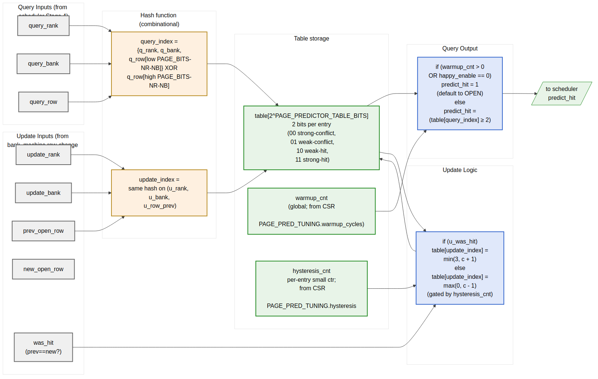

<!-- RTL Design Sherpa Documentation Header -->
<table>
<tr>
<td width="80">
  <a href="https://github.com/sean-galloway/RTLDesignSherpa">
    
  </a>
</td>
<td>
  <strong>RTL Design Sherpa</strong> · <em>Learning Hardware Design Through Practice</em><br>
  <sub>
    <a href="https://github.com/sean-galloway/RTLDesignSherpa">GitHub</a> ·
    <a href="https://github.com/sean-galloway/RTLDesignSherpa/blob/main/docs/DOCUMENTATION_INDEX.md">Documentation Index</a> ·
    <a href="https://github.com/sean-galloway/RTLDesignSherpa/blob/main/LICENSE">MIT License</a>
  </sub>
</td>
</tr>
</table>

---

<!-- End Header -->

# HAPPY Page Predictor (removed)

> ## ⚠️ REMOVED — Not in current RTL
>
> The HAPPY hybrid page-conflict predictor described below was **removed**
> from the v1 implementation. The v1 scheduler uses a **closed-page policy**
> (RDA / WRA auto-precharge on every column command), which makes page
> prediction moot — there is no open row to predict against.
>
> If an open-page or hybrid policy is reintroduced in a future revision,
> the predictor's design rationale (HAPPY thresholds, table sizing,
> hysteresis) in this chapter remains a useful starting point.

**Status:** Removed in v1 (was Draft v0.1)
**Status:** Draft v0.1

> Architectural context: HAS §3.2 `page_predictor`. The algorithm view (query + update flow) is in `ddr2_lpddr2_has/assets/mermaid/09_happy_predictor.png` — refer to it for the algorithm. This block-level MAS section is the implementation view: hash inputs, table organization, multi-rank handling, warmup / hysteresis, storage choice, scheduler timing.

---

## Purpose

`page_predictor_fub` is the HAPPY hybrid page-conflict predictor (Ghasempour et al., 2015). It answers one question for the scheduler:

> "For a request I am about to issue to (rank, bank), will the *next* access to this (rank, bank) hit the row I am about to leave open, or conflict with it?"

The answer drives the Stage-4 auto-precharge fallback in `scheduler` (§2.7) when the lookahead window is inconclusive. A "next will hit" prediction → issue bare RD/WR (keep row open). A "next will conflict" prediction → issue RDA/WRA (close row in flight to save tRP later).

The FUB is **synthesized only when `PAGE_POLICY == HAPPY_HYBRID`** at elaboration. Builds with `PAGE_POLICY == OPEN` or `PAGE_POLICY == CLOSE` do not instantiate this FUB; the scheduler ties its `predict_hit_i` input to 1 (default-to-open) or 0 (default-to-close) respectively.

A runtime kill-switch (`SCHED_TUNING.happy_enable`) lets software A/B-test the predictor's contribution without rebuilding. When `happy_enable == 0`, the FUB stays in silicon but its output forces `predict_hit = 1` (default open).

---

## Conditional Instantiation

```systemverilog
generate
    if (PAGE_POLICY == "HAPPY_HYBRID") begin : g_happy
        page_predictor_fub #(
            .PAGE_PREDICTOR_TABLE_BITS (PAGE_PREDICTOR_TABLE_BITS),
            .NUM_RANKS                 (NUM_RANKS),
            .NUM_BANKS                 (NUM_BANKS),
            .ROW_WIDTH                 (ROW_WIDTH)
        ) u_page_predictor ( ... );

        assign predict_hit_to_sched = u_page_predictor.predict_hit_o;
    end
    else if (PAGE_POLICY == "OPEN") begin : g_open
        assign predict_hit_to_sched = '1;        // always predict "hit" → bare RD/WR
    end
    else begin : g_close // CLOSE
        assign predict_hit_to_sched = '0;        // always predict "conflict" → RDA/WRA
    end
endgenerate
```

The scheduler's interface is identical in all three cases; the predictor's presence is invisible at the scheduler boundary.

---

## Synthesis Parameters

| Parameter                     | Source            | Effect                                                                |
|-------------------------------|-------------------|-----------------------------------------------------------------------|
| `PAGE_PREDICTOR_TABLE_BITS`   | top (default 12)  | Table size = `2^PAGE_PREDICTOR_TABLE_BITS` entries (default 4 K entries) |
| `NUM_RANKS`                   | top               | Folded into the hash index                                            |
| `NUM_BANKS`                   | top               | Folded into the hash index                                            |
| `ROW_WIDTH`                   | top               | Source for the row-bit hash inputs                                    |
| `HYSTERESIS_BITS`             | derived           | Width of per-entry hysteresis counter (small, e.g., 3 bits)            |
| `WARMUP_WIDTH`                | derived           | Width of global warmup counter (16-bit per CSR field)                  |

---

## Block Implementation View



**Source:** [09_page_predictor_implementation.mmd](../assets/mermaid/09_page_predictor_implementation.mmd)

The HAS-side algorithm view (`ddr2_lpddr2_has/assets/mermaid/09_happy_predictor.png`) shows the query/update *flow*; the diagram above shows the FUB's *physical organization* — input ports, hash, table, gate logic.

---

## Hash Function

The table is indexed by a hash of (rank, bank, row). Multi-rank is folded into the same table — there is no per-rank replication. The hash is the **concatenation of identity bits with a XOR-folded row hash**:

```
hash_inputs    = {rank, bank, row}        // total width: clog2(NR) + clog2(NB) + ROW_WIDTH
table_idx_width = PAGE_PREDICTOR_TABLE_BITS

// Identity portion: low (clog2(NR) + clog2(NB)) bits of the index
id_portion = {rank, bank}                  // width clog2(NR) + clog2(NB)

// Hash portion: remaining (table_idx_width - id_portion_width) bits of the index
hash_portion = row[low_HASH_BITS]
               XOR row[mid_HASH_BITS]
               XOR row[high_HASH_BITS]
               // (each slice is HASH_BITS = table_idx_width - id_portion_width wide)

table_idx = {id_portion, hash_portion}
```

Concrete example at default config (`NR=1, NB=8, ROW_WIDTH=14, PAGE_PREDICTOR_TABLE_BITS=12`):

- `id_portion` = `{0-bit rank, 3-bit bank}` = 3 bits
- `hash_portion` = 9 bits = `row[8:0] XOR row[13:5]` (XOR of two row slices)
- `table_idx` = `{3-bit bank, 9-bit row_hash}` — 4 K entries, 8 banks each get a 512-entry slice of the table

For multi-rank (`NR=4`, others same):

- `id_portion` = `{2-bit rank, 3-bit bank}` = 5 bits
- `hash_portion` = 7 bits = `row[6:0] XOR row[13:7]`
- `table_idx` = `{2-bit rank, 3-bit bank, 7-bit row_hash}` — 4 K entries, 32 (rank, bank) tuples each get a 128-entry slice

**Why fold rank into identity rather than hash.** Folding rank into the identity portion guarantees that two different ranks never collide for the same row hash. The trade-off is that the per-(rank, bank) slice shrinks (128 entries each at NR=4 vs 512 at NR=1). At default 4 K-entry table, this is fine — even 128 entries per slice is more than enough to track the working set of a typical bank.

If `PAGE_PREDICTOR_TABLE_BITS` is small enough that the identity portion eats the whole index (e.g., `PAGE_PREDICTOR_TABLE_BITS = 5` at `NR=4, NB=8`), there is no `hash_portion` and the predictor degrades to a per-(rank, bank) single-counter. An elaboration assertion fires in that case requiring `PAGE_PREDICTOR_TABLE_BITS >= id_portion_width + 4`.

---

## Table Storage

Each entry is a 2-bit saturating counter:

- `00` = strong conflict-likely
- `01` = weak conflict-likely
- `10` = weak hit-likely (reset value)
- `11` = strong hit-likely

A `predict_hit` query returns 1 when the entry value is `>= 2` (hit-likely side of the saturating range).

Total storage = `2^PAGE_PREDICTOR_TABLE_BITS × 2 bits`. Concrete:

| `PAGE_PREDICTOR_TABLE_BITS` | Entries | Storage  | Implementation               |
|-----------------------------|---------|----------|-------------------------------|
| 8                           | 256     | 512 bit  | Distributed flops             |
| 12 (default)                | 4 K     | 8 Kbit (1 KB) | Single BRAM18 (FPGA) / small RF (ASIC) |
| 16                          | 64 K    | 128 Kbit (16 KB) | Multiple BRAM tiles or SRAM macro |

The storage choice is synthesis-script driven: a SystemVerilog `(* ram_style = "block" *)` attribute on the table array hints BRAM for sizes ≥ 8 (the BRAM18 sweet spot at 512×36-bit = 512 entries × 4 bits, which fits two predictor lookups per BRAM word).

At the default 12-bit (4 K entries), a single 36 Kbit BRAM18 holds the entire table with room to spare for hysteresis counters. The query path is one BRAM-read cycle latency (registered output) — important for the scheduler's Stage-4 timing.

**BRAM port arrangement.** The table has one read port (the query path) and one read-modify-write port (the update path). On 7-series BRAM, this is naturally a true dual-port configuration. Update and query can happen in parallel.

---

## Warmup Counter

A global warmup counter delays the predictor's first trustworthy output. At reset:

```
warmup_cnt = PAGE_PRED_TUNING.warmup_cycles    // 16-bit, default 4096
```

While `warmup_cnt > 0`:

- Every cycle decrement `warmup_cnt`
- Query output forces `predict_hit_o = 1` (default open)

When `warmup_cnt == 0`:

- Query output is `(table[table_idx] >= 2)`

The warmup exists because the table starts at "weakly hit-likely" everywhere. Without it, the predictor would output uniform "hit" for the first few hundred accesses anyway — but the warmup makes that explicit and tunable. Software can shorten the warmup for short-running workloads or extend it for cold-start benchmarks.

---

## Hysteresis Per Entry

To avoid the predictor flipping on every single misprediction, each table entry has a small **hysteresis counter** that gates updates:

```
struct entry_t {
    logic [1:0] saturating_counter;
    logic [HYSTERESIS_BITS-1:0] hyst_cnt;
};

// On update with was_hit:
//   if (hyst_cnt > 0):
//     hyst_cnt = hyst_cnt - 1
//     (no change to saturating_counter)
//   else:
//     update saturating_counter (inc on hit, dec on conflict)
//     hyst_cnt = PAGE_PRED_TUNING.hysteresis
```

At reset `hyst_cnt = 0` (full sensitivity). The CSR-supplied hysteresis value (default 0) is added per update. With `PAGE_PRED_TUNING.hysteresis = 3`, the predictor only updates every 4th conflicting observation — useful for workloads with high inherent variance.

The hysteresis flops are *per-entry* — at default 12-bit table with 3-bit hysteresis, total hysteresis storage is `4096 × 3 = 12 Kbit`, which is significant. The hysteresis_bits parameter defaults to 0 (disabling hysteresis); enabling it is opt-in via `HYSTERESIS_BITS` at elaboration. When `HYSTERESIS_BITS == 0` the FUB synthesizes no hysteresis flops and the update fires every cycle.

---

## Update Path

The predictor is *trained* by `bank_machine_fub`'s open-row change broadcast (§2.9). Each time a bank's open row changes (via PRE+ACT or auto-precharge → ACT), the predictor learns:

```
was_hit = (new_open_row == prev_open_row_when_request_was_made)
        // i.e., did the next access actually hit the row we predicted on?
```

This requires the predictor to remember the row context of each prediction it made. The simplest implementation: a small per-bank shadow register that captures the row each request was predicted on. On open-row change broadcast, the shadow register's row is the "prev" row that was predicted on, and the broadcast's new_open_row is what the actual row turned out to be.

The shadow register is `ROW_WIDTH × NR × NB` flops total — for default config (14 × 1 × 8) = 112 flops. For multi-rank (14 × 4 × 8) = 448 flops.

**Why this works.** The HAPPY paper trains on actual observed outcomes; we observe outcomes by watching bank state transitions. A row-hit observation occurs when the bank stays ACTIVE on the same row across multiple column commands; a row-conflict occurs when the bank transitions PRE → ACT (new row).

---

## Query Path Timing

The scheduler's Stage-4 (per §2.7) queries the predictor when:

- An entry has been picked for issue
- Lookahead is inconclusive (no same-bank pending in the lookahead window)
- `PAGE_POLICY == HAPPY_HYBRID`

The query is single-cycle:

```
cycle T:   scheduler asserts query_valid_o, query_rank/bank/row
cycle T:   predictor computes hash, indexes table (BRAM read)
cycle T+1: predict_hit_o is valid
cycle T+1: scheduler latches the auto-precharge decision
```

This puts the predictor in the scheduler's Stage-4 register-to-register path. The BRAM read access dominates: at FPGA targets ~1.5 ns. Combined with the scheduler's Stage-4 mux, the total Stage-4 path is ~2.2 ns — fits the 200 MHz target (5 ns) with slack; the 500 MHz target requires an extra register stage on the predict_hit output.

If a query and an update target the same table entry in the same cycle, the BRAM's true-dual-port write-first behavior makes the read return the newly-written value. This is fine for correctness — the more-recent training applies.

---

## Interface

### Query (from scheduler)

| Signal              | Direction | Width                | Description                                          |
|---------------------|-----------|----------------------|------------------------------------------------------|
| `query_valid_i`     | input     | 1                    | Scheduler is requesting a prediction                 |
| `query_rank_i`      | input     | `$clog2(NR)`         | Query rank                                           |
| `query_bank_i`      | input     | `$clog2(NB)`         | Query bank                                           |
| `query_row_i`       | input     | `ROW_WIDTH`          | Row of the request being predicted                   |
| `predict_hit_o`     | output    | 1                    | 1-cycle-later: 1 = predicted hit, 0 = predicted conflict |

### Update (from bank machine broadcast)

| Signal                  | Direction | Width                | Description                                          |
|-------------------------|-----------|----------------------|------------------------------------------------------|
| `bank_orw_changed_i`    | input     | NR×NB                | One-cycle strobe per (rank, bank) — from §2.9 broadcast |
| `bank_new_open_row_i`   | input     | NR×NB × ROW_WIDTH    | New open row value                                   |

The predictor internally maintains the shadow `prev_open_row[NR][NB]` register described above; the strobe + new row let it compute `was_hit = (bank_new_open_row_i == prev_open_row_shadow[r][b])`.

### CSR live inputs

| Signal              | Direction | Width  | Source                                            |
|---------------------|-----------|--------|---------------------------------------------------|
| `cfg_warmup_i`      | input     | 16     | `PAGE_PRED_TUNING.warmup_cycles`                  |
| `cfg_hysteresis_i`  | input     | 8      | `PAGE_PRED_TUNING.hysteresis`                     |
| `cfg_happy_enable_i`| input     | 1      | `SCHED_TUNING.happy_enable`                       |

### Telemetry outputs

| Signal                  | Direction | Width  | Description                                  |
|-------------------------|-----------|--------|----------------------------------------------|
| `dbg_table_warm_pct_o`  | output    | 8      | Fraction of table entries that have updated at least once |
| `dbg_accuracy_per_bank_o[NR][NB]` | output | 8 | Rolling prediction accuracy per (rank, bank) |
| `dbg_warmup_active_o`   | output    | 1      | `warmup_cnt > 0`                            |

The accuracy telemetry is the **single most useful debug signal** in the FUB. The bring-up team will watch it to decide whether HAPPY is helping, hurting, or break-even on the workload of the day.

---

## CSR Hooks

| CSR field                                  | Source                                                      | Use case                                  |
|--------------------------------------------|-------------------------------------------------------------|-------------------------------------------|
| `OBS_PAGE_PRED_ACCURACY` (R)               | Aggregate accuracy across all banks                          | Headline predictor health                 |
| `OBS_PAGE_PRED_ACCURACY_R<R>_B<N>` (R)     | Per-(rank, bank) accuracy (sparse, mirrors `OBS_BANK_OPEN_ROW_*`) | Per-bank predictor health           |
| `STATUS.page_pred_warmup_active` (R)       | `dbg_warmup_active_o`                                       | Is the predictor producing real predictions yet? |
| `PAGE_PRED_TUNING.warmup_cycles` (R/W)     | `cfg_warmup_i`                                              | Tunable warmup                           |
| `PAGE_PRED_TUNING.hysteresis` (R/W)        | `cfg_hysteresis_i`                                          | Tunable hysteresis                       |

---

## Verification Notes (cocotb test plan)

| Scenario                                                                          | What it proves                                         |
|-----------------------------------------------------------------------------------|--------------------------------------------------------|
| Cold reset; all queries return predict_hit = 1 (warmup phase)                     | Warmup gate works                                       |
| `warmup_cycles = 0`; first query after reset goes through the table                | Warmup can be disabled                                  |
| `warmup_cycles = 4096`; query returns gate-default until cycle 4096               | Warmup countdown                                        |
| Train 100 row-hits to (rank 0, bank 3); predict_hit on a fresh query to same bank | Counter trained to strong-hit                          |
| Train 100 row-conflicts to (rank 0, bank 3); predict_hit returns 0                | Counter trained to strong-conflict                      |
| `hysteresis = 3`; counter updates only every 4th observation                      | Hysteresis gate                                          |
| Multi-rank (NR=2): training on (0, b) does not affect (1, b)                      | Rank-isolation via identity bits                        |
| Two different rows on same bank with identical low-bits collision                  | Hash sensitivity to row mid/high bits                    |
| `happy_enable = 0` runtime; queries return 1 regardless of table state            | Runtime kill-switch                                      |
| `PAGE_POLICY != HAPPY_HYBRID` build: FUB not instantiated                          | Conditional gen check                                    |
| Concurrent query + update to same hash bucket                                     | BRAM true-dual-port write-first read returns new value  |
| Predictor accuracy CSR telemetry tracks ground truth                              | Accuracy counter correctness                             |

---

## Open Questions / Future Work

- **Per-bank vs unified table.** A unified table (current design) shares storage across all (rank, bank) pairs. An alternative is a per-bank smaller table — saves cross-bank interference at the cost of less aggregate storage. The unified design's identity-bits scheme already provides per-(rank, bank) isolation at the index level; per-bank tables would only help if the row hash collisions are concentrated. Punt; revisit if characterization shows clustering.
- **Update gating during refresh.** When a bank's open-row changes due to refresh (REFRESHING → IDLE → ACT), the predictor sees a row-change broadcast that isn't really a "prediction outcome." Currently the update path doesn't distinguish. A flag bit on the broadcast (`is_refresh_induced`) would let the predictor skip these updates. Cheap to add; not in v1.
- **Two-level predictor.** HAPPY in the paper is a two-level predictor (history table + decision table). The v1 implementation is the one-level decision-table only — simpler and the paper's results show one-level captures most of the benefit. The two-level variant could be added as `PAGE_PREDICTOR_LEVELS = 2` parameter if characterization shows v1 misses the workload's true pattern.
- **Predictor accuracy across runtime mode changes.** When `force_inorder` toggles or `lookahead_active` changes, the predictor's training set distribution shifts. Should the accuracy counters reset on these mode changes? Probably yes — adds one extra clear strobe. Punt to v2 unless bring-up calls it out.
