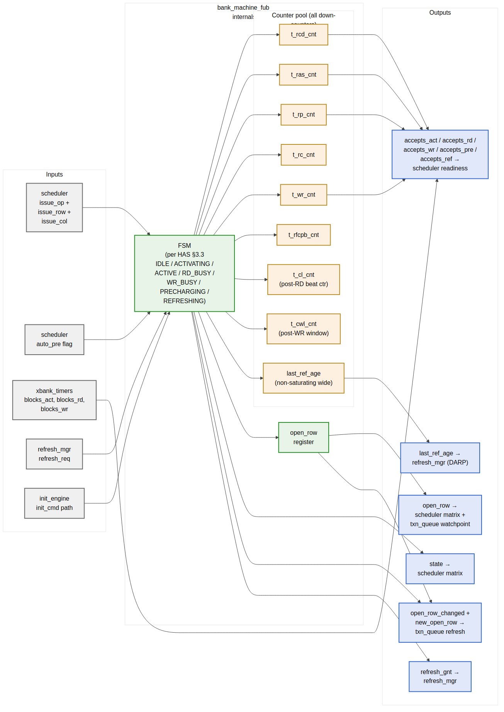

<!-- RTL Design Sherpa Documentation Header -->
<table>
<tr>
<td width="80">
  <a href="https://github.com/sean-galloway/RTLDesignSherpa">
    
  </a>
</td>
<td>
  <strong>RTL Design Sherpa</strong> · <em>Learning Hardware Design Through Practice</em><br>
  <sub>
    <a href="https://github.com/sean-galloway/RTLDesignSherpa">GitHub</a> ·
    <a href="https://github.com/sean-galloway/RTLDesignSherpa/blob/main/docs/DOCUMENTATION_INDEX.md">Documentation Index</a> ·
    <a href="https://github.com/sean-galloway/RTLDesignSherpa/blob/main/LICENSE">MIT License</a>
  </sub>
</td>
</tr>
</table>

---

<!-- End Header -->

# Bank Machine (`bank_machine_fub`)

**Module:** `bank_machine_fub.sv`
**Location:** `rtl/fub/`
**Category:** FUB
**Parent:** `ddr2_lpddr2_ctrl` (instantiated `NUM_RANKS × NUM_BANKS` times)
**Status:** Draft v0.1

> Architectural context: HAS §3.3. The FSM state diagram is in `ddr2_lpddr2_has/assets/mermaid/03_bank_machine_fsm.png` and is the canonical state reference — this section is the implementation view (port interface, counter pool, broadcast updates, multi-rank instantiation, timing).

---

## Purpose

`bank_machine_fub` is the per-(rank, bank) state machine that enforces JEDEC per-bank timing constraints. One FSM instance per (rank, bank) — so a 1-rank 8-bank build has 8 instances, a 2-rank 8-bank build has 16, a 4-rank 8-bank build has 32. Each instance tracks:

- Open-row state and the row identifier
- All per-bank timing counters (tRCD, tRAS, tRP, tRC, tWR, tRFCpb, plus per-RD CL and per-WR CWL windows)
- The "last refreshed" age used by DARP per-bank refresh selection
- The refresh handshake state to `refresh_mgr_fub`

The instance fans its outputs into:

- A per-(rank, bank) row of the scheduler's bank-state matrix
- The `txn_queue`'s row-hit-cache refresh broadcast (`open_row_changed[r][b]` + `new_open_row[r][b]`)
- The refresh manager's `refresh_gnt[r][b]` array and the `last_ref_age[r][b]` DARP selection input

The bank machine is the most-replicated FUB in the design. Per-instance area is small (~150–300 LUTs, see below), but the replication factor (NR × NB, up to 32) makes total bank-machine area the second-largest after the scheduler.

---

## Synthesis Parameters

| Parameter            | Source           | Effect on this FUB                                             |
|----------------------|------------------|----------------------------------------------------------------|
| `ROW_WIDTH`          | top              | Width of `open_row` register and `new_open_row` broadcast       |
| `COL_WIDTH`          | top              | Width of column passthrough (consumed by `cmd_encoder`, not stored) |
| `MEMTYPE`            | top              | Controls whether the `REFRESHING` state uses tRFCab or tRFCpb (LPDDR2 only has REFpb) |
| `T_*_WIDTH_MAX`      | derived          | Width of each timing-counter register (set by max CSR-loaded tREFI, tRC, tRFCpb, etc.) |
| `LAST_REF_AGE_WIDTH` | derived          | Width of `last_ref_age` counter; sized to span `8 × tREFI_cycles` without saturation |

The bank machine takes **no rank/bank identifier as a parameter** — every instance is identical. Identity comes from the position in the top-level generate block and is passed in via wire-level `bank_id_i` and `rank_id_i` ports (used only for assertion messages and CSR routing; the FSM logic is identity-agnostic).

---

## Instantiation Pattern

Recap from §2.1 top-integration:

```systemverilog
generate
    for (genvar r = 0; r < NUM_RANKS; r++) begin : g_rank
        for (genvar b = 0; b < NUM_BANKS; b++) begin : g_bank
            bank_machine_fub #(.ROW_WIDTH(ROW_WIDTH)) u_bank_machine (
                .mc_clk             (mc_clk),
                .mc_rst_n           (mc_rst_n),
                .rank_id_i          (r[$clog2(NR)-1:0]),
                .bank_id_i          (b[$clog2(NB)-1:0]),
                .sched_issue_if     (sched_to_bank[r][b]),
                .xbank_blocks_i     (xbank_to_bank[r][b]),
                .refresh_req_i      (refresh_req[r][b]),
                .refresh_gnt_o      (refresh_gnt[r][b]),
                .init_cmd_if        (init_to_bank[r][b]),
                .state_o            (bank_state[r][b]),
                .open_row_o         (bank_open_row[r][b]),
                .accepts_o          (bank_accepts[r][b]),
                .open_row_changed_o (orw_changed[r][b]),
                .new_open_row_o     (new_orw[r][b]),
                .last_ref_age_o     (bank_last_ref_age[r][b])
            );
        end
    end
endgenerate
```

The outputs are 2-D-indexed arrays at the top level. The scheduler and txn_queue consume them by name; no aggregation logic in the top — pure structural wiring.

---

## Block Internals



**Source:** [07_bank_machine_internals.mmd](../assets/mermaid/07_bank_machine_internals.mmd)

The diagram above is the implementation view. The HAS state-diagram view is at `ddr2_lpddr2_has/assets/mermaid/03_bank_machine_fsm.png` — refer to it for state transitions; this section is the port + counter detail.

---

## FSM States and Transition Triggers

Recap of the seven states (full state diagram in HAS):

| State          | Held while                                                        | Exits via                                          |
|----------------|-------------------------------------------------------------------|----------------------------------------------------|
| `IDLE`         | No row open; bank free                                            | ACT or REFpb issued by scheduler                   |
| `ACTIVATING`   | `t_rcd_cnt > 0`                                                   | `t_rcd_cnt == 0` → `ACTIVE`                        |
| `ACTIVE`       | Row open; awaiting column command or PRE                          | RD/RDA, WR/WRA, or PRE issued by scheduler         |
| `RD_BUSY`      | `t_cl_cnt > 0` (CL + BL/2 beats remaining)                        | Last beat returned → `ACTIVE` (bare RD) or `PRECHARGING` (RDA) |
| `WR_BUSY`      | `t_cwl_cnt > 0` (CWL + BL/2 + tWR window)                         | Window expired → `ACTIVE` (bare WR) or `PRECHARGING` (WRA) |
| `PRECHARGING`  | `t_rp_cnt > 0`                                                    | `t_rp_cnt == 0` → `IDLE`                           |
| `REFRESHING`   | `t_rfc_cnt > 0` (tRFCpb for LPDDR2, tRFCab for DDR2 REFab)        | `t_rfc_cnt == 0` → `IDLE`                          |

**Auto-precharge handling.** RDA / WRA do not require a separate state — they are encoded as an "auto-pre pending" flag set when the FSM enters `RD_BUSY` / `WR_BUSY`. When the busy window expires, the flag steers the next-state to `PRECHARGING` instead of `ACTIVE`. No PRE command is consumed from the scheduler — the precharge timing is purely internal. This is the same trick the cmd_encoder uses to fold RDA into one DRAM command.

**Init-engine bypass.** During init, the `init_cmd_if` path can issue ACT, PRE, MRS, REF directly without going through the scheduler. The FSM honors these as if they came from the scheduler — same state transitions, same counter reloads. The init engine knows the JEDEC sequence; the bank machine just executes it.

---

## Counter Pool

All counters are **down-counters that saturate at 0**. Each is loaded with a CSR-supplied cycle count on the relevant trigger.

| Counter         | Load Trigger                          | Reload Value (cycles)                | Saturates At | Width  |
|-----------------|---------------------------------------|--------------------------------------|--------------|--------|
| `t_rcd_cnt`     | ACT issued                            | `TIMINGS_RC_RCD_RP.tRCD`             | 0            | 8 bits |
| `t_ras_cnt`     | ACT issued                            | `TIMINGS_RC_RCD_RP.tRAS`             | 0            | 8 bits |
| `t_rp_cnt`      | PRE or PREA issued; or RDA/WRA window expiration | `TIMINGS_RC_RCD_RP.tRP`     | 0            | 8 bits |
| `t_rc_cnt`      | ACT issued                            | `TIMINGS_RC_RCD_RP.tRC`              | 0            | 8 bits |
| `t_wr_cnt`      | WR or WRA last beat issued            | `TIMINGS_CL_CWL_WR.tWR`              | 0            | 8 bits |
| `t_rfcpb_cnt`   | REF or REFpb issued                   | LPDDR2 `tRFCpb` / DDR2 `tRFCab`      | 0            | 16 bits |
| `t_cl_cnt`      | RD or RDA issued                      | `TIMINGS_CL_CWL_WR.CL + BL/2`        | 0            | 8 bits |
| `t_cwl_cnt`     | WR or WRA issued                      | `TIMINGS_CL_CWL_WR.CWL + BL/2 + tWR` | 0            | 8 bits |
| `last_ref_age`  | REF or REFpb completion (`t_rfcpb_cnt → 0`) | reload to 0; otherwise +1 per cycle | does not saturate (wide enough for 8 × tREFI) | 24 bits |

The CSR-supplied values are read from `TIMINGS_*` registers in `csr_apb_fub`; the values are live (not staged) since timing parameters are *typically* loaded once at init and not changed at runtime. Software *can* change them at quiet points, but the bank machine doesn't enforce quiet-point staging — it just samples them on each counter load.

**`last_ref_age` is non-saturating** because DARP needs to distinguish an entry that was refreshed 10 cycles ago from one refreshed 10,000 cycles ago. A 24-bit width supports `2^24 / 200 MHz = 84 ms` of age, well past 8 × tREFI (typically 50 µs).

---

## Outputs to Scheduler (`accepts_*`)

The `accepts_o` struct is the **combinational readiness output** consumed by the scheduler's Stage-1 readiness computation. Each member is the AND of "FSM state permits this command" and "all relevant counters are 0" and "xbank constraints permit this command":

```
accepts_act = (state == IDLE)
           AND (t_rp_cnt == 0)
           AND (t_rc_cnt == 0)
           AND NOT xbank_blocks_act

accepts_rd  = (state == ACTIVE)
           AND (t_rcd_cnt == 0)
           AND NOT xbank_blocks_rd

accepts_wr  = (state == ACTIVE)
           AND (t_rcd_cnt == 0)
           AND NOT xbank_blocks_wr

accepts_pre = (state == ACTIVE)
           AND (t_ras_cnt == 0)

accepts_ref = (state == IDLE)
           AND (t_rp_cnt == 0)
           AND (t_rc_cnt == 0)
```

These are pure combinational — no flop between the state register and the scheduler. The scheduler's Stage-1 critical path (per §2.7) routes through these comparators.

**Why xbank lives outside.** Cross-bank constraints (tRRD, tFAW, tCCD, tWTR, tRTW) are shared across all banks of a rank or globally across the channel — they can't be enforced inside a per-bank FSM. The `xbank_timers_fub` (§2.10) aggregates them and presents the per-(rank, bank) AND-mask via `xbank_blocks_i`.

---

## Refresh Handshake Protocol

The bank machine cooperates with `refresh_mgr_fub` via a two-wire handshake per (rank, bank):

| Signal              | Direction              | Meaning                                                                |
|---------------------|------------------------|------------------------------------------------------------------------|
| `refresh_req_i`     | refresh_mgr → bank     | "Drain to a quiet state and await my REF / REFpb command"             |
| `refresh_gnt_o`     | bank → refresh_mgr     | "I am in IDLE (or REFRESHING) and will not issue any column command"  |

The bank machine's protocol:

1. **`refresh_req` asserts** while the bank is in `ACTIVE` / `RD_BUSY` / `WR_BUSY`: the bank does not assert `refresh_gnt` yet. It finishes its current column command (if any) and falls back to `ACTIVE`. The scheduler is masked from issuing new column commands to this bank during the refresh window (`txn_queue` watchpoint — see §2.6 and §2.7).
2. **`refresh_req` asserts** while the bank is `ACTIVE` and no column command is in flight: the bank issues an internal precharge (driving `accepts_pre` high to signal the scheduler can issue PRE; or, if the scheduler is gated for the refresh window, the bank can self-issue PRE on `t_ras_cnt == 0`). Once `state == IDLE` and `t_rp_cnt == 0`, `refresh_gnt` asserts.
3. **`refresh_req` asserts** while the bank is in `IDLE`: `refresh_gnt` asserts the same cycle.
4. **REF/REFpb arrives** from the scheduler (via the refresh manager's priority path): FSM transitions `IDLE → REFRESHING`, `t_rfcpb_cnt` loads, `last_ref_age` resets to 0.
5. **`refresh_req` deasserts** after refresh completes: bank machine drops `refresh_gnt`, transitions `REFRESHING → IDLE` on `t_rfcpb_cnt == 0`, and is free to accept new ACTs.

For multi-rank REFab dispatch (per §2.11 refresh_mgr), the refresh manager asserts `refresh_req[r][*]` for all banks on the target rank simultaneously and waits for all `refresh_gnt[r][*]` before issuing REF. Other ranks' bank machines see `refresh_req[r' ≠ r] = 0` throughout and continue normal operation.

---

## Open-Row Change Broadcast

When the FSM transitions in a way that changes the open row, the bank machine asserts a one-cycle broadcast to `txn_queue_fub`:

| Transition                                  | `open_row_changed_o` | `new_open_row_o`           |
|---------------------------------------------|----------------------|----------------------------|
| `IDLE → ACTIVATING` (via ACT)               | 1 cycle              | The ACT's row              |
| `ACTIVE → PRECHARGING → IDLE` (after RDA/WRA or explicit PRE) | 1 cycle (on entering IDLE) | 0 (no row open)            |
| `REFRESHING → IDLE`                         | 1 cycle              | 0 (no row open)            |
| `ACTIVATING → ACTIVE`                       | not asserted (row was already valid as of ACTIVATING) | — |

This is the path that drives `txn_queue`'s `row_hit_cached` refresh, as described in §2.6. The one-cycle lag (broadcast at T, queue refresh visible at T+1) is the deliberate trade described in both this block and the scheduler (§2.7).

`new_open_row_o = 0` when the bank is leaving an open-row state is a convention — the queue's refresh path compares against the new row only when the bank ends in an active state. When ending in IDLE, the queue sets `row_hit_cached = 0` for all entries targeting this (rank, bank) regardless of `new_open_row_o`.

---

## Per-Instance vs. Aggregated Storage

What lives per-instance (NR × NB copies):

- `state` register (3 bits)
- `open_row` register (ROW_WIDTH bits)
- All counters (~80 bits per instance)
- `auto_pre_pending` flag (1 bit)

What is aggregated at the top level (one copy each):

- `bank_state[NR][NB]` — concatenation of per-instance `state` outputs into a 2-D array
- `bank_accepts[NR][NB]` — concatenation of `accepts` structs
- The DARP candidate-set vector (computed by `refresh_mgr_fub` from the array of `last_ref_age` outputs)
- The scheduler's match vector (computed by the scheduler from `bank_state` and `bank_accepts`)

This separation matters for synthesis: the per-instance flops are local to each bank machine (good for placement); the aggregation buses are wide (NR × NB × ~30 bits = up to ~1000 bits at 4×8) and route across the chip to the scheduler and refresh manager.

**Routing concern.** At `NUM_RANKS=4`, `NUM_BANKS=8`, the bank-state array routes 32 instances' worth of state and accepts wires to the scheduler. This is a ~1000-bit bus and is the second-widest in the design (after `txn_queue.q_entries_o`). The scheduler's Stage-1 critical path absorbs this in the 200 MHz target with slack; the 500 MHz target requires registered bank-state outputs (which adds one cycle to the scheduler-to-issue latency but is otherwise harmless — bank states change slowly compared to scheduler issue).

---

## Per-Instance Area Estimate

At default config (ROW_WIDTH=14, COL_WIDTH=10, 8-bit timing counters, 24-bit `last_ref_age`):

| Item                                | Per instance      |
|-------------------------------------|-------------------|
| FSM state (3 bits + 3-bit next)     | ~10 LUTs          |
| Counter pool (8 down-counters)      | ~60 flops + 30 LUTs |
| `open_row` register (14 bits)       | 14 flops          |
| `last_ref_age` (24 bits)            | 24 flops          |
| `auto_pre_pending` + combinational `accepts_*` glue | ~20 LUTs |
| **Per-instance total**              | **~120 flops + 60 LUTs ≈ 100–150 LUTs** |
| 32-instance total (4-rank × 8-bank) | **~3,200–4,800 LUTs** |

This is ~25% of the controller's total LUT budget at the max-rank config — significant. At single-rank, the bank machines fall to ~800–1,200 LUTs, comfortably in budget.

---

## CSR Hooks

| CSR field                                | Source signal                                | Use case                                    |
|------------------------------------------|----------------------------------------------|---------------------------------------------|
| `OBS_ROW_HIT_RANK<R>_BANK<N>` (R)        | Driven by scheduler when row-hit picks this bank | Per-bank row-hit telemetry (HAS §6.3)   |
| `OBS_REF_LATENCY_RANK<R>_BANK<N>` (R)    | Time from `refresh_req` to `refresh_gnt`     | Per-bank refresh-blocking time              |
| `OBS_BANK_OPEN_ROW_R<R>_B<N>` (R)        | Current `open_row` value                     | Debug: which row is currently open          |
| `OBS_BANK_STATE_R<R>_B<N>` (R)           | Current FSM state (3-bit encoding)           | Debug: bank state for bring-up              |
| `STATUS.bank_idle_mask` (R)              | One bit per (rank, bank): `state == IDLE`    | Quick visibility into bank availability     |

The per-(rank, bank) observation registers are sparse at multi-rank — at NR=4, NB=8 there are 32 of each. The CSR slave generates them from a YAML template (see §4.2). Software queries the `cap_max_ranks` and `NUM_BANKS` capability bits (§4.4) to know which registers exist.

---

## Verification Notes (cocotb test plan)

| Scenario                                                                          | What it proves                                                  |
|-----------------------------------------------------------------------------------|-----------------------------------------------------------------|
| Single ACT → RD → PRE → IDLE on bank 0                                            | Smoke: each counter loads and decrements correctly              |
| ACT → RDA: bank auto-precharges without explicit PRE from scheduler                | Auto-precharge flag steers RD_BUSY → PRECHARGING                |
| ACT → WRA: bank auto-precharges; `t_wr_cnt` window respected                       | Write recovery before precharge                                 |
| Scheduler issues RD while `t_rcd_cnt > 0`                                          | Assertion fires; `accepts_rd` was 0 — should be impossible      |
| `refresh_req` asserts during `ACTIVATING`                                          | `refresh_gnt` waits until bank reaches IDLE                     |
| `refresh_req` asserts during `RD_BUSY`                                             | Bank completes RD, returns to ACTIVE, then drains via PRE       |
| `refresh_req` asserts when bank is IDLE                                            | `refresh_gnt` asserts same cycle                                 |
| REF completion → `last_ref_age` resets to 0                                       | DARP age-tracking correctness                                    |
| Two adjacent ACTs to different rows on same bank — second blocks on `t_rp_cnt`     | Per-bank tRP enforcement                                         |
| Cross-bank ACT (handled by xbank_timers) — should NOT affect this bank             | Per-bank FSM is rank/bank-local                                  |
| Multi-rank (NR=2): refresh on rank 0 bank 3; rank 1 bank 3 continues normal ops    | Per-rank refresh isolation                                       |
| Open-row change broadcast: ACT issued, `open_row_changed` asserts for 1 cycle      | Broadcast timing correctness                                     |
| Soft reset during `WR_BUSY` — counters clear, state returns to IDLE                | Reset behavior                                                   |

---

## Open Questions / Future Work

- **CSR coverage of per-bank state.** At NR=4, NB=8 the `OBS_BANK_OPEN_ROW_*` registers consume 32 CSR slots — non-trivial. Worth gating behind a `cap_per_bank_obs` capability bit so smaller builds skip them entirely?
- **Per-instance vs centralized `last_ref_age`.** Could the age counters live in `refresh_mgr_fub` and free up flops per bank machine? Slight area win but adds a wide read port from refresh_mgr to bank_machine for age comparison; punt to v2.
- **Auto-pre flag clear timing.** Currently the `auto_pre_pending` flag clears on entering `PRECHARGING`. If a refresh request arrives mid-RD with auto-pre pending, the bank still does the auto-pre (drains via tRP) before granting refresh. This is correct per JEDEC, but worth a verification scenario (added above).
- **tWR vs tRP composition.** A WRA → PRECHARGING transition needs `max(t_wr_cnt, t_rp_load)` cycles. Implementation: the FSM enters PRECHARGING after `t_wr_cnt` expires and *then* loads `t_rp_cnt`. This is the simplest correct sequence; alternative is to start `t_rp_cnt` early and gate `IDLE` on `max(t_wr_cnt, t_rp_cnt)`. The simpler form is preferred unless characterization shows it costs measurable bandwidth.
