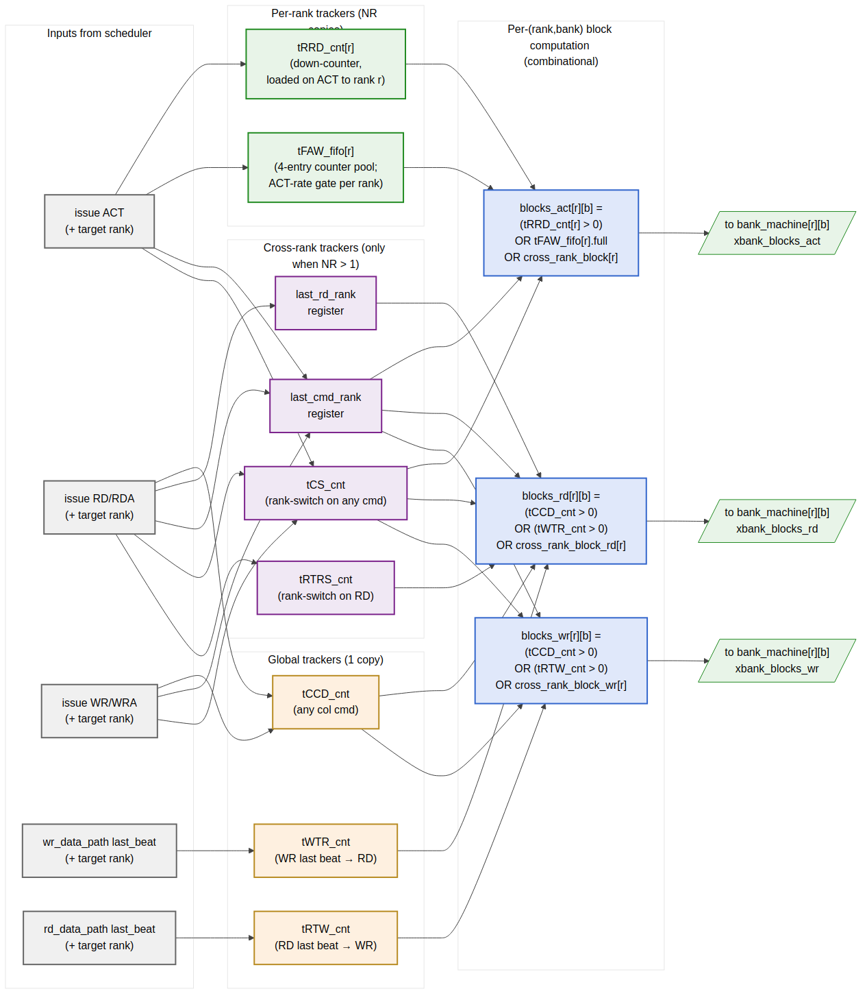

<!-- RTL Design Sherpa Documentation Header -->
<table>
<tr>
<td width="80">
  <a href="https://github.com/sean-galloway/RTLDesignSherpa">
    
  </a>
</td>
<td>
  <strong>RTL Design Sherpa</strong> · <em>Learning Hardware Design Through Practice</em><br>
  <sub>
    <a href="https://github.com/sean-galloway/RTLDesignSherpa">GitHub</a> ·
    <a href="https://github.com/sean-galloway/RTLDesignSherpa/blob/main/docs/DOCUMENTATION_INDEX.md">Documentation Index</a> ·
    <a href="https://github.com/sean-galloway/RTLDesignSherpa/blob/main/LICENSE">MIT License</a>
  </sub>
</td>
</tr>
</table>

---

<!-- End Header -->

# Cross-Bank Timers (`xbank_timers_fub`)

**Module:** `xbank_timers_fub.sv`
**Location:** `rtl/fub/`
**Category:** FUB
**Parent:** `ddr2_lpddr2_ctrl` (one instance)
**Status:** Draft v0.1

> Architectural context: HAS §3.3 `xbank_timers` and the "Per-Rank vs. Cross-Rank Scope" table added in v0.2. This block-level MAS section is the implementation view: per-constraint tracker structure, the per-rank vs global scope partition, multi-rank cross-rank gates, and the combinational `blocks_*` outputs.

---

## Purpose

`xbank_timers_fub` enforces the **cross-bank** JEDEC timing constraints — the ones that span banks of the same rank, or span ranks of the same channel. Per-bank constraints (tRCD, tRAS, tRP, etc.) live in `bank_machine_fub` (§2.9); this FUB owns everything that cannot live in a single bank machine because the relevant resource (the DRAM device's ACT-rate budget, the shared DQ bus, the chip-select setup) is shared.

The FUB produces per-(rank, bank) AND-mask signals (`blocks_act`, `blocks_rd`, `blocks_wr`) that gate each bank machine's `accepts_*` outputs. These masks are the bridge between cross-bank reality and the per-bank state machines' otherwise-local view.

There is **one instance** at the top level — even at multi-rank, the FUB is internally partitioned by scope rather than replicated.

---

## Constraint Inventory

Per HAS §3.3, the cross-bank constraints partition into three scopes:

| Constraint | Scope                       | Why                                                                       |
|------------|-----------------------------|---------------------------------------------------------------------------|
| `tRRD`     | per-rank                    | Limits ACT-to-ACT stagger inside one DRAM device                          |
| `tFAW`     | per-rank                    | Four-Activate-Window — device-local thermal/power limit                   |
| `tCCD`     | global (channel)            | Column-to-column on shared DQ bus                                         |
| `tWTR`     | global (channel)            | Write-data → read-data turnaround on shared DQ bus                        |
| `tRTW`     | global (channel)            | Read-data → write-data turnaround on shared DQ bus                        |
| `tRTRS`    | cross-rank only (NR > 1)    | Rank-to-rank DQ-bus handoff on consecutive reads to different ranks       |
| `tCS`      | cross-rank only (NR > 1)    | Chip-select setup when issuing a command to a different rank than the last |

For `NUM_RANKS == 1` builds, the cross-rank section is fully omitted at elaboration — the `tRTRS_cnt` and `tCS_cnt` flops are not synthesized and the `last_rd_rank` / `last_cmd_rank` registers tie off. The other tracker categories are present in every build.

---

## Synthesis Parameters

| Parameter            | Source            | Effect                                                                |
|----------------------|-------------------|-----------------------------------------------------------------------|
| `NUM_RANKS`          | top               | Per-rank tracker fanout; enables cross-rank gates when `> 1`           |
| `NUM_BANKS`          | top               | Output fanout: `blocks_*[NR][NB]`                                     |
| `T_RRD_WIDTH`        | derived           | Width of `tRRD_cnt` (sized to span max CSR-loaded tRRD value)         |
| `T_FAW_WIDTH`        | derived           | Width of each `tFAW_fifo` counter                                     |
| `T_CCD_WIDTH`        | derived           | Width of global `tCCD_cnt`                                            |
| `T_WTR_WIDTH`        | derived           | Width of global `tWTR_cnt`                                            |
| `T_RTW_WIDTH`        | derived           | Width of global `tRTW_cnt`                                            |
| `T_RTRS_WIDTH`       | derived (NR>1)    | Width of `tRTRS_cnt` (typically 2-bit for DDR2/3 1-cycle tRTRS)        |
| `T_CS_WIDTH`         | derived (NR>1)    | Width of `tCS_cnt` (typically 1-cycle on Artix-class FPGA targets)     |

The `T_*_WIDTH` parameters are computed at elaboration from the maximum CSR-loadable timing value. CSR values themselves are live (loaded once at init) and feed the counter-load values directly.

---

## Block Internals



**Source:** [08_xbank_timers_scope.mmd](../assets/mermaid/08_xbank_timers_scope.mmd)

The diagram shows three tracker pools (per-rank, global, cross-rank), the scheduler-issue inputs that load them, and the per-(rank, bank) `blocks_*` combinational outputs.

---

## Per-Rank Trackers

### `tRRD_cnt[NR]`

One down-counter per rank.

- **Load**: `issue_op_o == ACT` on rank `r` → `tRRD_cnt[r] = TIMINGS_RRD_FAW_WTR.tRRD`
- **Decrement**: `tRRD_cnt[r] > 0` decrements every cycle
- **Effect**: contributes to `blocks_act[r][*]` (gates *all banks* of rank `r`, since tRRD spans banks within the rank)
- **No cross-rank interference**: an ACT on rank 0 does not affect `tRRD_cnt[1]`

At the default tRRD ~5 cycles (DDR2-800), the counter is 3 bits. At 200 MHz the load-to-zero latency is 5 cycles — well within the scheduler's per-cycle reckoning.

### `tFAW_fifo[NR]`

Four-Activate-Window per rank. Implementation is a 4-entry counter pool (not a true FIFO of timestamps):

```
struct tFAW_slot_t {
    logic [T_FAW_WIDTH-1:0] cnt;   // down-counter; 0 means "this slot is free"
};

tFAW_slot_t tFAW_fifo[NUM_RANKS][4];

// Per cycle, per slot:
//   if (cnt > 0) cnt = cnt - 1;

// On ACT issue to rank r:
//   pick the slot in tFAW_fifo[r] with the smallest cnt (the next-to-evict slot;
//   one of them is guaranteed to be 0 if blocks_act_faw is currently low)
//   load that slot's cnt = TIMINGS_RRD_FAW_WTR.tFAW

// blocks_act_faw[r] = AND over all 4 slots: (cnt > 0)
```

The "pick smallest" load policy is equivalent to "replace the oldest entry," which is correct for a rolling-window tFAW check. The check `AND over 4 slots cnt > 0` is "all 4 most-recent ACTs are still within tFAW" — block.

**Why not a literal FIFO of timestamps.** A timestamp FIFO requires subtraction at check time (`now - oldest_ts > tFAW?`) and a wide subtractor. The counter-pool approach is a 4-entry comparison-to-zero, which is one LUT layer.

At default tFAW ~32 cycles (DDR2-800), each slot's counter is 5 bits. Total `tFAW_fifo` storage per rank: 4 × 5 = 20 flops. Across 4 ranks: 80 flops. Trivial.

---

## Global Trackers (channel-wide)

### `tCCD_cnt`

Single down-counter. Tracks the minimum gap between *any* column command (RD, RDA, WR, WRA) and the *next* column command anywhere on the channel.

- **Load**: any column command issue → `tCCD_cnt = TIMINGS_RRD_FAW_WTR.tCCD`
- **Effect**: contributes to both `blocks_rd[*][*]` and `blocks_wr[*][*]`

At DDR2-800 with BL=4, tCCD = 2 cycles. The counter is 2 bits.

### `tWTR_cnt`

Single down-counter. Tracks the minimum gap between the **last write data beat** completing and the **next read** issuing.

- **Load**: `wr_data_path_fub` strobes `wr_last_beat` → `tWTR_cnt = TIMINGS_RRD_FAW_WTR.tWTR`
- **Effect**: contributes to `blocks_rd[*][*]`
- **Subtle point**: loaded from the data-path event, *not* from the WR command issue. This is because tWTR is "last write data on DQ → first read CAS," not "WR command → RD command." The two are different by CWL + BL/2 cycles.

### `tRTW_cnt`

Symmetric to tWTR. Tracks the minimum gap between the **last read data beat** completing and the **next write** issuing.

- **Load**: `rd_data_path_fub` strobes `rd_last_beat` → `tRTW_cnt = TIMINGS_CL_CWL_WR.tRTW` (CSR field added in v0.2)
- **Effect**: contributes to `blocks_wr[*][*]`

At DDR2-800 tRTW is typically 0 cycles, but the counter is still synthesized for parameterization and verification consistency. At DDR3+ tRTW becomes a relevant constraint; we want the FUB to be ready.

---

## Cross-Rank Trackers (only when `NUM_RANKS > 1`)

These trackers synthesize only when `NUM_RANKS > 1` — at single-rank, they tie off and consume no flops.

### `last_rd_rank` register

`$clog2(NR)`-bit register holding the rank of the most recent RD/RDA issue. Used to detect rank-switching for the tRTRS gate.

### `tRTRS_cnt`

Single down-counter. Tracks the rank-to-rank read switching delay. DDR2 spec: 1 cycle when consecutive RDs target different ranks; 0 when same rank.

- **Load**: RD/RDA issued to rank `r`, and `r != last_rd_rank` → `tRTRS_cnt = TIMINGS_RTRS.tRTRS`
- **Effect**: contributes to `blocks_rd[r'][*]` *for `r' != last_rd_rank`* (block reads to a different rank while the bus handoff window is open)
- **Reset rule**: when an intervening WR or PRE breaks the read chain, `tRTRS_cnt` does not need to fire on the next RD. Implemented by also clearing on any non-RD issue.

### `last_cmd_rank` register and `tCS_cnt`

Similar pair for the chip-select setup constraint. When any new command targets a rank different from the previous command, tCS-cycles must pass before the new `CS_n[r']` can drive.

- **Load**: any command issue where target rank `r != last_cmd_rank` → `tCS_cnt = TIMINGS_CS.tCS`
- **Effect**: contributes to `blocks_act[r'][*]`, `blocks_rd[r'][*]`, `blocks_wr[r'][*]` *for `r' != last_cmd_rank`*

On Artix-class FPGAs targeting DDR2-800, `tCS` is typically met by IOB setup margin and the counter loads with 0 cycles. The flop and gate exist for parameter-driven verification and for stricter-margin platforms.

---

## Combinational `blocks_*` Outputs

The final per-(rank, bank) outputs are pure ORs of the relevant tracker bits:

```
// Common cross-rank block gates (only when NR > 1; else 0)
cross_rank_block[r] = (NR > 1)
                      AND (tCS_cnt > 0)
                      AND (r != last_cmd_rank)

cross_rank_block_rd[r] = cross_rank_block[r]
                       OR ( (NR > 1)
                            AND (tRTRS_cnt > 0)
                            AND (r != last_rd_rank) )

cross_rank_block_wr[r] = cross_rank_block[r]    // no tRTW-rank-switch gate in v1

// Per-(rank, bank) outputs (same for all banks of a rank)
blocks_act[r][b] = (tRRD_cnt[r] > 0)
                OR (tFAW_fifo[r].all_busy)
                OR cross_rank_block[r]

blocks_rd[r][b] = (tCCD_cnt > 0)
               OR (tWTR_cnt > 0)
               OR cross_rank_block_rd[r]

blocks_wr[r][b] = (tCCD_cnt > 0)
               OR (tRTW_cnt > 0)
               OR cross_rank_block_wr[r]
```

Note that `blocks_*[r][b]` does not depend on `b` — every bank within a rank sees the same xbank gate. The 2-D `blocks_*` output is a fanout convenience for the top-level wiring; the underlying logic is `NR`-wide, then broadcast to `NB` banks.

This is a deliberate fanout: the bank machine port (§2.9) accepts `xbank_blocks_i` as a per-(rank, bank) struct because the wider port is symmetric with the bank machine's other 2-D-indexed signals. The cost is one extra wire-fanout layer at the top; the benefit is the bank-machine module declaration doesn't have to be parameterized differently.

---

## Interface

### Inputs from Scheduler

| Signal                       | Direction | Width             | Description                                          |
|------------------------------|-----------|-------------------|------------------------------------------------------|
| `issue_op_i`                 | input     | 4                 | Same encoding as `scheduler_fub.issue_op_o`          |
| `issue_rank_i`               | input     | `$clog2(NR)`      | Rank being issued to                                 |
| `issue_strobe_i`             | input     | 1                 | `(issue_op_i != NOP) && issue_valid`                  |

### Inputs from Data Paths

| Signal              | Direction | Width  | Description                                          |
|---------------------|-----------|--------|------------------------------------------------------|
| `wr_last_beat_i`    | input     | 1      | Last beat of a WR burst pushed to DFI wrdata         |
| `wr_last_rank_i`    | input     | `$clog2(NR)` | Rank of that burst                            |
| `rd_last_beat_i`    | input     | 1      | Last beat of an RD burst returned from DFI rddata    |
| `rd_last_rank_i`    | input     | `$clog2(NR)` | Rank of that burst                            |

### Inputs from CSR (live)

| Signal           | Direction | Width   | Source                                  |
|------------------|-----------|---------|-----------------------------------------|
| `t_rrd_i`        | input     | width   | `TIMINGS_RRD_FAW_WTR.tRRD`              |
| `t_faw_i`        | input     | width   | `TIMINGS_RRD_FAW_WTR.tFAW`              |
| `t_ccd_i`        | input     | width   | `TIMINGS_RRD_FAW_WTR.tCCD`              |
| `t_wtr_i`        | input     | width   | `TIMINGS_RRD_FAW_WTR.tWTR`              |
| `t_rtw_i`        | input     | width   | `TIMINGS_CL_CWL_WR.tRTW`                |
| `t_rtrs_i`       | input     | 4       | `TIMINGS_XRANK.tRTRS` (only when NR>1)  |
| `t_cs_i`         | input     | 4       | `TIMINGS_XRANK.tCS` (only when NR>1)    |

### Outputs to Bank Machines

| Signal                    | Direction | Width        | Description                          |
|---------------------------|-----------|--------------|--------------------------------------|
| `blocks_act_o[NR][NB]`    | output    | NR×NB        | Per-(rank, bank) ACT gate            |
| `blocks_rd_o[NR][NB]`     | output    | NR×NB        | Per-(rank, bank) RD gate             |
| `blocks_wr_o[NR][NB]`     | output    | NR×NB        | Per-(rank, bank) WR gate             |

### Debug Outputs

| Signal                          | Description                                              |
|---------------------------------|----------------------------------------------------------|
| `dbg_t_rrd_obs_o[NR]`           | Live `tRRD_cnt[r]` values for waveform-debug             |
| `dbg_tfaw_busy_count_o[NR]`     | Per-rank count of non-zero tFAW slots                    |
| `dbg_xrank_block_active_o`      | One-bit: any cross-rank gate currently asserted          |

---

## Timing Budget

The path from scheduler issue → `blocks_*` update is single-cycle:

```
cycle T:   scheduler asserts issue_strobe_i with issue_op_i = ACT, issue_rank_i = r
cycle T:   load tRRD_cnt[r], push tFAW_fifo[r], load tCS_cnt (if rank-switched)
cycle T+1: tRRD_cnt[r] now > 0, blocks_act_o[r][*] = 1
```

The `blocks_*_o` outputs are combinational from the registers; the scheduler's Stage-1 path consumes them in the *same* cycle they update. So the scheduler always sees the post-issue gate state on the next cycle — no race where the scheduler picks two same-rank ACTs back-to-back.

For 500 MHz targets, the per-(rank, bank) fan-out path (NR × NB destinations) may need registered outputs. The 200 MHz default budget is comfortable.

**Per-bank fan-out concern.** At NR=4, NB=8, each `blocks_*` signal fans out 32 ways. Synthesis will buffer this automatically; no manual replication needed in RTL.

---

## CSR Hooks

| CSR field                          | Source                                  | Use case                                |
|------------------------------------|-----------------------------------------|-----------------------------------------|
| `STATUS.xbank_blocking_pct` (R)    | Rolling count of cycles where ANY `blocks_*` is asserted | Bandwidth-headroom telemetry |
| `OBS_TFAW_HITS_RANK<R>` (R)        | Incremented when ACT was blocked by tFAW for rank `r`     | Characterization: tFAW pressure |
| `OBS_TWTR_HITS` (R)                | Incremented when RD was blocked by tWTR                  | DQ-bus turnaround pressure |
| `OBS_XRANK_SWITCHES` (R)           | Incremented on every `last_cmd_rank` change (NR>1)        | Rank-locality telemetry |

The cross-rank counters are only present at `NUM_RANKS > 1` builds; at single-rank they tie to zero and read 0.

---

## Verification Notes (cocotb test plan)

| Scenario                                                                          | What it proves                                          |
|-----------------------------------------------------------------------------------|---------------------------------------------------------|
| Two ACTs to different banks of same rank, gap = tRRD - 1 cycle                    | Second ACT blocks; `blocks_act[r][*]` was high           |
| Two ACTs to different banks of same rank, gap = tRRD cycles                       | Second ACT issues at exactly tRRD                       |
| Five ACTs to rank 0 within tFAW window                                            | Fifth blocks; tFAW gate engages                          |
| Five ACTs spaced across tFAW boundary (4 in + 1 out)                              | Fifth issues; tFAW slot 1 has aged out                  |
| Multi-rank: ACTs on rank 0 do NOT block ACTs on rank 1                            | Per-rank tRRD / tFAW isolation                          |
| Multi-rank: RD to rank 0 then RD to rank 1, gap < tRTRS                           | Second blocks; `blocks_rd[1][*]` was high               |
| Multi-rank: RD to rank 0, then PRE to rank 0, then RD to rank 1                    | Intervening PRE clears tRTRS gate                       |
| WR last beat → RD before tWTR elapsed                                              | RD blocks; tWTR gate engaged                            |
| RD last beat → WR before tRTW elapsed (DDR3+ scenario)                            | WR blocks; tRTW gate engaged                            |
| Multi-rank with tCS > 0: cross-rank ACT blocks for tCS cycles                     | tCS gate works                                          |
| `NUM_RANKS = 1` build: cross-rank gates synthesize to 0                          | Synthesis sanity                                        |
| Heavy multi-rank traffic: telemetry counter increments correctly                  | CSR observability                                       |

---

## Open Questions / Future Work

- **tRTW cross-rank rank-switch gate.** Currently `cross_rank_block_wr` only depends on tCS (any rank switch), not on a separate "tRTRS-equivalent for writes." DDR4 introduced this; for DDR2/3 it's typically subsumed by tCS + tRTW. Worth a verification scenario at DDR3+ to confirm.
- **tFAW slot-selection policy.** "Pick smallest cnt" works correctly but doesn't necessarily match the literal "evict oldest by arrival." For a 4-entry pool with same-cycle arrivals, the two are equivalent. If multiple ACTs hit in the same cycle (single-issue scheduler means this doesn't currently happen), behavior would need re-spec.
- **Per-rank tCCD?** DDR4 introduced bank groups, with same-group tCCD_L being longer than different-group tCCD_S. For DDR2/LPDDR2 this is not relevant (no bank groups). The DDR3+ family controllers will add a per-bank-group tCCD tracker.
- **Counter-shift vs flop-pool for tFAW.** An alternative implementation is a single shift register that ratchets a tFAW-cycles delay line. Saves one comparator but consumes the same flops. Not worth changing in v1; revisit if Synth flags the comparator chain.
