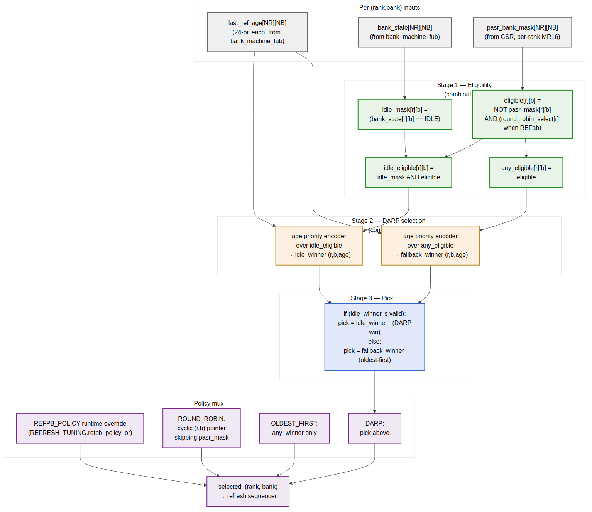

<!-- RTL Design Sherpa Documentation Header -->
<table>
<tr>
<td width="80">
  <a href="https://github.com/sean-galloway/RTLDesignSherpa">
    
  </a>
</td>
<td>
  <strong>RTL Design Sherpa</strong> · <em>Learning Hardware Design Through Practice</em><br>
  <sub>
    <a href="https://github.com/sean-galloway/RTLDesignSherpa">GitHub</a> ·
    <a href="https://github.com/sean-galloway/RTLDesignSherpa/blob/main/docs/DOCUMENTATION_INDEX.md">Documentation Index</a> ·
    <a href="https://github.com/sean-galloway/RTLDesignSherpa/blob/main/LICENSE">MIT License</a>
  </sub>
</td>
</tr>
</table>

---

<!-- End Header -->

# Refresh Controller (`refresh_ctrl`)

**Module:** `refresh_ctrl.sv`
**Location:** `rtl/fub/`
**Category:** FUB
**Parent macro:** `command_scheduler_macro`
**Status:** v1 implemented (REFab + tREFI postponer; REFpb/DARP/ZQCS/PASR deferred to v2)

> Architectural context: HAS §3.4.
>
> **Renamed:** the SWAG called this `refresh_mgr_fub`; the implementation
> name is `refresh_ctrl`.
>
> **v1 scope vs SWAG:** v1 implements the **REFab path** and the **tREFI
> postponer** (JEDEC max 8 postponed refreshes). The DARP per-bank selector,
> ZQCS piggyback path, per-rank round-robin, and PASR mask propagation
> described below are **deferred to v2** — they're kept in this chapter as
> the architectural target. The text says "bank machines" in places; in
> the current implementation refresh wins against the scheduler's other
> commands via priority, and the per-bank counters in `xbank_timers` reset
> when REF issues.

---

## Purpose

`refresh_ctrl` owns DRAM refresh scheduling. In v1 it produces:

- The `refresh_req_o` signal that elevates refresh to highest priority in
  the scheduler.
- The `pending_refreshes_o` counter for the JEDEC max-8 postponed window.
- (Future) Per-rank DARP selection, ZQCS piggyback, PASR mask propagation.

This is the heart of the controller's correctness story: get refresh wrong
and DRAM forgets data. The FUB is built around a deterministic postponer
(no saturating-pending counter — saturation would be out-of-JEDEC).

For multi-rank builds, the FUB drives REFab in a round-robin across ranks so non-targeted ranks keep servicing column commands during the refresh window — see §3.4 in the HAS for the rationale.

---

## Synthesis Parameters

| Parameter                | Source           | Effect                                                            |
|--------------------------|------------------|-------------------------------------------------------------------|
| `NUM_RANKS`              | top              | Per-rank PASR masks, per-rank refresh_req fan-out, round-robin pointer width |
| `NUM_BANKS`              | top              | DARP candidate matrix width                                       |
| `REFPB_POLICY`           | top              | `ROUND_ROBIN`, `OLDEST_FIRST`, `DARP` — picks the synthesized REFpb selector tree |
| `REFRESH_DEFER_MAX`      | top (default 8)  | Postponer batch depth and `refresh_owed` counter width             |
| `MEMTYPE`                | top              | Picks REFab vs REFpb default; LPDDR2 uses REFpb, DDR2 uses REFab  |
| `T_REFI_WIDTH`           | derived          | Width of `t_refi_cnt`                                              |
| `T_RFC_WIDTH`            | derived          | Width of `t_rfcpb_cnt` / `t_rfcab_cnt`                            |
| `T_ZQCS_WIDTH`           | derived          | Width of the ZQCS interval counter                                |

---

## Top-Level FSM

Six-state FSM mirroring HAS §3.4. The state register is the only flop on the priority path.

| State              | Held while                                                          | Exits via                                              |
|--------------------|---------------------------------------------------------------------|--------------------------------------------------------|
| `IDLE`             | `wants_refresh` pulse not asserted; ZQCS not due                    | `wants_refresh` → `WAIT_BANK_GNTS`                     |
| `WAIT_BANK_GNTS`   | Asserting `refresh_req` to selected banks; awaiting `refresh_gnt`   | All required `refresh_gnt[r][b]` high → `DO_REFRESH`   |
| `DO_REFRESH`       | Refresh sequencer issuing REF/REFpb back-to-back, draining `refresh_owed` | `refresh_owed == 0` → `CHECK_ZQCS`               |
| `CHECK_ZQCS`       | One-cycle check whether `wants_zqcs` is asserted                    | `wants_zqcs == 1` → `DO_ZQCS`, else → `RELEASE`        |
| `DO_ZQCS`          | Running ZQCS sequence (PRE_ALL → tRP → ZQCS → wait tZQCS)           | tZQCS expired → `RELEASE`                              |
| `RELEASE`          | Deasserting `refresh_req`; one cycle for bank machines to drop grants | All `refresh_gnt` low → `IDLE`                       |

The FSM advances at most one state per MC clock; full `WAIT → DO → CHECK → ZQCS → RELEASE → IDLE` traversal of a non-batched single-refresh-with-ZQCS takes ~(tRFCpb + tZQCS + 4) cycles.

---

## Counter Inventory

| Counter         | Width                          | Loaded on / Behavior                                                  |
|-----------------|--------------------------------|-----------------------------------------------------------------------|
| `t_refi_cnt`    | `T_REFI_WIDTH`                 | Down-counter from `TIMINGS_RAS_RFC_REFI.tREFI` (or scaled by `tREFI_scale` for LPDDR2 temperature derating); reloads on hitting 0 |
| `postpone_cnt`  | `$clog2(REFRESH_DEFER_MAX)`    | Down-counter from `REFRESH_DEFER_MAX − 1` to 0; decrements on each `t_refi_cnt` zero; reloads on emitting `wants_refresh` |
| `refresh_owed`  | `$clog2(REFRESH_DEFER_MAX × NR) + 1` | **Non-saturating** counter of refreshes still to issue; +REFRESH_DEFER_MAX when postponer fires; decrements per refresh issued |
| `t_zqcs_cnt`    | `T_ZQCS_WIDTH`                 | Down-counter for periodic ZQCS interval; reload from `REFRESH_TUNING.zqcs_freq_hz` (live CSR) |
| `tRFC_inflight` | `T_RFC_WIDTH`                  | Down-counter inside the sequencer for the *currently-issued* REF/REFpb; gates the next back-to-back issue |

The `refresh_owed` counter is **non-saturating** because JEDEC requires the controller to honor every missed refresh. A saturating counter would silently drop deadlines if the workload kept the bus blocked for more than `REFRESH_DEFER_MAX × tREFI`. v0.1 HAS used a saturating counter; v0.2 changed it to the deterministic postponer-based non-saturating counter described here.

The width sizing is generous: `clog2(REFRESH_DEFER_MAX × NR) + 1` covers the worst case where the postponer just fired AND every rank has a queued batch waiting.

---

## Postponer Logic

The postponer is what aggregates `REFRESH_DEFER_MAX` worth of tREFI deadlines into a single back-to-back refresh batch. This trades worst-case refresh latency for sustained bandwidth (fewer scheduler interrupts).

```
// Per cycle:
if (t_refi_cnt > 0):
    t_refi_cnt = t_refi_cnt - 1
else:
    // tREFI fired
    t_refi_cnt = tREFI_cycles    // reload
    if (postpone_cnt > 0):
        postpone_cnt = postpone_cnt - 1
        // (no refresh emitted yet; defer)
    else:
        // batch complete
        emit wants_refresh        // one-cycle pulse to FSM
        postpone_cnt = REFRESH_DEFER_MAX - 1
        refresh_owed = refresh_owed + REFRESH_DEFER_MAX
```

The `wants_refresh` pulse is captured by the FSM's `IDLE → WAIT_BANK_GNTS` transition. Once captured, the FSM stays out of IDLE until `refresh_owed == 0` (sequencer drains the batch).

Setting `REFRESH_DEFER_MAX = 1` disables batching — every tREFI fires one refresh, equivalent to the no-postponer behavior. Setting `REFRESH_DEFER_MAX = 8` (default at JEDEC's ceiling) gathers up to 8 deadlines before firing the back-to-back batch.

**LPDDR2 temperature scaling**: the reload value for `t_refi_cnt` is `tREFI_cycles / tREFI_scale`, where `tREFI_scale ∈ {1, 2, 4}` from MR4 temperature class (1x at nominal, 2x at high-temp, 4x at very-high-temp). The scale is a live CSR read; software writes it after the SoC has polled MR4 via the LPDDR2 PHY.

---

## DARP Selection (REFpb Path)

For REFpb, the FUB selects one (rank, bank) tuple to refresh each iteration through the batch drain. The DARP policy (HAS §3.4) is "max age among idle non-PASR-masked tuples; if none idle, fall back to oldest-first."



**Source:** [10_refresh_darp_selector.mmd](../assets/mermaid/10_refresh_darp_selector.mmd)

### Stage 1 — Eligibility (combinational, NR × NB parallel)

For each (r, b):

```
eligible[r][b]      = NOT pasr_bank_mask[r][b]
idle_mask[r][b]     = (bank_state[r][b] == IDLE)
idle_eligible[r][b] = idle_mask[r][b] AND eligible[r][b]
any_eligible[r][b]  = eligible[r][b]
```

PASR masking is per-rank (HAS §3.4 v0.2 change) — masked banks of one rank don't suppress the same bank on another rank.

### Stage 2 — Dual Priority Encoders

Two parallel age-priority encoders over `last_ref_age[NR][NB]`:

```
idle_winner     = age_pe(idle_eligible)    // (r,b) with max age, or NONE
fallback_winner = age_pe(any_eligible)     // (r,b) with max age across all eligible
```

For NR=4, NB=8 = 32 candidates, the encoder is a 32-entry tournament — 5 levels of pairwise compare-and-select on 24-bit ages. ~50 LUT-delays at FPGA target — slower than the scheduler's 16-entry tournament (§2.7) but only matters once per refresh batch issue, not every cycle.

### Stage 3 — DARP Pick

```
if (idle_winner is valid):
    pick = idle_winner          // DARP win
else:
    pick = fallback_winner      // fall back to oldest-first
```

### Policy Mux

`REFRESH_TUNING.refpb_policy_or` overrides the synthesized default. The three policy branches are computed in parallel:

- `ROUND_ROBIN`: cyclic `(r, b)` pointer that skips PASR-masked tuples
- `OLDEST_FIRST`: just `fallback_winner` (skip the DARP idle-test)
- `DARP`: the Stage-3 pick

A 3:1 mux selects the active policy. Un-synthesized policies tie off and the mux returns `pslverr` on CSR write of an unavailable choice (per HAS §6.3 quiet-point semantics).

### Round-Robin Pointer

For `ROUND_ROBIN` policy and for REFab (per-rank round-robin), the FUB maintains a `round_robin_(rank, bank)` pointer that increments past PASR-masked tuples after each refresh issue. For REFab, the bank field is ignored and only the rank pointer advances.

---

## REFab Path (Multi-Rank Round-Robin)

When `MEMTYPE == "DDR2"` or LPDDR2 falls back to REFab, the FUB drives REF with per-rank dispatch. The HAS §3.4 specifies why: driving REF with all `CS_n[*] = 0` would freeze every rank simultaneously, wasting bandwidth on ranks not due. The round-robin keeps the non-target ranks available for column commands.

Sequence per REFab iteration (one drain step):

1. `target_rank = round_robin_rank` (advanced post-issue)
2. Assert `refresh_req[target_rank][*]` for all banks on `target_rank` (none for other ranks)
3. Wait for `AND(refresh_gnt[target_rank][b] for b in 0..NB-1)`
4. Issue REF via the scheduler's refresh-priority path; `cmd_encoder` drives `dfi_cs_n[target_rank] = 0`, others = 1
5. Load `tRFC_inflight = tRFCab_cycles` (DDR2 REFab) or `tRFCab_cycles` (LPDDR2 fallback REFab)
6. Wait for `tRFC_inflight == 0`
7. `refresh_owed = refresh_owed - 1`; advance `round_robin_rank = (round_robin_rank + 1) % NR`
8. If `refresh_owed > 0`, repeat from step 1 with the new `target_rank`

For `NUM_RANKS == 1`, the round-robin pointer is a tied 0 and the path collapses to single-rank REFab.

---

## REFpb Path (LPDDR2 Default)

REFpb operates on a (rank, bank) tuple — only that one bank on that one rank enters REFRESHING. All other banks (on the same rank and other ranks) keep operating.

Sequence per REFpb iteration:

1. DARP / policy selector picks `target_(rank, bank)` (above)
2. Assert `refresh_req[target_rank][target_bank]` (single bit)
3. Wait for `refresh_gnt[target_rank][target_bank]`
4. Issue REFpb via scheduler; `cmd_encoder` drives `dfi_cs_n[target_rank] = 0`, embeds the bank number in the LPDDR2 CA bus
5. Load `tRFC_inflight = tRFCpb_cycles`
6. Wait for `tRFC_inflight == 0`
7. `refresh_owed = refresh_owed - 1`
8. If `refresh_owed > 0`, repeat from step 1 with a fresh DARP selection (`last_ref_age` for the just-refreshed tuple resets to 0, so it won't immediately win again)

---

## Periodic ZQCS Piggyback

Periodic ZQCS is implemented as a side-channel on the refresh window. `t_zqcs_cnt` runs in parallel with the postponer:

```
if (t_zqcs_cnt > 0):
    t_zqcs_cnt = t_zqcs_cnt - 1
else:
    t_zqcs_cnt = zqcs_interval_cycles     // reload from REFRESH_TUNING.zqcs_freq_hz
    wants_zqcs = 1                         // sticky until consumed by FSM
```

The FSM checks `wants_zqcs` in the `CHECK_ZQCS` state after a refresh batch drains. If asserted, the FSM enters `DO_ZQCS` and runs the ZQCS sequence:

1. Issue PRE_ALL (idempotent on the just-refreshed ranks; required on ranks that may have stayed ACTIVE during partial refresh)
2. Wait tRP
3. Issue ZQCS command
4. Wait tZQCS (~64–256 cycles)
5. Clear `wants_zqcs`; transition to `RELEASE`

This piggybacks on the "all banks idle" guarantee that the refresh window already provides — no separate bus-blocking event is needed for ZQCS. The cost is a small latency at the end of refresh batches (only when ZQCS is actually due).

Setting `REFRESH_TUNING.zqcs_freq_hz = 0` disables periodic ZQCS (init-only mode).

---

## Per-Rank PASR Handling

PASR (Partial Array Self-Refresh) is an LPDDR2 feature that lets the SoC mask off DRAM regions that hold no data, saving refresh power. The mask is per-rank because each rank has its own MR16/MR17.

- `pasr_bank_mask[NR]` — `NUM_BANKS`-bit per-rank register, written by SoC via `PASR_BANK_MASK_RANK<R>` CSR
- `pasr_seg_mask[NR]` — segment mask, written via `PASR_SEG_MASK_RANK<R>`

The FUB uses `pasr_bank_mask[r][b]` to skip masked banks in the DARP selector (Stage 1 eligibility). The segment mask is propagated to DRAM via MR17 writes.

### PASR Propagation Protocol

Per HAS §3.4 / Linux PASR Framework reference:

1. SoC writes new mask to CSR
2. Refresh manager treats the staging copy as advisory until the next self-refresh entry OR the next quiet point
3. On self-refresh entry (or quiet point), the new mask is propagated to DRAM via MR16/MR17 writes (one write per rank per register)
4. Mask is now active; subsequent refreshes honor it

The propagation is bundled with self-refresh entry to avoid an extra bus-blocking event during normal operation. If software needs immediate propagation, it asserts `CTRL.config_apply` and the FUB propagates at the next quiet point.

---

## Interface

### Outputs to Scheduler

| Signal              | Direction | Width  | Description                                                       |
|---------------------|-----------|--------|-------------------------------------------------------------------|
| `refresh_wants_o`   | output    | 1      | Binary "refresh due now" — pauses scheduler new-issue per §2.7    |
| `refresh_issue_o`   | output    | struct | When in DO_REFRESH, drives the next REF/REFpb command directly into the scheduler's command-issue path (scheduler relays to cmd_encoder) |

### Per-(Rank, Bank) Handshake

| Signal                                | Direction | Width   | Description                                          |
|---------------------------------------|-----------|---------|------------------------------------------------------|
| `refresh_req_o[NR][NB]`               | output    | NR×NB   | Asserted to banks that should drain to IDLE          |
| `refresh_gnt_i[NR][NB]`               | input     | NR×NB   | Bank machines acknowledge "in IDLE, ready"           |
| `bank_state_i[NR][NB]`                | input     | per BM  | Used for DARP idle-mask                              |
| `last_ref_age_i[NR][NB]`              | input     | 24-bit each | Used for age-priority encoder                    |
| `refresh_done_for_o[NR][NB]`          | output    | NR×NB   | "This bank has been handed back to the scheduler" — drives `txn_queue.refresh_done_for_i` per §2.6 |

### CSR (live)

| Signal                            | Direction | Width   | Source                                                |
|-----------------------------------|-----------|---------|-------------------------------------------------------|
| `cfg_refpb_policy_or_i`           | input     | 2       | `REFRESH_TUNING.refpb_policy_or`                      |
| `cfg_refresh_defer_active_i`      | input     | 4       | `REFRESH_TUNING.refresh_defer_active`                 |
| `cfg_zqcs_freq_hz_i`              | input     | 16      | `REFRESH_TUNING.zqcs_freq_hz`                         |
| `cfg_trefi_scale_i[NR]`           | input     | 2 × NR  | Per-rank LPDDR2 temperature derating from MR4 readback |
| `cfg_pasr_bank_mask_i[NR]`        | input     | NB × NR | Per-rank PASR bank mask                                |
| `cfg_pasr_seg_mask_i[NR]`         | input     | 8 × NR  | Per-rank PASR segment mask                             |

### Init-Engine Coordination

| Signal              | Direction | Width  | Description                                                 |
|---------------------|-----------|--------|-------------------------------------------------------------|
| `init_in_progress_i`| input     | 1      | Disables postponer and FSM during init                      |
| `init_mrs_passthru_o` | output  | struct | Forwards MRS writes (MR16/MR17 PASR propagation) to init path |

### Self-Refresh Coordination (with power_state)

| Signal              | Direction | Width  | Description                                                 |
|---------------------|-----------|--------|-------------------------------------------------------------|
| `sr_entry_req_i`    | input     | 1      | `power_state_fub` requests self-refresh entry               |
| `sr_entry_gnt_o`    | output    | 1      | `refresh_mgr` ack — no auto-refresh in progress             |
| `sr_active_i`       | input     | 1      | DRAM is in self-refresh; `t_refi_cnt` paused                |
| `sr_exit_done_i`    | input     | 1      | DRAM has exited self-refresh; resume `t_refi_cnt`           |

### Telemetry

| Signal                  | Description                                              |
|-------------------------|----------------------------------------------------------|
| `dbg_refresh_owed_o`    | Current `refresh_owed` value                             |
| `dbg_postpone_cnt_o`    | Current postponer state                                  |
| `dbg_darp_idle_count_o` | Number of idle-eligible tuples this cycle                |
| `dbg_state_o`           | Current FSM state (3-bit encoded)                        |
| `dbg_target_rank_o`     | (REFab) current `round_robin_rank`                       |
| `dbg_pasr_active_o`     | OR over all PASR masks — "any mask is non-zero"         |

---

## Timing Budget

The DARP selector is the slowest path inside this FUB:

| Path                                                                  | Levels (FPGA estimate) | Budget   |
|-----------------------------------------------------------------------|------------------------|----------|
| `bank_state[r][b]` → `idle_eligible[r][b]`                            | 2 LUT levels           | 0.5 ns   |
| `last_ref_age[r][b]` → age priority encoder (32-entry, 5 levels)      | 5 × 2 LUT = 10 levels  | 1.6 ns   |
| Encoder output → 3-way policy mux → `target_(rank, bank)`             | 2 LUT levels           | 0.4 ns   |
| Routing / setup margin                                                |                        | 0.3 ns   |
| **Total**                                                             |                        | **2.8 ns** |

At 200 MHz (5 ns cycle) this closes with ~2.2 ns slack. At 500 MHz it misses by ~800 ps and needs the encoder pipelined (one register between the dual encoders and the policy mux — adds one cycle to DARP latency, but DARP only fires once per refresh issue, so the throughput impact is zero).

The FSM transitions are all single-cycle. Total refresh-batch latency in cycles is `(REFRESH_DEFER_MAX × max(tRFCab, tRFCpb)) + (zqcs cycles if applicable) + ~5 FSM cycles`. At default config (REFRESH_DEFER_MAX=8, tRFCpb=8 cycles for LPDDR2-1066) this is ~70 cycles per batch fire.

---

## CSR Hooks

| CSR field                                | Source signal                                | Use case                                |
|------------------------------------------|----------------------------------------------|-----------------------------------------|
| `OBS_REFRESH_PENDING_MAX` (R)            | Watermark of `refresh_owed`                 | Detect refresh backpressure              |
| `OBS_REFRESH_DEFER_HIST_0..3` (R)        | 4-bin histogram of postpone_cnt at fire-time | Characterization: postponer health      |
| `OBS_REF_LATENCY_RANK<R>_BANK<N>` (R)    | Time from `refresh_req` to `refresh_gnt` for that bank | Per-bank refresh-blocking distribution |
| `STATUS.refresh_mgr_state` (R)           | `dbg_state_o`                                | Bring-up debug                          |
| `STATUS.refresh_target_rank` (R)         | `dbg_target_rank_o`                          | (NR>1) which rank is currently refreshing |
| `STATUS.pasr_active` (R)                 | `dbg_pasr_active_o`                          | LPDDR2 PASR-active flag                 |

---

## Verification Notes (cocotb test plan)

| Scenario                                                                          | What it proves                                              |
|-----------------------------------------------------------------------------------|-------------------------------------------------------------|
| `REFRESH_DEFER_MAX = 1`; every tREFI fires one refresh                            | Postponer disabled mode                                     |
| `REFRESH_DEFER_MAX = 8`; postpone 8 deadlines then drain                          | Batching mode                                               |
| Bandwidth-starved workload exceeds 8×tREFI; `refresh_owed` grows past 8           | Non-saturating counter holds the deadline correctly          |
| DDR2 REFab on single-rank: all banks → REFRESHING; gnt waits then asserts        | Single-rank REFab smoke                                     |
| DDR2 REFab on NR=2: rank 0 refreshes; rank 1 banks continue normal ops           | Per-rank REFab dispatch                                     |
| LPDDR2 REFpb with DARP: pick targets idle bank with max age                       | DARP selector idle preference                                |
| LPDDR2 REFpb with DARP: all banks busy → fall back to oldest-first                | DARP fallback path                                          |
| `REFPB_POLICY = ROUND_ROBIN`; cyclic refresh skipping PASR-masked banks            | Round-robin policy                                          |
| Per-rank PASR: rank 0 bank 3 masked; rank 1 bank 3 not masked                     | Per-rank PASR isolation                                     |
| `zqcs_freq_hz = 0`; periodic ZQCS disabled, only init-time ZQCS                  | ZQCS disable                                                |
| `zqcs_freq_hz = 1`; ZQCS fires once per second, piggybacked on refresh           | Periodic ZQCS                                               |
| Self-refresh entry: `sr_entry_req` asserts; `sr_entry_gnt` waits for current refresh to complete | Self-refresh handshake                              |
| LPDDR2 temperature derate from MR4: tREFI_scale = 2x → t_refi_cnt loads at half value | Temperature-compensated refresh                          |
| Multi-rank PASR write via CSR + quiet-point; MR16 propagation visible             | PASR update protocol                                        |
| Refresh during in-flight read on different rank (NR=2): read completes uninterrupted | Per-rank refresh non-interference                     |

---

## Open Questions / Future Work

- **REFab on multiple ranks in parallel.** Currently REFab dispatches to one rank at a time in round-robin. An alternative is to drive REF on multiple ranks simultaneously (e.g., 2-at-a-time on 4-rank systems) — saves wall-clock refresh time at the cost of more concurrently-blocked ranks. Trade-off depends on whether the workload is bottlenecked by per-rank throughput or by aggregate refresh budget. Punt to v2 with characterization data.
- **DARP look-ahead.** Currently DARP picks the (rank, bank) with max age and idle. A look-ahead variant could weight age by predicted upcoming traffic to that bank — if `txn_queue` has pending column commands queued for a bank, prefer to refresh a different bank that's about to go idle. Adds a wire from `txn_queue` to the DARP selector; valuable but adds complexity. Not in v1.
- **Postponer adaptive depth.** `REFRESH_DEFER_MAX` is static at elaboration; `refresh_defer_active` is the runtime tunable (up to MAX). Could the active value auto-tune based on observed refresh-pending history? Would close a characterization loop in hardware. Discuss with software team — likely lives in firmware, not RTL.
- **PASR mask write coalescing.** If software writes PASR_BANK_MASK_RANK<R> for all ranks back-to-back, the FUB currently propagates each on its own quiet point. Could coalesce into one MR16/MR17 burst. Minor optimization; only matters if PASR is reconfigured frequently. Punt unless software flags it.
