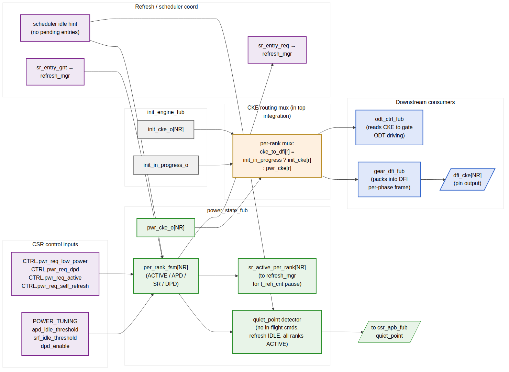

<!-- RTL Design Sherpa Documentation Header -->
<table>
<tr>
<td width="80">
  <a href="https://github.com/sean-galloway/RTLDesignSherpa">
    
  </a>
</td>
<td>
  <strong>RTL Design Sherpa</strong> · <em>Learning Hardware Design Through Practice</em><br>
  <sub>
    <a href="https://github.com/sean-galloway/RTLDesignSherpa">GitHub</a> ·
    <a href="https://github.com/sean-galloway/RTLDesignSherpa/blob/main/docs/DOCUMENTATION_INDEX.md">Documentation Index</a> ·
    <a href="https://github.com/sean-galloway/RTLDesignSherpa/blob/main/LICENSE">MIT License</a>
  </sub>
</td>
</tr>
</table>

---

<!-- End Header -->

# Power-State FSM (`power_state_fub`)

**Module:** `power_state_fub.sv`
**Location:** `rtl/fub/`
**Category:** FUB
**Parent:** `ddr2_lpddr2_ctrl`
**Status:** Draft v0.1

> Architectural context: HAS §3.5. The HAS state diagram for power transitions is in `ddr2_lpddr2_has/assets/mermaid/04_power_state_fsm.png` — refer to it for state transitions. This section is the implementation view (per-rank FSM array, per-rank CKE routing, self-refresh coord with refresh manager, quiet-point detector, init-time CKE handoff).

---

## Purpose

`power_state_fub` controls DRAM power state. It tracks per-rank power-state independently so that, for example, rank 0 can stay ACTIVE servicing AXI traffic while rank 1 is in SELF_REFRESH for thermal or workload reasons. The FUB drives the per-rank `dfi_cke[NR]` outputs that DRAM uses to enter / exit power-down states, and coordinates with `refresh_mgr_fub` on self-refresh entry / exit.

The FUB also owns the **quiet-point detector** consumed by `csr_apb_fub` for CSR override staging. Quiet point is "nothing in flight" — defined as `txn_queue` empty (or only `PENDING`), refresh manager IDLE, no DFI command pipelined, every rank in ACTIVE (not in any low-power state).

---

## Synthesis Parameters

| Parameter              | Source           | Effect                                                              |
|------------------------|------------------|---------------------------------------------------------------------|
| `NUM_RANKS`            | top              | One per-rank FSM instance per rank                                  |
| `MEMTYPE`              | top              | DPD state is LPDDR2-only; DDR2 builds elide the DPD transitions    |
| `APD_THRESHOLD_WIDTH`  | derived          | Width of the `apd_idle_cnt` per-rank idleness counter (16-bit)       |
| `SRF_THRESHOLD_WIDTH`  | derived          | Width of the `srf_idle_cnt` (24-bit)                                |

---

## Per-Rank FSM Array

The FUB instantiates `NUM_RANKS` independent FSMs, one per rank. Each per-rank FSM has the four canonical states:

| State                 | DRAM behavior                                                | dfi_cke[r] |
|-----------------------|--------------------------------------------------------------|------------|
| `ACTIVE`              | DRAM ready for commands; refreshes flow through refresh_mgr  | 1          |
| `ACTIVE_POWER_DOWN` (APD) | CKE de-asserted; DRAM ignores commands; refreshes paused | 0          |
| `SELF_REFRESH` (SRF)  | DRAM internally refreshes; controller's tREFI paused         | 0          |
| `DEEP_POWER_DOWN` (DPD) | LPDDR2-only; full power-off; SoC must re-init this rank   | 0          |

Transitions are software-requested via per-rank CSR control bits (`CTRL.pwr_req_*` are broadcast to all ranks in v1; a v2 enhancement would add per-rank control) OR auto-triggered by idleness counters (`apd_idle_cnt`, `srf_idle_cnt`).

### Per-Rank vs. Channel-Wide Trigger Sources

| Trigger                       | Scope          | Notes                                              |
|-------------------------------|----------------|----------------------------------------------------|
| `CTRL.pwr_req_low_power` (R/W)| Channel-wide   | All ranks → APD                                    |
| `CTRL.pwr_req_self_refresh`   | Channel-wide   | All ranks → SRF                                    |
| `CTRL.pwr_req_dpd`            | Channel-wide (LPDDR2) | All ranks → DPD                                |
| `CTRL.pwr_req_active`         | Channel-wide   | All ranks → ACTIVE                                 |
| `apd_idle_cnt[r] expired`     | Per-rank       | Auto-APD on rank `r` idleness                      |
| `srf_idle_cnt[r] expired`     | Per-rank       | Auto-SRF on rank `r` idleness                      |
| AXI traffic to rank `r`       | Per-rank       | Forces rank `r` back to ACTIVE                     |

The per-rank auto-triggers mean that traffic localized to a subset of ranks naturally lets the others enter low-power without software intervention. This is the multi-rank power-saving story.

---

## CKE Routing Topology



**Source:** [11_power_state_cke_routing.mmd](../assets/mermaid/11_power_state_cke_routing.mmd)

The diagram shows the full CKE routing topology — how init-time CKE drive overrides FSM-driven CKE during init, and how the muxed CKE per rank flows to `odt_ctrl`, `gear_dfi`, and the DFI pins.

### Init Override

During init (`init_in_progress == 1`), the init engine drives `init_cke_o[NR]` directly. The CKE mux in the top integration overrides `pwr_cke_o[NR]` with `init_cke_o[NR]`:

```systemverilog
assign cke_to_dfi[r] = init_in_progress ? init_cke[r] : pwr_cke[r];
```

When init completes, the init engine drops `init_in_progress`, and `pwr_cke_o[NR]` (initialized to all-1 at FSM reset) drives.

### Downstream Consumers

- `odt_ctrl_fub` reads CKE to gate ODT driving (ODT is only valid when CKE is asserted)
- `gear_dfi_fub` packs CKE into the per-phase DFI frame
- The DFI `dfi_cke[NR]` pin output is driven from the gear

---

## Per-Rank FSM Transitions

```
ACTIVE → APD:
  trigger: CTRL.pwr_req_low_power || apd_idle_cnt[r] expired
  pre-conditions: bank_state[r][*] all IDLE (no row open)
  drive: dfi_cke[r] = 0
  wait: tXP (exit-power-down latency budget) baked into the entry, no count needed

APD → ACTIVE:
  trigger: CTRL.pwr_req_active || AXI traffic to rank r || refresh_mgr wants_refresh
  drive: dfi_cke[r] = 1
  wait: tXP cycles (the rank cannot accept commands until tXP elapsed)

ACTIVE → SRF:
  trigger: CTRL.pwr_req_self_refresh || srf_idle_cnt[r] expired
  pre-conditions:
    - bank_state[r][*] all IDLE
    - refresh_mgr.sr_entry_req asserted
    - refresh_mgr.sr_entry_gnt asserted (refresh_mgr has paused its own scheduling)
  drive: issue SREFE (self-refresh entry) DRAM command, then dfi_cke[r] = 0
  notify: sr_active_per_rank[r] = 1 → refresh_mgr pauses t_refi_cnt for rank r

SRF → ACTIVE:
  trigger: CTRL.pwr_req_active || AXI traffic to rank r
  drive: dfi_cke[r] = 1, then issue SREFX (self-refresh exit) DRAM command
  wait: tXSR (~ tRFC + 10 ns) before the rank accepts commands
  notify: sr_active_per_rank[r] = 0 → refresh_mgr resumes t_refi_cnt
          AND fires sr_exit_done_i to refresh_mgr (full handshake closes)

ACTIVE → DPD:  (LPDDR2 only)
  trigger: CTRL.pwr_req_dpd
  pre-conditions: bank_state[r][*] all IDLE, refresh_mgr coordinated
  drive: dfi_cke[r] = 0 with special DPD encoding on CA bus
  rank is now fully powered down; software must full-init it to exit

DPD → ACTIVE: (LPDDR2 only)
  Not directly transitionable; software writes CTRL.init_force_restart + select the
  rank's MR sequence; the init_engine re-walks the per-rank MRS_LOAD steps for rank r
```

Reset state per rank is `ACTIVE` with `dfi_cke[r] = 1`.

---

## Quiet-Point Detector

`quiet_point_o` is asserted when **all** of the following hold for at least one MC cycle:

```
quiet_point = (txn_queue.q_occupancy == 0
               OR all queue entries are PENDING)        // §2.6
             AND (refresh_mgr.dbg_state == IDLE)        // §2.11
             AND (init_engine.init_in_progress == 0)    // §2.12
             AND (cmd_encoder pipeline drained)
             AND (all ranks' per_rank_fsm[r] == ACTIVE)  // this FUB
```

The detector is purely combinational from the inputs — `csr_apb_fub` samples it directly to time CSR override commits. When `CTRL.config_apply == 1`, the FUB also asserts a "quiet-point hold" signal that drains the scheduler and refresh manager to expedite the quiet point (rather than waiting for natural quiescence).

The drain phase is bounded — typically < 256 MC cycles for a healthy queue — and is the only operational disruption from a runtime override.

---

## Idleness Counters

Per-rank `apd_idle_cnt[r]` and `srf_idle_cnt[r]`:

```
// Per cycle, per rank:
if (per_rank_fsm[r] == ACTIVE AND no AXI traffic targets rank r):
    if (apd_idle_cnt[r] < APD_THRESHOLD): apd_idle_cnt[r] = apd_idle_cnt[r] + 1
    if (srf_idle_cnt[r] < SRF_THRESHOLD): srf_idle_cnt[r] = srf_idle_cnt[r] + 1
else:
    apd_idle_cnt[r] = 0
    srf_idle_cnt[r] = 0

// Trigger conditions:
auto_apd_trigger[r] = (apd_idle_cnt[r] == cfg_apd_idle_threshold_i)
auto_srf_trigger[r] = (srf_idle_cnt[r] == cfg_srf_idle_threshold_i)
```

The thresholds come from `POWER_TUNING.apd_idle_threshold` (16-bit, default 1024 cycles ≈ 5 µs at 200 MHz) and `POWER_TUNING.srf_idle_threshold` (24-bit, default 16 M cycles ≈ 80 ms at 200 MHz). Software can disable auto-triggers by setting the threshold to its max value (no-trigger ceiling).

"AXI traffic targets rank r" is computed by ORing all `q_entries[i].valid AND (q_entries[i].rank == r)` from the `txn_queue` snapshot. This is the same wire the scheduler uses; reading it adds zero new buses.

---

## Self-Refresh Coordination with `refresh_mgr_fub`

The handshake (per HAS §3.4 and §2.11):

1. `power_state_fub` decides to enter SRF on rank `r` (CSR-requested or auto)
2. `power_state_fub` asserts `sr_entry_req_o = 1`
3. `refresh_mgr_fub` waits until it's safe (no auto-refresh in flight) and asserts `sr_entry_gnt_i = 1`
4. `power_state_fub` issues SREFE command (via `cmd_encoder` bypass path), then drops `dfi_cke[r] = 0`
5. `power_state_fub` asserts `sr_active_per_rank_o[r] = 1`
6. `refresh_mgr_fub` pauses `t_refi_cnt` while any rank is in SR
7. When software requests exit (or AXI traffic to rank `r`), `power_state_fub` drives `dfi_cke[r] = 1`, issues SREFX, waits tXSR
8. `power_state_fub` drops `sr_active_per_rank_o[r] = 0`, asserts `sr_exit_done_o = 1` for one cycle
9. `refresh_mgr_fub` resumes `t_refi_cnt` and the FSM returns to ACTIVE for that rank

If multiple ranks enter SR at different times, `refresh_mgr_fub` only resumes `t_refi_cnt` when the **last** rank exits SR (i.e., when `OR(sr_active_per_rank_o[*]) == 0`). The handshake is per-rank but the refresh-pause is channel-wide — refresh of any non-SR rank still needs to honor JEDEC tREFI.

---

## Interface

### Per-Rank CKE Outputs

| Signal              | Direction | Width  | Description                                          |
|---------------------|-----------|--------|------------------------------------------------------|
| `pwr_cke_o[NR]`     | output    | NR     | Per-rank CKE drive (muxed against init in top)       |
| `pwr_state_o[NR]`   | output    | NR × 2 | Per-rank state encoding (ACTIVE / APD / SRF / DPD)    |

### Refresh Manager Handshake

| Signal                       | Direction | Width  | Description                                          |
|------------------------------|-----------|--------|------------------------------------------------------|
| `sr_entry_req_o`             | output    | 1      | Channel-wide request to enter SR (any rank pending)  |
| `sr_entry_gnt_i`             | input     | 1      | refresh_mgr ack — no auto-refresh in flight          |
| `sr_active_per_rank_o[NR]`   | output    | NR     | Per-rank SR-active                                    |
| `sr_exit_done_o`             | output    | 1      | One-cycle pulse on per-rank SREFX completion         |

### Scheduler Coordination

| Signal                       | Direction | Width   | Description                                          |
|------------------------------|-----------|---------|------------------------------------------------------|
| `txn_queue_rank_pending_i[NR]` | input  | NR      | OR-reduce of `q_entries[*].rank == r AND valid` from §2.6 |
| `quiet_point_o`              | output    | 1      | The big OR-AND signal documented above               |

### Init Engine Coordination

| Signal                       | Direction | Width  | Description                                          |
|------------------------------|-----------|--------|------------------------------------------------------|
| `init_in_progress_i`         | input     | 1      | From init_engine_fub                                 |
| `init_cke_i[NR]`             | input     | NR     | From init_engine_fub (muxed at top)                  |

### Command Encoder Bypass (for SREFE / SREFX / DPDE)

| Signal              | Direction | Width  | Description                                          |
|---------------------|-----------|--------|------------------------------------------------------|
| `pwr_cmd_strobe_o`  | output    | 1      | Power-related DRAM command being issued              |
| `pwr_cmd_op_o`      | output    | 4      | SREFE, SREFX, DPDE, DPDX                             |
| `pwr_cmd_rank_o`    | output    | `$clog2(NR)` | Target rank                                    |

### CSR

| Signal                            | Direction | Width  | Source                                              |
|-----------------------------------|-----------|--------|-----------------------------------------------------|
| `cfg_pwr_req_low_power_i`         | input     | 1      | `CTRL.pwr_req_low_power`                            |
| `cfg_pwr_req_dpd_i`               | input     | 1      | `CTRL.pwr_req_dpd`                                  |
| `cfg_pwr_req_active_i`            | input     | 1      | `CTRL.pwr_req_active`                               |
| `cfg_pwr_req_self_refresh_i`      | input     | 1      | `CTRL.pwr_req_self_refresh`                         |
| `cfg_apd_idle_threshold_i`        | input     | 16     | `POWER_TUNING.apd_idle_threshold`                   |
| `cfg_srf_idle_threshold_i`        | input     | 24     | `POWER_TUNING.srf_idle_threshold`                   |
| `cfg_dpd_enable_i`                | input     | 1      | `POWER_TUNING.dpd_enable` (LPDDR2 only)             |

### Status / IRQ

| Signal                  | Direction | Width  | Description                                          |
|-------------------------|-----------|--------|------------------------------------------------------|
| `status_history_o`      | output    | 32     | Last 8 channel-wide power-state transitions (4-bit encoding each); drives `STATUS_HISTORY` CSR |
| `dbg_state_per_rank_o[NR]` | output | NR × 2 | Per-rank FSM state                                  |

---

## CSR Hooks

| CSR field                          | Source                            | Use case                                |
|------------------------------------|-----------------------------------|-----------------------------------------|
| `STATUS.power_state` (R)           | Encoded combined state           | Quick health check                       |
| `STATUS_HISTORY` (R)               | `status_history_o`                | Bring-up: power-state oscillation debug  |
| `STATUS.power_state_per_rank_R<R>` (R) | `dbg_state_per_rank_o[R]`     | Per-rank state                          |
| `POWER_TUNING.apd_idle_threshold` (R/W) | `cfg_apd_idle_threshold_i`   | Software tunable                         |
| `POWER_TUNING.srf_idle_threshold` (R/W) | `cfg_srf_idle_threshold_i`   | Software tunable                         |

---

## Verification Notes (cocotb test plan)

| Scenario                                                                          | What it proves                                              |
|-----------------------------------------------------------------------------------|-------------------------------------------------------------|
| Cold reset → init → ACTIVE for all ranks                                          | Reset / init sequencing                                     |
| `CTRL.pwr_req_low_power`; rank 0 enters APD; AXI traffic resumes ACTIVE          | APD entry/exit (channel-wide trigger)                       |
| Auto-APD on rank-0 idleness while rank-1 has traffic                              | Per-rank auto-trigger; rank-1 stays ACTIVE                  |
| `CTRL.pwr_req_self_refresh`; all ranks enter SRF; `t_refi_cnt` pauses             | Self-refresh entry coordination with refresh_mgr            |
| SRF exit on AXI traffic; SREFX command issued; tXSR honored                       | Self-refresh exit timing                                    |
| LPDDR2 build, `CTRL.pwr_req_dpd`; ranks enter DPD; software re-init exits        | DPD entry / re-init exit (LPDDR2)                          |
| DDR2 build, `CTRL.pwr_req_dpd`; ignored (no DPD on DDR2)                          | DPD-not-available behavior                                  |
| Multi-rank: rank 0 SRF + rank 1 ACTIVE; refresh manager pauses t_refi_cnt        | Multi-rank SRF correctness                                  |
| quiet_point asserts when all conditions hold                                      | Quiet-point detector                                        |
| `CTRL.config_apply` triggers fast quiet-point drain                               | Software-forced quiet point                                 |
| Race: AXI traffic arrives same cycle as auto-APD trigger; rank stays ACTIVE      | Priority of traffic over auto-trigger                       |
| STATUS_HISTORY captures 8 transitions on rapid CSR power requests                 | History register correctness                                |

---

## Open Questions / Future Work

- **Per-rank CSR control.** v1 has channel-wide `CTRL.pwr_req_*` bits. A v2 enhancement is per-rank requests (`CTRL.pwr_req_low_power_rank_R<R>`). Useful for software that knows it has consolidated workload onto rank 0 and wants rank 1+ in SR; not in v1 to keep the CSR map flat.
- **Software-driven SRF wake on AXI hint.** When SR is software-forced, the FUB still wakes on AXI traffic. Some use cases want "stay in SR until software explicitly says go." Could add a `POWER_TUNING.srf_lock` bit. Punt to v2.
- **Per-rank quiet-point.** Currently `quiet_point` is channel-wide. A per-rank quiet point would let CSR overrides apply during partial SR. Adds complexity to `csr_apb_fub` commit logic; probably not worth it.
- **DPD wake latency.** DPD exit requires full re-init (~100s of µs). Bring-up will want to characterize this — should the FUB time the wake and expose it via `OBS_DPD_WAKE_LATENCY_US`? Add if the bring-up team asks.
