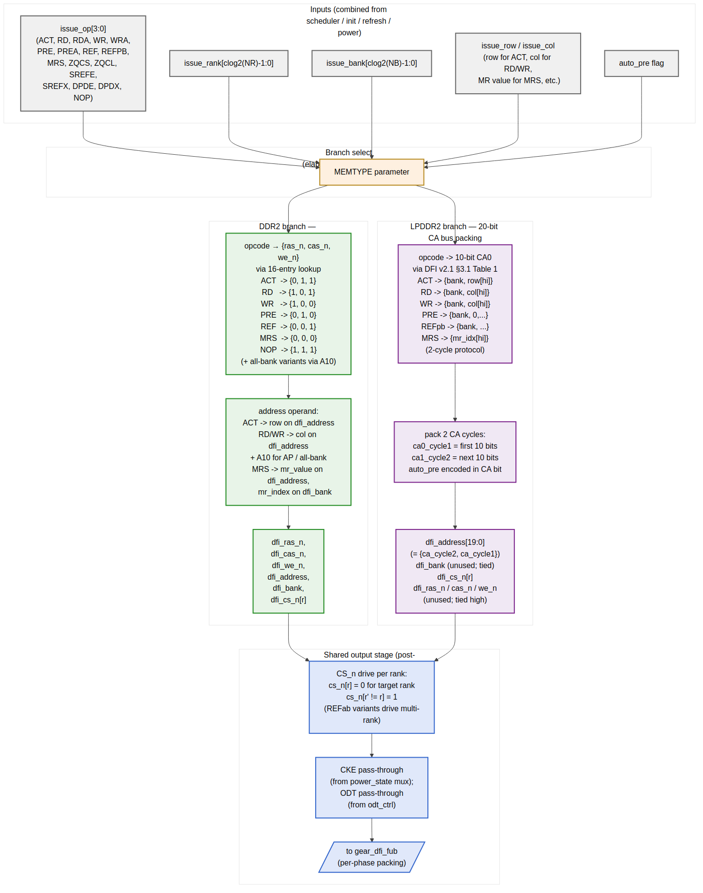

<!-- RTL Design Sherpa Documentation Header -->
<table>
<tr>
<td width="80">
  <a href="https://github.com/sean-galloway/RTLDesignSherpa">
    
  </a>
</td>
<td>
  <strong>RTL Design Sherpa</strong> · <em>Learning Hardware Design Through Practice</em><br>
  <sub>
    <a href="https://github.com/sean-galloway/RTLDesignSherpa">GitHub</a> ·
    <a href="https://github.com/sean-galloway/RTLDesignSherpa/blob/main/docs/DOCUMENTATION_INDEX.md">Documentation Index</a> ·
    <a href="https://github.com/sean-galloway/RTLDesignSherpa/blob/main/LICENSE">MIT License</a>
  </sub>
</td>
</tr>
</table>

---

<!-- End Header -->

# Command Encoder (`cmd_encoder_fub`)

**Module:** `cmd_encoder_fub.sv`
**Location:** `rtl/fub/`
**Category:** FUB
**Parent:** `ddr2_lpddr2_ctrl`
**Status:** Draft v0.1

> Architectural context: HAS §3.6. This block is the **memtype-swappable encoder** — the one stage of the controller where DDR2 and LPDDR2 actually diverge at the wire level. Everything upstream is rank/bank-tuple-abstract; everything downstream is DFI-frame-abstract.

---

## Purpose

`cmd_encoder_fub` takes an abstract DRAM command operand `(op, rank, bank, row, col, auto_pre)` and emits the wire-level DFI command bits:

- For **DDR2**: traditional `dfi_ras_n` / `dfi_cas_n` / `dfi_we_n` strobes plus `dfi_address` and `dfi_bank`
- For **LPDDR2**: the JEDEC 20-bit CA-bus packed encoding per DFI v2.1 §3.1 Table 1

Per-rank `dfi_cs_n[NR]` driving is also this FUB's job — it derives the per-rank chip-select pattern from the issue's target rank and the command type (single-rank commands drive one CS_n low; REFab with per-rank dispatch from §2.11 drives the appropriate single rank).

The FUB is purely combinational at the per-command level — the input arrives from the scheduler / init / refresh / power-state bypass paths, the encoded output flows the same cycle to `gear_dfi_fub` for per-phase packing. There is no state inside the encoder; that lives upstream (scheduler, init, refresh) or downstream (gear, bank machines).

---

## Synthesis Parameters

| Parameter        | Source           | Effect                                                              |
|------------------|------------------|---------------------------------------------------------------------|
| `MEMTYPE`        | top              | Picks the DDR2 or LPDDR2 branch (only one branch is synthesized)    |
| `NUM_RANKS`      | top              | Width of `dfi_cs_n[NR]` output                                       |
| `NUM_BANKS`      | top              | Bank-field width                                                    |
| `ROW_WIDTH`      | top              | Row operand width                                                   |
| `COL_WIDTH`      | top              | Column operand width                                                |
| `DFI_ADDR_WIDTH` | top              | Width of `dfi_address` output (14 for DDR2, 20 for LPDDR2)           |

---

## Branch Selection (Elaboration-Time)



**Source:** [12_cmd_encoder_branches.mmd](../assets/mermaid/12_cmd_encoder_branches.mmd)

```systemverilog
generate
    if (MEMTYPE == "DDR2") begin : g_ddr2_enc
        ddr2_cmd_encoder #(
            .NUM_RANKS(NUM_RANKS),
            .NUM_BANKS(NUM_BANKS),
            .ROW_WIDTH(ROW_WIDTH),
            .COL_WIDTH(COL_WIDTH),
            .DFI_ADDR_WIDTH(DFI_ADDR_WIDTH)
        ) u_enc ( ... );
    end
    else begin : g_lpddr2_enc
        lpddr2_cmd_encoder #(
            .NUM_RANKS(NUM_RANKS),
            .NUM_BANKS(NUM_BANKS),
            .ROW_WIDTH(ROW_WIDTH),
            .COL_WIDTH(COL_WIDTH),
            .DFI_ADDR_WIDTH(DFI_ADDR_WIDTH)
        ) u_enc ( ... );
    end
endgenerate
```

Only one encoder is in silicon per build. The two encoders share the per-rank CS_n drive stage (next section), which is post-branch.

---

## DDR2 Encoding Branch

DDR2 uses the classic `{RAS_n, CAS_n, WE_n}` strobe encoding with the row/column operand on `dfi_address`. The 16-entry lookup is purely combinational:

| Opcode    | `ras_n` | `cas_n` | `we_n` | `dfi_address`                          | `dfi_bank`     | Auto-pre via A10 |
|-----------|---------|---------|--------|-----------------------------------------|----------------|------------------|
| `ACT`     | 0       | 1       | 1      | row                                    | bank           | n/a              |
| `RD`      | 1       | 0       | 1      | {col, A10=0}                            | bank           | A10=0            |
| `RDA`     | 1       | 0       | 1      | {col, A10=1}                            | bank           | A10=1            |
| `WR`      | 1       | 0       | 0      | {col, A10=0}                            | bank           | A10=0            |
| `WRA`     | 1       | 0       | 0      | {col, A10=1}                            | bank           | A10=1            |
| `PRE`     | 0       | 1       | 0      | A10=0 (specific bank)                  | bank           | n/a              |
| `PREA`    | 0       | 1       | 0      | A10=1 (all banks)                       | x              | n/a              |
| `REF`     | 0       | 0       | 1      | x                                      | x              | n/a              |
| `MRS`     | 0       | 0       | 0      | MR value                               | MR index (0..3) | n/a              |
| `ZQCS`    | 1       | 1       | 0      | A10=0                                  | x              | n/a              |
| `ZQCL`    | 1       | 1       | 0      | A10=1                                  | x              | n/a              |
| `NOP`     | 1       | 1       | 1      | x                                      | x              | n/a              |

The A10 bit doubles as the auto-precharge flag (for RD/WR) and the all-bank flag (for PRE). Both meanings are mutually exclusive — there's no ambiguity because the same opcode never uses both.

For multi-cycle DDR2 commands that don't exist in the base set (e.g., DDR2 doesn't have a per-bank refresh — REFpb opcode is silently encoded as REF in DDR2 builds via a generate-time assertion).

### DDR2-Specific Multi-Cycle Behavior

DDR2 commands are single-cycle at the DFI command interface. The encoder's output is valid one MC cycle after the issue strobe; gear_dfi packs it into the appropriate DFI phase slot. There is no command-side multi-cycle protocol on DDR2 — all such complexity is on the data path side.

---

## LPDDR2 Encoding Branch

LPDDR2 uses a packed 20-bit Command-Address (CA) bus per DFI v2.1 §3.1 Table 1. The CA bus is 10 bits wide and runs at DDR rate, so each logical DRAM command occupies 2 CA cycles (CA0 on rising edge, CA1 on falling edge equivalent — gear_dfi handles the phase split).

The encoder produces a flat 20-bit `dfi_address[19:0]` where:

- `dfi_address[9:0]` = first CA cycle bits (CA0)
- `dfi_address[19:10]` = second CA cycle bits (CA1)

### CA-Bus Encoding (Selected Subset)

LPDDR2's CA encoding is more compact than the JEDEC spec text suggests. Per DFI v2.1 §3.1 Table 1, the relevant bit patterns (this table is the canonical lookup):

| Opcode   | CA0 (first cycle, bits 9..0)                              | CA1 (second cycle, bits 9..0)                  |
|----------|----------------------------------------------------------|-----------------------------------------------|
| `ACT`    | `{Row[16:14], 0, 0, 1, BA[2:0], Row[13:11]}`              | `{Row[10:0]}`                                  |
| `RD`     | `{0, 0, 1, AP, BA[2:0], 0, 0, Col[9]}`                    | `{0, Col[11:10], Col[8:1]}`                    |
| `WR`     | `{0, 0, 0, AP, BA[2:0], 0, 0, Col[9]}`                    | `{0, Col[11:10], Col[8:1]}`                    |
| `PRE`    | `{1, 0, 0, 1, AB, BA[2:0], 0, 0}`                          | `{0, 0, 0, 0, 0, 0, 0, 0, 0, 0}`               |
| `REFpb`  | `{1, 0, 1, 0, 0, BA[2:0], 0, 0}`                           | `{0, 0, 0, 0, 0, 0, 0, 0, 0, 0}`               |
| `REFab`  | `{1, 0, 1, 0, 1, 0, 0, 0, 0, 0}`                           | `{0, 0, 0, 0, 0, 0, 0, 0, 0, 0}`               |
| `MRW`    | `{0, 1, 1, 0, MRA[7:0]}`                                   | `{OP[7:0], 0, 0}`                              |
| `MRR`    | `{0, 1, 0, 0, MRA[7:0]}`                                   | `{0, 0, 0, 0, 0, 0, 0, 0, 0, 0}`               |
| `ZQC`    | `{1, 0, 0, 1, 0, ZQ_type[1:0], 0, 0, 0}`                   | (don't care)                                   |
| `NOP`    | all-1                                                      | all-1                                          |

The flat 20-bit `dfi_address` is the concatenation of CA0 and CA1; `gear_dfi_fub` splits them across the appropriate DFI phases.

### Address-Bit Spreading

LPDDR2 spreads row and column bits across CA0 and CA1 in a non-contiguous pattern. The encoder is responsible for the spreading; the rest of the controller uses contiguous `row[ROW_WIDTH-1:0]` and `col[COL_WIDTH-1:0]` representations. This conversion is the only "interesting" combinational work in the LPDDR2 branch — the rest is just lookup table indexing.

The DDR2 strobes (`dfi_ras_n` / `dfi_cas_n` / `dfi_we_n`) are tied high in LPDDR2 builds. They are present at the DFI port (per HAS §2.4) because the same top-level header serves both memtypes, but they carry no information.

---

## Per-Rank CS_n Drive (Shared Post-Branch Stage)

After the memtype-specific encoding, the shared stage drives `dfi_cs_n[NR]` per the issue's `issue_rank` and `issue_op`:

```
// Single-rank commands (default for most opcodes):
for r in 0..NR-1:
    dfi_cs_n[r] = (r == issue_rank) ? 0 : 1

// Special cases:
NOP / no-issue:
    dfi_cs_n[*] = 1                  // no rank selected

REFab from refresh_mgr round-robin:
    dfi_cs_n[round_robin_rank] = 0
    dfi_cs_n[other ranks] = 1        // per HAS §3.4 v0.2 multi-rank REFab

REFab from init (init-time global REF):
    dfi_cs_n[*] = 0                  // init can broadcast to all ranks
```

The init-time `dfi_cs_n[*] = 0` case is the only opcode that drives multiple CS_n low simultaneously — and even that is only during init, when no other rank-targeted command is active.

The driver also coordinates with `odt_ctrl_fub` (see §2.16) which needs to know which rank is being targeted and what command type to apply the correct ODT termination rules. The `odt_ctrl` interface receives `issue_rank` and `issue_op` as inputs and computes `dfi_odt[NR]` independently.

---

## Bypass-Path Sources

The encoder accepts commands from four upstream sources, multiplexed at the input boundary:

| Source                | Path                                          | Active when                          |
|-----------------------|-----------------------------------------------|--------------------------------------|
| `scheduler_fub`       | `sched_cmd_*` (normal traffic)                | `init_in_progress == 0`              |
| `init_engine_fub`     | `init_cmd_*` (cold boot)                       | `init_in_progress == 1`              |
| `refresh_mgr_fub`     | `refresh_issue_*` (REF / REFpb)                | Inside refresh-priority window       |
| `power_state_fub`     | `pwr_cmd_*` (SREFE, SREFX, DPDE, DPDX)         | Power-state transitions              |

The input mux is priority-ordered (init > power > refresh > scheduler). At any given cycle exactly one strobe is asserted (the upstream FUBs coordinate to ensure this); the encoder treats input as a single combined `issue_*` bus and doesn't need to know which source.

---

## Interface

### Issue Input (combined from all upstream sources)

| Signal              | Direction | Width                | Description                                          |
|---------------------|-----------|----------------------|------------------------------------------------------|
| `issue_strobe_i`    | input     | 1                    | A command is being issued this cycle                 |
| `issue_op_i`        | input     | 4                    | Opcode (encoded per scheduler §2.7)                  |
| `issue_rank_i`      | input     | `$clog2(NR)`         | Target rank                                          |
| `issue_bank_i`      | input     | `$clog2(NB)`         | Target bank (or MR index for MRS/MRW)                |
| `issue_row_i`       | input     | `ROW_WIDTH`          | Row operand (for ACT, MRS value also goes here)       |
| `issue_col_i`       | input     | `COL_WIDTH`          | Column operand (for RD/WR)                           |
| `issue_auto_pre_i`  | input     | 1                    | Auto-pre flag (for RDA/WRA)                          |
| `issue_all_bank_i`  | input     | 1                    | All-bank flag (for PREA / REFab)                     |

### DFI Command Outputs

| Signal              | Direction | Width                       | Description                                          |
|---------------------|-----------|-----------------------------|------------------------------------------------------|
| `dfi_cs_n_o[NR]`    | output    | NR                          | Per-rank chip-select                                 |
| `dfi_ras_n_o`       | output    | 1                           | DDR2 RAS strobe (tied high for LPDDR2)               |
| `dfi_cas_n_o`       | output    | 1                           | DDR2 CAS strobe (tied high for LPDDR2)               |
| `dfi_we_n_o`        | output    | 1                           | DDR2 WE strobe (tied high for LPDDR2)                |
| `dfi_address_o`     | output    | `DFI_ADDR_WIDTH`             | DDR2: row/col operand; LPDDR2: packed 20-bit CA      |
| `dfi_bank_o`        | output    | `$clog2(NB)`                | DDR2: bank operand; LPDDR2: tied (bank is in CA bus) |

### ODT / Power Coordination (pass-through)

| Signal              | Direction | Width  | Description                                          |
|---------------------|-----------|--------|------------------------------------------------------|
| `dfi_cke_i[NR]`     | input     | NR     | Pre-muxed CKE from CKE-routing topology (§2.13)      |
| `dfi_cke_o[NR]`     | output    | NR     | Pass-through to gear                                  |
| `dfi_odt_i[NR]`     | input     | NR     | From `odt_ctrl_fub`                                   |
| `dfi_odt_o[NR]`     | output    | NR     | Pass-through to gear                                  |

The CKE and ODT are pass-throughs here because they're already finalized upstream; the encoder isn't allowed to modify them.

### Telemetry

| Signal              | Description                                              |
|---------------------|----------------------------------------------------------|
| `dbg_last_op_o`     | Last issued opcode — drives `STATUS.issue_op_obs`        |
| `dbg_last_rank_o`   | Last issued rank                                         |

---

## Timing Budget

The encoder is single-cycle combinational from input to output. At the worst case (LPDDR2 ACT with full row-bit spreading across CA0+CA1), the path is:

| Path                                                                    | Levels (FPGA) | Budget   |
|-------------------------------------------------------------------------|---------------|----------|
| `issue_op_i` → opcode lookup table                                      | 2 LUT levels  | 0.4 ns   |
| `issue_row_i / issue_col_i` → CA bit spreading network                   | 3 LUT levels  | 0.6 ns   |
| `issue_rank_i` + opcode → per-rank `dfi_cs_n_o`                         | 2 LUT levels  | 0.4 ns   |
| Routing / setup margin                                                  |               | 0.3 ns   |
| **Total**                                                               |               | **1.7 ns** |

Comfortable for 500 MHz. The encoder is rarely on the critical path — that's dominated by the scheduler upstream.

---

## CSR Hooks

| CSR field                          | Source                            | Use case                                |
|------------------------------------|-----------------------------------|-----------------------------------------|
| `STATUS.issue_op_obs` (R)          | `dbg_last_op_o`                  | What was the last DRAM command issued    |
| `STATUS.issue_rank_obs` (R)        | `dbg_last_rank_o`                | What rank was last targeted              |

---

## Verification Notes (cocotb test plan)

| Scenario                                                                          | What it proves                                              |
|-----------------------------------------------------------------------------------|-------------------------------------------------------------|
| DDR2 build: ACT to bank 3 row 0x1234; `{ras_n, cas_n, we_n} = {0, 1, 1}`, dfi_address = 0x1234, dfi_bank = 3 | DDR2 ACT encoding                          |
| DDR2 build: RDA to bank 3 col 0x040; A10 set; `{ras_n, cas_n, we_n} = {1, 0, 1}` | DDR2 auto-precharge via A10                                 |
| DDR2 build: PREA; A10 set; dfi_bank = don't care                                  | DDR2 all-bank precharge via A10                             |
| LPDDR2 build: ACT to bank 3 row 0x1234; CA0/CA1 packed per DFI v2.1 §3.1         | LPDDR2 ACT encoding                                          |
| LPDDR2 build: WR to bank 3 col 0x040 with auto-pre; AP bit set in CA0            | LPDDR2 auto-precharge via CA bit                            |
| LPDDR2 build: REFpb to bank 3; CA encoding matches §3.1 table                    | LPDDR2 REFpb encoding                                       |
| LPDDR2 build: REFab; CA encoding matches §3.1 table                              | LPDDR2 REFab encoding                                       |
| Multi-rank: ACT to rank 1; `dfi_cs_n = {0, 1}` (rank 1 selected); rank 0 inactive | Per-rank CS_n drive                                         |
| Multi-rank REFab from refresh_mgr round-robin: only target rank's CS_n low       | Per-rank REFab dispatch                                     |
| Init-time REF: `dfi_cs_n[*] = 0` (all ranks targeted)                              | Init broadcast CS_n                                          |
| NOP cycle: `dfi_cs_n[*] = 1`                                                      | No-issue idle pattern                                       |
| Two back-to-back commands in same MC cycle (impossible — single-issue scheduler)  | Sanity: only one strobe asserted at a time                  |
| DDR2 build accidentally invokes REFpb opcode                                      | Elaboration-time assertion fires                            |

---

## Open Questions / Future Work

- **LPDDR2 chip-id (multi-die) encoding.** LPDDR2 supports a chip-id bit for stacked-die parts. v1 doesn't expose this — the controller treats each rank as a single die. When DDR3+ family adds 3DS support, the encoder will need a `chip_id_i` input that goes into the CA bus encoding (per LPDDR2 §x.y). Punt to v2.
- **MRR (mode-register read) path.** LPDDR2 supports MRR for software to read DRAM state (temperature, ZQ status). v1 encodes MRR but the read-data path back through DFI is not in scope yet — needs `rd_data_path_fub` cooperation to deliver the MR value back to CSR. Add in v0.2 of MAS.
- **DDR2 OCD calibration commands.** DDR2 OCD (Off-Chip Driver) calibration uses extended MRS sequences. Not in v1; revisit when characterization on real DDR2 silicon flags drive-impedance issues.
- **Encoder LUT generation.** Currently the LPDDR2 CA-bus table is hand-coded from DFI v2.1 §3.1. Could be generated from a JSON/YAML spec file — easier to maintain when DFI v3+ changes the encoding (HAS v6.0 scope memory notes the changes). Punt; revisit at DDR3-LPDDR3 family controller.
