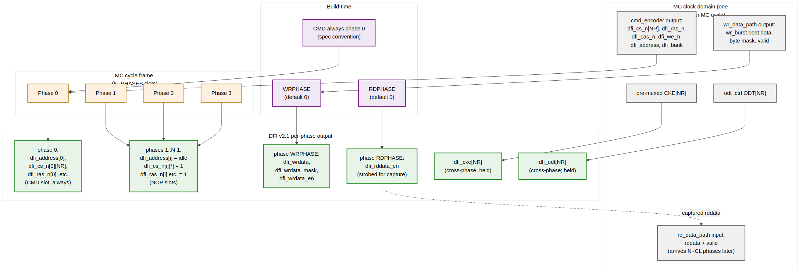

<!-- RTL Design Sherpa Documentation Header -->
<table>
<tr>
<td width="80">
  <a href="https://github.com/sean-galloway/RTLDesignSherpa">
    
  </a>
</td>
<td>
  <strong>RTL Design Sherpa</strong> · <em>Learning Hardware Design Through Practice</em><br>
  <sub>
    <a href="https://github.com/sean-galloway/RTLDesignSherpa">GitHub</a> ·
    <a href="https://github.com/sean-galloway/RTLDesignSherpa/blob/main/docs/DOCUMENTATION_INDEX.md">Documentation Index</a> ·
    <a href="https://github.com/sean-galloway/RTLDesignSherpa/blob/main/LICENSE">MIT License</a>
  </sub>
</td>
</tr>
</table>

---

<!-- End Header -->

# DFI Signal Pack (`dfi_signal_pack`)

**Module:** `dfi_signal_pack.sv`
**Location:** `rtl/fub/`
**Category:** FUB
**Parent macro:** `dfi_v21_interface_macro`
**Status:** v1 implemented (phase-0 carries cmd; other phases NOP)

> Architectural context: HAS §3.6.
>
> **Renamed:** the SWAG called this `gear_dfi_fub`; the implementation
> name is `dfi_signal_pack`. The parameter `N_PHASES` is now `DFI_RATE`.
>
> **Strict-flop outputs:** every aggregated DFI control bus output is
> registered.

---

## Purpose

DFI v2.1 runs at the PHY clock; the controller side runs at the MC clock,
which is the PHY clock divided by `DFI_RATE`. Each MC cycle therefore
corresponds to `DFI_RATE` consecutive PHY-side DFI cycles ("phases").
`dfi_signal_pack` aggregates the controller's single-issue command and
burst-of-`DFI_RATE` data beats into the right phase slots.

In v1, phase 0 carries the command emitted by `dfi_cmd_formatter` and the
other phases drive NOP. Data-path FUBs (`wr_beat_sequencer`,
`rd_cl_aligner`) pre-pack `DFI_RATE` DRAM beats per DFI cycle, so the data
path is naturally per-MC-cycle aligned.

Upstream FUBs are rate-blind: scheduler, init, refresh, powerdown,
mode_register, dfi_cmd_formatter all see one issue per MC clock. The
output of this FUB is the per-phase × `DFI_RATE` bus that routes to the
PHY pad.

---

## Synthesis Parameters

| Parameter            | Source           | Effect                                                              |
|----------------------|------------------|---------------------------------------------------------------------|
| `N_PHASES`           | top (default 4)  | Number of DFI phases per MC clock (`{1, 2, 4}`)                     |
| `WRPHASE`            | top (default 0)  | Phase slot that carries `dfi_wrdata`, `dfi_wrdata_en`, `dfi_wrdata_mask` |
| `RDPHASE`            | top (default 0)  | Phase slot that strobes `dfi_rddata_en`                              |
| `DFI_DATA_WIDTH`     | top              | Per-phase DFI data width                                            |
| `AXI_DATA_WIDTH`     | top              | Source data width (consumed by `wr_data_path` upstream)              |

The constraint `WRPHASE < N_PHASES` and `RDPHASE < N_PHASES` is checked at elaboration.

---

## Frame Packing View



**Source:** [13_gear_dfi_packing.mmd](../assets/mermaid/13_gear_dfi_packing.mmd)

Each MC cycle produces one "frame" of N DFI cycles. The command always goes in phase 0 by spec convention (PHY samples cmds on phase 0); write data goes in `WRPHASE`; read-data-enable is strobed in `RDPHASE`.

---

## Command Lane

The command from `cmd_encoder` is single-cycle-valid in the MC domain. The gear replicates each command signal across the per-phase output, **but only phase 0 carries the real command** — other phases drive idle (NOP) patterns:

```
for p in 0..N_PHASES-1:
    if (p == 0):
        // Phase 0 carries the actual command
        dfi_cs_n[p][r]   = cmd_encoder.dfi_cs_n_o[r]      // for all ranks r
        dfi_ras_n[p]     = cmd_encoder.dfi_ras_n_o
        dfi_cas_n[p]     = cmd_encoder.dfi_cas_n_o
        dfi_we_n[p]      = cmd_encoder.dfi_we_n_o
        dfi_address[p]   = cmd_encoder.dfi_address_o
        dfi_bank[p]      = cmd_encoder.dfi_bank_o
    else:
        // Other phases: idle pattern (NOP-equivalent)
        dfi_cs_n[p][*]   = 1
        dfi_ras_n[p]     = 1
        dfi_cas_n[p]     = 1
        dfi_we_n[p]      = 1
        dfi_address[p]   = 0
        dfi_bank[p]      = 0
```

The PHY clock runs N× faster than the MC clock; the PHY samples commands on phase 0 each MC cycle and ignores the other phases (they're NOPs). This is the simplest gear and works at all N_PHASES values.

For `N_PHASES = 1` (no gear), there's only one phase and the command goes directly through with no replication.

### Why Always Phase 0?

DDR2 / LPDDR2 PHYs typically sample command at phase 0 of the MC clock. Some PHYs allow command at other phases via a "CMDPHASE" parameter; the controller doesn't currently expose this since the bring-up board's a7ddrphy uses the conventional layout. If a future PHY requires it, add a `CMDPHASE` parameter symmetric with `WRPHASE`/`RDPHASE`.

---

## Write Data Lane

When the controller issues a write, `wr_data_path_fub` produces N consecutive data beats over `BL/2` MC cycles (where BL = burst length, typically 4 or 8). The gear packs these beats into `WRPHASE` of each successive MC cycle:

```
// In wr_data_path's beat-per-MC-cycle output:
//   wr_beat_data, wr_beat_mask, wr_beat_valid

for p in 0..N_PHASES-1:
    if (p == WRPHASE):
        dfi_wrdata[p]       = wr_data_path.wr_beat_data
        dfi_wrdata_mask[p]  = wr_data_path.wr_beat_mask
        dfi_wrdata_en[p]    = wr_data_path.wr_beat_valid
    else:
        dfi_wrdata[p]       = 0
        dfi_wrdata_mask[p]  = 0      // mask all
        dfi_wrdata_en[p]    = 0
```

For a BL=4 burst at `N_PHASES = 4`, the burst fits in **one** MC cycle (4 phases × 1 beat = 4 beats). For BL=4 at `N_PHASES = 2`, the burst takes **2** MC cycles. For BL=4 at `N_PHASES = 1`, the burst takes **4** MC cycles.

The width-conversion from AXI's `AXI_DATA_WIDTH` to DFI's `DFI_DATA_WIDTH` happens upstream in `wr_data_path`; gear just routes pre-packed beats to the WRPHASE slot.

### tCWL Latency Handling

The DRAM expects the first write data beat at `CWL` PHY cycles after the WR command. Since the command is on phase 0 and the data is on WRPHASE of a later MC cycle, the gear's "later MC cycle" must satisfy `((MC_cycle_delta × N_PHASES) + WRPHASE) == CWL`. The cmd_encoder's WR command issue and the wr_data_path's data-push are aligned by the scheduler; gear just passes them through. Verification cross-checks this against the live `CL_CWL_WR` CSR values.

---

## Read Data Lane

For reads, the gear has the inverse job: capture per-phase rddata returns from the PHY into a stream that `rd_data_path_fub` can consume one beat per MC cycle.

```
// Phase-by-phase rddata input from PHY:
for p in 0..N_PHASES-1:
    if (p == RDPHASE):
        rd_data_path.rd_beat_data  = dfi_rddata[p]
        rd_data_path.rd_beat_valid = dfi_rddata_valid[p]
    // Other phases are ignored (no real read data)

// Strobe rddata_en in RDPHASE on the cycle the data should be valid:
dfi_rddata_en[RDPHASE] = rd_strobe_at_CL    // computed from scheduler issue + CL
```

The `dfi_rddata_en` is the strobe to the PHY saying "capture this DRAM data beat at this phase." It's asserted exactly `CL` PHY cycles after the corresponding RD command. The gear converts the MC-cycle-relative timing to phase-relative.

### CL-Aware Pre-Drive of `dfi_rddata_en`

The gear has a small N-deep shift register that delays `rd_strobe_at_CL` by the appropriate number of phases. The strobe enters when the RD/RDA command issues (from cmd_encoder) and shifts out at the right cycle. The shift register is `(max_CL × N_PHASES)` deep — small (default 32 entries × 1 bit at 7-series).

---

## Cross-Phase Signals: CKE and ODT

Some signals are held across the entire MC cycle (cross-phase): CKE and ODT in particular. The gear drives them identically on every phase:

```
for p in 0..N_PHASES-1:
    dfi_cke[p][r]  = cke_from_power_state[r]    // for all ranks r
    dfi_odt[p][r]  = odt_from_odt_ctrl[r]
```

These signals don't change within an MC cycle — they reflect the controller's CKE/ODT decision made at the start of the cycle. The PHY samples them at its own rate (DDR-style ODT timing) using the held value.

---

## DFI v2.1 Status / Update Lane

The DFI status sub-interface (`dfi_init_complete`, `dfi_ctrlupd_req`, `dfi_phyupd_req`, etc.) is **not gear-packed** — it's a single-bit-per-event signal that crosses MC ↔ PHY clock domains through standard CDC, independent of the phase. The gear passes them through without modification.

---

## Interface

### From `cmd_encoder_fub` (one cycle, MC clock)

| Signal              | Direction | Width                | Description                                |
|---------------------|-----------|----------------------|--------------------------------------------|
| `cmd_cs_n_i[NR]`    | input     | NR                   | Per-rank CS_n from cmd_encoder              |
| `cmd_ras_n_i`       | input     | 1                    |                                            |
| `cmd_cas_n_i`       | input     | 1                    |                                            |
| `cmd_we_n_i`        | input     | 1                    |                                            |
| `cmd_address_i`     | input     | `DFI_ADDR_WIDTH`     |                                            |
| `cmd_bank_i`        | input     | `$clog2(NB)`         |                                            |
| `cmd_strobe_i`      | input     | 1                    | 1 when a command is being issued this cycle |
| `cmd_rd_strobe_i`   | input     | 1                    | 1 when the issue is a RD/RDA (for rddata_en shift register) |
| `cmd_cl_i`          | input     | 4                    | CAS latency for this RD (snapshot at issue) |

### From `wr_data_path_fub` and `rd_data_path_fub`

| Signal                  | Direction | Width                | Description                                |
|-------------------------|-----------|----------------------|--------------------------------------------|
| `wr_beat_data_i`        | input     | `DFI_DATA_WIDTH`     | One beat per MC cycle                       |
| `wr_beat_mask_i`        | input     | `DFI_DATA_WIDTH/8`   |                                            |
| `wr_beat_valid_i`       | input     | 1                    |                                            |
| `rd_beat_data_o`        | output    | `DFI_DATA_WIDTH`     | Forwarded to rd_data_path                  |
| `rd_beat_valid_o`       | output    | 1                    |                                            |

### From `power_state_fub` and `odt_ctrl_fub`

| Signal              | Direction | Width  | Description                                          |
|---------------------|-----------|--------|------------------------------------------------------|
| `cke_i[NR]`         | input     | NR     | Per-rank CKE (already-muxed init/normal)             |
| `odt_i[NR]`         | input     | NR     | Per-rank ODT                                          |

### DFI Master Outputs (per-phase)

| Signal                            | Direction | Width                                       | Description                          |
|-----------------------------------|-----------|---------------------------------------------|--------------------------------------|
| `dfi_cs_n_o[NP][NR]`              | output    | NP × NR                                     | Per-phase per-rank CS_n              |
| `dfi_ras_n_o[NP]`                 | output    | NP                                          | Per-phase RAS                        |
| `dfi_cas_n_o[NP]`                 | output    | NP                                          | Per-phase CAS                        |
| `dfi_we_n_o[NP]`                  | output    | NP                                          | Per-phase WE                         |
| `dfi_address_o[NP]`               | output    | NP × `DFI_ADDR_WIDTH`                        | Per-phase address operand            |
| `dfi_bank_o[NP]`                  | output    | NP × `$clog2(NB)`                           | Per-phase bank                       |
| `dfi_wrdata_o[NP]`                | output    | NP × `DFI_DATA_WIDTH`                       | Per-phase write data                 |
| `dfi_wrdata_mask_o[NP]`           | output    | NP × `DFI_DATA_WIDTH/8`                     | Per-phase byte mask                  |
| `dfi_wrdata_en_o[NP]`             | output    | NP                                          | Per-phase write enable               |
| `dfi_rddata_en_o[NP]`             | output    | NP                                          | Per-phase read-data-enable strobe    |
| `dfi_cke_o[NR]`                   | output    | NR                                          | Per-rank CKE (cross-phase)           |
| `dfi_odt_o[NR]`                   | output    | NR                                          | Per-rank ODT (cross-phase)           |

### DFI Read-Data Inputs (per-phase, from PHY)

| Signal                            | Direction | Width                                       | Description                          |
|-----------------------------------|-----------|---------------------------------------------|--------------------------------------|
| `dfi_rddata_i[NP]`                | input     | NP × `DFI_DATA_WIDTH`                       | Per-phase read data from PHY         |
| `dfi_rddata_valid_i[NP]`          | input     | NP                                          | Per-phase rddata valid                |

---

## Pipeline Staging

The command path is single-cycle combinational (zero gear pipeline latency). The write data path has one MC-cycle pipeline stage (the beat-data flop) so the AXI-data-width to DFI-data-width width-conversion in `wr_data_path` can register its output. The read data path is single-cycle from PHY input to `rd_data_path` output.

At `N_PHASES = 4`, `DFI_DATA_WIDTH = 32`, the per-phase data bus is 128 bits wide (4 × 32) on the gear output — manageable in 7-series routing. At `N_PHASES = 4`, `DFI_DATA_WIDTH = 128`, it's 512 bits — wider but still OK with appropriate placement.

---

## CSR Hooks

| CSR field                          | Source                            | Use case                                |
|------------------------------------|-----------------------------------|-----------------------------------------|
| `STATUS.gear_dfi_wrphase_obs` (R)  | `WRPHASE` parameter echo          | Software-visible build config            |
| `STATUS.gear_dfi_rdphase_obs` (R)  | `RDPHASE` parameter echo          | Software-visible build config            |
| `STATUS.gear_dfi_n_phases_obs` (R) | `N_PHASES` parameter echo         | Software-visible build config            |

There are no runtime tunables — gear ratio is build-time only.

---

## Verification Notes (cocotb test plan)

| Scenario                                                                          | What it proves                                              |
|-----------------------------------------------------------------------------------|-------------------------------------------------------------|
| `N_PHASES = 1`: command and data on the single phase                              | No-gear smoke                                               |
| `N_PHASES = 2`: command on phase 0, write data on phase 0 (`WRPHASE=0`)            | 2x gear baseline                                            |
| `N_PHASES = 4, WRPHASE = 0`: BL=4 write completes in 1 MC cycle (4 beats × 1 phase) | Full-width gear                                          |
| `N_PHASES = 4, WRPHASE = 2`: write data offset by 2 phases relative to cmd        | Off-zero WRPHASE                                            |
| Read with CL=5, N_PHASES=4: `dfi_rddata_en` asserts at the correct phase           | CL-aware shift register                                     |
| Read in flight; PHY drives rddata; gear forwards beat-per-MC-cycle to rd_data_path | Read data reconstruction                                    |
| Command on phase 0, NOPs on other phases — PHY sees only the one cmd              | Phase-replication idle correctness                          |
| Per-rank CKE held cross-phase                                                      | CKE pass-through                                            |
| Per-rank ODT held cross-phase                                                      | ODT pass-through                                            |
| `WRPHASE = N_PHASES` (illegal) at elaboration → assertion fires                    | Elaboration-time bounds check                                |
| Multi-rank: ACT on rank 1; phase 0 has `dfi_cs_n[0][1]=0`; other ranks have CS_n=1 | Per-rank CS_n routes through phase 0                        |

---

## Open Questions / Future Work

- **Configurable CMDPHASE.** Currently command is always on phase 0. Some PHYs allow command on other phases. Worth a build parameter symmetric with WRPHASE/RDPHASE if the controller targets non-7-series PHYs. Punt; revisit at DDR3+ family.
- **Two-cycle command paths.** LPDDR2's 2-cycle CA-bus protocol is already absorbed in cmd_encoder (which emits a 20-bit dfi_address); the gear sees one MC-cycle frame. But if a future memtype has commands that span multiple MC cycles (rather than multiple phases within one MC cycle), the gear would need a multi-cycle replicator. Not in v1.
- **Late rddata capture.** If a PHY has variable rddata return latency (training-dependent), the controller may need a CL_SHIFT register driven by training rather than fixed CSR value. Today the shift-register depth is built from a CSR-loaded CL — works for fixed-latency PHYs only. Add at DDR3+ family controller.
- **N_PHASES = 8 or higher.** DDR3+ and LPDDR3+ support higher gear ratios. The current shift-register and replicator design scales linearly to N_PHASES = 8 without architectural changes; the routing buses just get wider. Validate when we get there.
