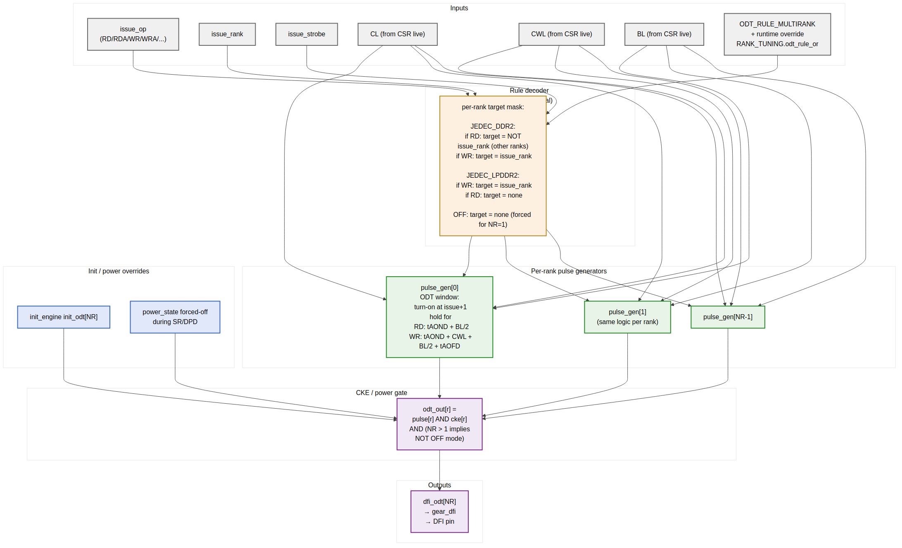

<!-- RTL Design Sherpa Documentation Header -->
<table>
<tr>
<td width="80">
  <a href="https://github.com/sean-galloway/RTLDesignSherpa">
    
  </a>
</td>
<td>
  <strong>RTL Design Sherpa</strong> · <em>Learning Hardware Design Through Practice</em><br>
  <sub>
    <a href="https://github.com/sean-galloway/RTLDesignSherpa">GitHub</a> ·
    <a href="https://github.com/sean-galloway/RTLDesignSherpa/blob/main/docs/DOCUMENTATION_INDEX.md">Documentation Index</a> ·
    <a href="https://github.com/sean-galloway/RTLDesignSherpa/blob/main/LICENSE">MIT License</a>
  </sub>
</td>
</tr>
</table>

---

<!-- End Header -->

# ODT Control (`odt_ctrl_fub`)

**Module:** `odt_ctrl_fub.sv`
**Location:** `rtl/fub/`
**Category:** FUB
**Parent:** `ddr2_lpddr2_ctrl`
**Status:** Draft v0.1

> Architectural context: HAS §3.6 and the `ODT_RULE_MULTIRANK` parameter in HAS §5.2. This is the FUB where the famous "ODT-high on the non-accessed rank during read" JEDEC rule lives. It is also the single most multi-rank-specific block in the design — for `NUM_RANKS=1`, the FUB synthesizes to a trivial tie-off.

---

## Purpose

`odt_ctrl_fub` produces the per-rank `dfi_odt[NR]` signals that drive each DRAM rank's On-Die Termination network. ODT is a JEDEC-mandated impedance-matching feature: a DDR2/3 DRAM device contains internal termination resistors that the controller selectively turns on to terminate the DQ/DQS bus at the appropriate end of a read or write.

The rule is asymmetric:

- **During a read**, the rank being read **drives** the DQ bus. *Other* ranks should drive their ODT high to terminate the bus from the controller side of the channel.
- **During a write**, the controller drives the DQ bus. The *target* rank drives ODT high to terminate at the receiving end.

For a single-rank point-to-point system (`NUM_RANKS=1`), ODT serves no purpose — there's nothing else on the bus — and the FUB ties `dfi_odt[0] = 0` always. For multi-rank, the JEDEC cross-termination rules apply.

The FUB is implementation-light: a small combinational rule decoder feeding per-rank pulse generators that produce the timed ODT windows.

---

## Synthesis Parameters

| Parameter              | Source                | Effect                                                              |
|------------------------|-----------------------|---------------------------------------------------------------------|
| `NUM_RANKS`            | top                   | Per-rank pulse generator fanout; `NUM_RANKS=1` collapses to tie-off |
| `ODT_RULE_MULTIRANK`   | top                   | One of `JEDEC_DDR2`, `JEDEC_LPDDR2`, `OFF`; forced to `OFF` when NR=1 |
| `MEMTYPE`              | top                   | Picks DDR2 vs LPDDR2 turn-on/turn-off timings (tAOND/tAOFD)         |
| `T_AOND_WIDTH`         | derived               | Width of the ODT turn-on delay counter (typically 3 bits)            |
| `T_AOFD_WIDTH`         | derived               | Width of the ODT turn-off delay counter                              |

The `ODT_RULE_MULTIRANK = OFF` mode is the forced value at single-rank — even if software writes `RANK_TUNING.odt_rule_or = JEDEC_DDR2`, the CSR slave returns `pslverr` because the option isn't available.

---

## ODT Rules



**Source:** [14_odt_ctrl_rules.mmd](../assets/mermaid/14_odt_ctrl_rules.mmd)

### `JEDEC_DDR2` Rule (Default for Multi-Rank DDR2)

```
For each issued RD / RDA targeting rank R:
    For each rank r in 0..NR-1:
        if (r != R):
            odt_target[r] = 1     // ODT-high on non-accessed ranks
        else:
            odt_target[r] = 0     // accessed rank drives data, no ODT

For each issued WR / WRA targeting rank R:
    For each rank r in 0..NR-1:
        if (r == R):
            odt_target[r] = 1     // ODT-high on accessed rank (receiver)
        else:
            odt_target[r] = 0     // other ranks idle
```

This is the textbook DDR2 multi-rank ODT pattern from JESD79-2 §x.y.

### `JEDEC_LPDDR2` Rule

LPDDR2 systems are usually single-rank point-to-point. The few multi-rank LPDDR2 systems use a simpler rule:

```
For each issued WR / WRA targeting rank R:
    odt_target[R] = 1                // ODT-high on accessed rank
    odt_target[r != R] = 0           // others idle

For each issued RD / RDA:
    odt_target[*] = 0                // no ODT during read on LPDDR2 (per LPDDR2 spec)
```

LPDDR2 multi-rank usage is uncommon enough that this rule is mostly a placeholder — the v1 controller defaults to JEDEC_DDR2 for either memtype when NR > 1; software can override to JEDEC_LPDDR2 if the board demands it.

### `OFF` Rule

```
odt_target[*] = 0   always
```

Forced when `NUM_RANKS=1`. The FUB collapses to a tie-off — no pulse generators, no rule decoder, no flops.

---

## Per-Rank Pulse Generators

Each rank gets a small pulse generator that converts the rule decoder's `odt_target[r]` into a properly-timed ODT window. The window for a DDR2 read on a non-accessed rank, for example, is:

```
turn-on at:    cycle (issue + tAOND)              // issue is the RD command issue cycle
turn-off at:   cycle (issue + tAOND + BL/2)        // BL/2 = number of beats over which the read drives DQ
```

For a DDR2 write on the accessed rank:

```
turn-on at:    cycle (issue + tAOND + CWL - 1)    // turn on 1 cycle before first write beat
turn-off at:   cycle (issue + tAOND + CWL + BL/2 + tAOFD)
```

The pulse generator is implemented as a small shift register (depth = `max(CL, CWL) + BL/2 + tAOFD ~ 16 cycles`). When `odt_target[r] = 1` for the current issue, a "pulse plan" record (turn-on delay, hold duration) is loaded into the shift register; each cycle, the bit corresponding to "is the ODT window currently active" is read out.

### Concrete Timing Example — DDR2-800, CL=5, CWL=5, BL=4

| Cycle (from RD issue) | What's happening                       | ODT on non-accessed rank |
|-----------------------|----------------------------------------|--------------------------|
| 0                     | RD issued by scheduler                 | 0 (idle)                 |
| 1                     | gear_dfi presents on phase 0           | 0                        |
| 2                     | tAOND (2 cycles for DDR2-800)          | 1 (turn-on)              |
| 3                     | DRAM begins CL-counting                | 1                        |
| 4                     | continue                                | 1                        |
| 5                     | continue                                | 1                        |
| 6                     | first data beat (CL cycles after issue)| 1                        |
| 7                     | data beat 2                             | 1                        |
| 8                     | data beat 3                             | 1                        |
| 9                     | data beat 4 (last for BL=4)             | 1                        |
| 10                    | tAOFD (1 cycle for DDR2-800)            | 0 (turn-off)             |

So the ODT window is `cycles 2..9` (8 cycles total) for a CL=5 BL=4 read. The pulse generator handles this with a counter that loads at issue time and decrements per cycle.

---

## Concurrent-Issue Edge Case

Per the scheduler design (§2.7), only one command issues per MC cycle. So at most one pulse-plan is loaded per cycle per rank. But the *window* of a previously-loaded pulse can overlap with a new issue:

- Cycle 0: RD to rank 0 issued → ODT-on rank 1 from cycle 2..9
- Cycle 4: RD to rank 1 issued → ODT-on rank 0 from cycle 6..13

In cycle 6..9, both ranks need ODT-on at the same time (the first read's window overlapping the second read's window). The per-rank pulse generators handle this independently — each has its own shift register and OR-aggregator. The final `dfi_odt[r]` is the OR of all in-flight pulses for that rank.

The shift register is sized to hold ~3 in-flight pulses per rank (rare for back-to-back same-rank-target reads; more common at high gear ratios with deep queues).

---

## CKE / Power-State Gating

ODT is only valid when CKE is asserted — if a rank is in APD, SR, or DPD, its ODT should be off regardless of pulse-plan state. The output stage gates each pulse with the per-rank CKE:

```
dfi_odt_o[r] = pulse_active[r]
            AND cke_i[r]
            AND (ODT_RULE_MULTIRANK != "OFF")
```

When `power_state_fub` drops CKE on a rank, ODT for that rank goes to 0 immediately, even mid-pulse. This is correct — the DRAM stops listening to the command bus and won't see the ODT anyway.

---

## Init-Time ODT

During init, the init engine drives `init_odt[NR]` directly (per the SET_CTRL_BITS opcode in §2.12). The output mux selects `init_odt[r]` when `init_in_progress == 1`:

```
dfi_odt_o[r] = init_in_progress ? init_odt_i[r] : (pulse_active[r] AND cke_i[r] AND ...)
```

Init typically holds ODT at a default (often 0) throughout the init sequence; the JEDEC init flow doesn't require ODT to be on during the MRS sequence.

---

## Runtime Override

`RANK_TUNING.odt_rule_or` is the runtime override per HAS §5.4:

| Value | Meaning                                                  |
|-------|----------------------------------------------------------|
| 00    | Use build-time `ODT_RULE_MULTIRANK` default              |
| 01    | Force JEDEC_DDR2                                          |
| 10    | Force JEDEC_LPDDR2                                        |
| 11    | Force OFF (only valid when NR=1; else `pslverr` on write) |

Override takes effect at the next quiet point (per §4.3). Writing an un-synthesized rule returns `pslverr` immediately on APB.

The override mux is a small 4:1 mux in the rule decoder:

```
active_rule = cfg_odt_rule_or == 00 ? ODT_RULE_MULTIRANK
            : cfg_odt_rule_or == 01 ? JEDEC_DDR2
            : cfg_odt_rule_or == 10 ? JEDEC_LPDDR2
                                    : OFF
```

---

## Interface

### Issue Input (from cmd_encoder bypass)

| Signal              | Direction | Width                | Description                                          |
|---------------------|-----------|----------------------|------------------------------------------------------|
| `issue_strobe_i`    | input     | 1                    | A command is being issued this cycle                 |
| `issue_op_i`        | input     | 4                    | Same opcode as cmd_encoder                            |
| `issue_rank_i`      | input     | `$clog2(NR)`         | Target rank                                          |

### CSR (live)

| Signal                  | Direction | Width  | Source                              |
|-------------------------|-----------|--------|-------------------------------------|
| `cfg_cl_i`              | input     | 4      | `TIMINGS_CL_CWL_WR.CL`              |
| `cfg_cwl_i`             | input     | 4      | `TIMINGS_CL_CWL_WR.CWL`             |
| `cfg_bl_i`              | input     | 4      | Burst length (from MR0)             |
| `cfg_t_aond_i`          | input     | `T_AOND_WIDTH` | ODT turn-on delay              |
| `cfg_t_aofd_i`          | input     | `T_AOFD_WIDTH` | ODT turn-off delay             |
| `cfg_odt_rule_or_i`     | input     | 2      | `RANK_TUNING.odt_rule_or`           |

### CKE / Init Coordination

| Signal              | Direction | Width  | Description                                                |
|---------------------|-----------|--------|------------------------------------------------------------|
| `cke_i[NR]`         | input     | NR     | From `power_state_fub` (already-muxed with init)            |
| `init_in_progress_i`| input     | 1      | From `init_engine_fub`                                     |
| `init_odt_i[NR]`    | input     | NR     | From `init_engine_fub` (drives during init)                |

### Outputs (to gear)

| Signal              | Direction | Width  | Description                                                |
|---------------------|-----------|--------|------------------------------------------------------------|
| `dfi_odt_o[NR]`     | output    | NR     | Final per-rank ODT to `gear_dfi`                            |

### Telemetry

| Signal                          | Description                                  |
|---------------------------------|----------------------------------------------|
| `dbg_odt_pulse_active_o[NR]`    | Per-rank pulse-active state (for waveform)   |
| `dbg_odt_rule_active_o`         | Currently-active rule (2-bit, after override) |

---

## Multi-Rank Fan-Out and Area

| Configuration                     | Per-instance area | Total area     |
|-----------------------------------|-------------------|----------------|
| NR=1 (tied off)                   | ~0 LUTs           | 0 LUTs          |
| NR=2, JEDEC_DDR2                  | ~30 LUTs/rank + ~16 flops/rank | ~100 LUTs |
| NR=4, JEDEC_DDR2                  | ~30 LUTs/rank + ~16 flops/rank | ~250 LUTs |

The pulse-generator shift register dominates the per-rank flop count. The rule decoder is a small 4:1 mux per rank. Total at maximum config is ~0.5% of the controller's overall LUT budget — negligible.

---

## CSR Hooks

| CSR field                          | Source                            | Use case                                |
|------------------------------------|-----------------------------------|-----------------------------------------|
| `STATUS.odt_rule_active` (R)       | `dbg_odt_rule_active_o`           | Software check of effective rule         |
| `RANK_TUNING.odt_rule_or` (R/W)    | `cfg_odt_rule_or_i`               | Runtime rule override                    |
| `OBS_ODT_PULSE_PCT_R<R>` (R)       | Rolling fraction of cycles ODT-on per rank | Power telemetry                  |

---

## Verification Notes (cocotb test plan)

| Scenario                                                                          | What it proves                                              |
|-----------------------------------------------------------------------------------|-------------------------------------------------------------|
| NR=1: `dfi_odt[0]` always 0 regardless of traffic                                 | Tie-off behavior                                            |
| NR=2 JEDEC_DDR2: RD to rank 0; rank 1 ODT-on during the read window               | Cross-rank read ODT                                          |
| NR=2 JEDEC_DDR2: WR to rank 0; rank 0 ODT-on during the write window              | Same-rank write ODT                                          |
| NR=2: back-to-back RD to rank 0 then rank 1; both ranks ODT-on during overlap     | Concurrent pulses, OR aggregation                            |
| NR=4: RD to rank 1; ranks 0, 2, 3 ODT-on; rank 1 off                              | Multi-rank cross-termination                                 |
| ODT turn-on at exactly `tAOND` cycles after issue; turn-off at `BL/2 + tAOFD`     | Timing precision per JEDEC                                   |
| Power-down on rank 1 during a RD to rank 0 → rank 1 ODT goes to 0 mid-pulse        | CKE gating                                                   |
| Init sequence: `init_odt[NR]` drives output regardless of pulse state              | Init bypass                                                  |
| Runtime override JEDEC_DDR2 → OFF; ODT goes to 0 at next quiet point               | Runtime rule override                                        |
| Runtime override to JEDEC_LPDDR2 (NR=2 LPDDR2 build): RD on rank 0 → no ODT       | LPDDR2 rule                                                  |
| NR=1 + write `RANK_TUNING.odt_rule_or = JEDEC_DDR2` → APB `pslverr`               | Single-rank override rejection                               |
| Multi-rank simulator: bring-up engineer captures `OBS_ODT_PULSE_PCT_R<R>`         | Power-telemetry plumbing works                               |

---

## Open Questions / Future Work

- **ODT during precharge / refresh.** Currently the rule decoder only emits ODT pulses for RD / RDA / WR / WRA. During PRE, REF, ZQCS the ODT is off. This matches typical JEDEC interpretation, but some board designs want ODT held high during refresh to avoid bus floating. Could add a `RANK_TUNING.odt_during_refresh` bit. Not in v1; revisit if bring-up flags signal-integrity issues.
- **Dynamic ODT (DDR3+).** DDR3 introduced Rtt_Wr (write ODT) vs Rtt_Nom (idle ODT), allowing different termination values during different windows. DDR2/LPDDR2 only has Rtt_Nom. The FUB has hooks for dynamic ODT (a 2-bit `odt_level_o[NR]` output is reserved) but the v1 controller doesn't drive them. Add in DDR3-LPDDR3 family controller.
- **ODT during write-leveling.** DDR3+ has a write-leveling phase where ODT is held in a specific pattern. DDR2 doesn't have write leveling, so this is a DDR3+ concern. Reserve the `wl_odt_pattern_i` input on this FUB for forward compat.
- **Per-pulse shift register depth tuning.** Currently sized for 3 concurrent pulses per rank. At very deep queues + high gear ratio, more could overlap. Worth a verification scenario to confirm the depth holds under stress; bump if it doesn't.
