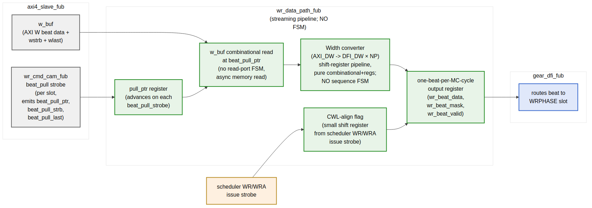

<!-- RTL Design Sherpa Documentation Header -->
<table>
<tr>
<td width="80">
  <a href="https://github.com/sean-galloway/RTLDesignSherpa">
    
  </a>
</td>
<td>
  <strong>RTL Design Sherpa</strong> · <em>Learning Hardware Design Through Practice</em><br>
  <sub>
    <a href="https://github.com/sean-galloway/RTLDesignSherpa">GitHub</a> ·
    <a href="https://github.com/sean-galloway/RTLDesignSherpa/blob/main/docs/DOCUMENTATION_INDEX.md">Documentation Index</a> ·
    <a href="https://github.com/sean-galloway/RTLDesignSherpa/blob/main/LICENSE">MIT License</a>
  </sub>
</td>
</tr>
</table>

---

<!-- End Header -->

# Write Data Path (`wr_data_path_fub`)

**Module:** `wr_data_path_fub.sv`
**Location:** `rtl/fub/`
**Category:** FUB
**Parent:** `ddr2_lpddr2_ctrl`
**Status:** Draft v0.1

> Architectural context: HAS §3.7. The micro-architecture closely mirrors the **stream** `axi_write_engine` (`projects/components/stream/rtl/fub/axi_write_engine.sv`): a streaming pipeline with **no FSM**, only flags, counters, and shift registers. State is implicit in pointers and inflight counts; sequence is enforced by data-flow handshakes, not by enumerated states.

---

## Purpose

`wr_data_path_fub` moves write-data beats from the AXI4-slave's `w_buf` into DFI write-data form, aligned to the CWL window after the corresponding WR/WRA command issue. Width-conversion (AXI `DATA_WIDTH` → `N_PHASES × DFI_DATA_WIDTH` per MC cycle) happens here; byte-strobe (`wstrb`) propagates with the data.

The FUB is **pulled by `wr_cmd_cam_fub`**, not by the scheduler. When the scheduler picks a write entry, the CAM's `beat_pull_*` interface begins requesting per-beat data from this FUB. The FUB walks the AXI W-buffer at the supplied pointer (`w_buf_ptr` + `beats_issued`), width-converts, and presents the result to `gear_dfi_fub` on the WRPHASE slot of the appropriate MC cycle.

There are no enumerated FSM states. Internal state is:

- A pointer that advances on each `beat_pull_strb`
- A shift register tracking how many beats have been pushed to DFI per inflight slot
- A small CL/CWL alignment shift register that times the first beat's appearance on `wr_beat_valid`

This is exactly the "streaming pipeline + flags" model from stream's `axi_write_engine`, adapted to the slave-side direction (AXI host → DRAM rather than internal SRAM → AXI memory).

---

## Stream Uarch Heritage

This FUB is modeled after stream's `axi_write_engine` with the following deliberate parallels:

| Property                                  | Stream `axi_write_engine`                | This FUB                                  |
|-------------------------------------------|------------------------------------------|-------------------------------------------|
| No enumerated FSM                          | Yes — streaming flags only               | Yes — streaming flags only                |
| Streaming data path (no internal buffering)| Yes — passthrough SRAM → AXI W            | Yes — passthrough w_buf → DFI wrdata       |
| Per-transaction outstanding tracking      | Per-channel inflight flags (V1) or counters (V2/V3) | Per-CAM-slot beat counter, in `wr_cmd_cam_fub` rather than here |
| Pre-allocation handshake                  | SRAM `wr_alloc_size` reserves space       | `w_buf` allocation reserves space in `axi4_slave_fub` (upstream) |
| Combinational AR / W outputs              | Yes (option to register for timing)       | `wr_beat_*` outputs are registered (1-cycle pipeline stage) |
| Strobe-on-handshake completion             | `done_strobe` on AW handshake             | `wr_beat_last` strobe on last beat issued; CAM holds completion until `b_complete` from `xbank_timers` |
| Per-PERFORMANCE mode parameter             | `PERFORMANCE` ∈ LOW/MED/HIGH              | `WR_DATAPATH_PIPELINE` ∈ {0, 1} for v1; deeper modes deferred to v2 |

Where stream tracks per-channel state across `NUM_CHANNELS`, the DDR controller tracks per-CAM-slot state across `WR_CAM_DEPTH`. The "channel" / "slot" analogy is direct.

The most important constraint: **no FSMs.** When you see a state-like behavior described below (e.g., "first beat aligned to CWL"), it is implemented as a shift register, not as enumerated states. This keeps the FUB's silicon footprint minimal and the timing well-behaved across the FPGA / ASIC range.

---

## Synthesis Parameters

| Parameter                  | Source            | Effect                                                            |
|----------------------------|-------------------|-------------------------------------------------------------------|
| `AXI_DATA_WIDTH`           | top               | Source data width                                                 |
| `DFI_DATA_WIDTH`           | top               | Per-phase destination width                                       |
| `N_PHASES`                 | top               | Phases per MC cycle (1, 2, or 4)                                  |
| `WR_CAM_DEPTH`             | top               | Number of inflight write slots tracked                            |
| `WR_DATAPATH_PIPELINE`     | top (default 0)   | 0 = single-cycle (default); 1 = registered intermediate stage     |
| `CWL_MAX`                  | derived           | Max CAS Write Latency for the CWL-align shift register             |

`WR_DATAPATH_PIPELINE=0` matches stream's V1 baseline — one MC cycle from `beat_pull_strb` to `wr_beat_valid` on gear. `=1` adds a register stage in the width-converter for 500 MHz close, costing one extra cycle of latency but adding zero throughput penalty (the pipeline is single-issue anyway).

---

## Block Pipeline View



**Source:** [15_wr_data_path_pipeline.mmd](../assets/mermaid/15_wr_data_path_pipeline.mmd)

---

## Datapath Stages (all combinational unless noted)

### Stage 1 — Beat Pull and W-Buf Read

On each MC cycle:

```
if (wr_cam.beat_pull_strb):
    pull_ptr_next = wr_cam.beat_pull_ptr     // not "current+1"; the CAM supplies the absolute pointer
    strb_ptr_next = wr_cam.beat_pull_strb_ptr
    is_last       = wr_cam.beat_pull_last
    slot_active   = wr_cam.beat_pull_slot

w_buf_beat_data = w_buf[pull_ptr_next]       // combinational distributed-RAM read
w_buf_beat_strb = wstrb_buf[strb_ptr_next]   // companion strobe buffer
```

No state machine: `pull_ptr_next` is supplied by the CAM, so the FUB doesn't need to remember "where are we in the burst." The CAM owns burst-walk state (per §2.5); this FUB just reads at the supplied pointer.

### Stage 2 — Width Conversion (AXI → DFI)

The conversion is a shift-register pipeline:

```
// Case 1: AXI_DATA_WIDTH == N_PHASES × DFI_DATA_WIDTH (typical)
//         1 AXI beat → 1 MC cycle of N_PHASES DFI beats; no further conversion needed
wr_beat_data_next = w_buf_beat_data
wr_beat_mask_next = w_buf_beat_strb

// Case 2: AXI_DATA_WIDTH > N_PHASES × DFI_DATA_WIDTH
//         1 AXI beat → multiple MC cycles
// A small shift register (sub_beat_cnt) tracks which sub-beat is being emitted
//   sub_beat_cnt steps from 0..K-1 where K = AXI_DW / (NP × DFI_DW)
//   No FSM — just a saturating counter that resets when the AXI beat is fully drained

// Case 3: AXI_DATA_WIDTH < N_PHASES × DFI_DATA_WIDTH
//         Multiple AXI beats → 1 MC cycle
// An accumulator register concatenates K AXI beats into one MC frame
//   K = (NP × DFI_DW) / AXI_DW; same shift-register pattern, just direction reversed
```

The width-conversion is the only place where any "state" exists, and even then it's a simple saturating counter (sub_beat_cnt) — no enumerated states, no transition table. The CAM's `beat_pull_strb` rate is matched to the conversion ratio so the upstream side automatically backpressures the right amount.

### Stage 3 — CWL Alignment

The first beat to DFI must appear `CWL` PHY cycles after the scheduler's WR/WRA command issue. That's `ceil(CWL / N_PHASES)` MC cycles plus a phase-level adjustment.

A small CWL-align shift register absorbs the latency:

```
// On scheduler issue strobe (WR / WRA / init WR):
cwl_pipe.shift_in(slot, valid=1)

// Each MC cycle:
cwl_pipe.shift_left()

// At depth = cwl_in_mc_cycles, the slot index pops out → drive wr_beat_valid for this slot
```

The shift register depth is `(CWL_MAX × N_PHASES + 1) / N_PHASES` ≈ 4 entries at default config. Per-entry width is `clog2(WR_CAM_DEPTH) + 1` (slot index plus valid bit) ≈ 5 bits at default. Total CWL-align shift register storage: ~20 flops. Trivial.

No FSM. The shift register *is* the timing alignment — the position in the shift register IS the cycle offset from issue.

### Stage 4 — Output Register

```
wr_beat_data_o  ← wr_beat_data_next  (registered)
wr_beat_mask_o  ← wr_beat_mask_next  (registered)
wr_beat_valid_o ← cwl_pipe.head.valid (registered)
wr_beat_last_o  ← is_last AND cwl_pipe.head.valid (registered)
```

Per-MC-cycle output to `gear_dfi_fub`. The single register stage matches stream's V1 default for combinational AW output with optional intermediate register for timing.

---

## Outstanding Tracking — Per CAM Slot

Stream's `axi_write_engine` tracks per-channel inflight state as a simple flag (PIPELINE=0) or counter (PIPELINE=1). Here, the per-burst tracking lives **in `wr_cmd_cam_fub` (§2.5)**:

| What                              | Where                              | Stream analog                              |
|-----------------------------------|------------------------------------|--------------------------------------------|
| Burst-walk state (which beat next)| `wr_cmd_cam.beats_issued[slot]`     | `r_w_drain_cnt[channel]` in axi_write_engine |
| Last-beat detection               | `wr_cmd_cam.beat_pull_last`         | `r_w_last_beat[channel]`                  |
| Inflight outstanding              | `wr_cmd_cam.b_pending[slot]`        | `r_b_outstanding[channel]`                |
| B-response timing                 | `wr_cmd_cam` waits for `b_complete` from `xbank_timers` | `r_b_received` flag |

The FUB itself stays stateless beyond the width-converter and CWL-align shift register. This is the deliberate parallel to stream — burst-walk state lives in the engine's "command queue" structure, the datapath itself is a streaming pipeline.

---

## Width-Conversion Cases (Concrete Numbers)

| AXI_DATA_WIDTH | DFI_DATA_WIDTH | N_PHASES | Conversion           | Sub-beat counter width |
|----------------|----------------|----------|----------------------|------------------------|
| 64             | 32             | 2        | 1:1 (64 == 32×2)     | none                   |
| 64             | 16             | 4        | 1:1 (64 == 16×4)     | none                   |
| 128            | 32             | 4        | 1:1 (128 == 32×4)    | none                   |
| 128            | 16             | 4        | 1:2 (128 → 2 MC cycles of 16×4=64) | 1 bit         |
| 256            | 32             | 4        | 1:2 (256 → 2 MC cycles of 32×4=128) | 1 bit         |
| 64             | 32             | 4        | 2:1 (2 AXI beats accumulate → 1 MC cycle) | 1 bit  |

The most common configs (left rows) need no sub-beat conversion at all — the width converter is a pure wire connection. The complexity only appears for asymmetric width combinations, and even then the sub-beat counter is a single-flop saturating counter.

---

## Interface

### From `wr_cmd_cam_fub` (the pull side)

| Signal                  | Direction | Width                    | Description                                          |
|-------------------------|-----------|--------------------------|------------------------------------------------------|
| `beat_pull_strb_i`      | input     | 1                        | Pull a beat this cycle                               |
| `beat_pull_slot_i`      | input     | `$clog2(WR_CAM_DEPTH)`   | Which CAM slot                                       |
| `beat_pull_ptr_i`       | input     | `W_BUF_PTR_WIDTH`        | Absolute pointer into w_buf                          |
| `beat_pull_strb_ptr_i`  | input     | `W_BUF_PTR_WIDTH`        | Absolute pointer into wstrb buffer                   |
| `beat_pull_last_i`      | input     | 1                        | This is the last beat of the burst                   |

### From `axi4_slave_fub` (the source buffer)

| Signal              | Direction | Width                        | Description                                          |
|---------------------|-----------|------------------------------|------------------------------------------------------|
| `w_buf_data_i`      | input     | `AXI_DATA_WIDTH × W_BUF_DEPTH` | The full w_buf as a wide bus (read-port to FUB)    |
| `wstrb_buf_i`       | input     | `AXI_DATA_WIDTH/8 × W_BUF_DEPTH` | The companion strobe buffer                       |

The `w_buf` is implemented as distributed RAM in `axi4_slave_fub`; the FUB reads it asynchronously at `pull_ptr`. This is the same pattern as stream's SRAM-to-engine streaming.

### From `scheduler_fub` (CWL alignment)

| Signal              | Direction | Width                    | Description                                          |
|---------------------|-----------|--------------------------|------------------------------------------------------|
| `wr_issue_strobe_i` | input     | 1                        | Scheduler issued a WR/WRA this cycle                 |
| `wr_issue_slot_i`   | input     | `$clog2(WR_CAM_DEPTH)`   | Which CAM slot                                       |

### To `gear_dfi_fub`

| Signal              | Direction | Width                          | Description                                          |
|---------------------|-----------|--------------------------------|------------------------------------------------------|
| `wr_beat_data_o`    | output    | `N_PHASES × DFI_DATA_WIDTH`     | One MC-cycle frame's worth of write data              |
| `wr_beat_mask_o`    | output    | `N_PHASES × DFI_DATA_WIDTH/8`   | Companion byte mask                                  |
| `wr_beat_valid_o`   | output    | 1                              | Frame is valid this cycle                            |
| `wr_beat_last_o`    | output    | 1                              | Last beat of the burst                               |
| `wr_beat_slot_o`    | output    | `$clog2(WR_CAM_DEPTH)`         | CAM slot (for `xbank_timers` last-beat strobe)        |

### To `xbank_timers_fub`

| Signal              | Direction | Width  | Description                                          |
|---------------------|-----------|--------|------------------------------------------------------|
| `wr_last_beat_o`    | output    | 1      | Used by `xbank_timers.tWTR_cnt` reload (§2.10)        |
| `wr_last_rank_o`    | output    | `$clog2(NR)` | Rank of the burst (from CAM via slot lookup)    |

### Debug

| Signal                  | Description                                  |
|-------------------------|----------------------------------------------|
| `dbg_pull_ptr_o`        | Current pull_ptr value                       |
| `dbg_cwl_pipe_depth_o`  | CWL-align shift register fill level          |
| `dbg_sub_beat_cnt_o`    | Sub-beat counter (when width-conversion is active) |

---

## Timing Budget

Single-cycle path from `beat_pull_strb_i` to `wr_beat_data_o`:

| Path                                                                    | Levels (FPGA)  | Budget   |
|-------------------------------------------------------------------------|----------------|----------|
| `beat_pull_strb_i` + `beat_pull_ptr_i` → w_buf combinational read        | 3 LUT levels   | 0.6 ns   |
| w_buf read → width-converter mux                                        | 2 LUT levels   | 0.4 ns   |
| Width converter → `wr_beat_data_next` to register                        | 1 LUT level    | 0.2 ns   |
| Routing / setup margin                                                  |                | 0.3 ns   |
| **Total**                                                               |                | **1.5 ns** |

Closes at 500 MHz with slack at default config (when no asymmetric width conversion). At asymmetric configs (the 1:2 or 2:1 cases), the sub-beat-counter selection adds ~0.3 ns; still closes at 500 MHz. The `WR_DATAPATH_PIPELINE=1` build adds a register at the width-converter output for ASIC targets >500 MHz.

---

## CSR Hooks

| CSR field                          | Source                            | Use case                                |
|------------------------------------|-----------------------------------|-----------------------------------------|
| `STATUS.wr_beats_in_flight` (R)    | Counter of pull_strb pulses minus last_beats | Live in-flight beat count       |
| `OBS_AXI_W_LATENCY_AVG` (R)        | Avg time from W intake to wr_beat_last | Telemetry for write latency      |

---

## Verification Notes (cocotb test plan)

| Scenario                                                                          | What it proves                                              |
|-----------------------------------------------------------------------------------|-------------------------------------------------------------|
| Single BL=4 write, AXI_DW = N_PHASES × DFI_DW (1:1)                                | Smoke: beats flow through with no width conversion          |
| Single BL=8 write, 1:1 width                                                       | Multi-beat burst smoke                                       |
| BL=4 write, asymmetric AXI_DW > N_PHASES × DFI_DW (1:2)                            | Sub-beat conversion correctness                              |
| BL=4 write, asymmetric AXI_DW < N_PHASES × DFI_DW (2:1)                            | Accumulating conversion correctness                          |
| First beat appears exactly CWL cycles after scheduler issue                       | CWL alignment shift register                                  |
| Back-to-back writes to different CAM slots: each gets its own CWL alignment       | Per-slot CWL pipe correctness                                |
| `WR_DATAPATH_PIPELINE=1`: same correctness, extra cycle of latency                | Pipeline parameter                                            |
| `wr_last_beat_o` strobes exactly once per burst, matching `xbank_timers.tWTR` reload | tWTR plumbing                                          |
| Reset during a mid-burst pull: pull_ptr clears, no spurious wr_beat_valid          | Reset behavior                                               |
| `wr_beat_data_o` byte-mask matches `wstrb` from AXI W                              | Strobe propagation                                            |

---

## Open Questions / Future Work

- **Multi-beat width conversion latency.** At `AXI_DW = 128, DFI_DW × NP = 64` (1:2 case), each AXI beat takes 2 MC cycles to emit. Could overlap with CWL alignment if multiple bursts are in flight; current design serializes per-burst. Verify with traffic mix and decide whether to add cross-burst pipelining (V2-style).
- **V2 / V3 performance modes.** Stream's V2 (command-pipelined) and V3 (OoO drain) would map to "interleave beats from multiple in-flight CAM slots." The CAM already supports multiple in-flight slots; the FUB would need a small per-slot beat-counter shadow rather than tracking the active slot. Punt to v2 of MAS.
- **Strobe-less writes.** Some hosts always write full beats and don't drive `wstrb`. Detecting this could let the strobe RAM and mask pipeline be omitted at elaboration. Minor area win; punt.
- **Skid buffer between this FUB and gear_dfi.** Currently the gear is expected to always accept the beat in the cycle it's offered. If the gear adds backpressure (it currently doesn't), a one-deep skid buffer would be needed here. Confirm gear's no-backpressure invariant in a verification scenario.
