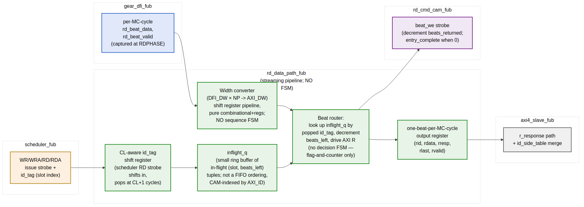

<!-- RTL Design Sherpa Documentation Header -->
<table>
<tr>
<td width="80">
  <a href="https://github.com/sean-galloway/RTLDesignSherpa">
    
  </a>
</td>
<td>
  <strong>RTL Design Sherpa</strong> · <em>Learning Hardware Design Through Practice</em><br>
  <sub>
    <a href="https://github.com/sean-galloway/RTLDesignSherpa">GitHub</a> ·
    <a href="https://github.com/sean-galloway/RTLDesignSherpa/blob/main/docs/DOCUMENTATION_INDEX.md">Documentation Index</a> ·
    <a href="https://github.com/sean-galloway/RTLDesignSherpa/blob/main/LICENSE">MIT License</a>
  </sub>
</td>
</tr>
</table>

---

<!-- End Header -->

# Read Data Path (`rd_data_path_fub`)

**Module:** `rd_data_path_fub.sv`
**Location:** `rtl/fub/`
**Category:** FUB
**Parent:** `ddr2_lpddr2_ctrl`
**Status:** Draft v0.1

> Architectural context: HAS §3.7. The micro-architecture closely mirrors the **stream** `axi_read_engine` (`projects/components/stream/rtl/fub/axi_read_engine.sv`): a streaming pipeline with **no FSM**, only flags, counters, and shift registers. Per-burst state is implicit in pointers and an ID-indexed inflight ring buffer; sequence is enforced by data-flow handshakes, not by enumerated states.

---

## Purpose

`rd_data_path_fub` captures DRAM read-data beats arriving from `gear_dfi_fub`, width-converts them to AXI form, routes them to the correct AXI ID based on the in-flight CAM slot mapping, and presents them on the AXI R channel for `axi4_slave_fub` to drive back to the host.

CL (CAS Latency) alignment is the inverse of `wr_data_path_fub`'s CWL alignment: when the scheduler issues a RD/RDA, the first beat will appear from DFI rddata exactly CL PHY cycles later. A small CL-aware shift register holds the slot index so it pops out at the right cycle to tag the arriving beats.

There are no enumerated FSM states. Internal state is:

- A small CL-align shift register that times slot-index handoff to the inflight ring buffer
- An ID-indexed ring buffer of (slot, beats_remaining) tuples for in-flight reads
- A width-conversion shift register pipeline

This is exactly the "streaming pipeline + flags" model from stream's `axi_read_engine`, adapted to the slave-side direction (DRAM → AXI host rather than memory → internal SRAM).

---

## Stream Uarch Heritage

This FUB is modeled after stream's `axi_read_engine` with the following deliberate parallels:

| Property                                  | Stream `axi_read_engine`                  | This FUB                                   |
|-------------------------------------------|-------------------------------------------|--------------------------------------------|
| No enumerated FSM                          | Yes — streaming flags only                | Yes — streaming flags only                 |
| Streaming data path                        | Direct passthrough AXI R → SRAM            | Direct passthrough DFI rddata → AXI R       |
| ID-based completion routing                | `m_axi_rid` → channel ID                  | `dfi_rddata` arrival time → slot index via CL pipe; slot ID → AXI ID via CAM |
| Pre-allocation handshake                  | `rd_alloc_size` reserves SRAM space        | rd_cmd_cam slot reservation in `axi4_slave_fub` (upstream)|
| Combinational AR / R outputs               | Yes (option to register for timing)        | `r_beat_*` outputs are registered (1-cycle pipeline stage) |
| Strobe-on-handshake completion             | `done_strobe` on AR handshake              | `entry_complete` to rd_cmd_cam on last beat |
| Out-of-order completion across IDs         | Inherent — channel ID is part of AXI ID   | Inherent — slot index travels with the data |
| Per-PERFORMANCE mode parameter             | `PERFORMANCE` ∈ LOW/MED/HIGH               | `RD_DATAPATH_PIPELINE` ∈ {0, 1} for v1; deeper modes deferred to v2 |

Where stream's read engine tracks per-channel inflight reads, this FUB tracks per-CAM-slot inflight reads. The slot index in `rd_cmd_cam` is the analog of stream's channel ID.

**No FSMs anywhere in this FUB.** When the description below uses words like "first beat" or "burst completion" it does NOT mean an enumerated state — it's encoded in the inflight ring buffer's `beats_remaining` counter and the data-flow valid/last bits.

---

## Synthesis Parameters

| Parameter                  | Source            | Effect                                                            |
|----------------------------|-------------------|-------------------------------------------------------------------|
| `AXI_DATA_WIDTH`           | top               | Output (destination) width                                        |
| `DFI_DATA_WIDTH`           | top               | Per-phase source width                                            |
| `N_PHASES`                 | top               | Phases per MC cycle                                               |
| `RD_CAM_DEPTH`             | top               | Number of inflight read slots tracked                              |
| `RD_DATAPATH_PIPELINE`     | top (default 0)   | 0 = single-cycle; 1 = registered intermediate stage                |
| `CL_MAX`                   | derived           | Max CAS latency for the CL-align shift register                    |

---

## Block Pipeline View



**Source:** [16_rd_data_path_pipeline.mmd](../assets/mermaid/16_rd_data_path_pipeline.mmd)

---

## Datapath Stages (all combinational unless noted)

### Stage 1 — CL-Aligned Slot Tagging

When the scheduler issues RD/RDA, the slot index is shifted into a small CL-align register:

```
// On scheduler RD/RDA issue strobe:
cl_pipe.shift_in(slot, valid=1)

// Each MC cycle:
cl_pipe.shift_left()

// At depth = cl_in_mc_cycles + 1, the slot index pops out → enters inflight_q
```

The shift register depth is `(CL_MAX × N_PHASES + 1) / N_PHASES` ≈ 4 entries at default config. Per-entry width is `clog2(RD_CAM_DEPTH) + 1` ≈ 5 bits. ~20 flops total.

No FSM — the position in the shift register IS the cycle offset from issue.

### Stage 2 — Inflight Ring Buffer

When the CL pipe pops a slot, it's pushed into an ID-indexed inflight ring buffer:

```
struct inflight_t {
    logic valid;
    logic [$clog2(RD_CAM_DEPTH)-1:0] slot;
    logic [BURST_LEN_WIDTH-1:0]       beats_remaining;
};

inflight_t inflight_q[RD_CAM_DEPTH];        // CAM-indexed, NOT FIFO-ordered

// On CL pipe pop:
inflight_q[popped_slot].valid           = 1
inflight_q[popped_slot].slot            = popped_slot
inflight_q[popped_slot].beats_remaining = burst_len_from_cam[popped_slot]
```

The ring buffer is CAM-indexed by the slot number (which is, in turn, the AXI ID echo from the CAM). Because the CAM enforces "at most one entry per AXI ID at a time" (or `MAX_PER_ID_READS = N` per HAS §3.1), there's never a collision on `inflight_q[slot]`.

No FSM — each entry is just (valid, slot, counter), and the counter is decremented when a beat is consumed. When `beats_remaining` reaches 0, the entry's valid clears.

### Stage 3 — Width Conversion (DFI → AXI)

The conversion is the inverse of `wr_data_path_fub` Stage 2:

```
// Case 1: AXI_DATA_WIDTH == N_PHASES × DFI_DATA_WIDTH (typical)
//         1 MC cycle of DFI beats → 1 AXI beat; pure wire connection
axi_beat_data = rd_beat_data

// Case 2: AXI_DATA_WIDTH > N_PHASES × DFI_DATA_WIDTH
//         K MC cycles → 1 AXI beat
// Accumulator concatenates K MC cycles before forwarding

// Case 3: AXI_DATA_WIDTH < N_PHASES × DFI_DATA_WIDTH
//         1 MC cycle → K AXI beats
// Shift register emits K sub-beats over K successive cycles
//   sub_beat_cnt is a saturating counter, NOT a state machine
```

Same sub-beat-counter pattern as the write path. No enumerated states.

### Stage 4 — Beat Router and AXI R Drive

The beat router takes the converted data and looks up the destination slot from the inflight ring:

```
// On rd_beat_valid (from gear_dfi):
//   target_slot = head_of_cl_pipe                 // the slot the CL pipe is currently serving
//   data        = width_converted_beat
//   beat_last   = (inflight_q[target_slot].beats_remaining == 1)
//
//   inflight_q[target_slot].beats_remaining = beats_remaining - 1
//   if (beats_remaining was 1):
//     inflight_q[target_slot].valid = 0
//     entry_complete strobe to rd_cmd_cam for slot
//
// Drive AXI R outputs:
//   r_beat_id   = cam.axi_id[target_slot]
//   r_beat_data = data
//   r_beat_resp = OKAY (or SLVERR on DFI rddata error)
//   r_beat_last = beat_last
//   r_beat_valid = 1
```

The beat router is again **flag-and-counter only** — no state register, no transition table. The `beats_remaining` counter is the per-burst progress; the CAM slot is the AXI-ID anchor; the gear's `rd_beat_valid` is the data-flow handshake.

### Stage 5 — Output Register

```
r_beat_id_o    ← r_beat_id    (registered)
r_beat_data_o  ← r_beat_data  (registered)
r_beat_resp_o  ← r_beat_resp  (registered)
r_beat_last_o  ← r_beat_last  (registered)
r_beat_valid_o ← r_beat_valid (registered)
```

Per-MC-cycle output to `axi4_slave_fub`'s `r_response_fifo`. The single register stage matches stream's V1 default.

---

## Out-of-Order Completion (Inherent)

Stream's read engine handles OoO completion across channels because the AXI ID carries the channel index. This FUB handles OoO across AXI IDs because the CL pipe tags each in-flight read with its slot index *before* the data arrives.

The first beat of a read to AXI ID 0x3 might arrive in the same MC cycle as the last beat of an earlier read to AXI ID 0x7. The CL pipe sourced the slot indexes in the correct order; the inflight ring buffer tracks each independently; the AXI R channel returns each beat with its correct ID.

**Per-ID ordering is preserved** because each AXI ID has at most `MAX_PER_ID_READS` (typically 1 in v1) in flight, so beats to the same ID can never arrive out of order from the DRAM (a single in-flight read returns all its beats in burst order). Cross-ID ordering is *not* preserved — that's the whole point of OoO.

This matches the AXI4 ordering semantics: per-ID in-order, cross-ID OoO (when `AXI_OOO_ACROSS_IDS = true`).

---

## CL Alignment Concrete Example

At DDR2-800, `CL = 5`, `N_PHASES = 4`:

| MC cycle from RD issue | What's happening                                  | CL pipe head |
|------------------------|---------------------------------------------------|--------------|
| 0                      | scheduler RD issued                               | empty        |
| 0                      | CL pipe.shift_in(slot=3)                          | slot=3       |
| 1                      | gear_dfi presents RD on phase 0                   | slot=3       |
| 2                      | tied to CL counter inside DRAM                    | slot=3       |
| 2 (shift_left)         |                                                   | slot=3 → next position |
| 3                      | DFI rddata begins arriving                        | slot=3 → head |
| 3                      | inflight_q[3].valid = 1; beats_remaining = burst_len | slot=3 |
| 3                      | first beat: drive r_beat_id = cam.axi_id[3], r_beat_valid = 1 | |
| 4                      | second beat                                       |              |
| 5                      | third beat                                        |              |
| 6                      | last beat; beats_remaining → 0; inflight_q[3].valid = 0; entry_complete to rd_cmd_cam | |

This is the rough timing — actual cycles depend on `CL`, `N_PHASES`, `BL`, and the gear's per-phase mapping. The CL pipe absorbs all of that complexity in its shift register depth.

---

## Interface

### From `scheduler` (CL alignment intake)

| Signal              | Direction | Width                    | Description                                          |
|---------------------|-----------|--------------------------|------------------------------------------------------|
| `rd_issue_strobe_i` | input     | 1                        | Scheduler issued a RD/RDA this cycle                 |
| `rd_issue_slot_i`   | input     | `$clog2(RD_CAM_DEPTH)`   | Which CAM slot                                       |
| `rd_issue_burst_len_i` | input  | `BURST_LEN_WIDTH`        | Total beats for the burst (for inflight_q counter)    |

### From `gear_dfi_fub` (per-MC-cycle beat input)

| Signal              | Direction | Width                              | Description                                          |
|---------------------|-----------|------------------------------------|------------------------------------------------------|
| `rd_beat_data_i`    | input     | `N_PHASES × DFI_DATA_WIDTH`        | One MC-cycle frame's worth of read data              |
| `rd_beat_valid_i`   | input     | 1                                  | Frame is valid this cycle                            |

### From `rd_cmd_cam` (slot → AXI ID lookup)

| Signal              | Direction | Width                                              | Description                              |
|---------------------|-----------|----------------------------------------------------|------------------------------------------|
| `cam_axi_id_i[RD_CAM_DEPTH]`  | input | RD_CAM_DEPTH × AXI_ID_WIDTH | Per-slot AXI ID (combinational read)             |

### To `rd_cmd_cam` (entry-complete strobe)

| Signal                  | Direction | Width                    | Description                                          |
|-------------------------|-----------|--------------------------|------------------------------------------------------|
| `entry_complete_strb_o` | output    | 1                        | Last beat of a burst was just emitted                |
| `entry_complete_slot_o` | output    | `$clog2(RD_CAM_DEPTH)`   | Which slot just completed                            |

### To `axi4_slave_fub` (AXI R-channel push)

| Signal              | Direction | Width                | Description                                          |
|---------------------|-----------|----------------------|------------------------------------------------------|
| `r_beat_id_o`       | output    | `AXI_ID_WIDTH`       | rid                                                  |
| `r_beat_data_o`     | output    | `AXI_DATA_WIDTH`     | rdata                                                |
| `r_beat_resp_o`     | output    | 2                    | rresp (OKAY / SLVERR)                                |
| `r_beat_last_o`     | output    | 1                    | rlast                                                |
| `r_beat_valid_o`    | output    | 1                    | rvalid                                                |
| `r_beat_ready_i`    | input     | 1                    | rready (back-pressure from axi4_slave's r_response_fifo) |

### To `xbank_timers`

| Signal              | Direction | Width  | Description                                          |
|---------------------|-----------|--------|------------------------------------------------------|
| `rd_last_beat_o`    | output    | 1      | Used by `xbank_timers.tRTW_cnt` reload (§2.10)        |
| `rd_last_rank_o`    | output    | `$clog2(NR)` | Rank of the burst                              |

### Debug

| Signal                          | Description                                              |
|---------------------------------|----------------------------------------------------------|
| `dbg_cl_pipe_depth_o`           | CL-align shift register fill level                       |
| `dbg_inflight_count_o`          | Number of in-flight reads (popcount of inflight_q.valid)  |
| `dbg_sub_beat_cnt_o`            | Sub-beat counter (when width-conversion is active)        |

---

## Backpressure Handling

The AXI R-channel ready (`r_beat_ready_i`) is the only backpressure source. If the host's R-channel master stalls and the `r_response_fifo` fills, `rd_data_path_fub` cannot pull from `gear_dfi`. Currently the gear has no backpressure signal — it expects to deliver every rd_beat as it arrives from the PHY.

A small skid buffer (1-2 deep) inside this FUB absorbs the brief stalls between R-channel handshakes. For sustained backpressure, the architecture relies on the scheduler not issuing new RD commands when `r_beat_ready_i` has been low for `R_STALL_THRESHOLD` cycles — this hint flows back to the scheduler via the `STATUS.axi_r_stall` CSR observation.

---

## CSR Hooks

| CSR field                          | Source                            | Use case                                |
|------------------------------------|-----------------------------------|-----------------------------------------|
| `STATUS.rd_beats_in_flight` (R)    | popcount over inflight_q.valid     | Live in-flight burst count               |
| `STATUS.axi_r_stall` (R)           | r_beat_ready_i low for N cycles   | Host backpressure indicator              |
| `OBS_AXI_R_LATENCY_AVG` (R)        | Avg time from rd_issue_strobe to first beat | AXI read latency telemetry        |
| `OBS_AXI_R_LATENCY_P99` (R)        | 99th percentile of the above       | Tail latency                            |

---

## Verification Notes (cocotb test plan)

| Scenario                                                                          | What it proves                                              |
|-----------------------------------------------------------------------------------|-------------------------------------------------------------|
| Single BL=4 read, AXI_DW = N_PHASES × DFI_DW (1:1)                                 | Smoke: beats flow through with no width conversion          |
| Single BL=8 read, 1:1 width                                                       | Multi-beat burst smoke                                       |
| First beat arrives exactly CL cycles after scheduler issue                        | CL alignment shift register                                  |
| OoO across IDs: read to ID 0x3 then read to ID 0x7; ID 0x7 returns first         | OoO across IDs preserves rid tagging                         |
| Per-ID in-order: two reads to same ID complete in issue order                     | Per-ID ordering preservation                                  |
| Asymmetric width AXI_DW > DFI_DW × NP: K-cycle accumulator drives 1 AXI beat      | Accumulating width conversion                                |
| Asymmetric width AXI_DW < DFI_DW × NP: 1 MC cycle drives K AXI beats              | Sub-beat width conversion                                    |
| `entry_complete` to rd_cmd_cam fires exactly once per burst at last beat          | CAM completion strobe                                        |
| `rd_last_beat_o` to xbank_timers fires for tRTW reload                            | xbank tRTW plumbing                                           |
| AXI R back-pressure (rready=0): skid buffer absorbs 1-2 beats                     | Backpressure smoke                                            |
| DFI rddata error during burst (rresp = SLVERR): propagates to AXI R               | Error propagation                                             |
| Reset during in-flight read: inflight_q clears, no spurious r_beat_valid          | Reset behavior                                                |
| Concurrent: AR for ID 0x3 + last-beat of ID 0x7 + first beat of ID 0x5; all three correct in same cycle | Concurrent-ID throughput              |

---

## Open Questions / Future Work

- **Skid buffer sizing.** Currently spec'd at 1-2 deep. Under heavy host backpressure, may need to be deeper. Verify with traffic mix; bump if needed.
- **V2 / V3 performance modes.** Stream's V2 / V3 modes for read engine include OoO completion (V3) which this FUB already supports inherently. The V2 "command-pipelined" mode is already the baseline here since CL pipe is multi-deep. The MAS-level mode parameter is therefore vestigial; revisit at v0.2 of MAS.
- **DFI rddata error handling.** Currently `rresp = OKAY` always; the DFI rddata-error signal is not wired in v1. Add at the DFI status sub-interface level when bring-up flags PHY error conditions.
- **Read interleaving with refresh.** When a refresh interrupts in-flight reads (per §2.11 refresh handshake), the bank machine drains the read first before granting refresh. The inflight_q should naturally drain through the CL pipe; verify the timing in a concurrent refresh-during-read test.
