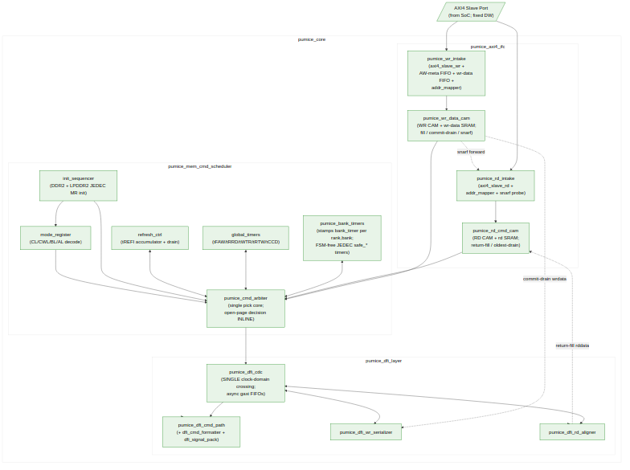

<!-- RTL Design Sherpa Documentation Header -->
<table>
<tr>
<td width="80">
  
</td>
<td>
  <strong>RTL Design Sherpa</strong> · <em>Learning Hardware Design Through Practice</em> 
  
    <a href="https://github.com/sean-galloway/RTLDesignSherpa">GitHub</a> ·
    <a href="https://github.com/sean-galloway/RTLDesignSherpa/blob/main/docs/DOCUMENTATION_INDEX.md">Documentation Index</a> ·
    <a href="https://github.com/sean-galloway/RTLDesignSherpa/blob/main/LICENSE">MIT License</a>
  
</td>
</tr>
</table>

---

<!-- End Header -->

# Block Diagram

## Top-Level Block Diagram

The controller's top-level data and control flow is shown below. AXI4 traffic
enters at top-left into `pumice_axi4_ifc`, which maps addresses and pushes
per-direction records into its two CAMs (`pumice_wr_data_cam`,
`pumice_rd_cmd_cam`). The `pumice_mem_cmd_scheduler` layer queries the CAMs
each cycle and picks the next abstract command (`pumice_cmd_arbiter` against
the bank and global timers). The `pumice_dfi_layer` crosses the single
controller-to-PHY clock boundary (`pumice_dfi_cdc`) and formats the chosen
command into DFI v2.1 wires (`dfi_cmd_formatter` / `dfi_signal_pack`), while
its write serializer and read aligner move write beats out and return read
beats in alignment with the scheduled commands. `pumice_top` instantiates
`pumice_core` (these three layers) plus the PeakRDL `pumice_csr` block that
drives all configuration by name.

**Source:** [01_block_diagram.mmd](../assets/mermaid/01_block_diagram.mmd)

## Data Flow Summary

**Write path:**
1. AXI master issues an AW/W transaction; `pumice_wr_intake` (an AXI4 slave
   write engine + AW-meta FIFO + wr-data FIFO) accepts it and splits the
   host burst at DRAM-burst boundaries.
2. `addr_mapper` translates the flat AXI address into (rank, bank, row, col)
   using `bank_lsb` (+ optional hash).
3. `pumice_wr_data_cam` fills the write burst into its SRAM and records the
   command; the `r_fdone` fill-complete flag gates schedulability and snarf.
4. `pumice_cmd_arbiter` queries the wr/rd CAMs against the per-(rank,bank)
   `safe_*` outputs from `pumice_bank_timers` and the turnaround windows from
   `global_timers`; it picks the next abstract command
   (ACT, WR/WRA, RD/RDA, PRE, REF, MRS, NOP) and applies the page policy
   (open-page decision inline).
5. In `pumice_dfi_layer`, the command crosses the CDC and `dfi_cmd_formatter`
   encodes it into DFI cs_n / ras_n / cas_n / we_n / address / bank wires
   (DDR2) or the packed CA bus (LPDDR2); closed-page uses WRA (auto-precharge).
6. `dfi_signal_pack` aggregates the per-phase DFI control bus.
7. On the write-fire strobe, the DFI write serializer commit-drains the burst
   from `pumice_wr_data_cam`'s SRAM and drives `dfi_wrdata` / `dfi_wrdata_en`
   / `dfi_wrdata_mask` with PHY alignment.
8. On retire, the write CAM slot is freed and `pumice_wr_intake` returns the
   B-response to the AXI master.

**Read path:**
1. AXI master issues an AR transaction; `pumice_rd_intake` accepts and splits
   the burst.
2. Address mapping identical to the write path; `pumice_rd_cmd_cam` records
   the read command. `pumice_rd_intake` probes the write-data CAM: on a snarf
   hit (unscheduled, same-id, same-BL) the read is served directly from the
   write CAM SRAM without going to DRAM (read-your-write forwarding).
3. `pumice_cmd_arbiter` issues ACT, then RD / RDA via the DFI layer.
4. The DFI read aligner drives `dfi_rddata_en` `t_rddata_en` cycles after the
   RD command and captures `dfi_rddata` beats for the burst.
5. Returned beats fill `pumice_rd_cmd_cam`'s SRAM; its oldest-first drain
   engine (gated on data-ready) streams them back out, tagged with the
   original AXI ID, on the R channel.

**Refresh path:**
1. `refresh_ctrl`'s tREFI counter elapses, incrementing the
   `refresh_pending` accumulator (JEDEC max 8 postponed).
2. When `refresh_pending` exceeds the soft threshold, refresh becomes
   highest-priority in the arbiter.
3. For REFab: the arbiter waits for the addressed banks to be safe (via
   `pumice_bank_timers`), then issues REF; the affected timers reload.
4. LPDDR2 per-bank refresh (REFpb) selection is driven by
   `REFRESH_TUNING.refpb_policy_or`.

**Init / power path:**
1. On cold reset, `init_sequencer` holds off AXI traffic.
2. `init_sequencer` executes the memtype-specific JEDEC MR/init sequence,
   driving CKE / RESET_N and issuing MR-write strobes into `mode_register`.
   `mode_register` propagates live CL / CWL / BL / AL to the DFI layer.
3. On completion, `init_done_o` asserts and the arbiter begins servicing AXI
   traffic.
4. Power-down / self-refresh entry (Active / APD / SR / DPD) is managed by
   `powerdown_ctrl` (present but optional; not in the default top build),
   with SR-entry coordinated with `refresh_ctrl`.

Detailed per-module behavior follows in Chapter 3.
