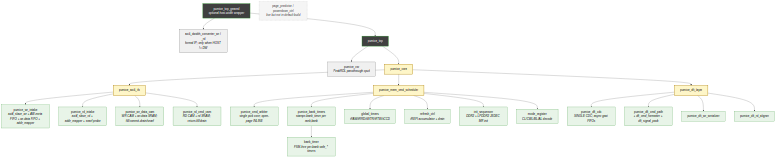

<!-- RTL Design Sherpa Documentation Header -->
<table>
<tr>
<td width="80">
  <a href="https://github.com/sean-galloway/RTLDesignSherpa">
    
  </a>
</td>
<td>
  <strong>RTL Design Sherpa</strong> · <em>Learning Hardware Design Through Practice</em><br>
  <sub>
    <a href="https://github.com/sean-galloway/RTLDesignSherpa">GitHub</a> ·
    <a href="https://github.com/sean-galloway/RTLDesignSherpa/blob/main/docs/DOCUMENTATION_INDEX.md">Documentation Index</a> ·
    <a href="https://github.com/sean-galloway/RTLDesignSherpa/blob/main/LICENSE">MIT License</a>
  </sub>
</td>
</tr>
</table>

---

<!-- End Header -->

# Module Hierarchy

The controller is decomposed into **three layers under `pumice_core`**, each
built from leaf FUBs. Each FUB is independently verified at the unit level;
each layer is verified as an integration ("macro") unit. See
[FUB Breakdown](05_fub_breakdown.md) for the per-FUB role descriptions and
[Chapter 3](../ch03_architecture/) for the behavioral details.

## Hierarchy Tree



**Source:** [02_module_hierarchy.mmd](../assets/mermaid/02_module_hierarchy.mmd)

## Layered Organization

```
SoC level
└── pumice_top_geared            ← OPTIONAL host-width wrapper
    │                              (axi4_dwidth_converter_wr/_rd when HOST != DW)
    └── pumice_top               ← instantiated by the SoC
        ├── pumice_csr           ← PeakRDL passthrough cpuif register block
        └── pumice_core          ← the controller proper
            ├── pumice_axi4_ifc          ← host AXI + wr/rd CAMs
            ├── pumice_mem_cmd_scheduler ← "what command to issue this cycle"
            └── pumice_dfi_layer         ← single CDC + DFI v2.1 datapath
```

The single controller-to-PHY clock crossing lives inside `pumice_dfi_layer`
(`pumice_dfi_cdc`, async FIFOs only). The host AXI interface, CAMs, and
command scheduler all run on `aclk`; the DFI command path, write serializer,
and read aligner run on `dfi_clk`.

## Layer Groupings

| Layer / macro                  | FUBs                                                                                                                       |
|--------------------------------|----------------------------------------------------------------------------------------------------------------------------|
| `pumice_axi4_ifc`              | `pumice_wr_intake`, `pumice_rd_intake`, `addr_mapper`, `pumice_wr_data_cam`, `pumice_rd_cmd_cam`                            |
| `pumice_mem_cmd_scheduler`     | `pumice_cmd_arbiter`, `pumice_bank_timers` (`bank_timer`), `global_timers`, `refresh_ctrl`, `init_sequencer`, `mode_register` |
| `pumice_dfi_layer`             | `pumice_dfi_cdc`, `pumice_dfi_cmd_path` (`dfi_cmd_formatter`, `dfi_signal_pack`), `pumice_dfi_wr_serializer`, `pumice_dfi_rd_aligner` |
| `pumice_core`                  | (wraps the three layers above)                                                                                             |

Also present in the tree but not in the default top build: `page_predictor`
and `powerdown_ctrl` (referenced / optional; verify against the filelists in
`rtl/filelists/`).

Chapter 3 follows the layer ordering (one section per architectural layer,
with module names hyperlinked to their MAS chapters).

## Memtype-Conditional Logic

Memtype (DDR2 vs LPDDR2) is a runtime CSR selection (`PHY_TIMING.memtype`),
not an elaboration parameter. The memtype-dependent logic lives in:

- **`dfi_cmd_formatter`** — a memtype branch: DDR2 drives ras/cas/we; LPDDR2
  packs the 10-bit JESD209-2F CA-bus command (two edges) onto `dfi_address`.
- **`init_sequencer`** — runs the DDR2 or LPDDR2 JEDEC MR/init sequence.
- **`mode_register`** — CL / CWL / BL / AL decode differs by memtype.

Both memtypes pass the full simulation suite.

## Single Clock-Domain Crossing

The design has exactly one clock-domain crossing: `pumice_dfi_cdc` inside
`pumice_dfi_layer`, built from asynchronous gaxi FIFOs. One FIFO word is one
DFI cycle, so the command / write-data / read-data datapaths are bubble-free.
Everything up to the CDC is on `aclk`; everything past it is on `dfi_clk`.

## What Changed vs the Earlier Architecture

The controller was rearchitected from an earlier FSM-based, elaboration-time
decomposition into the current three-layer, CSR-driven design. Notably:

- **Retired**: `txn_queue`, `bank_machine`, `xbank_timers`, `cmd_encoder`,
  `odt_ctrl`, `scheme selector`, the `*_macro`-as-architecture names, and
  `axi_intake`/`axi_frontend`.
- **Replaced by**: the two CAMs (`pumice_wr_data_cam` + `pumice_rd_cmd_cam`),
  FSM-free `bank_timer` (stamped by `pumice_bank_timers`), `global_timers`,
  `dfi_cmd_formatter` (+ `dfi_signal_pack`), and the single `ADDR_MAP.bank_lsb`
  knob.
- **Introduced**: the single-CDC DFI layer, the PeakRDL `pumice_csr` block
  (configuration by name), and the optional `pumice_top_geared` host-width
  wrapper.
