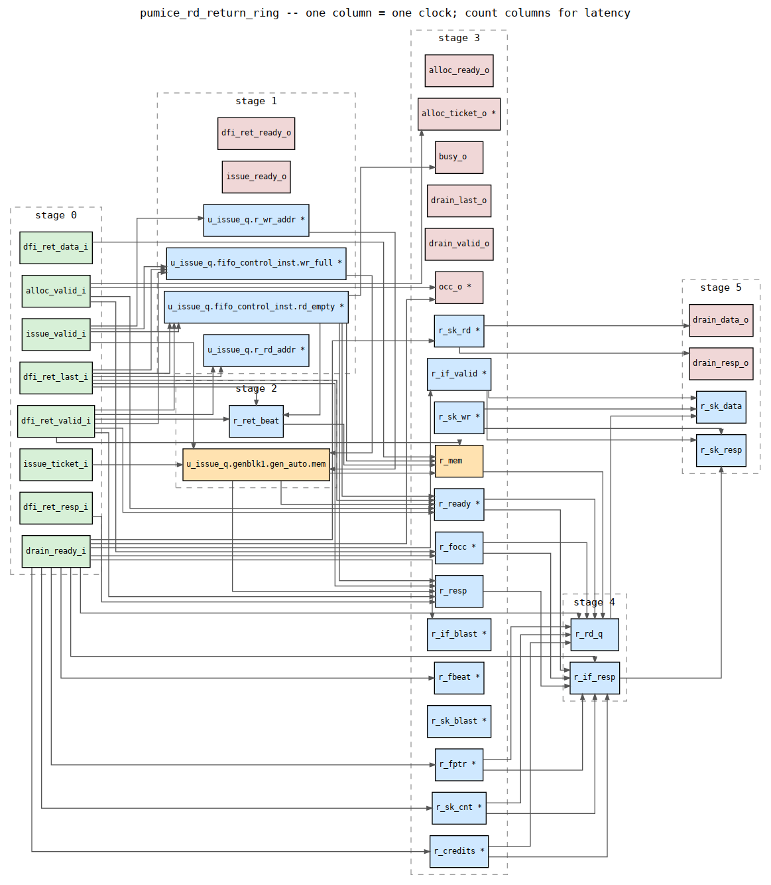

# Pipeline Latency and Mux-Level Schematics

Every figure on this page is **derived from the elaborated netlist**, not
written by hand, so it cannot drift from the RTL without the generator
disagreeing. Regenerate with the commands in the last section; if a number here
disagrees with a fresh run, the page is stale and the run is right.

## How the numbers are obtained

Yosys elaborates each block and stops after `proc`, so the netlist is still
word-level (`$mux`, `$eq`, `$add`, `$dff`) and maps back to the SystemVerilog
rather than to LUTs. `gen_latency.py` then reduces that netlist to **state
only** — flops, memories and ports. Combinational logic is never a node; it is
the edge between two pieces of state. Nodes are ranked into columns by
flop-distance from the input ports, so **one column is one clock**.

Two properties matter for trusting the result:

* The netlist is **flattened** for this view. A parameterised submodule
  instance carries a Yosys type of `$paramod\<name>\<params>`, and treating
  that as a primitive makes its internal registers invisible — `pumice_bank_timers`
  reported 0 registers and 0 clocks before flattening, which is impossible for
  a timer block. Flattening removes the class of error rather than adding
  another special case.
* **Feedback is condensed** (Tarjan SCC) before ranking. Without it any
  register that feeds itself makes the longest path infinite. A path whose
  longest route runs through a real loop is reported as a lower bound.

Clock and reset nets are excluded before the graph is built; they connect
everything to everything and would destroy the staging.

## Per-block pipeline depth

Depth is the longest flop-distance from an input port. Registers counts the
merged registers (a bit-blasted `r_bank[2:0]` is one), not raw flop cells.

| Block | Depth (clocks) | Registers | State nodes |
|---|---|---|---|
| `addr_mapper` | 0 | 0 | 8 |
| `dfi_cmd_formatter` | 0 | 0 | 17 |
| `dfi_signal_pack` | 0 | 0 | 24 |
| `global_timers` | 1 | 5 | 24 |
| `mode_register` | 1 | 1 | 16 |
| `pumice_dfi_cdc` | 2 | 53 | 78 |
| `pumice_dfi_rd_aligner` | 2 | 3 | 14 |
| `pumice_dfi_wr_serializer` | 2 | 2 | 12 |
| `pumice_wr_splitter` | 2 | 13 | 51 |
| `powerdown_ctrl` | 3 | 5 | 18 |
| `pumice_bank_timers` | 3 | 48 | 72 |
| `pumice_cmd_arbiter` | 3 | 57 | 128 |
| `pumice_rd_cmd_cam` | 3 | 11 | 49 |
| `pumice_rd_intake` | 3 | 24 | 75 |
| `refresh_ctrl` | 3 | 6 | 26 |
| `pumice_row_pred_table` | 4 | 8 | 18 |
| `pumice_rd_return_ring` | 5 | 23 | 41 |
| `pumice_wr_data_cam` | 5 | 60 | 120 |
| `pumice_rbl_table` | 6 | 21 | 31 |
| `pumice_page_policy` | 7 | 39 | 70 |
| `pumice_wr_intake` | 7 | 31 | 79 |

Three blocks are purely combinational (`addr_mapper`, `dfi_cmd_formatter`,
`dfi_signal_pack`): they transform a command in place and add no clock. The two
deepest are the paging predictors and the write intake.

## Datapath latencies worth knowing

Read return, the path that sets read bandwidth:

| Path | Flops |
|---|---|
| `dfi_ret_data_i` -> `drain_data_o` (return ring) | 3 |

That is slot write, then the block RAM, then the skid — the three register
boundaries the ring is built from.

Scheduling, from a CAM entry becoming schedulable to the command issuing:

| Path | Flops |
|---|---|
| `*_sch_*` / `bank_*_ready_i` -> `rd_issue_slot_o` | 3 |
| `*_sch_*` / `bank_*_ready_i` -> `wr_commit_slot_o` | 3 |

This is the arbiter's pick pipeline, and it is the reason strict in-order
scheduling costs bandwidth under the auto-precharge paging modes: those modes
need two dependent commands per access (activate, then column-with-
auto-precharge), so each access pays the pick-pipeline traversal twice. See the
scheduler chapter and PUMICE-021.

## Combinational feedthroughs

A zero-flop input-to-output path is **not latency, it is a timing path** —
typically a ready/valid handshake. The generator reports these separately for
exactly that reason. In the return ring, for example, `alloc_ready_o`,
`issue_ready_o` and `dfi_ret_ready_o` are all combinational from their
respective valids. They belong in timing review, not in a latency budget.

## The schematics

Three views live in `rtl/schematics/`, each answering a different question:

| View | File | Question |
|---|---|---|
| Mux-level | `<block>.png` | what does this cell-for-cell look like |
| Dataflow | `<block>.dataflow.png` | which combinational cone is deep (timing) |
| Latency | `<block>.latency.png` | how many flops from here to there |

The mux-level view is faithful but becomes unreadable above roughly 1200 cells,
so the largest blocks are deliberately black-boxed rather than rendered into a
hairball. The latency view has no such limit, because its node count is the
number of registers rather than the number of cells.



Symbols come from a custom netlistsvg skin. The shipped default aliases the
one-hot case primitive onto the two-input mux symbol, so every `case` statement
rendered as a 2:1 mux, and it has no symbol at all for the async-reset flop —
the element a clock-domain review most needs to see. Both are fixed in
`skin/rds-skin.svg`.

## Regenerating

```bash
cd rtl/schematics
python3 make_skin.py                                   # once, or after an npm bump
python3 gen_schematics.py --module <block>             # mux-level + the Yosys JSON
python3 gen_dataflow.py   --module <block> --min-depth 3
python3 gen_latency.py    --module <block> --min-flops 1
```

`gen_latency.py` prunes with `--from` / `--to` (port regexes), `--only` /
`--hide` (node regex), `--no-feedback` (drop backward edges from the picture)
and `--max-nodes`. Above `--max-nodes` the picture is skipped and the table
still prints, which is the right behaviour for the largest blocks.
