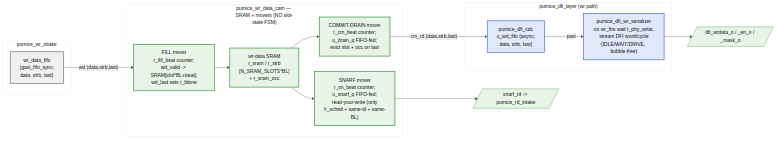

<!-- RTL Design Sherpa Documentation Header -->
<table>
<tr>
<td width="80">
  
</td>
<td>
  <strong>RTL Design Sherpa</strong> · <em>Learning Hardware Design Through Practice</em> 
  
    <a href="https://github.com/sean-galloway/RTLDesignSherpa">GitHub</a> ·
    <a href="https://github.com/sean-galloway/RTLDesignSherpa/blob/main/docs/DOCUMENTATION_INDEX.md">Documentation Index</a> ·
    <a href="https://github.com/sean-galloway/RTLDesignSherpa/blob/main/LICENSE">MIT License</a>
  
</td>
</tr>
</table>

---

<!-- End Header -->

# Write Data Path (`pumice_wr_data_cam` + `pumice_dfi_wr_serializer`)

**Modules:** `pumice_wr_data_cam.sv`, `pumice_dfi_wr_serializer.sv`
**Location:** `rtl/fub/`
**Category:** FUB
**Parents:** `pumice_axi4_ifc` (CAM), `pumice_dfi_layer` (serializer)
**Status:** implemented

> The old single-block `wr_beat_sequencer` / `wr_data_path_fub` no longer
> exists. In the rearchitected controller the write data path is split
> across two clock domains and two FUBs:
>
> - `pumice_wr_data_cam` (MC domain, inside `pumice_axi4_ifc`) — a
>   write-command CAM plus a wr-data SRAM with three de-FSM'd movers.
> - `pumice_dfi_wr_serializer` (DFI domain, inside `pumice_dfi_layer`) —
>   a purely mechanical DFI-word streamer that drives `dfi_wrdata`.
>
> The single clock-domain crossing between them is `pumice_dfi_cdc`
> (async gaxi FIFOs). This chapter documents both halves.

> Architectural context: HAS §3.7 and `_SWEEP_GROUND_TRUTH.md` §8. Both
> halves follow the repository "streaming pipeline + flags" model — no
> enumerated datapath FSM in the CAM movers (the DFI serializer has a tiny
> 3-state pacing FSM only, described below). Sequence is enforced by
> data-flow handshakes and burst beat-counters, not by slot state latches.

---

## Purpose

The write data path stages the AXI write burst that arrives on the AW/W
channels, holds it while the scheduler picks a moment to commit it to
DRAM, and — when the DFI layer is ready — streams it onto the DFI write
bus one DFI word per cycle.

`pumice_wr_data_cam` is the MC-domain staging structure. It stores each
pending write's key `{bank, row, col}`, its AXI id, a free-running age,
and the burst's beats in an SRAM slot. It exposes associative query ports
so the `pumice_cmd_arbiter` can find row-hit writes, an oldest-entry port
as a scheduler fallback, and a snarf (read-your-write) forwarding port for
`pumice_rd_intake`. On commit it drains the SRAM slot into the DFI layer.

`pumice_dfi_wr_serializer` is the DFI-domain endpoint. On a WR command
strobe (`wr_fire_i`) it waits `t_phy_wrlat` DFI cycles, then pops one
DFI word per cycle from its write-data FIFO onto `dfi_wrdata` /
`dfi_wrdata_en` / `dfi_wrdata_mask` until the burst's `last` word.

---

## `pumice_wr_data_cam` — three movers over one SRAM

The CAM never runs a datapath state machine. It has one SRAM
(`r_sram[N_SRAM_SLOTS*BL]`, plus a companion strobe array `r_strb`) and
three movers, each of which is just a burst beat-counter reading the head
of a request FIFO:

| Mover        | Trigger source        | Direction        | Beat counter |
|--------------|-----------------------|------------------|--------------|
| **fill**     | `u_fill_q` (insert-order slot FIFO) | wd_data_i → SRAM | `r_fill_beat` |
| **snarf**    | `u_snarf_q` (accept-order slot FIFO) | SRAM → snarf_rd | `r_sn_beat`   |
| **commit**   | `u_drain_q` (scheduled-slot FIFO)    | SRAM → cm_rd    | `r_cm_beat`   |

Each mover streams straight off its request-FIFO head, which is stable
until popped. The head slot IS the "active" slot; "active" simply means
the FIFO is non-empty; the FIFO is popped on the burst's last beat. This
is the de-FSM'd streaming reader pattern — no active/slot latch.

### Entry state

Per entry (`NUM_ENTRIES`, default 8): `r_valid`, `r_bank`, `r_row`,
`r_col`, `r_id`, `r_age`, plus:

- `r_ptr` — SRAM slot index, set on the entry's first fill beat.
- `r_pv` — pointer-valid (first beat has been staged).
- `r_fdone` — **fill COMPLETE** (`wd_last` has been seen). An entry may be
  scheduled or snarfed only once `r_fdone` is set; otherwise the
  commit-drain mover could outrun a gapped fill and read stale SRAM beats.
- `r_sched` — the scheduler has committed this slot. It is set the cycle
  `commit_valid_i` fires and immediately excludes the entry from the
  `sched_lu` / `oldest` ports, so the arbiter can pick the next entry the
  very next cycle (clean one-command-per-clock). It clears on evict.

`r_age_ctr` is a free-running counter; relative age is
`w_rel[i] = r_age_ctr - r_age[i]`, which is wrap-safe.

### SRAM slot pre-allocation

`N_SRAM_SLOTS` may be less than `NUM_ENTRIES`. `r_sram_occ` is a
per-SRAM-slot occupancy bitmap. On the first fill beat of an entry a free
slot is chosen (`w_slot_free`, highest-index-first scan), recorded into
`r_ptr`, and marked occupied. The slot is freed on the entry's commit
evict. `wd_ready_o` deasserts on the first beat if no SRAM slot is free.

### Age-based selectors

Three selectors run combinationally over the entry array (all skip
already-scheduled and not-fill-complete entries where applicable):

- **oldest port** — oldest valid, fill-complete, unscheduled entry (max
  relative age). Scheduler fallback.
- **scheduler lookups** (`N_SCHED_LU`, default 4) — for each `{bank, row}`
  query, the oldest matching fill-complete unscheduled entry. This gives
  the arbiter in-order commit per row.
- **snarf lookup** — the *youngest* match (min relative age), so a read
  sees the latest write data.

---

## Snarf: write-to-read forwarding (was the standalone `wr2rd_forward`)

There is no standalone `wr2rd_forward` FUB anymore. Write-to-read
forwarding is the **snarf mover inside `pumice_wr_data_cam`**. When
`pumice_rd_intake` presents an AR's decoded key on the snarf probe port,
the CAM combinationally searches for a matching in-flight write. The match
is deliberately narrow — a write is snarfable only when all three hold:

1. **Not yet scheduled** (`!r_sched`). A scheduled write is
   draining/evicting to DRAM, so its CAM data is racy.
2. **Same AXI id** (`r_id[i] == snarf_probe_id_i`). Same-id
   write-before-read is the only AXI-ordered case where the read is
   *required* to observe the write; cross-id has no ordering guarantee, so
   a cross-id read takes the DRAM path instead.
3. **Same burst length** — `snarf_probe_len_i == BL-1`. Every admitted
   write is exactly `BL` beats (ragged bursts are rejected upstream in
   `pumice_wr_intake`), so this reduces to `arlen == BL-1`. A short or long
   read must not snarf a full-BL write.

The match must also be fill-complete (`r_fdone`). Among candidates the
youngest is chosen. `snarf_hit_o` asserts when a valid probe finds a match
with matching length. On `snarf_accept_i`, the matched slot is pushed into
`u_snarf_q`; the snarf mover then streams `snarf_rd_data_o` beats
(non-destructively — snarf does not evict the write) in accept order.

> The old chapter's "last-write-wins highest-slot-index" rule and the
> "any matching in-flight write regardless of id" behavior are gone. The
> live policy is youngest-match, same-id, same-BL, unscheduled only.

---

## Commit drain and B response

The arbiter's commit does two things atomically: it sets `r_sched` on the
slot (immediate exclusion from the pick ports) and enqueues the slot into
`u_drain_q`. The commit mover works through scheduled slots at its own
pace, streaming `cm_rd_data_o` / `cm_rd_strb_o` to the DFI write path and
popping `u_drain_q` on the last beat. On that last beat the entry is
evicted (`r_valid`, `r_pv`, `r_fdone`, `r_sched` cleared; SRAM slot freed)
and `commit_done_valid_o` / `commit_done_id_o` strobe, which drives the
`pumice_wr_intake` B response. Decoupling the scheduled-mark from the
drain is what allows one-command-per-clock scheduling.

---

## `pumice_dfi_wr_serializer` — the DFI-domain endpoint

This FUB is purely mechanical and lives in the DFI clock domain. Its
internal datapath unit is the DFI word (`DFI_DATA_WIDTH`, default 128),
which already carries all `DFI_RATE` phases; `dfi_signal_pack` splits it to
the pins, so there is **no per-beat packing here**.

Interface (abridged):

| Signal            | Dir | Description                                       |
|-------------------|-----|---------------------------------------------------|
| `t_phy_wrlat_i`   | in  | WR-cmd → wrdata_en delay (DFI cycles)             |
| `wr_fire_i`       | in  | WR command strobe (from `pumice_dfi_cmd_path`)    |
| `wd_valid/ready/data/strb/last` | in/out | Pre-staged write-data FIFO (DFI-word granular) |
| `dfi_wrdata_o`    | out | `= wd_data_i` while driving                        |
| `dfi_wrdata_en_o` | out | all-ones while driving, else 0                    |
| `dfi_wrdata_mask_o` | out | `~wd_strb_i` while driving (AXI wstrb=1 write → DFI mask=1 means "mask", i.e. mask = ~strb) |

It has a small 3-state pacing FSM (`S_IDLE`, `S_WAIT`, `S_DRIVE`) — the
only FSM in the whole write path, and it exists to time `t_phy_wrlat`, not
to route data:

- `S_IDLE`: on an available fire, if `t_phy_wrlat==0` drive word 0
  combinationally this cycle (via `w_start_now`) and go straight to
  `S_DRIVE` (or stay idle for a single-word burst); if `==1` go to
  `S_DRIVE`; else load `r_wait = t_phy_wrlat-1` and go `S_WAIT`.
- `S_WAIT`: count down, enter `S_DRIVE` at fire+wrlat.
- `S_DRIVE`: pop one DFI word per cycle. On the last word, if another fire
  is pending continue **seamlessly** into the next burst (zero bubbles);
  else return to `S_IDLE`.

A `r_pending` counter (3-bit) absorbs `wr_fire` strobes that arrive while a
burst is in flight. This matters: the DFI cmd path paces column commands
exactly `BL_WORDS` DFI cycles apart (the burst's DQ-bus occupancy), so the
next burst's first word is due the cycle right after the current burst's
last word. Because the data is pre-staged in the FIFO (the CAM drains it
when the command is scheduled), at `wr_fire` the burst is already waiting,
so the drive never stalls and bursts run back-to-back with zero bubbles.

> Fixed bug (see project notes): a fire arriving mid-burst used to be
> dropped, stranding the write in the PHY. It is now counted in
> `r_pending`.

---

## Block Pipeline View

**Source:** [15_wr_data_path_pipeline.mmd](../assets/mermaid/15_wr_data_path_pipeline.mmd)

---

## `pumice_wr_data_cam` interface

### Insert (from `pumice_wr_intake` aw_push)

| Signal        | Dir | Width          | Description                    |
|---------------|-----|----------------|--------------------------------|
| `ins_valid_i` | in  | 1              | Allocate an entry              |
| `ins_ready_o` | out | 1              | Free entry AND fill-FIFO room  |
| `ins_bank_i`  | in  | `BKW`          | Decoded bank                   |
| `ins_row_i`   | in  | `ROW_WIDTH`    | Decoded row                    |
| `ins_col_i`   | in  | `COL_WIDTH`    | Decoded column                 |
| `ins_id_i`    | in  | `IW`           | AXI id                         |

### Fill data (from `pumice_wr_intake` wdata pop)

| Signal       | Dir | Width | Description                               |
|--------------|-----|-------|-------------------------------------------|
| `wd_valid_i` | in  | 1     | Write-data beat valid                     |
| `wd_ready_o` | out | 1     | Fill-FIFO head present AND SRAM slot free |
| `wd_data_i`  | in  | `DW`  | Beat data                                 |
| `wd_strb_i`  | in  | `SW`  | Byte strobes                              |
| `wd_last_i`  | in  | 1     | Last beat (sets `r_fdone`, pops fill FIFO)|

### Snarf lookup + stream (to/from `pumice_rd_intake`)

| Signal              | Dir | Description                                       |
|---------------------|-----|---------------------------------------------------|
| `snarf_probe_*`     | in  | Probe key {bank,row,col}, id, len                 |
| `snarf_hit_o`       | out | Valid probe matched (youngest, same-id, same-BL)  |
| `snarf_accept_i`    | in  | Read admitted as a snarf; push slot to snarf FIFO |
| `snarf_rd_valid/ready/data/last` | out/in | Snarf data stream (accept order)    |

### Oldest port + scheduler lookups (to `pumice_cmd_arbiter`)

| Signal              | Dir | Description                                       |
|---------------------|-----|---------------------------------------------------|
| `oldest_valid_o` + `oldest_{bank,row,col,id,slot}_o` | out | Oldest fill-complete unscheduled entry |
| `sched_lu_valid_i[N]` + `sched_lu_{bank,row}_i` | in | Per-port {bank,row} queries |
| `sched_lu_hit_o[N]` + `sched_lu_{slot,col,id,age}_o` | out | Oldest matching entry per port |

### Commit / drain (to `pumice_dfi_layer` write path)

| Signal              | Dir | Description                                       |
|---------------------|-----|---------------------------------------------------|
| `commit_valid_i`    | in  | Arbiter commits a slot                            |
| `commit_ready_o`    | out | Room in the drain FIFO                            |
| `commit_slot_i`     | in  | Slot to schedule                                  |
| `cm_rd_valid/ready/data/strb/last` | out/in | Commit-drain data stream           |
| `commit_done_valid_o` + `commit_done_id_o` | out | Evict strobe → drives B response |
| `busy_o`            | out | Any pending fill / snarf / drain / oldest         |

---

## `pumice_dfi_wr_serializer` parameters

| Parameter         | Default | Effect                                     |
|-------------------|---------|--------------------------------------------|
| `DFI_DATA_WIDTH`  | 128     | DFI-word width (= `DRAM_BEAT_WIDTH*DFI_RATE`) |
| `DFI_RATE`        | 2       | Phases per DFI word (`= DFI_EN_WIDTH`)     |
| `DFI_STRB_WIDTH`  | DW/8    | Byte-mask width                            |
| `WRLAT_W`         | 8       | Width of `t_phy_wrlat_i`                   |

---

## Verification Notes (cocotb test plan)

| Scenario                                                                 | What it proves                                    |
|--------------------------------------------------------------------------|---------------------------------------------------|
| Insert + fill a BL burst; `r_fdone` sets only on `wd_last`               | Fill mover + fill-complete gate                   |
| Commit an entry; SRAM drains in order; evict + `commit_done` on last     | Commit mover + B-response strobe                  |
| Snarf hit: same-id, same-BL, unscheduled write returns its data          | Snarf youngest-match forwarding                   |
| Snarf miss: cross-id read, or scheduled write, or mismatched len         | Snarf policy exclusions                           |
| Oldest / sched-lookup exclude scheduled + not-fill-complete entries      | Pick-port correctness (1 cmd/clock)               |
| SRAM slot exhaustion: `wd_ready_o` / `ins_ready_o` deassert              | Pre-allocation backpressure                       |
| DFI serializer: `t_phy_wrlat` sweep (0, 1, N); first word at fire+wrlat  | Write-latency alignment                           |
| Back-to-back WR fires paced `BL_WORDS` apart: zero-bubble drive          | `r_pending` seamless continuation                 |
| `wr_fire` mid-burst is counted, not dropped                              | `r_pending` regression                            |
| `dfi_wrdata_mask_o == ~wd_strb_i` while driving                          | Strobe → mask inversion                           |

---

## Open Questions / Future Work

- **Cross-burst commit interleave.** The commit mover drains one scheduled
  slot at a time. Interleaving beats from multiple scheduled slots would
  need a per-slot beat-counter shadow. Punt to a later performance mode.
- **Multi-outstanding DFI reads/writes.** The serializer's `r_pending`
  counter is 3-bit; deeper pipelining is bounded by the DFI cmd path's
  pacing, not by this FUB.
- **Strobe-less writes.** Hosts that always write full beats could elide
  the strobe SRAM and mask path at elaboration. Minor area win; punt.
