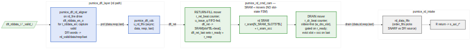

<!-- RTL Design Sherpa Documentation Header -->
<table>
<tr>
<td width="80">
  
</td>
<td>
  <strong>RTL Design Sherpa</strong> · <em>Learning Hardware Design Through Practice</em> 
  
    <a href="https://github.com/sean-galloway/RTLDesignSherpa">GitHub</a> ·
    <a href="https://github.com/sean-galloway/RTLDesignSherpa/blob/main/docs/DOCUMENTATION_INDEX.md">Documentation Index</a> ·
    <a href="https://github.com/sean-galloway/RTLDesignSherpa/blob/main/LICENSE">MIT License</a>
  
</td>
</tr>
</table>

---

<!-- End Header -->

# Read Data Path (`pumice_rd_cmd_cam` + `pumice_dfi_rd_aligner`)

**Modules:** `pumice_rd_cmd_cam.sv`, `pumice_dfi_rd_aligner.sv`
**Location:** `rtl/fub/`
**Category:** FUB
**Parents:** `pumice_axi4_ifc` (CAM), `pumice_dfi_layer` (aligner)
**Status:** implemented

> The old single-block `rd_cl_aligner` / `rd_data_path_fub` no longer
> exists. In the rearchitected controller the read data path is split
> across two clock domains and two FUBs:
>
> - `pumice_dfi_rd_aligner` (DFI domain, inside `pumice_dfi_layer`) —
>   drives `dfi_rddata_en` at the right cycle for an issued READ and
>   captures `dfi_rddata` words into the read return FIFO.
> - `pumice_rd_cmd_cam` (MC domain, inside `pumice_axi4_ifc`) — an
>   outstanding-read reorder buffer: DRAM data returns in *issue* order
>   and buffers per entry; it drains to `pumice_rd_intake` in *AR* order.
>
> The single clock-domain crossing between them is `pumice_dfi_cdc`
> (async gaxi FIFOs). This chapter documents both halves.

> Architectural context: HAS §3.7 and `_SWEEP_GROUND_TRUTH.md` §8. The CAM
> has no datapath FSM — the movers are burst beat-counters over the SRAM.
> The DFI aligner has a small pacing FSM for the `dfi_rddata_en` window
> only. Sequence is enforced by data-flow handshakes, not by slot state.

---

## Purpose

The read data path is the miss path: reads that cannot be satisfied by a
snarf from the write CAM (see §17) go to DRAM. `pumice_rd_cmd_cam` is the
mirror of `pumice_wr_data_cam` — entries keyed `{bank, row, col}` with a
free-running age, an oldest port, and `N_SCHED_LU` scheduler lookups, so
reads row-hit-schedule exactly like writes. It also acts as a **reorder
buffer**: it accepts AR inserts in AR order, lets the scheduler issue them
in an order it chooses (row-hit optimized), receives DRAM data in *issue*
order, and drains it back to the host in *AR/oldest* order.

`pumice_dfi_rd_aligner` is the DFI-domain endpoint. On a RD command strobe
(`rd_fire_i`) it drives the `dfi_rddata_en` capture window starting
`t_rddata_en` DFI cycles later, and pushes one DFI word per
`dfi_rddata_valid` cycle into the read return FIFO as `{data, resp, last}`.

Compared to the write CAM there is **no snarf port** here — snarf is a
write-CAM concept (§17). Data flows *in* from the DFI return and *out* to
`pumice_rd_intake`.

---

## `pumice_rd_cmd_cam` — reorder buffer, two movers over one SRAM

The CAM stores each burst's return data in an SRAM (`r_sram[N_SRAM_SLOTS*BL]`)
and runs two de-FSM'd movers, each a burst beat-counter:

| Mover           | Trigger source            | Direction         | Beat counter |
|-----------------|---------------------------|-------------------|--------------|
| **return-fill** | `u_issue_q` (issue-order slot FIFO) | dfi_ret → SRAM | `r_ret_beat` |
| **drain**       | oldest-valid pick, data-ready gated | SRAM → drain   | `r_dr_beat`  |

### Entry state and age

Per entry (`NUM_ENTRIES`, default 8): `r_valid`, `r_issued` (scheduler has
issued it to DRAM), `r_ready` (return data complete), `r_bank`, `r_row`,
`r_col`, `r_id`, `r_resp`, `r_age`, plus `r_ptr` (SRAM slot, set on the
first return beat) and `r_pv` (pointer valid). `r_age_ctr` is free-running;
relative age `w_rel[i] = r_age_ctr - r_age[i]` is wrap-safe.

SRAM slot pre-allocation is identical to the write CAM: `r_sram_occ`
bitmap, highest-index-first free scan, allocate on first return beat, free
on drain evict.

### The three age selectors

- **issue-side oldest** — oldest valid **not-yet-issued** entry (max rel).
  Scheduler fallback; drives the `oldest_*` port.
- **scheduler lookups** (`N_SCHED_LU`, default 4) — per `{bank, row}`
  query, the oldest not-issued match. Row-hit read scheduling.
- **drain-side oldest** — oldest valid entry over **all** valid entries
  (max rel), regardless of issued/ready. This is `w_dro_slot`.

### Ordering guarantee

Inserts happen in AR order and each new insert is *younger*, so the
drain-side oldest pick `w_dro_slot` is stable across a burst: the entry
stays valid until its own last-beat evict, and later inserts can never
become "more oldest". The drain mover therefore needs no active latch —
the draining slot IS the oldest-valid pick. It only fires when that oldest
entry's data is staged: `w_dr_go = w_dro_found && r_ready[w_dro_slot]`.
This is what enforces AR-order release even though DRAM returns arrive in
issue order.

### Issue-order return fill

When the scheduler issues a read it notifies the CAM (`issue_valid_i` /
`issue_slot_i`), which sets `r_issued[slot]` and pushes the slot into
`u_issue_q`. DRAM returns arrive in the same order the reads were issued,
so the return-fill mover writes each return burst into the issue-FIFO head
slot's SRAM region. On the burst's `dfi_ret_last`, it sets `r_ready`,
captures `r_resp`, and pops `u_issue_q`.

---

## `pumice_dfi_rd_aligner` — the DFI-domain endpoint

This FUB mirrors `pumice_dfi_wr_serializer`. Its internal unit is the DFI
word (`= dfi_rddata` width); `BL_WORDS = BL/DFI_RATE` words per burst.

It has two independent concerns:

**1. `dfi_rddata_en` window (small pacing FSM).** A 3-state FSM
(`S_IDLE`, `S_WAIT`, `S_EN`) plus a pending-fire counter `r_epend`:

- `S_IDLE`: on an available fire, if `t_rddata_en==0` drive word 0's
  enable combinationally (`w_en_now`) and seed the remaining-cycle counter
  for `BL_WORDS-1` more en cycles; if `==1` go straight to `S_EN`; else
  load `r_ewait = t_rddata_en-1` and go `S_WAIT`.
- `S_WAIT`: count down, enter `S_EN` at fire+`t_rddata_en`.
- `S_EN`: assert `dfi_rddata_en_o` for the window. On the last en-cycle, if
  another fire is pending reseed for a contiguous back-to-back window (zero
  bubbles); else return to `S_IDLE`.

Like the write serializer, the DFI cmd path paces column commands
`BL_WORDS` apart, so windows abut with zero bubbles. A `rd_fire` arriving
mid-window is counted in `r_epend` (previously it was dropped, leaving the
second read with no capture window and stranding it in the PHY).

**2. Capture (flag-and-counter only).** On each `dfi_rddata_valid`
(`w_word_valid = |dfi_rddata_valid_i`) a word is pushed to the read FIFO:
`rd_data_o = dfi_rddata_i`, `rd_resp_o = OKAY`, and `rd_last_o` asserts on
word `BL_WORDS-1`. A single word counter `r_rcnt` tracks progress; it wraps
on the last word.

> v1 note: `rd_resp_o` is hardwired `RESP_OKAY` — the DFI rddata-error
> signal is not yet wired. The aligner supports one outstanding read window
> (single-issue, tRTW/tCCD spaced by the scheduler / `global_timers`).

---

## Block Pipeline View

**Source:** [16_rd_data_path_pipeline.mmd](../assets/mermaid/16_rd_data_path_pipeline.mmd)

---

## `pumice_rd_cmd_cam` interface

### Insert (from `pumice_rd_intake` ar_push, AR order)

| Signal        | Dir | Width       | Description         |
|---------------|-----|-------------|---------------------|
| `ins_valid_i` | in  | 1           | Allocate an entry   |
| `ins_ready_o` | out | 1           | Free entry available|
| `ins_bank/row/col/id_i` | in | key + id | Decoded key + AXI id |

### Scheduler ports (to `pumice_cmd_arbiter`)

| Signal              | Dir | Description                                      |
|---------------------|-----|--------------------------------------------------|
| `sched_lu_valid_i[N]` + `sched_lu_{bank,row}_i` | in | Per-port {bank,row} queries |
| `sched_lu_hit_o[N]` + `sched_lu_{slot,col,id,age}_o` | out | Oldest not-issued match per port |
| `oldest_valid_o` + `oldest_{bank,row,col,id,slot}_o` | out | Oldest not-issued entry |

### Issue notify (from scheduler)

| Signal          | Dir | Description                                          |
|-----------------|-----|------------------------------------------------------|
| `issue_valid_i` | in  | Scheduler issued this slot to DRAM                   |
| `issue_ready_o` | out | Room in the issue-order FIFO                         |
| `issue_slot_i`  | in  | Slot issued (records issue order for return fill)    |

### DFI return (from `pumice_dfi_layer` read path, issue order)

| Signal             | Dir | Description                                       |
|--------------------|-----|---------------------------------------------------|
| `dfi_ret_valid_i`  | in  | Return beat valid                                 |
| `dfi_ret_ready_o`  | out | Issue-FIFO head present AND SRAM slot free        |
| `dfi_ret_data_i`   | in  | Return beat data                                  |
| `dfi_ret_resp_i`   | in  | Return response (captured on last)                |
| `dfi_ret_last_i`   | in  | Last beat (sets `r_ready`, pops issue FIFO)       |

### Drain (to `pumice_rd_intake` R source, AR order)

| Signal             | Dir | Description                                       |
|--------------------|-----|---------------------------------------------------|
| `drain_valid_o`    | out | Oldest entry with data ready                      |
| `drain_ready_i`    | in  | Downstream accepts                                |
| `drain_data_o`     | out | Beat data                                         |
| `drain_id_o`       | out | AXI id (rid echo)                                 |
| `drain_resp_o`     | out | rresp                                             |
| `drain_last_o`     | out | Last beat (evicts entry, frees SRAM slot)         |
| `busy_o`           | out | Oldest-valid present OR issue FIFO non-empty      |

---

## `pumice_dfi_rd_aligner` parameters

| Parameter         | Default | Effect                                     |
|-------------------|---------|--------------------------------------------|
| `DFI_DATA_WIDTH`  | 128     | DFI-word width                             |
| `DFI_RATE`        | 2       | Phases per DFI word (`= DFI_EN_WIDTH`, `DFI_VALID_WIDTH`) |
| `BL_WORDS`        | 4       | DFI words per read burst (`= BL/DFI_RATE`) |
| `RDEN_W`          | 8       | Width of `t_rddata_en_i`                   |

---

## Out-of-Order Completion (across AXI IDs)

The CAM preserves AXI ordering the way the standard requires: per-ID reads
complete in issue order (a single in-flight read returns all its beats in
burst order), while cross-ID reads may complete out of order because the
scheduler is free to issue them in row-hit order. The reorder buffer's
AR-order drain (oldest-first, data-ready gated) makes the release order
deterministic; the `drain_id_o` echo tags each beat with its original AXI
id.

---

## Verification Notes (cocotb test plan)

| Scenario                                                                 | What it proves                              |
|--------------------------------------------------------------------------|---------------------------------------------|
| Insert AR, issue, DFI return, drain: BL burst round-trips                | Full miss-path smoke                        |
| Returns in issue order buffered into correct SRAM slots                  | Issue-order return fill                     |
| Out-of-issue-order scheduling but AR-order drain release                 | Reorder-buffer ordering guarantee           |
| Drain gated on `r_ready`: oldest entry with data not yet complete stalls | Data-ready gate                             |
| SRAM slot exhaustion deasserts `dfi_ret_ready_o`                         | Return-side pre-allocation backpressure     |
| DFI aligner `t_rddata_en` sweep (0, 1, N); en-window at fire+t_rddata_en | Read-latency window alignment               |
| Back-to-back RD fires paced `BL_WORDS` apart: contiguous en windows      | `r_epend` seamless continuation             |
| `rd_fire` mid-window counted, not dropped                                | `r_epend` regression                        |
| `rd_last_o` on DFI word `BL_WORDS-1`                                      | Word counter / burst boundary               |

---

## Open Questions / Future Work

- **DFI rddata error propagation.** `rd_resp_o` is fixed OKAY in v1; wire
  the PHY rddata-error to `rd_resp_o` (and thence `r_resp` → AXI rresp)
  during bring-up.
- **Multi-outstanding read windows.** The aligner is single-issue in v1;
  the `r_epend` counter already tolerates paced back-to-back fires, but
  overlapping windows would need a deeper capture-side counter.
- **Read-path parallelism for reorder / col-major.** Deferred perf item —
  the drain mover releases one oldest burst at a time.
