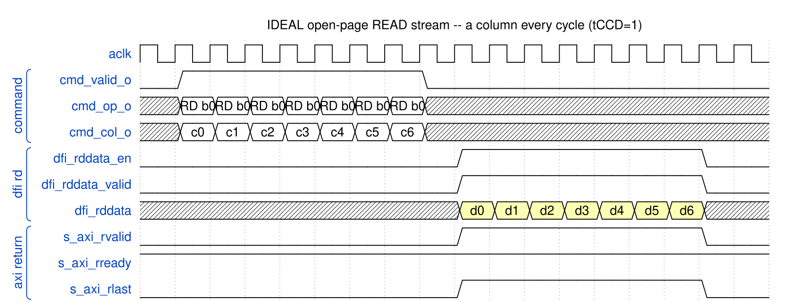
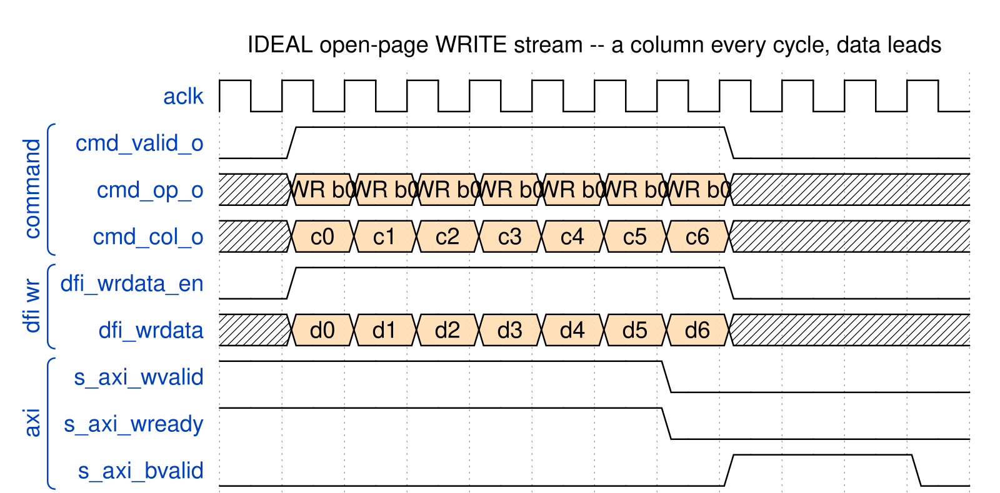
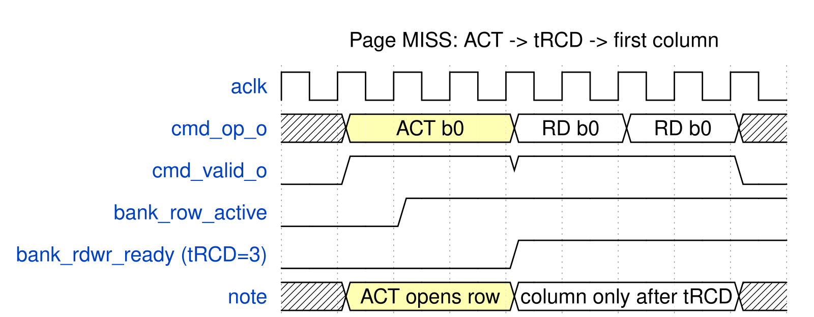
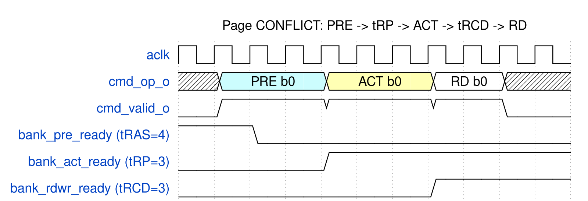
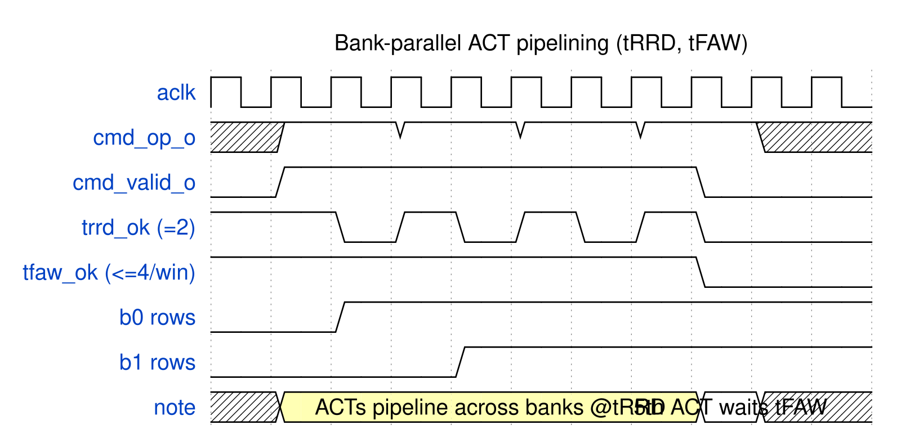
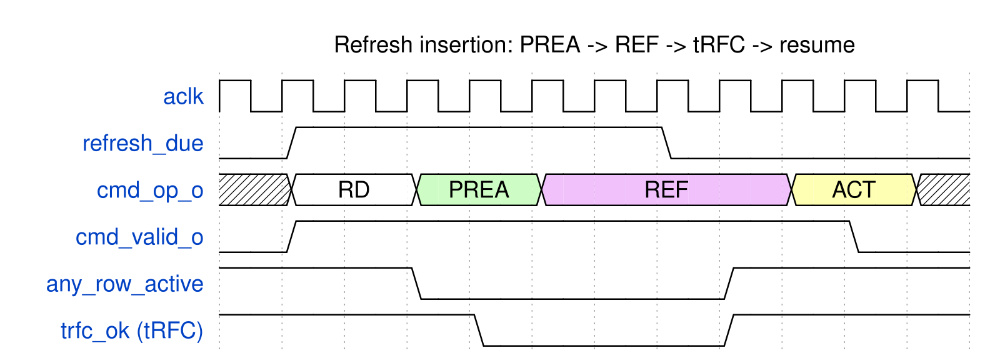
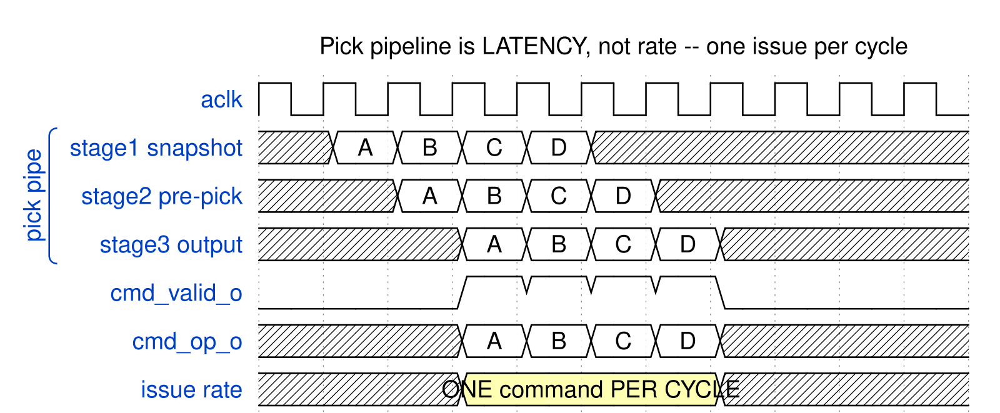
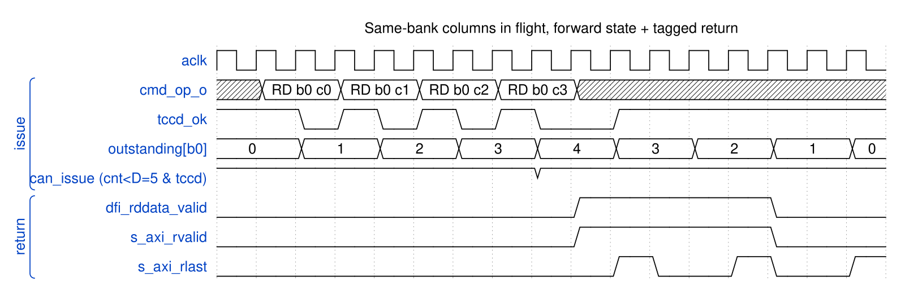
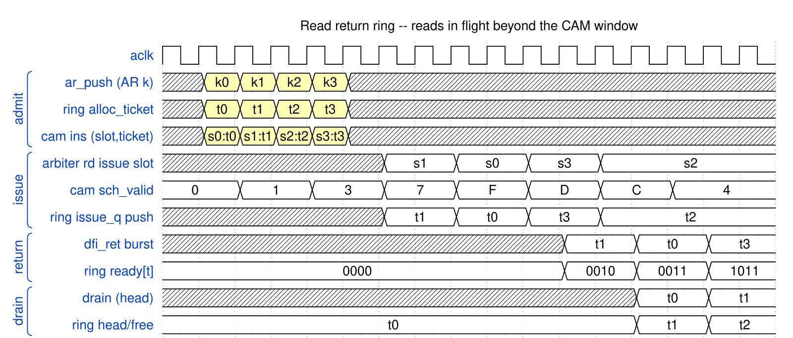
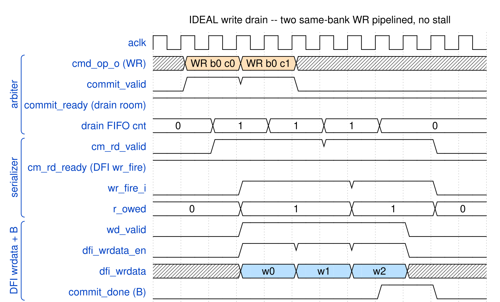

# Ideal Command Cadence

Every diagram on this page is generated (`design/gen_waves.py`) and rendered
(`design/render_waves.py`); none is drawn by hand. They define the cadence the
RTL is written to hit, so where a diagram and the RTL disagree, one of them is a
bug and the disagreement is the point.

**Operating point.** Nexys A7, DDR2-300 at aclk 75 MHz, DFI_RATE=2, BL4 on a x16
device with a 32-bit DRAM beat. That gives `BURST_WORDS = 1` DFI word per DRAM
burst (`pumice_core.sv:76`), so **one column moves 8 bytes in one aclk cycle**
and the peak is 600 MB/s. Timing in aclk cycles: tCCD=1, tRCD=3, tRP=3, tRAS=4,
tRC=6, tWTR=2, tRTW=2, tRRD=2, tFAW=6, CL=3, CWL=2, t_rddata_en=6,
write_latency=0.

> **Corrected 2026-09-10.** These diagrams previously declared tCCD=2 and drew a
> column every *other* cycle while captioned "~100% bus util", which cannot both
> be true. `pumice_core.sv:255` clamps `t_ccd_i` up to `BURST_WORDS`, which is 1
> here, and the board sustains 571.3 MB/s read. A column every cycle is the
> ideal, and that is what these now show.

## Streaming



IDEAL open-page READ stream: a column EVERY cycle (tCCD=1 at BL4/x16/32b beat), rvalid continuous after the t_rddata_en+CL fill. 8 B/cycle = 600 MB/s peak; the board measures 571.3 (95%). No occupancy stall between same-bank columns -- the per-bank mask is AP-gated, so non-AP columns are spaced by tCCD alone.



IDEAL open-page WRITE stream: a column EVERY cycle (tCCD=1), wready never drops. Board measures 570.3 MB/s = 95% of the 600 MB/s peak. Write data LEADS the command (rate-matched commit + CMD_DELAY); a WR held at the DFI for want of data stalls the whole in-order command stream behind it.

## Paying for a row



PAGE MISS: ACT then wait tRCD=3 before the first column. First-access latency only -- subsequent hits stream at tCCD (see open_read_stream).



PAGE CONFLICT: PRE (after tRAS) -> tRP -> ACT -> tRCD -> RD. Worst case; open-page avoids it on hits.



CROSS-BANK ACT pipelining: one ACT per tRRD=2, capped at 4 per tFAW window. Their tRCDs overlap so columns from multiple banks are ready together -> the 4x.

## Maintenance



REFRESH: precharge-all -> REFab -> wait tRFC -> resume (re-ACT). The only maintenance bubble; postpone/pullin credits (PUMICE-006) move it out of demand windows.

## Pipelining and reordering



IDEAL pick pipeline: A,B,C,D advance one stage/cycle, one FIRES every cycle after a 3-cycle fill. Pipeline = LATENCY, not throughput. Today's bug: an occupancy mask blocks B until A drains -> 1 per 4 cycles. DELETE it; gate only on DRAM timers.



DEADLOCK FIX: up to D=ceil((t_rddata_en+CL)/tCCD)=5 same-bank columns in flight; per-bank counter gates issue (cnt<D & tCCD), completion (R-last/B) decrements. Today one-per-bank is forced -> 15%% util. Return path (rd issue-FIFO, aligner MAX_OUTSTANDING) must hold D.



READ RETURN RING: CAM entry lives insert->issue; the ticket (AR-order ring slot) follows the read through DRAM; returns fill by ticket in issue order; the ring drains its head in AR order once complete. In-flight bound = RD_RET_DEPTH (32), not NUM_ENTRIES (8): Little's law 32 x 8 B / 27 cyc > the 8 B/cyc bus.



IDEAL write drain: 2 same-bank WR columns pipeline at tCCD; drain FIFO stays shallow, cm_rd_ready/wr_fire keep pace, wrdata streams, one B per host burst. No stall on commit_ready.

## Regenerating

```bash
python3 design/gen_waves.py        # JSON, self-checking
python3 design/gen_write_path.py   # JSON for the write-path pair
python3 design/render_waves.py     # -> docs/pumice_mas/assets/waves/*.png
```

`design/check_waves.py` runs inside all three. WaveDrom renders a malformed
diagram without complaining -- a short `data` list leaves buses blank, ragged
rows render out of step, a long caption runs off the image -- so an unchecked
render is a picture of a bug. It found eleven real defects in this set when it
was first written, five of them labels attached to a logic level instead of a
bus slot, which silently shifts every label in that row onto the wrong segment.
