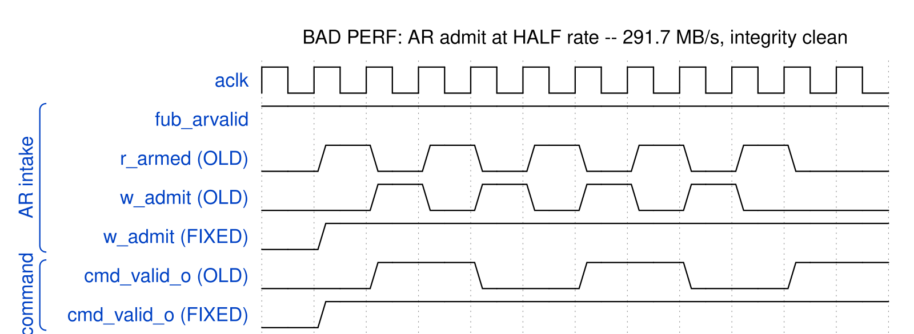
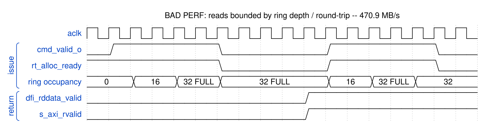
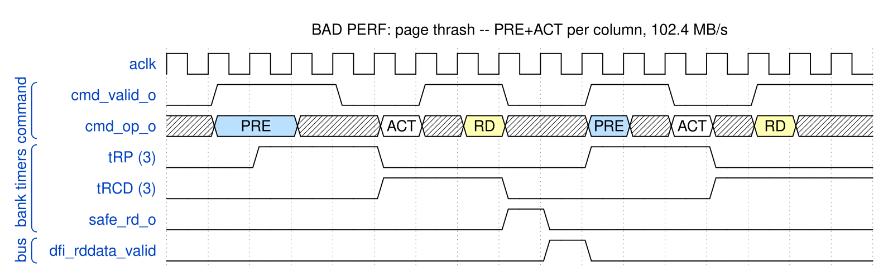
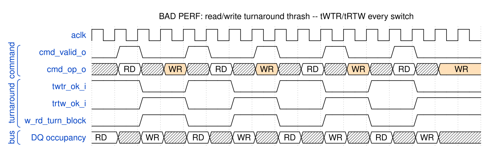
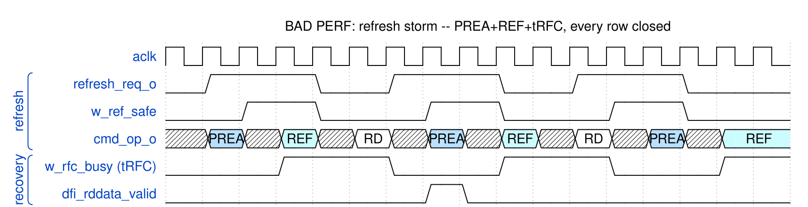
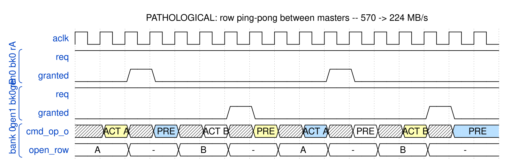
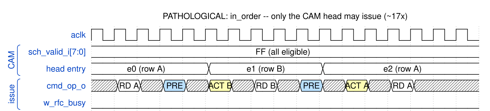
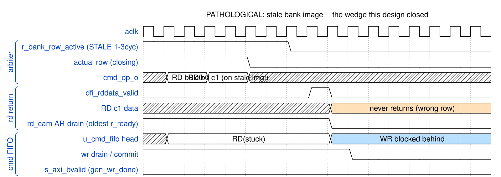
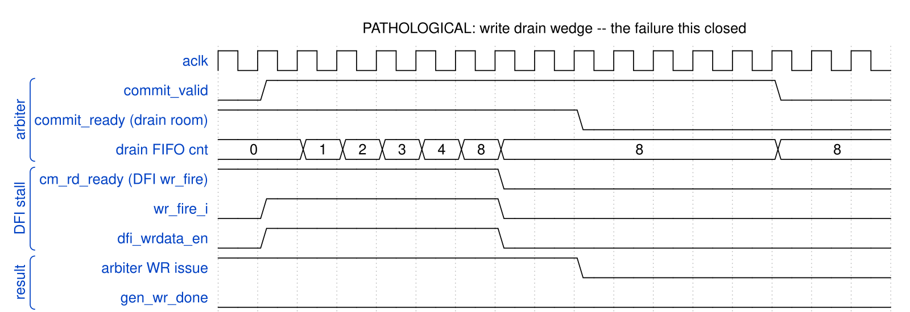

# Performance Pathologies

A specification made only of ideals cannot be used to recognise a bad capture.
These are the shapes that mean something is wrong, each one measured on this
board and captioned with the number it produced, so an ILA trace can be matched
against it by eye.

They divide into two kinds, and the distinction matters more than it sounds.
**Bad performance is correct**: every byte is right, every transaction
completes, and the only symptom is the shape. That is the class that ships,
because nothing fails. **Pathological** shapes are the ones where the design is
wedged or about to be.

## Bad performance -- correct, just slow

BAD PERF -- read admit at HALF rate. The arm bit was cleared by its own admit and could only re-set the next cycle, so one sub-command (= one DRAM burst = one column here) admitted every TWO cycles. Ceiling 0.5 x 8 B x 75 MHz = 300 MB/s; measured 291.7 against 570 for writes. Integrity was perfect throughout -- this shape is the ONLY symptom.

BAD PERF -- reads bounded by the RETURN RING, not by tCCD. Tickets allocate at admit and free only when the beat drains ~49 cycles later, so the sustained rate is DEPTH/latency: 32/49 = 0.78 col/cycle = 470.9 MB/s, which is exactly what the board measured at depth 32. Issue goes idle in bursts (alloc_ready low) even though every DRAM timer is clear. Depth 64 -> 571.3 MB/s.

BAD PERF -- page thrash (col_major). Every access is a different row in the SAME bank, so each column costs PRE + tRP + ACT + tRCD before it can issue: ~8 cycles of overhead per 8 bytes. Board: 102.4 MB/s read at AxLEN 4 against 571.3 for row_major -- a 5.6x penalty with identical DRAM and identical controller settings. The fix is the ADDRESS MAP, not the controller.

BAD PERF -- read/write turnaround thrash. Switching direction every column pays tWTR or tRTW each time and the DQ bus idles in the gap. This is the workload a global reorder window exists to fix: pumice batches same-direction columns and sustains 570.1 MB/s with both directions live, where LiteDRAM's per-bank round-robin pays the turnaround and reaches 285.6.

BAD PERF -- refresh storm. With tREFI cranked down, every refresh costs PREA + REF + tRFC and closes every open row, so the next access is a guaranteed page miss too. w_rfc_busy blocks ACT and REF alike. Board sweep: fast_refresh vs slow_refresh is the axis that isolates this; the cost is roughly tRFC/tREFI of the bus plus the re-activation of every row it closed.

## Pathological

PATHOLOGICAL -- row ping-pong between masters. Two generators on different ROWS of the same banks force a PRE+ACT pair between every pair of columns; the row buffer never survives a grant. Measured accidentally 2026-09-10: spacing two readers a device/4 region apart put them in the same banks and collapsed row_major from 570 to 224 MB/s. Place concurrent masters in NEIGHBOURING banks, not distant rows.

PATHOLOGICAL -- in_order (SCHED_POLICY.order_mode=1). Every entry is eligible and several are page hits, but only the HEAD may issue, so a row-interleaved stream pays PRE+ACT between consecutive columns while the hit sits two entries back. This is the cost of the mode, not a defect: it exists to make ordering observable. Roughly 17x on the board -- use it to prove reordering is what is buying the bandwidth, never in production.

CURRENT FAILURE (mask relaxed, no forward-state): 2nd same-bank RD classified on STALE row image -> lands on closing row -> never returns -> in-order AR-drain wedges -> stuck RD head-of-line-blocks WRs in the shared cmd FIFO -> write 'wedges first'. Reference only.

CURRENT WEDGE (hypothesis, to confirm by waveform): same-bank WR pipelining fills the drain FIFO (8); cm_rd_ready (DFI accepting writes) stalls -> commit_ready=0 -> arbiter WR stops -> gen_wr_done never asserts. MEASURE which CM_RD_STALL candidate holds wr_fire off (see kmap sheet 2).

## How to use these

Take the board's own numbers first (`build-perf/host/pumice_master.py --char`),
then match the shape. The bandwidth alone rarely says which of these you have:
the admit gate, the ring bound and a refresh storm all present as "reads are
slow and the data is fine", and they are told apart by *where* the idle cycles
sit -- at the intake, at the ticket allocator, or behind a tRFC counter.

The last two diagrams are historical. They are the failure chains this design
closed, kept because recognising them is still the fastest way to rule them out.
