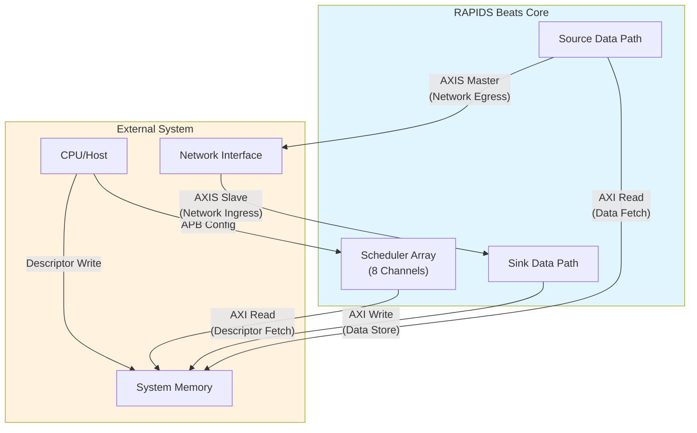

# Product Overview

## Introduction

RAPIDS Beats is a high-performance network-to-memory accelerator designed for descriptor-based data movement operations. It bridges network interfaces (AXI-Stream) with system memory (AXI4), enabling efficient DMA transfers without CPU intervention.

The "Beats" architecture represents Phase 1 of the RAPIDS family, optimized for simplicity and throughput in streaming applications.

## System Context

**Source:** [01_system_context.mmd](../assets/mermaid/01_system_context.mmd)

## Target Applications

| Application | Description | Key Requirements |
|-------------|-------------|------------------|
| **Network Offload** | Receive packets from network, store to memory | Low latency, high throughput |
| **Scatter-Gather DMA** | Multi-descriptor data movement | Descriptor chaining |
| **Streaming Accelerator** | Front-end for compute engines | Continuous data flow |
| **Protocol Processing** | Header/payload separation | Multi-channel isolation |

: Target Applications

## Architecture Highlights

### Phase 1 "Beats" Simplifications

The Beats architecture prioritizes simplicity over feature completeness:

| Feature | Beats (Phase 1) | Future Phases |
|---------|-----------------|---------------|
| **Transfer Unit** | Full beats only | Chunk-level alignment |
| **Flow Control** | Backpressure-based | Credit management |
| **Address Alignment** | Pre-aligned required | Hardware alignment fixup |
| **Network Interface** | Direct AXIS | Protocol conversion |

: Phase 1 Simplifications

### Key Capabilities

1. **8 Independent Channels** - Concurrent transfers with dedicated resources
2. **Descriptor Chaining** - Automatic next-descriptor fetch
3. **Dual Data Paths** - Simultaneous sink (write) and source (read)
4. **Monitor Integration** - Real-time event reporting via MonBus
5. **Error Detection** - Address range checking, AXI error propagation
