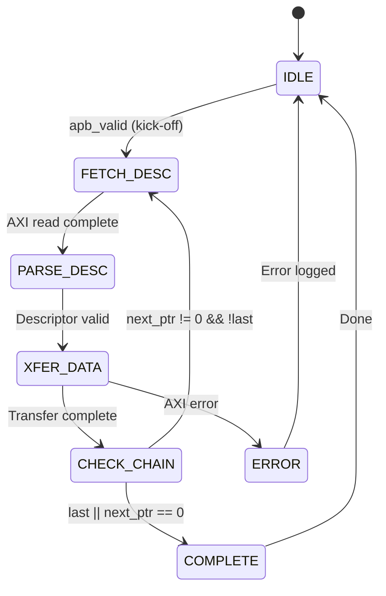

# Key Features

## Feature Summary

### Multi-Channel Architecture

- **8 Independent Channels** with dedicated schedulers
- **Per-Channel State Machines** for concurrent operation
- **Shared AXI Infrastructure** with arbitrated access
- **Channel Isolation** prevents cross-channel interference

### Descriptor-Based Control

- **256-bit Descriptor Format** with all transfer parameters
- **Automatic Chaining** follows next_descriptor_ptr links
- **Last Descriptor Flag** terminates chain processing
- **IRQ Generation** via gen_irq descriptor flag

### High-Performance Data Paths

| Path | Direction | Bandwidth | Features |
|------|-----------|-----------|----------|
| **Sink** | Network to Memory | 512-bit @ clock | SRAM buffering, AXI burst writes |
| **Source** | Memory to Network | 512-bit @ clock | AXI burst reads, SRAM buffering |

: Data Path Summary

### Monitoring and Debug

- **64-bit MonBus Packets** for all significant events
- **State Transition Reports** track FSM activity
- **Error Event Codes** for fault diagnosis
- **Performance Metrics** for throughput analysis

## Feature Details

### Descriptor Processing

**Source:** [02_descriptor_flow.mmd](../assets/mermaid/02_descriptor_flow.mmd)

### SRAM Buffering

Each data path includes dedicated SRAM buffering:

| Parameter | Default | Range | Description |
|-----------|---------|-------|-------------|
| SRAM_DEPTH | 512 | 64-4096 | Entries per channel |
| Data Width | 512 | Fixed | Bits per entry |
| Total Size | 32KB | 4KB-256KB | Per data path |

: SRAM Buffer Parameters

**Buffer Operation:**

- **Sink Path:** Fill from AXIS, drain to AXI write engine
- **Source Path:** Fill from AXI read engine, drain to AXIS
- **Flow Control:** Backpressure when buffer full/empty

### AXI Burst Optimization

RAPIDS optimizes AXI transactions for maximum bandwidth:

| Feature | Implementation |
|---------|----------------|
| **Burst Length** | Up to 256 beats (AXI4 max) |
| **Outstanding Transactions** | Configurable (default 8) |
| **Address Alignment** | 64-byte aligned (beat size) |
| **4KB Boundary** | Automatic burst splitting |

: AXI Optimization Features

### Error Handling

| Error Type | Detection | Response |
|------------|-----------|----------|
| **Address Range** | Pre-fetch validation | Descriptor rejected |
| **AXI SLVERR** | Response check | Transfer aborted |
| **AXI DECERR** | Response check | Transfer aborted |
| **Timeout** | Watchdog timer | Channel reset |

: Error Handling Summary
