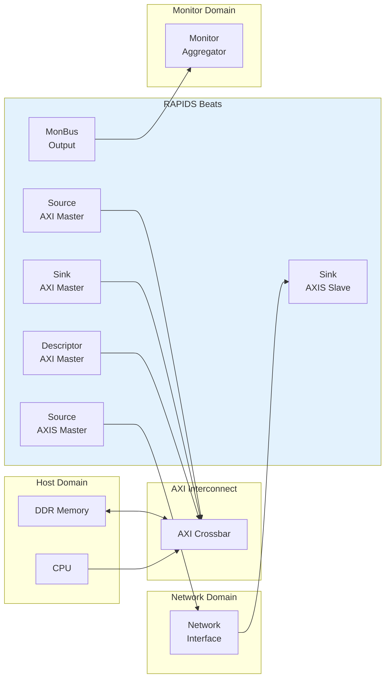

# System Context

## Integration Overview

RAPIDS Beats integrates into a system as a DMA engine bridging network interfaces and system memory. This section describes the external connections and system-level requirements.

## System Block Diagram

**Source:** [03_system_integration.mmd](../assets/mermaid/03_system_integration.mmd)

## Interface Connections

### Memory Interface

RAPIDS requires three AXI4 master ports connected to system memory:

| Port | Access Pattern | Typical Bandwidth |
|------|----------------|-------------------|
| **Descriptor AXI** | Random read (256-bit) | Low (<100 MB/s) |
| **Sink AXI** | Sequential write (512-bit) | High (up to interface max) |
| **Source AXI** | Sequential read (512-bit) | High (up to interface max) |

: AXI Memory Interface Requirements

**Interconnect Requirements:**

- All three ports MAY share a single physical AXI port with arbitration
- Descriptor port has lowest bandwidth requirement
- Sink and Source ports should have balanced bandwidth allocation

### Network Interface

RAPIDS uses standard AXI-Stream for network connectivity:

| Interface | Role | Signals |
|-----------|------|---------|
| **Sink AXIS** | Receives data from network | TDATA, TVALID, TREADY, TLAST |
| **Source AXIS** | Sends data to network | TDATA, TVALID, TREADY, TLAST |

: AXIS Network Interface

**Protocol Notes:**

- TKEEP/TSTRB supported for partial beat handling
- TID/TDEST may be used for channel routing (optional)
- TUSER available for sideband information

### Configuration Interface

Software configures RAPIDS through register writes:

| Method | Interface | Usage |
|--------|-----------|-------|
| **Direct Write** | Memory-mapped | Register configuration |
| **Descriptor Kick** | APB-style | Start descriptor processing |

: Configuration Methods

## Clock and Reset

### Clock Domains

| Clock | Frequency | Usage |
|-------|-----------|-------|
| `aclk` | 100-500 MHz | All RAPIDS logic |

: Clock Domains

**Note:** RAPIDS Beats uses a single clock domain. CDC (clock domain crossing) to different frequency domains must be handled externally.

### Reset Requirements

| Signal | Type | Description |
|--------|------|-------------|
| `aresetn` | Active-low | Async assert, sync deassert |

: Reset Signals

**Reset Sequence:**

1. Assert `aresetn` low for minimum 4 clock cycles
2. Ensure all AXI interfaces are idle before reset
3. Release reset synchronously to `aclk` rising edge
4. Wait 16 clock cycles before initiating transfers

## Power Considerations

### Clock Gating

RAPIDS supports optional clock gating for power reduction:

- **Idle Detection:** Automatic when no transfers pending
- **Per-Channel Gating:** Individual channels can be clock-gated
- **External Control:** `cfg_clock_enable` override available

### Power States

| State | Description | Exit Latency |
|-------|-------------|--------------|
| **Active** | Normal operation | 0 cycles |
| **Idle** | No pending transfers | 1 cycle |
| **Gated** | Clock disabled | 4 cycles |

: Power States
