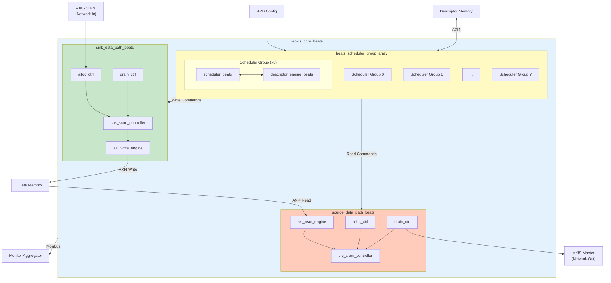

# Block Diagram

## Top-Level Architecture


**Source:** [04_block_diagram.mmd](../assets/mermaid/04_block_diagram.mmd)



## Component Summary

### Scheduler Group Array

The scheduler group array manages 8 independent channels:

| Component | Instance Count | Purpose |
|-----------|----------------|---------|
| `scheduler_beats` | 8 | Transfer coordination per channel |
| `descriptor_engine_beats` | 8 | Descriptor fetch and parse |
| Descriptor AXI Arbiter | 1 | Shared AXI4 for descriptor fetch |

: Scheduler Array Components

### Sink Data Path

Network-to-memory data flow:

| Component | Purpose |
|-----------|---------|
| `snk_sram_controller_beats` | Multi-channel SRAM management |
| `axi_write_engine_beats` | AXI4 burst write generation |
| `alloc_ctrl_beats` | Space allocation tracking |
| `drain_ctrl_beats` | Data availability tracking |

: Sink Path Components

### Source Data Path

Memory-to-network data flow:

| Component | Purpose |
|-----------|---------|
| `axi_read_engine_beats` | AXI4 burst read generation |
| `src_sram_controller_beats` | Multi-channel SRAM management |
| `alloc_ctrl_beats` | Space allocation tracking |
| `drain_ctrl_beats` | Data availability tracking |

: Source Path Components

## Hierarchy

```
rapids_core_beats
├── beats_scheduler_group_array
│   ├── beats_scheduler_group [0]
│   │   ├── scheduler_beats
│   │   └── descriptor_engine_beats
│   ├── beats_scheduler_group [1..6]
│   │   └── ...
│   └── beats_scheduler_group [7]
│       └── ...
├── sink_data_path_beats
│   ├── snk_sram_controller_beats
│   │   └── snk_sram_controller_unit_beats [0..7]
│   ├── axi_write_engine_beats
│   ├── alloc_ctrl_beats
│   └── drain_ctrl_beats
└── source_data_path_beats
    ├── axi_read_engine_beats
    ├── src_sram_controller_beats
    │   └── src_sram_controller_unit_beats [0..7]
    ├── alloc_ctrl_beats
    └── drain_ctrl_beats
```

## Internal Buses

| Bus | Width | Description |
|-----|-------|-------------|
| Descriptor Bus | 256-bit | Parsed descriptor to scheduler |
| Scheduler Command | Variable | Transfer parameters to data paths |
| SRAM Data | 512-bit | Data to/from SRAM buffers |
| MonBus | 64-bit | Monitor packets (aggregated) |

: Internal Bus Summary
