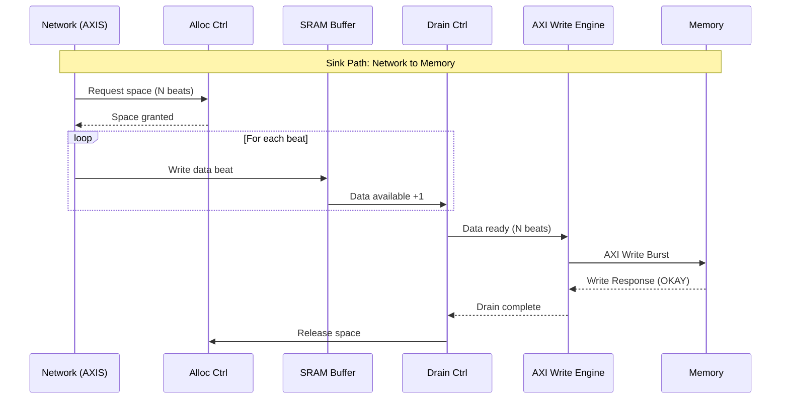
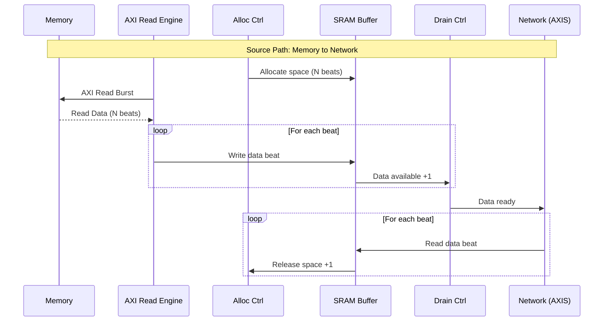

# Data Flow

## Overview

RAPIDS Beats implements two independent data paths that can operate concurrently:

1. **Sink Path:** Network to Memory (AXIS Slave -> AXI Write)
2. **Source Path:** Memory to Network (AXI Read -> AXIS Master)

## Sink Path Data Flow


**Source:** [05_sink_flow.mmd](../assets/mermaid/05_sink_flow.mmd)



### Sink Path Timing


**Source:** [sink_path_timing.json](../assets/wavedrom/sink_path_timing.json)

```wavedrom
{
  "signal": [
    {"name": "clk", "wave": "p.........|........."},
    {},
    ["Network Input",
      {"name": "s_axis_tvalid", "wave": "0.1...1...|0........"},
      {"name": "s_axis_tready", "wave": "1.........|........."},
      {"name": "s_axis_tdata", "wave": "x.=...=...|x........", "data": ["D0","D1-D3"]},
      {"name": "s_axis_tlast", "wave": "0.....1...|0........"}
    ],
    {},
    ["SRAM Buffer",
      {"name": "sram_wr_en", "wave": "0.1...1...|0........"},
      {"name": "sram_wr_addr", "wave": "x.=...=...|x........", "data": ["0","1-3"]},
      {"name": "data_avail", "wave": "=.=.=.=.=.|=........", "data": ["0","1","2","3","4","4"]}
    ],
    {},
    ["AXI Write",
      {"name": "m_axi_awvalid", "wave": "0.........|1.0......"},
      {"name": "m_axi_awaddr", "wave": "x.........|=.x......", "data": ["ADDR"]},
      {"name": "m_axi_awlen", "wave": "x.........|=.x......", "data": ["3"]},
      {"name": "m_axi_wvalid", "wave": "0.........|..1111.0."},
      {"name": "m_axi_wlast", "wave": "0.........|.....1.0."},
      {"name": "m_axi_bvalid", "wave": "0.........|.......1."},
      {"name": "m_axi_bresp", "wave": "x.........|.......=.", "data": ["OK"]}
    ]
  ],
  "config": {"hscale": 1.2},
  "head": {"text": "Sink Path: 4-Beat Transfer"}
}
```

## Source Path Data Flow


**Source:** [06_source_flow.mmd](../assets/mermaid/06_source_flow.mmd)



### Source Path Timing


**Source:** [source_path_timing.json](../assets/wavedrom/source_path_timing.json)

```wavedrom
{
  "signal": [
    {"name": "clk", "wave": "p.........|........."},
    {},
    ["AXI Read",
      {"name": "m_axi_arvalid", "wave": "0.1.0.....|........."},
      {"name": "m_axi_araddr", "wave": "x.=.x.....|.........", "data": ["ADDR"]},
      {"name": "m_axi_arlen", "wave": "x.=.x.....|.........", "data": ["3"]},
      {"name": "m_axi_rvalid", "wave": "0...1111..|0........"},
      {"name": "m_axi_rdata", "wave": "x...====..|x........", "data": ["D0","D1","D2","D3"]},
      {"name": "m_axi_rlast", "wave": "0......1..|0........"}
    ],
    {},
    ["SRAM Buffer",
      {"name": "sram_wr_en", "wave": "0...1111..|0........"},
      {"name": "data_avail", "wave": "=...=.=.=.|=........", "data": ["0","1","2","3","4"]}
    ],
    {},
    ["Network Output",
      {"name": "m_axis_tvalid", "wave": "0.........|1111.0..."},
      {"name": "m_axis_tready", "wave": "1.........|........."},
      {"name": "m_axis_tdata", "wave": "x.........|====.x...", "data": ["D0","D1","D2","D3"]},
      {"name": "m_axis_tlast", "wave": "0.........|...1.0..."}
    ]
  ],
  "config": {"hscale": 1.2},
  "head": {"text": "Source Path: 4-Beat Transfer"}
}
```

## Concurrent Operation

Both data paths operate independently and can run simultaneously:

```mermaid
gantt
    title Concurrent Sink and Source Transfers
    dateFormat X
    axisFormat %s

    section Sink Path
    Receive from Network    :sink1, 0, 4
    Buffer in SRAM          :sink2, 1, 5
    Write to Memory         :sink3, 5, 9

    section Source Path
    Read from Memory        :src1, 2, 6
    Buffer in SRAM          :src2, 3, 7
    Send to Network         :src3, 7, 11
```



### Deadlock Prevention

RAPIDS prevents deadlock through independent resource allocation:

| Resource | Sink Path | Source Path | Shared |
|----------|-----------|-------------|--------|
| SRAM Buffer | Dedicated | Dedicated | No |
| AXI Port | Write only | Read only | No |
| Scheduler | Per-channel | Per-channel | No |

: Resource Isolation
