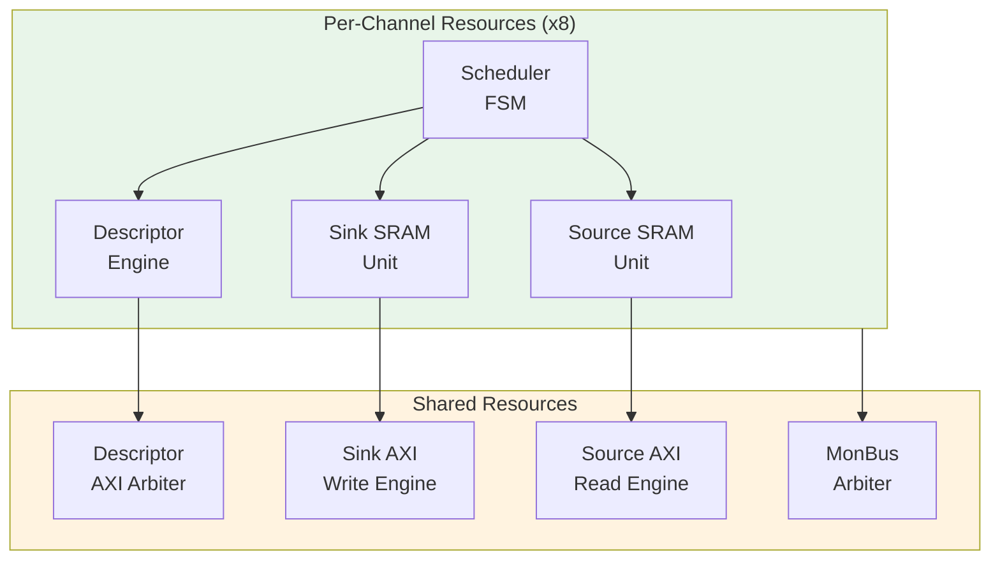
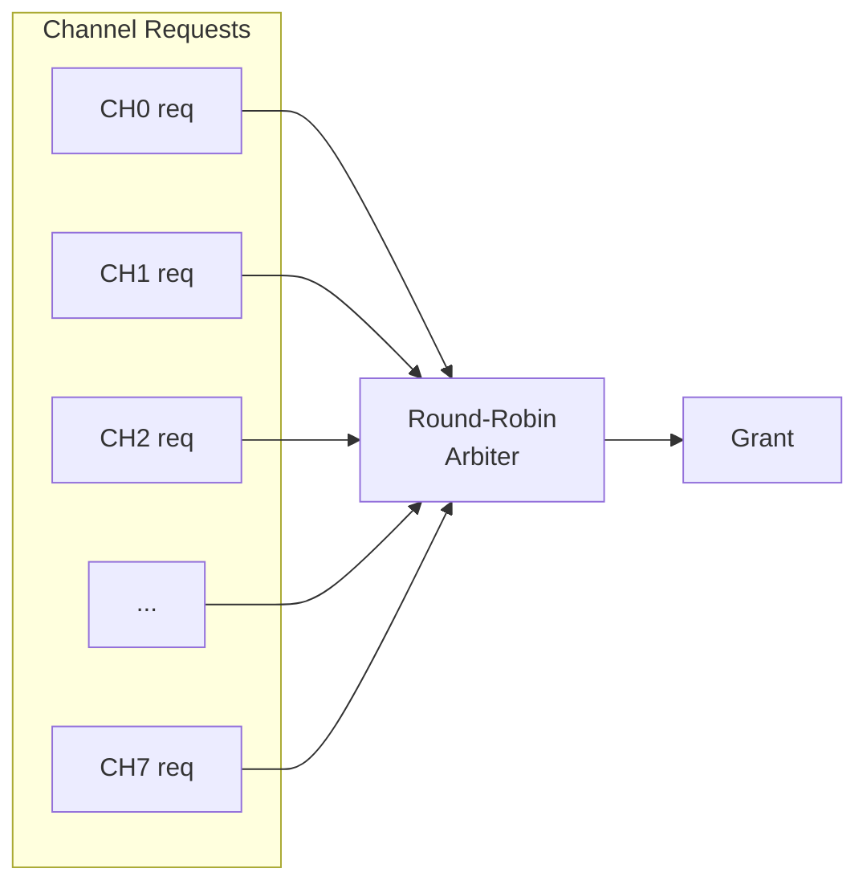
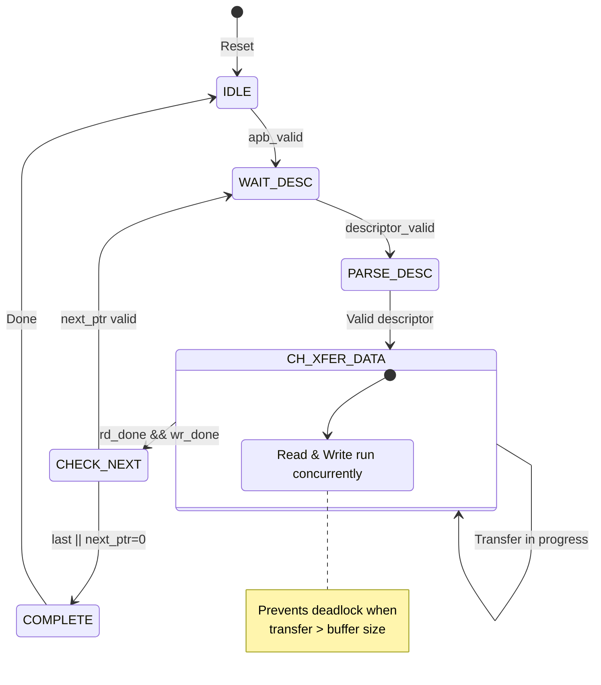

# Channel Architecture

## Multi-Channel Design

RAPIDS Beats supports 8 independent DMA channels, each with dedicated resources for concurrent operation.

## Channel Resource Allocation


**Source:** [07_channel_arch.mmd](../assets/mermaid/07_channel_arch.mmd)



## Per-Channel Resources

Each channel has dedicated:

| Resource | Description | Size/Capacity |
|----------|-------------|---------------|
| **Scheduler** | Transfer coordination FSM | 1 instance |
| **Descriptor Engine** | Descriptor fetch/parse | 8-deep FIFO |
| **Sink SRAM Unit** | Sink buffer partition | SRAM_DEPTH/8 entries |
| **Source SRAM Unit** | Source buffer partition | SRAM_DEPTH/8 entries |
| **Configuration Registers** | Per-channel config | ~16 registers |

: Per-Channel Resources

## Shared Resources

Resources shared across all channels:

| Resource | Arbitration | Max Outstanding |
|----------|-------------|-----------------|
| **Descriptor AXI** | Round-robin | 8 (1 per channel) |
| **Sink AXI Write** | Round-robin | 8 configurable |
| **Source AXI Read** | Round-robin | 8 configurable |
| **MonBus Output** | Priority | 1 (serialized) |

: Shared Resources

## Channel Scheduling

### Arbitration Policy



**Arbitration Timing:**


**Source:** [channel_arbitration.json](../assets/wavedrom/channel_arbitration.json)

```wavedrom
{
  "signal": [
    {"name": "clk", "wave": "p.........."},
    {},
    {"name": "ch0_req", "wave": "0.1........"},
    {"name": "ch1_req", "wave": "0..1......."},
    {"name": "ch2_req", "wave": "0...1......"},
    {},
    {"name": "grant", "wave": "x.0.1.2....", "data": ["CH0","CH1","CH2"]},
    {"name": "grant_valid", "wave": "0.1........"}
  ],
  "config": {"hscale": 1.5},
  "head": {"text": "Round-Robin Channel Arbitration"}
}
```

## Channel State Machine

Each channel scheduler follows this state machine:


**Source:** [08_channel_fsm.mmd](../assets/mermaid/08_channel_fsm.mmd)



### Channel State Timing


**Source:** [channel_state_timing.json](../assets/wavedrom/channel_state_timing.json)

```wavedrom
{
  "signal": [
    {"name": "clk", "wave": "p..............|..."},
    {},
    {"name": "apb_valid", "wave": "01.0...........|..."},
    {"name": "state", "wave": "=.=..=.=.......|=..", "data": ["IDLE","WAIT","PARSE","XFER","COMPLETE"]},
    {},
    {"name": "descriptor_valid", "wave": "0..1.0.........|..."},
    {"name": "sched_rd_valid", "wave": "0.....1........|0.."},
    {"name": "sched_wr_valid", "wave": "0.....1........|0.."},
    {},
    {"name": "sched_rd_done", "wave": "0..............|1.0"},
    {"name": "sched_wr_done", "wave": "0..............1|..0"},
    {"name": "channel_idle", "wave": "1..0...........|..1"}
  ],
  "config": {"hscale": 1},
  "head": {"text": "Single Descriptor Transfer Sequence"}
}
```

## Channel Isolation

Channels are isolated to prevent interference:

| Isolation Type | Implementation |
|----------------|----------------|
| **State Isolation** | Separate FSM per channel |
| **Buffer Isolation** | Partitioned SRAM per channel |
| **Error Isolation** | Per-channel error flags |
| **Reset Isolation** | Per-channel soft reset |

: Channel Isolation Features

### Per-Channel Error Handling

Each channel maintains independent error state:

```wavedrom
{
  "signal": [
    {"name": "clk", "wave": "p........"},
    {},
    {"name": "ch0_error", "wave": "0........"},
    {"name": "ch1_error", "wave": "0...1...."},
    {"name": "ch2_error", "wave": "0........"},
    {},
    {"name": "ch1_state", "wave": "=...=....", "data": ["XFER","ERROR"]},
    {"name": "ch0_state", "wave": "=........", "data": ["XFER"]},
    {"name": "ch2_state", "wave": "=........", "data": ["IDLE"]}
  ],
  "config": {"hscale": 1.5},
  "head": {"text": "Channel Error Isolation"}
}
```

Channel 1 error does not affect Channel 0 or Channel 2 operation.
