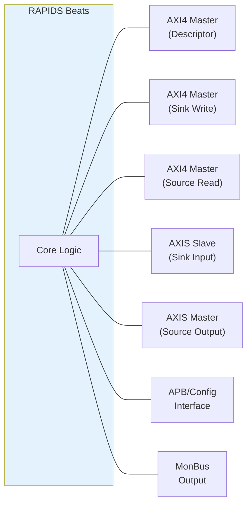

# Interface Summary

## External Interface Overview

RAPIDS Beats exposes the following external interfaces:

**Source:** [09_interface_overview.mmd](../assets/mermaid/09_interface_overview.mmd)

## Interface Port Summary

| Interface | Type | Direction | Data Width | Address Width |
|-----------|------|-----------|------------|---------------|
| Descriptor AXI | AXI4 Master | Read | 256-bit | 64-bit |
| Sink AXI | AXI4 Master | Write | 512-bit | 64-bit |
| Source AXI | AXI4 Master | Read | 512-bit | 64-bit |
| Sink AXIS | AXIS Slave | Input | 512-bit | - |
| Source AXIS | AXIS Master | Output | 512-bit | - |
| APB Config | APB-like | Input | 32-bit | 12-bit |
| MonBus | Custom | Output | 64-bit | - |

: External Interface Summary

## Clock and Reset

All interfaces operate in the same clock domain:

| Signal | Type | Description |
|--------|------|-------------|
| `aclk` | input | System clock (100-500 MHz typical) |
| `aresetn` | input | Active-low reset (async assert, sync deassert) |

: Clock and Reset Signals

## Interface Feature Matrix

| Feature | Desc AXI | Sink AXI | Src AXI | Sink AXIS | Src AXIS |
|---------|----------|----------|---------|-----------|----------|
| **Protocol** | AXI4 | AXI4 | AXI4 | AXIS | AXIS |
| **Direction** | Read | Write | Read | Slave | Master |
| **Burst Support** | INCR | INCR | INCR | N/A | N/A |
| **Max Burst** | 1 | 256 | 256 | N/A | N/A |
| **Outstanding** | 8 | 8 | 8 | N/A | N/A |
| **ID Width** | 8-bit | 8-bit | 8-bit | Optional | Optional |

: Interface Feature Matrix

## Signal Count Summary

| Interface | Input Signals | Output Signals | Total |
|-----------|---------------|----------------|-------|
| Descriptor AXI | ~20 | ~30 | ~50 |
| Sink AXI | ~15 | ~40 | ~55 |
| Source AXI | ~25 | ~25 | ~50 |
| Sink AXIS | ~20 | ~5 | ~25 |
| Source AXIS | ~5 | ~20 | ~25 |
| APB Config | ~15 | ~5 | ~20 |
| MonBus | ~2 | ~5 | ~7 |
| **Total** | **~102** | **~130** | **~232** |

: Signal Count Summary

**Note:** Signal counts are approximate and vary with configuration parameters.
