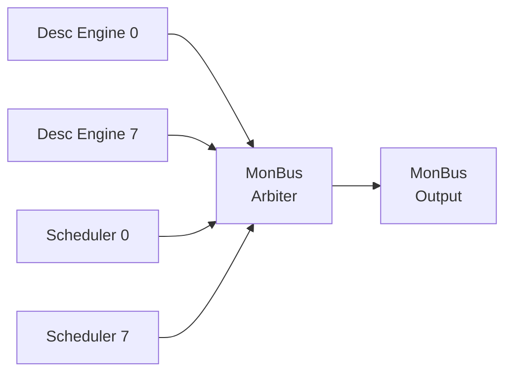

# Monitor Bus Interface

## Overview

RAPIDS Beats outputs a 64-bit Monitor Bus (MonBus) for real-time event reporting. The MonBus provides visibility into:

- State machine transitions
- Descriptor processing events
- Error conditions
- Performance metrics

## MonBus Packet Format

### 64-bit Packet Structure

```
Bit Field          Width   Description
───────────────────────────────────────────────────────
[63:60]            4-bit   packet_type (error, completion, etc.)
[59:57]            3-bit   protocol (CORE for RAPIDS)
[56:53]            4-bit   event_code (specific event)
[52:47]            6-bit   channel_id
[46:43]            4-bit   unit_id (subsystem)
[42:35]            8-bit   agent_id (module)
[34:0]             35-bit  event_data (event-specific)
```

### Signal List

| Signal | Width | Direction | Description |
|--------|-------|-----------|-------------|
| `monbus_pkt_valid` | 1 | output | Packet valid |
| `monbus_pkt_data` | 64 | output | Packet data |
| `monbus_pkt_ready` | 1 | input | Downstream ready |

: MonBus Signals

## Packet Types

| Type | Code | Description |
|------|------|-------------|
| ERROR | 4'h0 | Error event |
| COMPLETION | 4'h1 | Transfer/operation complete |
| THRESHOLD | 4'h2 | Threshold crossed |
| TIMEOUT | 4'h3 | Timeout event |
| PERF | 4'h4 | Performance metric |
| DEBUG | 4'hF | Debug/trace event |

: MonBus Packet Types

## Agent IDs

RAPIDS modules use the following Agent IDs:

| Agent ID | Module | Description |
|----------|--------|-------------|
| 0x10-0x17 | Descriptor Engine | Channels 0-7 |
| 0x30-0x37 | Scheduler | Channels 0-7 |
| 0x40-0x47 | Sink Data Path | Channels 0-7 |
| 0x50-0x57 | Source Data Path | Channels 0-7 |

: RAPIDS Agent IDs

## Event Codes

### Scheduler Events (Agent 0x30-0x37)

| Event Code | Type | Description |
|------------|------|-------------|
| 0x0 | COMPLETION | Descriptor complete |
| 0x1 | COMPLETION | Chain complete |
| 0x2 | ERROR | Timeout |
| 0x3 | ERROR | AXI error |
| 0x4 | DEBUG | State transition |

: Scheduler Event Codes

### Descriptor Engine Events (Agent 0x10-0x17)

| Event Code | Type | Description |
|------------|------|-------------|
| 0x0 | COMPLETION | Descriptor fetched |
| 0x1 | ERROR | Address range error |
| 0x2 | ERROR | AXI read error |
| 0x3 | DEBUG | Fetch started |

: Descriptor Engine Event Codes

## Timing Diagram


**Source:** [monbus_timing.json](../assets/wavedrom/monbus_timing.json)

```wavedrom
{
  "signal": [
    {"name": "clk", "wave": "p.........."},
    {},
    {"name": "monbus_pkt_valid", "wave": "0.1.0.1.0.."},
    {"name": "monbus_pkt_ready", "wave": "1.........."},
    {"name": "monbus_pkt_data", "wave": "x.=.x.=.x..", "data": ["PKT1","PKT2"]},
    {},
    ["Decoded",
      {"name": "packet_type", "wave": "x.=.x.=.x..", "data": ["COMPL","DEBUG"]},
      {"name": "agent_id", "wave": "x.=.x.=.x..", "data": ["0x30","0x30"]},
      {"name": "event_code", "wave": "x.=.x.=.x..", "data": ["0x0","0x4"]}
    ]
  ],
  "config": {"hscale": 1.5},
  "head": {"text": "MonBus Packet Sequence"}
}
```

## Event Data Encoding

### Completion Event Data

```
[34:32] - Reserved
[31:0]  - Transfer length (beats completed)
```

### Error Event Data

```
[34:32] - Error type
[31:16] - Reserved
[15:0]  - Error details
```

### State Transition Event Data

```
[34:32] - Reserved
[31:28] - Previous state
[27:24] - New state
[23:0]  - Timestamp (lower bits)
```

## MonBus Arbitration

Multiple RAPIDS modules generate MonBus packets. Internal arbitration ensures ordered delivery:



### Arbitration Policy

- Round-robin across modules
- No packet loss (backpressure if output blocked)
- Priority boosting for ERROR packets

## Integration Notes

### Downstream Connection

MonBus output typically connects to:

1. **MonBus Aggregator** - Combines multiple sources
2. **AXIL Converter** - Maps to AXI-Lite for CPU access
3. **Debug FIFO** - Buffered access for debug tools

### Packet Rate

| Scenario | Approximate Rate |
|----------|-----------------|
| Idle | 0 packets/cycle |
| Single channel active | ~1 packet/100 cycles |
| All channels active | ~1 packet/20 cycles |
| Error storm | Up to 1 packet/cycle |

: MonBus Packet Rates
