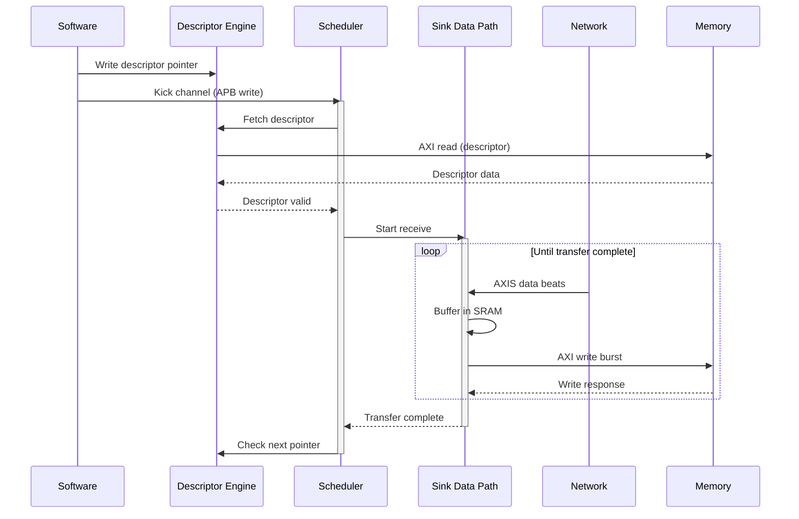
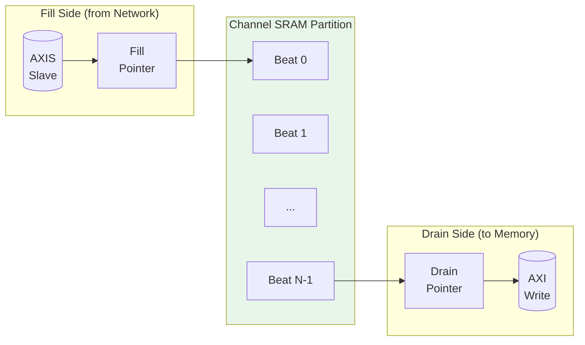
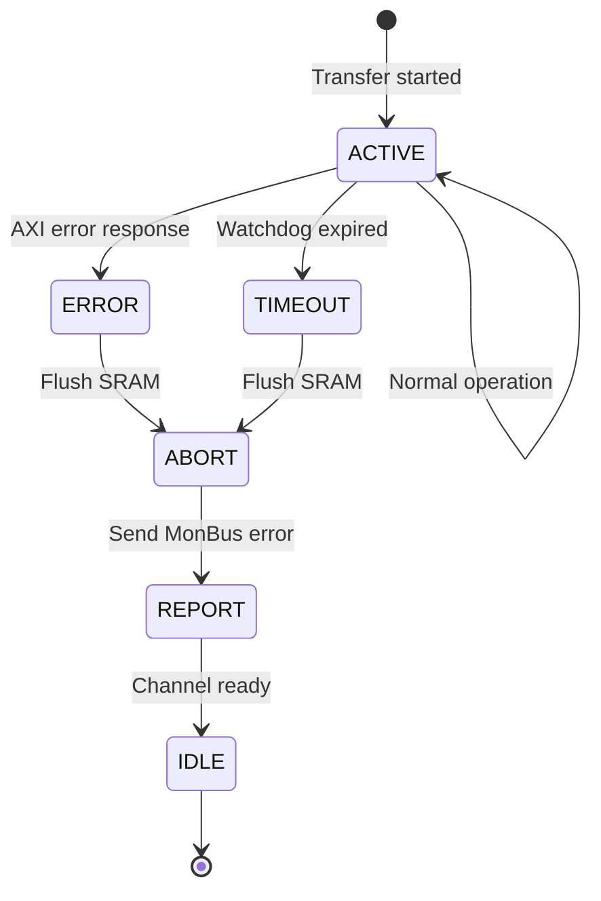

# Use Case: Network to Memory (Sink Path)

## Overview

The Sink Path transfers data from a network interface (AXI-Stream slave) to system memory (AXI4 write master). This is the primary receive data path for network applications.

## Operation Flow


**Source:** [09_sink_flow.mmd](../assets/mermaid/09_sink_flow.mmd)



## Timing Diagram


**Source:** [sink_transfer.json](../assets/wavedrom/sink_transfer.json)

```wavedrom
{
  "signal": [
    {"name": "clk", "wave": "p................|........."},
    {},
    ["Software Trigger",
      {"name": "apb_valid", "wave": "010..............|........."},
      {"name": "apb_channel", "wave": "x=x..............|.........", "data": ["CH0"]}
    ],
    {},
    ["Descriptor Fetch",
      {"name": "desc_fetch_req", "wave": "0.1.0............|........."},
      {"name": "desc_axi_arvalid", "wave": "0..1.0...........|........."},
      {"name": "desc_axi_rvalid", "wave": "0....1.0.........|........."},
      {"name": "desc_valid", "wave": "0.....1.0........|........."}
    ],
    {},
    ["Network Receive",
      {"name": "s_axis_tvalid", "wave": "0......1...1...1.|0........"},
      {"name": "s_axis_tready", "wave": "1................|........."},
      {"name": "s_axis_tdata", "wave": "x......=...=...=.|x........", "data": ["B0","B1","B2"]},
      {"name": "s_axis_tlast", "wave": "0..............1.|0........"}
    ],
    {},
    ["Memory Write",
      {"name": "sink_axi_awvalid", "wave": "0........1.0.....|........."},
      {"name": "sink_axi_wvalid", "wave": "0.........1...1..|0........"},
      {"name": "sink_axi_wlast", "wave": "0.............1..|0........"},
      {"name": "sink_axi_bvalid", "wave": "0................|1.0......"}
    ],
    {},
    ["Completion",
      {"name": "transfer_done", "wave": "0................|..1.0...."},
      {"name": "channel_idle", "wave": "1......0.........|....1...."}
    ]
  ],
  "config": {"hscale": 1},
  "head": {"text": "Sink Path: Network to Memory Transfer"}
}
```

## Buffer Management

### SRAM Buffering Strategy

The sink path uses internal SRAM to decouple network timing from memory timing:



### Flow Control

| Condition | Behavior |
|-----------|----------|
| SRAM full | Backpressure network (TREADY=0) |
| SRAM empty | Pause AXI writes |
| SRAM threshold | Optional early write start |

: Sink Path Flow Control

### Watermark Timing

```wavedrom
{
  "signal": [
    {"name": "clk", "wave": "p.............."},
    {},
    {"name": "sram_fill_level", "wave": "=.=.=.=.=.=.=.=", "data": ["0","1","2","3","4","3","2","1"]},
    {"name": "fill_threshold", "wave": "2..............", "data": ["3"]},
    {},
    {"name": "s_axis_tvalid", "wave": "0.1.1.1.1.0...."},
    {"name": "s_axis_tready", "wave": "1.....0...1...."},
    {},
    {"name": "axi_write_active", "wave": "0.....1.....0.."}
  ],
  "config": {"hscale": 1.5},
  "head": {"text": "SRAM Watermark Flow Control"}
}
```

## Performance Considerations

### Throughput

| Factor | Impact |
|--------|--------|
| Network bandwidth | Upper bound on receive rate |
| Memory bandwidth | Must match or exceed network |
| SRAM depth | Burst absorption capability |
| AXI outstanding | Overlapped write latency hiding |

: Sink Path Throughput Factors

### Latency

| Phase | Typical Cycles |
|-------|----------------|
| Descriptor fetch | 10-50 (memory dependent) |
| First beat to SRAM | 1 |
| SRAM to AXI write | 2-4 |
| AXI write completion | 10-100 (memory dependent) |

: Sink Path Latency Breakdown

## Error Handling

### Error Sources

| Error | Detection | Response |
|-------|-----------|----------|
| AXI write error | BRESP != OKAY | Stop transfer, report via MonBus |
| SRAM overflow | Fill pointer catches drain | Should never occur (TREADY control) |
| Timeout | Watchdog timer | Abort transfer, report error |

: Sink Path Error Handling

### Error Recovery Sequence



