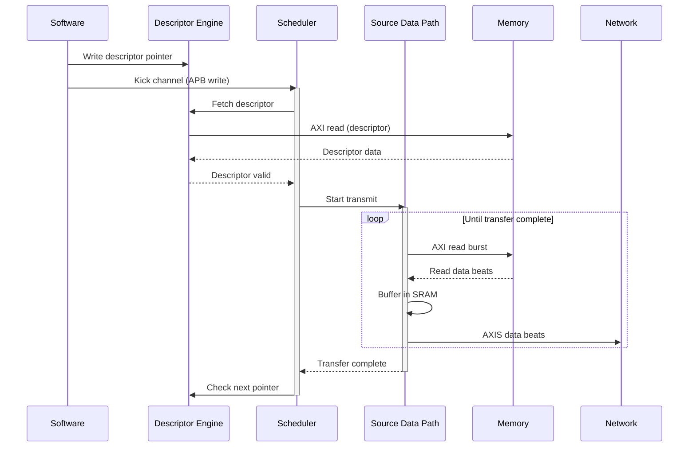
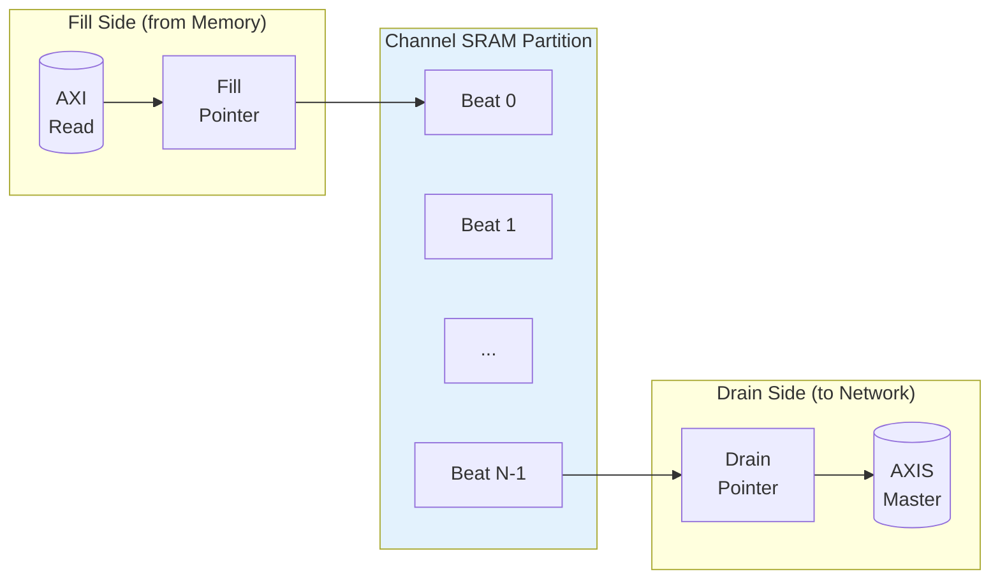

# Use Case: Memory to Network (Source Path)

## Overview

The Source Path transfers data from system memory (AXI4 read master) to a network interface (AXI-Stream master). This is the primary transmit data path for network applications.

## Operation Flow


**Source:** [10_source_flow.mmd](../assets/mermaid/10_source_flow.mmd)



## Timing Diagram


**Source:** [source_transfer.json](../assets/wavedrom/source_transfer.json)

```wavedrom
{
  "signal": [
    {"name": "clk", "wave": "p................|........."},
    {},
    ["Software Trigger",
      {"name": "apb_valid", "wave": "010..............|........."},
      {"name": "apb_channel", "wave": "x=x..............|.........", "data": ["CH0"]}
    ],
    {},
    ["Descriptor Fetch",
      {"name": "desc_fetch_req", "wave": "0.1.0............|........."},
      {"name": "desc_axi_arvalid", "wave": "0..1.0...........|........."},
      {"name": "desc_axi_rvalid", "wave": "0....1.0.........|........."},
      {"name": "desc_valid", "wave": "0.....1.0........|........."}
    ],
    {},
    ["Memory Read",
      {"name": "src_axi_arvalid", "wave": "0......1.0.......|........."},
      {"name": "src_axi_arready", "wave": "1................|........."},
      {"name": "src_axi_rvalid", "wave": "0........1...1...|0........"},
      {"name": "src_axi_rdata", "wave": "x........=...=...|x........", "data": ["D0","D1"]},
      {"name": "src_axi_rlast", "wave": "0............1...|0........"}
    ],
    {},
    ["Network Transmit",
      {"name": "m_axis_tvalid", "wave": "0..........1...1.|0........"},
      {"name": "m_axis_tready", "wave": "1................|........."},
      {"name": "m_axis_tdata", "wave": "x..........=...=.|x........", "data": ["D0","D1"]},
      {"name": "m_axis_tlast", "wave": "0..............1.|0........"}
    ],
    {},
    ["Completion",
      {"name": "transfer_done", "wave": "0................|1.0......"},
      {"name": "channel_idle", "wave": "1......0.........|..1......"}
    ]
  ],
  "config": {"hscale": 1},
  "head": {"text": "Source Path: Memory to Network Transfer"}
}
```

## Buffer Management

### SRAM Buffering Strategy

The source path uses internal SRAM to prefetch data and maintain network throughput:



### Flow Control

| Condition | Behavior |
|-----------|----------|
| SRAM full | Pause AXI reads |
| SRAM empty | Hold TVALID low |
| Network backpressure | Stop draining SRAM |

: Source Path Flow Control

### Prefetch Strategy

```wavedrom
{
  "signal": [
    {"name": "clk", "wave": "p.............."},
    {},
    {"name": "sram_fill_level", "wave": "=.=.=.=.=.=.=.=", "data": ["0","2","4","6","4","2","4","6"]},
    {"name": "prefetch_threshold", "wave": "2..............", "data": ["4"]},
    {},
    {"name": "axi_read_active", "wave": "0.1.....0.1...."},
    {},
    {"name": "m_axis_tvalid", "wave": "0.....1.....1.."},
    {"name": "m_axis_tready", "wave": "1.............."}
  ],
  "config": {"hscale": 1.5},
  "head": {"text": "Source Path Prefetch Behavior"}
}
```

## Concurrent Operation

### Read-Ahead Pipeline

The source path can issue AXI reads ahead of network consumption:

```wavedrom
{
  "signal": [
    {"name": "clk", "wave": "p...............|......"},
    {},
    ["AXI Read",
      {"name": "arvalid", "wave": "01.01.01.0......|......"},
      {"name": "rvalid", "wave": "0..1..1..1..1..1|0....."},
      {"name": "rdata", "wave": "x..=..=..=..=..=|x.....", "data": ["R0","R1","R2","R3","R4"]}
    ],
    {},
    ["AXIS Transmit",
      {"name": "tvalid", "wave": "0....1..1..1..1.|1.0..."},
      {"name": "tdata", "wave": "x....=..=..=..=.|=.x...", "data": ["R0","R1","R2","R3","R4"]},
      {"name": "tready", "wave": "1...............|......"}
    ],
    {},
    {"name": "sram_level", "wave": "=..=.=.=.=.=.=.=|=.=...", "data": ["0","1","2","2","2","2","2","2","1","0"]}
  ],
  "config": {"hscale": 1},
  "head": {"text": "Overlapped AXI Read and AXIS Transmit"}
}
```

## Performance Considerations

### Throughput

| Factor | Impact |
|--------|--------|
| Memory bandwidth | Upper bound on transmit rate |
| Network acceptance | Must keep pace with reads |
| SRAM depth | Read-ahead capability |
| AXI outstanding | Overlapped read latency hiding |

: Source Path Throughput Factors

### Latency

| Phase | Typical Cycles |
|-------|----------------|
| Descriptor fetch | 10-50 (memory dependent) |
| AXI read issue | 1-2 |
| Memory read latency | 10-100 (memory dependent) |
| SRAM to network | 1-2 |

: Source Path Latency Breakdown

## Error Handling

### Error Sources

| Error | Detection | Response |
|-------|-----------|----------|
| AXI read error | RRESP != OKAY | Stop transfer, report via MonBus |
| Network timeout | Watchdog timer | Abort transfer, report error |
| Address range | Descriptor validation | Reject descriptor |

: Source Path Error Handling

### Backpressure Handling

```wavedrom
{
  "signal": [
    {"name": "clk", "wave": "p.............."},
    {},
    {"name": "m_axis_tvalid", "wave": "0.1............"},
    {"name": "m_axis_tready", "wave": "1.....0...1...."},
    {"name": "m_axis_tdata", "wave": "x.=...=...=....", "data": ["D0","D0","D1"]},
    {},
    {"name": "sram_drain_stall", "wave": "0.....1...0...."},
    {"name": "axi_read_pause", "wave": "0.......1.0...."}
  ],
  "config": {"hscale": 1.5},
  "head": {"text": "Network Backpressure Response"}
}
```

When the network deasserts TREADY:
1. SRAM drain stalls immediately
2. SRAM continues filling until threshold
3. AXI reads pause when SRAM approaches full
4. Resume automatically when TREADY returns

