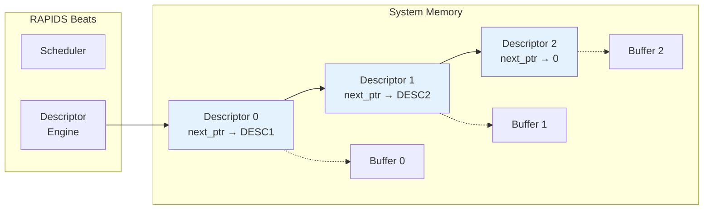
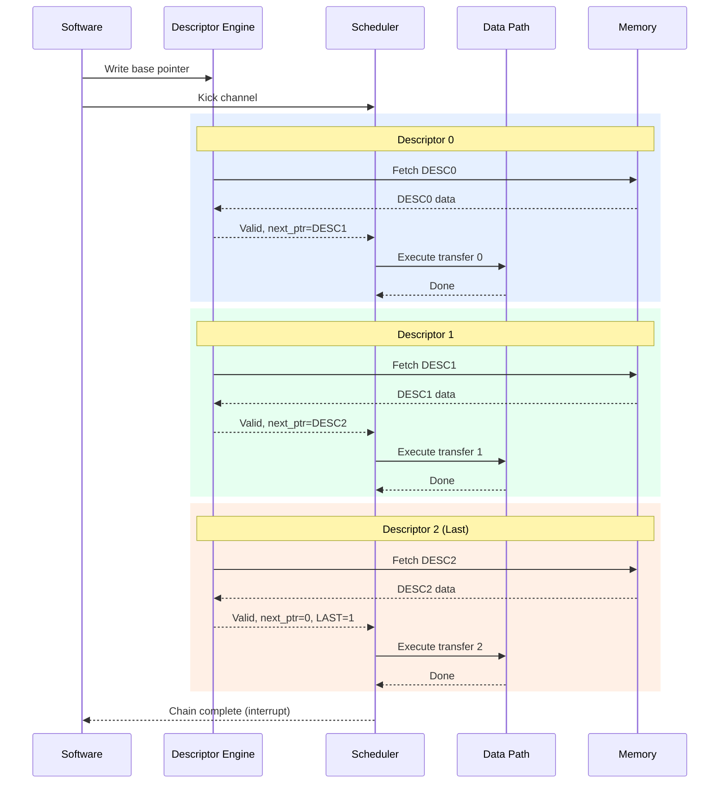
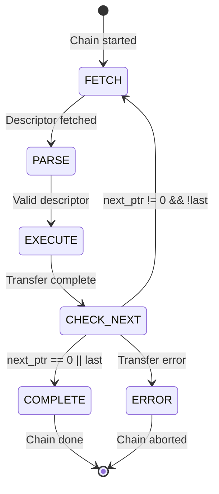
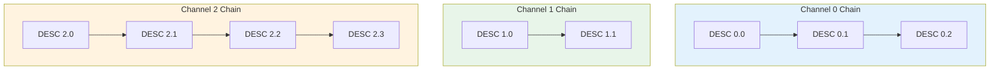

# Use Case: Descriptor Chaining

## Overview

Descriptor chaining enables multiple transfers to execute sequentially without software intervention. Each descriptor contains a pointer to the next descriptor, forming a linked list that RAPIDS processes automatically.

## Chain Structure


**Source:** [11_descriptor_chain.mmd](../assets/mermaid/11_descriptor_chain.mmd)



## Chain Execution Flow



## Timing Diagram


**Source:** [chain_execution.json](../assets/wavedrom/chain_execution.json)

```wavedrom
{
  "signal": [
    {"name": "clk", "wave": "p.........|.........|.........|...."},
    {},
    ["Descriptor 0",
      {"name": "desc_fetch[0]", "wave": "01.0......|..........|..........|...."},
      {"name": "desc_valid[0]", "wave": "0..1.0....|..........|..........|...."},
      {"name": "xfer_active[0]", "wave": "0...1...0.|..........|..........|...."}
    ],
    {},
    ["Descriptor 1",
      {"name": "desc_fetch[1]", "wave": "0.........|1.0.......|..........|...."},
      {"name": "desc_valid[1]", "wave": "0.........|..1.0.....|..........|...."},
      {"name": "xfer_active[1]", "wave": "0.........|...1...0..|..........|...."}
    ],
    {},
    ["Descriptor 2",
      {"name": "desc_fetch[2]", "wave": "0.........|..........|1.0.......|...."},
      {"name": "desc_valid[2]", "wave": "0.........|..........|..1.0.....|...."},
      {"name": "xfer_active[2]", "wave": "0.........|..........|...1...0..|...."},
      {"name": "last_desc", "wave": "0.........|..........|..1.......|0..."}
    ],
    {},
    {"name": "chain_complete", "wave": "0.........|..........|........1.|0..."},
    {"name": "channel_idle", "wave": "1.0.......|..........|..........|.1.."}
  ],
  "config": {"hscale": 1},
  "head": {"text": "Three-Descriptor Chain Execution"}
}
```

## Descriptor Fields for Chaining

### Relevant Fields

| Field | Bits | Description |
|-------|------|-------------|
| `next_ptr` | [191:128] | 64-bit pointer to next descriptor |
| `last` | [255] | Last descriptor in chain flag |
| `irq_en` | [254] | Generate interrupt on completion |

: Chaining-Related Descriptor Fields

### Chain Termination

A chain terminates when ANY of these conditions is true:

1. `next_ptr == 0` (null pointer)
2. `last == 1` (explicit last flag)
3. Error during transfer



## Prefetch Optimization

### Descriptor Prefetching

RAPIDS can prefetch the next descriptor while the current transfer executes:

```wavedrom
{
  "signal": [
    {"name": "clk", "wave": "p.............|.........."},
    {},
    ["Current Descriptor",
      {"name": "xfer_active", "wave": "01........0...|.........."},
      {"name": "xfer_progress", "wave": "x=.=.=.=.=.x..|..........", "data": ["0%","25%","50%","75%","100%"]}
    ],
    {},
    ["Next Descriptor (Prefetch)",
      {"name": "prefetch_en", "wave": "01.0..........|.........."},
      {"name": "prefetch_done", "wave": "0...1.........|.........."},
      {"name": "next_desc_ready", "wave": "0...1.......0.|.........."}
    ],
    {},
    ["Chain Progress",
      {"name": "desc_index", "wave": "=.........=...|..........", "data": ["N","N+1"]},
      {"name": "chain_gap", "wave": "x.........=...|..........", "data": ["0 cycles"]}
    ]
  ],
  "config": {"hscale": 1},
  "head": {"text": "Zero-Gap Descriptor Prefetch"}
}
```

**Benefit:** Zero-cycle gap between chained transfers when prefetch completes before current transfer.

## Multi-Channel Chaining

Each channel maintains independent chains:



Channels execute their chains concurrently and independently.

## Error During Chain

### Error Handling

When an error occurs mid-chain:

```wavedrom
{
  "signal": [
    {"name": "clk", "wave": "p.........|....."},
    {},
    {"name": "desc_index", "wave": "=.=.=.....|.....", "data": ["0","1","2"]},
    {"name": "xfer_active", "wave": "01.01.01..|0...."},
    {},
    {"name": "axi_error", "wave": "0.....1...|0...."},
    {"name": "chain_abort", "wave": "0......1..|0...."},
    {"name": "error_desc_idx", "wave": "x......=..|x....", "data": ["2"]},
    {},
    {"name": "irq_error", "wave": "0.......1.|0...."}
  ],
  "config": {"hscale": 1.5},
  "head": {"text": "Chain Abort on AXI Error"}
}
```

**Error Response:**
1. Current transfer aborts
2. Chain processing stops
3. Error status captures failing descriptor index
4. MonBus reports error event
5. Interrupt generated (if enabled)

### Recovery

Software must:
1. Read error status to identify failing descriptor
2. Fix the issue (descriptor content, memory mapping, etc.)
3. Restart chain from failing descriptor or beginning

