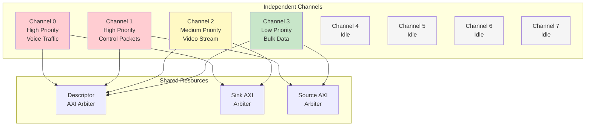
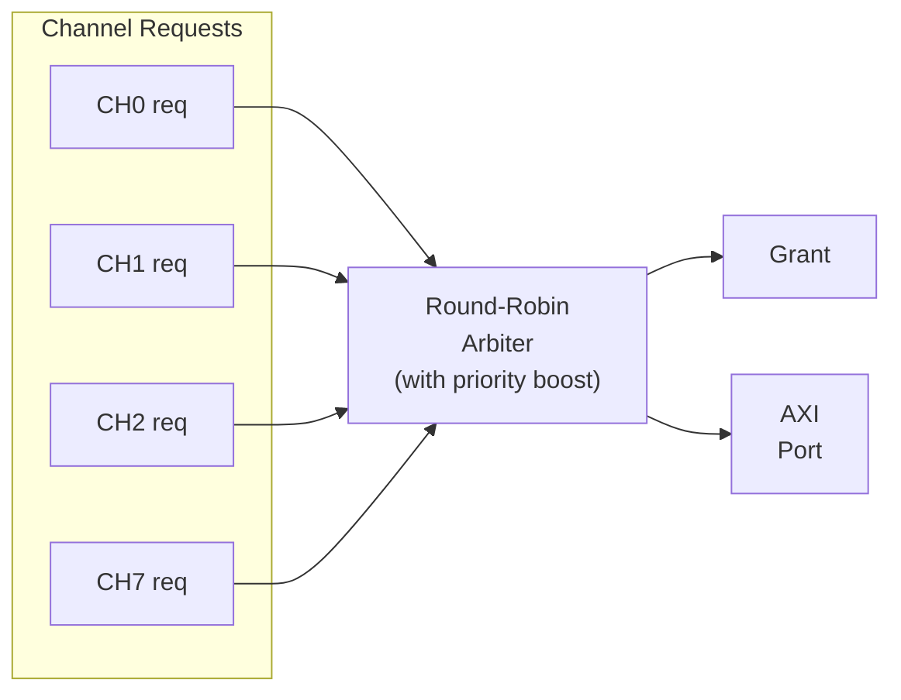
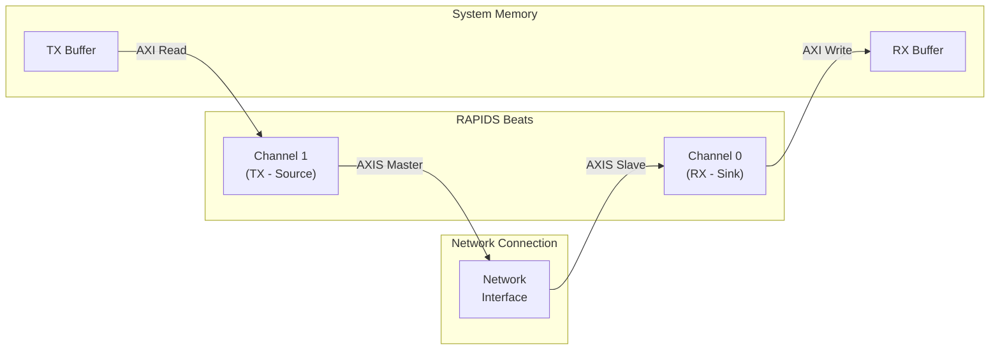
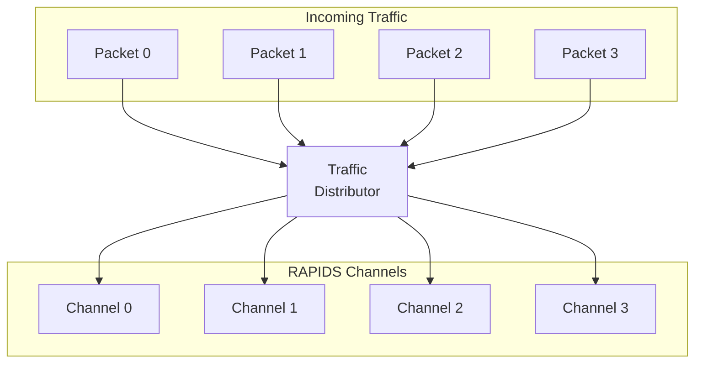

# Use Case: Multi-Channel Operation

## Overview

RAPIDS Beats supports 8 independent DMA channels that can operate concurrently. This enables parallel data transfers for multiple network connections, priority-based scheduling, and efficient resource utilization.

## Channel Independence


**Source:** [12_multi_channel.mmd](../assets/mermaid/12_multi_channel.mmd)



## Concurrent Operation Timing


**Source:** [multi_channel_timing.json](../assets/wavedrom/multi_channel_timing.json)

```wavedrom
{
  "signal": [
    {"name": "clk", "wave": "p................|.........."},
    {},
    ["Channel 0 (Sink)",
      {"name": "ch0_active", "wave": "01..........0....|.........."},
      {"name": "ch0_s_axis_tvalid", "wave": "0.1.1.1.1.1.0....|.........."},
      {"name": "ch0_axi_wvalid", "wave": "0...1.1.1.1...0..|.........."}
    ],
    {},
    ["Channel 1 (Source)",
      {"name": "ch1_active", "wave": "0.1..........0...|.........."},
      {"name": "ch1_axi_rvalid", "wave": "0...1.1.1.1...0..|.........."},
      {"name": "ch1_m_axis_tvalid", "wave": "0.....1.1.1.1..0.|.........."}
    ],
    {},
    ["Channel 2 (Sink)",
      {"name": "ch2_active", "wave": "0...1..........0.|.........."},
      {"name": "ch2_s_axis_tvalid", "wave": "0.....1.1.1.1.1..|0........."},
      {"name": "ch2_axi_wvalid", "wave": "0.......1.1.1.1..|..0......."}
    ],
    {},
    ["Shared AXI Write",
      {"name": "sink_axi_grant", "wave": "=...=.=.=.=.=.=..|=.........", "data": ["--","0","2","0","2","0","2","--"]}
    ]
  ],
  "config": {"hscale": 1},
  "head": {"text": "Three Channels Operating Concurrently"}
}
```

## Resource Arbitration

### Descriptor Port Arbitration

All channels share a single AXI port for descriptor fetches:

```wavedrom
{
  "signal": [
    {"name": "clk", "wave": "p.............."},
    {},
    {"name": "ch0_desc_req", "wave": "01..0.........."},
    {"name": "ch1_desc_req", "wave": "0.1..0........."},
    {"name": "ch2_desc_req", "wave": "0..1..0........"},
    {},
    {"name": "desc_grant", "wave": "x=.=.=.x.......", "data": ["CH0","CH1","CH2"]},
    {"name": "desc_axi_arvalid", "wave": "01.1.1.0......."}
  ],
  "config": {"hscale": 1.5},
  "head": {"text": "Round-Robin Descriptor Port Arbitration"}
}
```

### Sink/Source Arbitration

Data path AXI ports use round-robin arbitration with optional priority:



## Channel Isolation

### Error Isolation

Errors in one channel do not affect other channels:

```wavedrom
{
  "signal": [
    {"name": "clk", "wave": "p.............."},
    {},
    ["Channel 0",
      {"name": "ch0_active", "wave": "1.............."},
      {"name": "ch0_error", "wave": "0.............."},
      {"name": "ch0_state", "wave": "=..............", "data": ["XFER"]}
    ],
    {},
    ["Channel 1 (Error)",
      {"name": "ch1_active", "wave": "1.....0........"},
      {"name": "ch1_error", "wave": "0....1........."},
      {"name": "ch1_state", "wave": "=....=.........", "data": ["XFER","ERROR"]}
    ],
    {},
    ["Channel 2",
      {"name": "ch2_active", "wave": "1.............."},
      {"name": "ch2_error", "wave": "0.............."},
      {"name": "ch2_state", "wave": "=..............", "data": ["XFER"]}
    ]
  ],
  "config": {"hscale": 1.5},
  "head": {"text": "Channel Error Isolation"}
}
```

### Per-Channel Soft Reset

Individual channels can be reset without affecting others:

```wavedrom
{
  "signal": [
    {"name": "clk", "wave": "p.............."},
    {},
    {"name": "ch1_soft_reset", "wave": "0...1..0......."},
    {},
    {"name": "ch0_state", "wave": "=..............", "data": ["XFER"]},
    {"name": "ch1_state", "wave": "=...=..=.......", "data": ["ERROR","RESET","IDLE"]},
    {"name": "ch2_state", "wave": "=..............", "data": ["XFER"]}
  ],
  "config": {"hscale": 1.5},
  "head": {"text": "Per-Channel Soft Reset"}
}
```

## Use Case Examples

### Mixed Traffic Pattern

Typical network application with different traffic types:

| Channel | Traffic Type | Direction | Priority | Notes |
|---------|-------------|-----------|----------|-------|
| 0 | Voice/RTP | Sink | High | Low latency required |
| 1 | Voice/RTP | Source | High | Low latency required |
| 2 | Video | Sink | Medium | High bandwidth |
| 3 | Control | Source | Medium | Small packets |
| 4-7 | Bulk data | Both | Low | Background transfers |

: Mixed Traffic Channel Assignment

### Bidirectional Transfer

Single network connection using paired channels:



### Load Balancing

Multiple channels processing same traffic type:



## Performance Considerations

### Bandwidth Sharing

| Active Channels | Per-Channel BW (% of max) | Notes |
|-----------------|---------------------------|-------|
| 1 | 100% | Full bandwidth available |
| 2 | ~50% each | Round-robin sharing |
| 4 | ~25% each | Fair distribution |
| 8 | ~12.5% each | All channels active |

: Bandwidth Distribution

**Note:** Actual distribution depends on transfer sizes and memory latency.

### Latency Impact

Multi-channel operation adds arbitration latency:

| Scenario | Additional Latency |
|----------|-------------------|
| Single channel | 0 cycles |
| 2 channels contending | 1-2 cycles |
| 8 channels contending | Up to 7 cycles |

: Arbitration Latency

## MonBus Events

Each channel generates independent MonBus events:

```wavedrom
{
  "signal": [
    {"name": "clk", "wave": "p.............."},
    {},
    {"name": "ch0_complete", "wave": "0...1.0........"},
    {"name": "ch2_error", "wave": "0.....1.0......"},
    {"name": "ch1_complete", "wave": "0.......1.0...."},
    {},
    {"name": "monbus_valid", "wave": "0...1.1.1.0...."},
    {"name": "monbus_agent_id", "wave": "x...=.=.=.x....", "data": ["0x30","0x32","0x31"]},
    {"name": "monbus_event", "wave": "x...=.=.=.x....", "data": ["COMPL","ERROR","COMPL"]}
  ],
  "config": {"hscale": 1.5},
  "head": {"text": "Multi-Channel MonBus Events"}
}
```

Events are arbitrated and serialized on the shared MonBus output.

