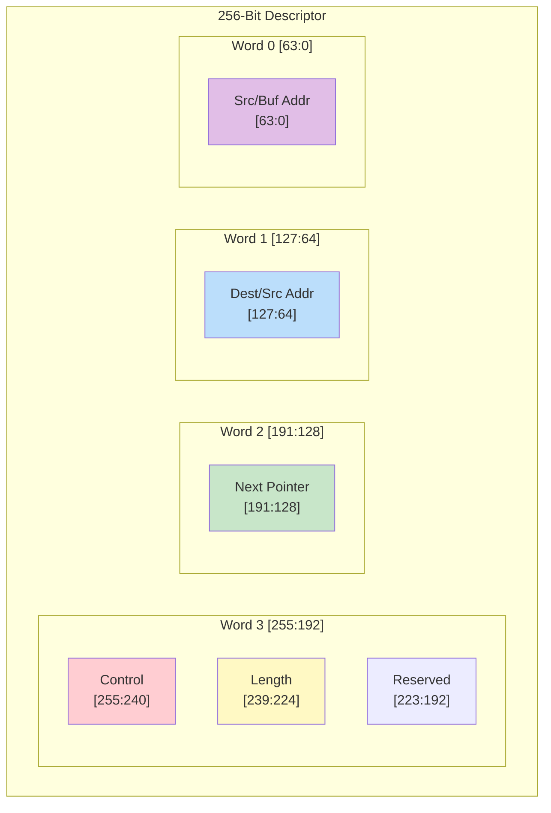

# Descriptor Format

## Overview

RAPIDS Beats uses 256-bit (32-byte) descriptors to define DMA transfers. Descriptors are stored in system memory and fetched by the Descriptor Engine when a channel is kicked.

## Descriptor Layout


**Source:** [13_descriptor_format.mmd](../assets/mermaid/13_descriptor_format.mmd)

### 256-Bit Structure

```
Bit Range    Field Name        Width   Description
────────────────────────────────────────────────────────────────
[255]        last              1       Last descriptor in chain
[254]        irq_en            1       Generate interrupt on completion
[253:252]    reserved          2       Reserved (write 0)
[251:248]    direction         4       Transfer direction
[247:240]    reserved          8       Reserved (write 0)
[239:224]    transfer_length   16      Transfer length in beats
[223:192]    reserved          32      Reserved (write 0)
[191:128]    next_ptr          64      Pointer to next descriptor
[127:64]     dest_addr         64      Destination address (sink) or source address
[63:0]       src_addr          64      Source address (source path) or buffer addr
```

### Visual Layout



## Field Descriptions

### Control Field [255:248]

| Bit | Field | Description |
|-----|-------|-------------|
| 255 | `last` | Set to 1 for last descriptor in chain |
| 254 | `irq_en` | Set to 1 to generate completion interrupt |
| 253:252 | Reserved | Write as 0 |
| 251:248 | `direction` | Transfer direction encoding |

: Control Field Bits

### Direction Encoding

| Value | Name | Description |
|-------|------|-------------|
| 4'h0 | SINK | Network to memory (AXIS slave to AXI write) |
| 4'h1 | SOURCE | Memory to network (AXI read to AXIS master) |
| 4'h2-F | Reserved | Reserved for future use |

: Direction Field Encoding

### Transfer Length [239:224]

- 16-bit field specifying transfer size in beats
- 1 beat = DATA_WIDTH bits (default 512 bits = 64 bytes)
- Maximum transfer: 65,535 beats (4 MB at 64 bytes/beat)
- Length of 0 is reserved (no operation)

### Next Pointer [191:128]

- 64-bit byte address of next descriptor
- Must be 32-byte aligned (bits [4:0] ignored)
- Value of 0 terminates chain (regardless of `last` bit)

### Address Fields [127:0]

**For SINK transfers (network to memory):**
| Field | Usage |
|-------|-------|
| `dest_addr` [127:64] | Memory write destination address |
| `src_addr` [63:0] | Not used (write 0) |

**For SOURCE transfers (memory to network):**
| Field | Usage |
|-------|-------|
| `dest_addr` [127:64] | Not used (write 0) |
| `src_addr` [63:0] | Memory read source address |

: Address Field Usage

## Descriptor Fetch Timing


**Source:** [descriptor_fetch.json](../assets/wavedrom/descriptor_fetch.json)

```wavedrom
{
  "signal": [
    {"name": "clk", "wave": "p..........|........."},
    {},
    ["AXI Read",
      {"name": "arvalid", "wave": "01.0.......|........."},
      {"name": "arready", "wave": "1..........|........."},
      {"name": "araddr", "wave": "x=.x.......|.........", "data": ["DESC_ADDR"]},
      {"name": "arlen", "wave": "x=.x.......|.........", "data": ["0 (1 beat)"]},
      {"name": "arsize", "wave": "x=.x.......|.........", "data": ["5 (32B)"]}
    ],
    {},
    ["AXI Read Data",
      {"name": "rvalid", "wave": "0...1.0....|........."},
      {"name": "rready", "wave": "1..........|........."},
      {"name": "rdata", "wave": "x...=.x....|.........", "data": ["DESC[255:0]"]},
      {"name": "rlast", "wave": "0...1.0....|........."}
    ],
    {},
    ["Parsed Fields",
      {"name": "desc_valid", "wave": "0....1.0...|........."},
      {"name": "desc_direction", "wave": "x....=.x...|.........", "data": ["SINK"]},
      {"name": "desc_length", "wave": "x....=.x...|.........", "data": ["0x100"]},
      {"name": "desc_next_ptr", "wave": "x....=.x...|.........", "data": ["0x1000"]}
    ]
  ],
  "config": {"hscale": 1},
  "head": {"text": "Descriptor Fetch and Parse"}
}
```

## Alignment Requirements

| Field | Alignment | Notes |
|-------|-----------|-------|
| Descriptor address | 32-byte | Bits [4:0] ignored |
| `next_ptr` | 32-byte | Bits [4:0] ignored |
| `dest_addr` | DATA_WIDTH/8 | 64-byte for 512-bit data |
| `src_addr` | DATA_WIDTH/8 | 64-byte for 512-bit data |

: Address Alignment Requirements

**Note:** Unaligned addresses may cause unpredictable behavior or AXI protocol violations.

## Descriptor Examples

### Sink Descriptor (Network to Memory)

```
Hex representation (LSB to MSB):
[63:0]    = 0x0000_0000_0000_0000  // src_addr (unused)
[127:64]  = 0x0000_0001_0000_0000  // dest_addr = 0x1_0000_0000
[191:128] = 0x0000_0000_0000_2000  // next_ptr = 0x2000
[255:192] = 0xC000_0100_0000_0000  // last=1, irq=1, dir=SINK, len=256

Binary control field:
  [255] = 1      // Last descriptor
  [254] = 1      // Interrupt enabled
  [253:252] = 00 // Reserved
  [251:248] = 0000 // Direction = SINK
```

### Source Descriptor (Memory to Network)

```
Hex representation (LSB to MSB):
[63:0]    = 0x0000_0002_0000_0000  // src_addr = 0x2_0000_0000
[127:64]  = 0x0000_0000_0000_0000  // dest_addr (unused)
[191:128] = 0x0000_0000_0000_0000  // next_ptr = 0 (last)
[255:192] = 0x4001_0080_0000_0000  // last=0, irq=1, dir=SOURCE, len=128

Binary control field:
  [255] = 0      // Not last (but next_ptr=0 terminates)
  [254] = 1      // Interrupt enabled
  [253:252] = 00 // Reserved
  [251:248] = 0001 // Direction = SOURCE
```

## Software Construction

### C Structure Example

```c
typedef struct __attribute__((packed, aligned(32))) {
    uint64_t src_addr;      // [63:0]
    uint64_t dest_addr;     // [127:64]
    uint64_t next_ptr;      // [191:128]
    uint16_t reserved1;     // [207:192]
    uint16_t length;        // [223:208] - Note: shifted in actual layout
    uint8_t  reserved2;     // [231:224]
    uint8_t  direction;     // [239:232] - lower 4 bits only
    uint8_t  reserved3;     // [247:240]
    uint8_t  control;       // [255:248] - last, irq_en, etc.
} rapids_descriptor_t;

// Helper macros
#define DESC_CTRL_LAST    (1 << 7)
#define DESC_CTRL_IRQ_EN  (1 << 6)
#define DESC_DIR_SINK     0x0
#define DESC_DIR_SOURCE   0x1
```

### Descriptor Ring Setup

```c
// Allocate descriptor ring (must be 32-byte aligned)
rapids_descriptor_t *desc_ring = aligned_alloc(32, NUM_DESC * sizeof(rapids_descriptor_t));

// Initialize chain
for (int i = 0; i < NUM_DESC - 1; i++) {
    desc_ring[i].next_ptr = (uint64_t)&desc_ring[i + 1];
    desc_ring[i].control = DESC_CTRL_IRQ_EN;
}

// Last descriptor
desc_ring[NUM_DESC - 1].next_ptr = 0;
desc_ring[NUM_DESC - 1].control = DESC_CTRL_LAST | DESC_CTRL_IRQ_EN;
```

