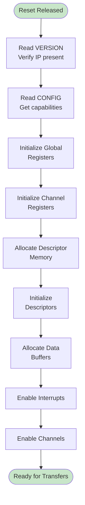

# Initialization Sequence

## Overview

This section describes the required steps to initialize RAPIDS Beats and start DMA transfers. The initialization sequence ensures proper hardware state before beginning operations.

## Boot Sequence


**Source:** [14_init_flow.mmd](../assets/mermaid/14_init_flow.mmd)



## Detailed Steps

### Step 1: Verify Hardware Presence

```c
// Read VERSION register
uint32_t version = read_reg(RAPIDS_BASE + VERSION);
uint8_t major = (version >> 24) & 0xFF;
uint8_t minor = (version >> 16) & 0xFF;

if (major < 1) {
    printf("ERROR: RAPIDS not detected or incompatible version\n");
    return -1;
}

printf("RAPIDS Beats v%d.%d detected\n", major, minor);
```

### Step 2: Read Configuration

```c
// Read CONFIG register
uint32_t config = read_reg(RAPIDS_BASE + CONFIG);
uint8_t num_channels = (config >> 24) & 0xFF;
uint8_t data_width = ((config >> 16) & 0xFF) * 8;  // Convert to bits
uint8_t sram_depth = ((config >> 8) & 0xFF) * 16;

printf("Channels: %d, Data Width: %d bits, SRAM: %d entries\n",
       num_channels, data_width, sram_depth);
```

### Step 3: Global Reset

```c
// Perform soft reset to ensure clean state
write_reg(RAPIDS_BASE + GLOBAL_CTRL, GLOBAL_CTRL_SOFT_RESET);

// Wait for reset completion
while (read_reg(RAPIDS_BASE + GLOBAL_STATUS) & GLOBAL_STATUS_RESET_ACTIVE) {
    // Poll until reset complete
}

// Clear any pending interrupts
write_reg(RAPIDS_BASE + IRQ_STATUS, 0xFFFFFFFF);
```

### Step 4: Allocate Resources

```c
// Allocate descriptor ring (must be 32-byte aligned)
size_t desc_size = NUM_DESCRIPTORS * sizeof(rapids_descriptor_t);
rapids_descriptor_t *desc_ring = aligned_alloc(32, desc_size);
if (!desc_ring) {
    return -ENOMEM;
}

// Allocate data buffers (must be 64-byte aligned for 512-bit AXI)
size_t buf_size = BUFFER_SIZE_BYTES;
void *rx_buffer = aligned_alloc(64, buf_size);
void *tx_buffer = aligned_alloc(64, buf_size);
```

### Step 5: Initialize Descriptors

```c
// Initialize sink descriptor chain
for (int i = 0; i < NUM_RX_DESC - 1; i++) {
    desc_ring[i].dest_addr = (uint64_t)(rx_buffer + i * FRAME_SIZE);
    desc_ring[i].src_addr = 0;
    desc_ring[i].next_ptr = (uint64_t)&desc_ring[i + 1];
    desc_ring[i].direction = DESC_DIR_SINK;
    desc_ring[i].length = FRAME_SIZE / 64;  // Convert to beats
    desc_ring[i].control = DESC_CTRL_IRQ_EN;
}

// Last descriptor
desc_ring[NUM_RX_DESC - 1].dest_addr = (uint64_t)(rx_buffer + (NUM_RX_DESC-1) * FRAME_SIZE);
desc_ring[NUM_RX_DESC - 1].next_ptr = 0;
desc_ring[NUM_RX_DESC - 1].control = DESC_CTRL_LAST | DESC_CTRL_IRQ_EN;

// Ensure descriptors are visible to hardware
__sync_synchronize();  // Memory barrier
```

### Step 6: Configure Channels

```c
// Configure channel 0 for sink (receive)
uint32_t ch0_base = RAPIDS_BASE + 0x100;

// Set descriptor pointer
write_reg(ch0_base + DESC_PTR_LO, (uint32_t)((uint64_t)desc_ring & 0xFFFFFFFF));
write_reg(ch0_base + DESC_PTR_HI, (uint32_t)((uint64_t)desc_ring >> 32));

// Configure channel
write_reg(ch0_base + CH_CONFIG, CH_CONFIG_DEFAULT);
```

### Step 7: Enable Interrupts

```c
// Enable completion and error interrupts for channel 0
write_reg(RAPIDS_BASE + IRQ_ENABLE, IRQ_CH0_COMPLETE | IRQ_CH0_ERROR);
```

### Step 8: Enable Channel

```c
// Enable channel (but don't kick yet)
write_reg(ch0_base + CH_CTRL, CH_CTRL_ENABLE);
```

## Initialization Timing


**Source:** [init_timing.json](../assets/wavedrom/init_timing.json)

```wavedrom
{
  "signal": [
    {"name": "clk", "wave": "p................|.."},
    {},
    ["Software Actions",
      {"name": "read_version", "wave": "01.0..............|.."},
      {"name": "read_config", "wave": "0..1.0............|.."},
      {"name": "soft_reset", "wave": "0....1.0..........|.."},
      {"name": "clear_irq", "wave": "0......1.0........|.."},
      {"name": "write_desc_ptr", "wave": "0........1.0......|.."},
      {"name": "write_irq_en", "wave": "0..........1.0....|.."},
      {"name": "write_ch_enable", "wave": "0............1.0..|.."}
    ],
    {},
    ["Hardware State",
      {"name": "reset_active", "wave": "0....1..0.........|.."},
      {"name": "ch0_state", "wave": "=....=..=.........|..", "data": ["IDLE","RESET","IDLE"]},
      {"name": "ch0_enabled", "wave": "0............1....|.."},
      {"name": "irq_enabled", "wave": "0..........1......|.."}
    ]
  ],
  "config": {"hscale": 1},
  "head": {"text": "Initialization Sequence Timing"}
}
```

## Starting Transfers

### Kick a Channel

After initialization, kick the channel to start processing:

```c
// Kick channel 0 to start descriptor processing
write_reg(ch0_base + CH_CTRL, CH_CTRL_ENABLE | CH_CTRL_KICK);
```


```wavedrom
{
  "signal": [
    {"name": "clk", "wave": "p..........."},
    {},
    {"name": "apb_write_kick", "wave": "01.0........"},
    {"name": "kick_pulse", "wave": "0.1.0......."},
    {},
    {"name": "ch_state", "wave": "=..=.=......", "data": ["IDLE","WAIT_DESC","PARSE"]},
    {"name": "desc_fetch", "wave": "0..1.0......"},
    {"name": "ch_active", "wave": "0..1........"}
  ],
  "config": {"hscale": 1.5},
  "head": {"text": "Channel Kick and Start"}
}
```

## Interrupt Handling

### Completion Interrupt

```c
void rapids_irq_handler(void) {
    uint32_t irq_status = read_reg(RAPIDS_BASE + IRQ_STATUS);

    // Handle channel 0 completion
    if (irq_status & IRQ_CH0_COMPLETE) {
        // Read channel status
        uint32_t ch_status = read_reg(ch0_base + CH_STATUS);
        uint8_t desc_count = (ch_status >> 16) & 0xFF;

        // Process completed buffers
        process_rx_buffers(desc_count);

        // Clear interrupt
        write_reg(RAPIDS_BASE + IRQ_STATUS, IRQ_CH0_COMPLETE);

        // Re-kick channel for continuous operation (if desired)
        write_reg(ch0_base + CH_CTRL, CH_CTRL_ENABLE | CH_CTRL_KICK);
    }

    // Handle errors
    if (irq_status & IRQ_CH0_ERROR) {
        uint32_t err_status = read_reg(ch0_base + ERR_STATUS);
        handle_error(err_status);

        // Clear error interrupt
        write_reg(RAPIDS_BASE + IRQ_STATUS, IRQ_CH0_ERROR);
    }
}
```

## Reset and Recovery

### Per-Channel Reset

```c
void reset_channel(int channel) {
    uint32_t ch_base = RAPIDS_BASE + 0x100 + (channel * 0x40);

    // Soft reset the channel
    write_reg(ch_base + CH_CTRL, CH_CTRL_SOFT_RESET);

    // Wait for reset complete
    while ((read_reg(ch_base + CH_STATUS) >> 28) == 0xF) {
        // State = RESET
    }

    // Clear error status
    write_reg(ch_base + ERR_STATUS, 0xFFFFFFFF);

    // Re-initialize descriptor pointer
    write_reg(ch_base + DESC_PTR_LO, saved_desc_ptr_lo[channel]);
    write_reg(ch_base + DESC_PTR_HI, saved_desc_ptr_hi[channel]);

    // Re-enable
    write_reg(ch_base + CH_CTRL, CH_CTRL_ENABLE);
}
```

### Global Reset

```c
void reset_rapids(void) {
    // Disable all interrupts
    write_reg(RAPIDS_BASE + IRQ_ENABLE, 0);

    // Global soft reset
    write_reg(RAPIDS_BASE + GLOBAL_CTRL, GLOBAL_CTRL_SOFT_RESET);

    // Wait for all channels idle
    while (read_reg(RAPIDS_BASE + GLOBAL_STATUS) & 0x00FF0000) {
        // Wait for active channels to clear
    }

    // Clear all interrupts
    write_reg(RAPIDS_BASE + IRQ_STATUS, 0xFFFFFFFF);

    // Re-run full initialization
    rapids_init();
}
```

