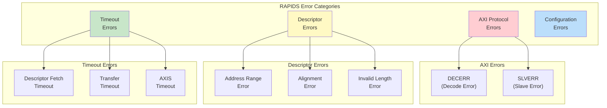
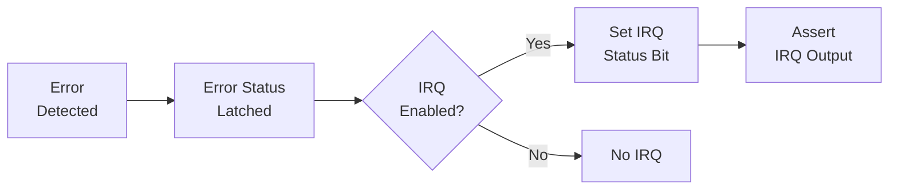
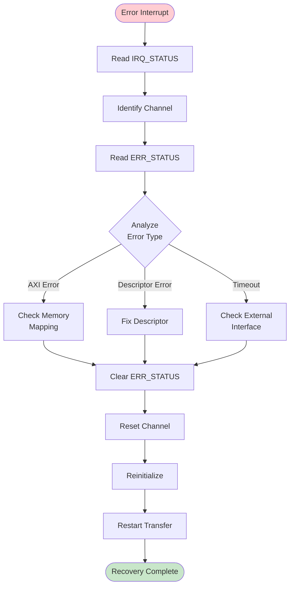

# Error Handling

## Overview

RAPIDS Beats implements comprehensive error detection and reporting. This section describes error types, detection mechanisms, and recommended recovery procedures.

## Error Categories


**Source:** [15_error_hierarchy.mmd](../assets/mermaid/15_error_hierarchy.mmd)



## Error Detection

### AXI Response Errors

RAPIDS monitors all AXI transactions for error responses:

| Response | Code | Description | Typical Cause |
|----------|------|-------------|---------------|
| OKAY | 2'b00 | Normal success | -- |
| EXOKAY | 2'b01 | Exclusive OK | -- |
| SLVERR | 2'b10 | Slave error | Memory protection, invalid access |
| DECERR | 2'b11 | Decode error | Address not mapped |

: AXI Response Codes


**Source:** [axi_error.json](../assets/wavedrom/axi_error.json)

```wavedrom
{
  "signal": [
    {"name": "clk", "wave": "p.............."},
    {},
    ["AXI Write",
      {"name": "awvalid", "wave": "01.0..........."},
      {"name": "wvalid", "wave": "0.1.1.0........"},
      {"name": "wlast", "wave": "0...1.0........"}
    ],
    {},
    ["AXI Response",
      {"name": "bvalid", "wave": "0.....1.0......"},
      {"name": "bresp", "wave": "x.....=.x......", "data": ["SLVERR"]}
    ],
    {},
    ["Error Handling",
      {"name": "error_detected", "wave": "0.....1.0......"},
      {"name": "ch_state", "wave": "=.....=........", "data": ["XFER","ERROR"]},
      {"name": "err_status", "wave": "x.....=........", "data": ["0x2X"]}
    ]
  ],
  "config": {"hscale": 1.5},
  "head": {"text": "AXI Slave Error Detection"}
}
```

### Descriptor Validation Errors

Descriptors are validated when parsed:

| Check | Error Condition | ERR_STATUS Code |
|-------|-----------------|-----------------|
| Address range | Address outside configured range | 0x10 |
| Alignment | Address not properly aligned | 0x11 |
| Length | Length = 0 or > max allowed | 0x12 |
| Direction | Invalid direction code | 0x13 |

: Descriptor Validation Errors

```wavedrom
{
  "signal": [
    {"name": "clk", "wave": "p.........."},
    {},
    {"name": "desc_valid", "wave": "01.0......."},
    {"name": "desc_length", "wave": "x=.x.......", "data": ["0x0000"]},
    {},
    {"name": "validation_pass", "wave": "0.........."},
    {"name": "validation_fail", "wave": "0.1.0......"},
    {"name": "err_type", "wave": "x.=.x......", "data": ["LEN_ERR"]},
    {},
    {"name": "ch_state", "wave": "=.=........", "data": ["PARSE","ERROR"]}
  ],
  "config": {"hscale": 1.5},
  "head": {"text": "Descriptor Length Validation Error"}
}
```

### Timeout Detection

RAPIDS implements watchdog timers for detecting stalled operations:

| Timeout Type | Typical Value | Condition |
|--------------|---------------|-----------|
| Descriptor fetch | 1024 cycles | No AXI response |
| Transfer | 65536 cycles | No progress |
| AXIS receive | 4096 cycles | TVALID stuck low |
| AXIS transmit | 4096 cycles | TREADY stuck low |

: Timeout Thresholds

```wavedrom
{
  "signal": [
    {"name": "clk", "wave": "p..............|...."},
    {},
    {"name": "transfer_active", "wave": "1..............|...."},
    {"name": "progress_counter", "wave": "=.=.=.=.=.=.=.=|....", "data": ["0","1K","2K","...","62K","63K","64K","65K"]},
    {"name": "data_beat", "wave": "0..............|...."},
    {},
    {"name": "timeout_expired", "wave": "0..............|1..."},
    {"name": "ch_state", "wave": "=..............|=...", "data": ["XFER","ERROR"]}
  ],
  "config": {"hscale": 1},
  "head": {"text": "Transfer Timeout Detection"}
}
```

## Error Reporting

### ERR_STATUS Register

When an error occurs, details are captured in the ERR_STATUS register:

```
ERR_STATUS [31:0]:
  [31:28] - AXI response code (BRESP or RRESP)
  [27:24] - Error type:
            0x0 = AXI write error
            0x1 = AXI read error
            0x2 = Descriptor fetch error
            0x3 = Descriptor validation error
            0x4 = Timeout error
  [23:16] - Descriptor index when error occurred
  [15:0]  - Reserved
```

### MonBus Error Events

Errors generate MonBus packets for system-wide visibility:

```wavedrom
{
  "signal": [
    {"name": "clk", "wave": "p.........."},
    {},
    {"name": "error_event", "wave": "01.0......."},
    {},
    {"name": "monbus_valid", "wave": "0.1.0......"},
    {"name": "monbus_pkt_type", "wave": "x.=.x......", "data": ["ERROR"]},
    {"name": "monbus_agent", "wave": "x.=.x......", "data": ["0x30"]},
    {"name": "monbus_event", "wave": "x.=.x......", "data": ["AXI_ERR"]},
    {"name": "monbus_data", "wave": "x.=.x......", "data": ["err_details"]}
  ],
  "config": {"hscale": 1.5},
  "head": {"text": "MonBus Error Event"}
}
```

### Interrupt Generation

Error interrupts are generated when enabled:



## Error Recovery

### Recovery Flow


**Source:** [16_error_recovery.mmd](../assets/mermaid/16_error_recovery.mmd)



### AXI Error Recovery

```c
void handle_axi_error(int channel) {
    uint32_t ch_base = RAPIDS_BASE + 0x100 + (channel * 0x40);
    uint32_t err_status = read_reg(ch_base + ERR_STATUS);

    uint8_t axi_resp = (err_status >> 28) & 0xF;
    uint8_t err_type = (err_status >> 24) & 0xF;
    uint8_t desc_idx = (err_status >> 16) & 0xFF;

    if (axi_resp == 0x3) {  // DECERR
        printf("CH%d: Address decode error at descriptor %d\n", channel, desc_idx);
        // Check memory mapping, descriptor addresses
    } else if (axi_resp == 0x2) {  // SLVERR
        printf("CH%d: Slave error at descriptor %d\n", channel, desc_idx);
        // Check memory protection, peripheral status
    }

    // Clear error and reset channel
    write_reg(ch_base + ERR_STATUS, 0xFFFFFFFF);
    reset_channel(channel);
}
```

### Descriptor Error Recovery

```c
void handle_desc_error(int channel) {
    uint32_t ch_base = RAPIDS_BASE + 0x100 + (channel * 0x40);
    uint32_t err_status = read_reg(ch_base + ERR_STATUS);

    uint8_t err_type = (err_status >> 24) & 0xF;
    uint8_t desc_idx = (err_status >> 16) & 0xFF;

    switch (err_type & 0xF) {
        case 0x0:  // Address range
            printf("CH%d: Descriptor %d has invalid address\n", channel, desc_idx);
            fix_descriptor_address(channel, desc_idx);
            break;
        case 0x1:  // Alignment
            printf("CH%d: Descriptor %d has alignment issue\n", channel, desc_idx);
            fix_descriptor_alignment(channel, desc_idx);
            break;
        case 0x2:  // Length
            printf("CH%d: Descriptor %d has invalid length\n", channel, desc_idx);
            fix_descriptor_length(channel, desc_idx);
            break;
    }

    // Clear and restart from fixed descriptor
    write_reg(ch_base + ERR_STATUS, 0xFFFFFFFF);
    write_reg(ch_base + DESC_PTR_LO, (uint32_t)&desc_ring[desc_idx]);
    write_reg(ch_base + DESC_PTR_HI, (uint32_t)((uint64_t)&desc_ring[desc_idx] >> 32));
    reset_channel(channel);
}
```

### Timeout Recovery

```c
void handle_timeout(int channel) {
    uint32_t ch_base = RAPIDS_BASE + 0x100 + (channel * 0x40);
    uint32_t err_status = read_reg(ch_base + ERR_STATUS);
    uint32_t ch_status = read_reg(ch_base + CH_STATUS);

    uint8_t desc_idx = (err_status >> 16) & 0xFF;
    uint8_t sram_level = (ch_status >> 8) & 0xFF;

    printf("CH%d: Timeout at descriptor %d, SRAM level %d\n",
           channel, desc_idx, sram_level);

    // Check external interfaces
    if (sram_level == 0) {
        printf("  SRAM empty - check network input\n");
    } else if (sram_level > 0) {
        printf("  SRAM has data - check memory interface\n");
    }

    // Abort and reset
    write_reg(ch_base + CH_CTRL, CH_CTRL_ABORT);
    while ((read_reg(ch_base + CH_STATUS) >> 28) != 0x0) {
        // Wait for IDLE
    }

    write_reg(ch_base + ERR_STATUS, 0xFFFFFFFF);
    reset_channel(channel);
}
```

## Error Prevention

### Best Practices

| Practice | Rationale |
|----------|-----------|
| Validate descriptors before submission | Catch errors before hardware processing |
| Use aligned addresses | Avoid alignment errors |
| Set reasonable timeouts | Detect issues without false positives |
| Monitor SRAM levels | Identify flow control issues |
| Enable MonBus | System-wide error visibility |

: Error Prevention Best Practices

### Descriptor Validation Example

```c
int validate_descriptor(rapids_descriptor_t *desc) {
    // Check alignment
    if (desc->dest_addr & 0x3F) {  // 64-byte alignment
        return ERR_ALIGNMENT;
    }

    // Check length
    if (desc->length == 0 || desc->length > MAX_BEATS) {
        return ERR_LENGTH;
    }

    // Check direction
    if (desc->direction > DESC_DIR_SOURCE) {
        return ERR_DIRECTION;
    }

    // Check address range
    if (desc->dest_addr < VALID_ADDR_MIN || desc->dest_addr > VALID_ADDR_MAX) {
        return ERR_ADDRESS;
    }

    return 0;  // Valid
}
```

