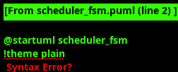
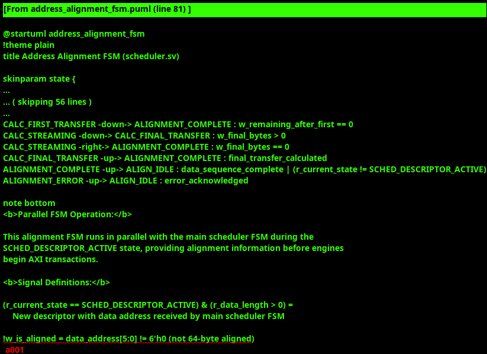

<!-- RTL Design Sherpa Documentation Header -->
<table>
<tr>
<td width="80">
  <a href="https://github.com/sean-galloway/RTLDesignSherpa">
    
  </a>
</td>
<td>
  <strong>RTL Design Sherpa</strong> · <em>Learning Hardware Design Through Practice</em><br>
  <sub>
    <a href="https://github.com/sean-galloway/RTLDesignSherpa">GitHub</a> ·
    <a href="https://github.com/sean-galloway/RTLDesignSherpa/blob/main/docs/DOCUMENTATION_INDEX.md">Documentation Index</a> ·
    <a href="https://github.com/sean-galloway/RTLDesignSherpa/blob/main/LICENSE">MIT License</a>
  </sub>
</td>
</tr>
</table>

---

<!-- End Header -->

### Scheduler

#### Overview

The Scheduler orchestrates data movement operations by managing descriptor execution, coordinating with data engines, and controlling program sequences. The module implements two sophisticated state machines: a main scheduler FSM for descriptor execution and an address alignment FSM that runs in parallel to pre-calculate optimal transfer parameters for maximum AXI performance.


#### Key Features

- **Dual State Machine Architecture**: Main scheduler FSM plus parallel address alignment FSM
- **Descriptor-Driven Operation**: Processes descriptors from descriptor engine with full stream control
- **Address Alignment Pre-calculation**: Dedicated FSM provides alignment information before AXI operations
- **Credit Management**: Atomic credit operations with early warning thresholds
- **Stream Boundary Support**: Complete EOS processing with sequence completion tracking
- **Program Sequencing**: Sequential program engine coordination for post-processing
- **Channel Reset Support**: Graceful channel shutdown with proper completion signaling
- **Monitor Integration**: Comprehensive event reporting for system visibility

#### Interface Specification

##### Configuration Parameters

| Parameter | Default Value | Description |
|-----------|---------------|-------------|
| `CHANNEL_ID` | 0 | Static channel identifier for this scheduler instance |
| `NUM_CHANNELS` | 32 | Total number of channels in system |
| `CHAN_WIDTH` | `$clog2(NUM_CHANNELS)` | Width of channel address fields |
| `ADDR_WIDTH` | 64 | Address width for data operations |
| `DATA_WIDTH` | 512 | Descriptor packet width |
| `CREDIT_WIDTH` | 8 | Credit counter width |
| `TIMEOUT_CYCLES` | 1000 | Data transfer timeout threshold |
| `EARLY_WARNING_THRESHOLD` | 4 | Credit warning threshold |

##### Clock and Reset Signals

| Signal Name | Type | Width | Direction | Required | Description |
|-------------|------|-------|-----------|----------|-------------|
| **clk** | logic | 1 | Input | Yes | System clock |
| **rst_n** | logic | 1 | Input | Yes | Active-low asynchronous reset |

##### Configuration Interface

| Signal Name | Type | Width | Direction | Required | Description |
|-------------|------|-------|-----------|----------|-------------|
| **cfg_idle_mode** | logic | 1 | Input | Yes | Force scheduler to idle state |
| **cfg_channel_wait** | logic | 1 | Input | Yes | Wait for channel enable |
| **cfg_channel_enable** | logic | 1 | Input | Yes | Channel enable control |
| **cfg_use_credit** | logic | 1 | Input | Yes | Enable credit-based flow control |
| **cfg_initial_credit** | logic | CREDIT_WIDTH | Input | Yes | Initial credit value (exponential encoding) |
| **credit_increment** | logic | 1 | Input | Yes | Credit increment request |
| **cfg_channel_reset** | logic | 1 | Input | Yes | Dynamic channel reset request |

##### Status Interface

| Signal Name | Type | Width | Direction | Required | Description |
|-------------|------|-------|-----------|----------|-------------|
| **scheduler_idle** | logic | 1 | Output | Yes | Scheduler idle status indicator |
| **fsm_state** | scheduler_state_t | 3 | Output | Yes | Current main FSM state |
| **descriptor_credit_counter** | logic | CREDIT_WIDTH | Output | Yes | Current credit count |
| **scheduler_error** | logic | 1 | Output | Yes | Scheduler error status |
| **backpressure_warning** | logic | 1 | Output | Yes | Credit or timeout warning |

##### Descriptor Engine Interface

| Signal Name | Type | Width | Direction | Required | Description |
|-------------|------|-------|-----------|----------|-------------|
| **descriptor_valid** | logic | 1 | Input | Yes | Descriptor available from engine |
| **descriptor_ready** | logic | 1 | Output | Yes | Ready to accept descriptor |
| **descriptor_packet** | logic | DATA_WIDTH | Input | Yes | Descriptor packet data |
| **descriptor_same** | logic | 1 | Input | Yes | Same descriptor flag |
| **descriptor_error** | logic | 1 | Input | Yes | Descriptor error status |
| **descriptor_is_rda** | logic | 1 | Input | Yes | RDA packet indicator |
| **descriptor_rda_channel** | logic | CHAN_WIDTH | Input | Yes | RDA channel identifier |
| **descriptor_eos** | logic | 1 | Input | Yes | End of Stream from descriptor |
| **descriptor_type** | logic | 2 | Input | Yes | Packet type |

##### Data Engine Interface

| Signal Name | Type | Width | Direction | Required | Description |
|-------------|------|-------|-----------|----------|-------------|
| **data_valid** | logic | 1 | Output | Yes | Data transfer request active |
| **data_ready** | logic | 1 | Input | Yes | Data engine ready for transfer |
| **data_address** | logic | ADDR_WIDTH | Output | Yes | Current data address |
| **data_length** | logic | 32 | Output | Yes | Remaining data length |
| **data_type** | logic | 2 | Output | Yes | Packet type from descriptor |
| **data_eos** | logic | 1 | Output | Yes | End of Stream indicator |
| **data_transfer_length** | logic | 32 | Input | Yes | Actual transfer length completed |
| **data_error** | logic | 1 | Input | Yes | Data transfer error |
| **data_done_strobe** | logic | 1 | Input | Yes | Data transfer completed |

##### Address Alignment Bus Interface

| Signal Name | Type | Width | Direction | Required | Description |
|-------------|------|-------|-----------|----------|-------------|
| **data_alignment_info** | alignment_info_t | Variable | Output | Yes | Pre-calculated alignment information |
| **data_alignment_valid** | logic | 1 | Output | Yes | Alignment information valid |
| **data_alignment_ready** | logic | 1 | Input | Yes | Alignment information ready |
| **data_alignment_next** | logic | 1 | Input | Yes | Request next alignment calculation |
| **data_transfer_phase** | transfer_phase_t | 3 | Output | Yes | Current transfer phase |
| **data_sequence_complete** | logic | 1 | Input | Yes | Transfer sequence complete |

##### Ctrlrd Engine Interface (Control Read Operations)

| Signal Name | Type | Width | Direction | Required | Description |
|-------------|------|-------|-----------|----------|-------------|
| **ctrlrd_valid** | logic | 1 | Output | Yes | Control read operation request |
| **ctrlrd_ready** | logic | 1 | Input | Yes | Control read match/completion (asserts when read data matches expected value) |
| **ctrlrd_addr** | logic | ADDR_WIDTH | Output | Yes | Control read address |
| **ctrlrd_data** | logic | 32 | Output | Yes | Control read expected/comparison data |
| **ctrlrd_mask** | logic | 32 | Output | Yes | Control read mask/flags |
| **ctrlrd_error** | logic | 1 | Input | Yes | Control read operation error (valid when ctrlrd_valid && ctrlrd_ready) |
| **ctrlrd_result** | logic | 32 | Input | Yes | Control read result data (actual value read) |

**Ctrlrd Ready Behavior:**
- `ctrlrd_ready` asserts **only when** the read response matches the expected value (`ctrlrd_data`)
- The ctrlrd engine performs retry operations until match or max retries exceeded
- `ctrlrd_error` is valid when both `ctrlrd_valid` and `ctrlrd_ready` are asserted
- Error conditions: AXI response error OR max retry count exceeded without match

**Operation Flow:**
1. Scheduler asserts `ctrlrd_valid` with address, expected data, and mask
2. Ctrlrd engine performs AXI read and compares result with expected data
3. If match: `ctrlrd_ready` asserts (proceed to data operations)
4. If no match: Retry read up to `cfg_ctrlrd_max_try` times
5. If max retries exceeded: `ctrlrd_ready` and `ctrlrd_error` assert together (enter error state)

**Note:** Ctrlrd operations execute BEFORE data operations, enabling pre-descriptor flag reads or synchronization checks with configurable retry mechanisms.

##### Ctrlwr Engine Interface (Control Write Operations)

| Signal Name | Type | Width | Direction | Required | Description |
|-------------|------|-------|-----------|----------|-------------|
| **ctrlwr_valid** | logic | 1 | Output | Yes | Control write operation request |
| **ctrlwr_ready** | logic | 1 | Input | Yes | Control write operation complete |
| **ctrlwr_addr** | logic | ADDR_WIDTH | Output | Yes | Control write address (ctrlwr0 or ctrlwr1) |
| **ctrlwr_data** | logic | 32 | Output | Yes | Control write data (ctrlwr0 or ctrlwr1) |
| **ctrlwr_error** | logic | 1 | Input | Yes | Control write operation error |

**Note:** Ctrlwr operations execute AFTER data operations complete, enabling post-descriptor notifications or cleanup operations.

##### RDA Completion Interface

| Signal Name | Type | Width | Direction | Required | Description |
|-------------|------|-------|-----------|----------|-------------|
| **rda_complete_valid** | logic | 1 | Output | Yes | RDA completion notification |
| **rda_complete_ready** | logic | 1 | Input | Yes | RDA completion ready |
| **rda_complete_channel** | logic | CHAN_WIDTH | Output | Yes | RDA completion channel |

##### Monitor Bus Interface

| Signal Name | Type | Width | Direction | Required | Description |
|-------------|------|-------|-----------|----------|-------------|
| **mon_valid** | logic | 1 | Output | Yes | Monitor packet valid |
| **mon_ready** | logic | 1 | Input | Yes | Monitor ready to accept packet |
| **mon_packet** | logic | 64 | Output | Yes | Monitor packet data |

#### Dual State Machine Architecture

##### Main Scheduler FSM



**States:**
- **SCHED_IDLE**: Ready for new descriptor, all operations complete
- **SCHED_WAIT_FOR_CONTROL**: Wait for channel enable and control signals
- **SCHED_ISSUE_CTRLRD**: Issue control read operation (pre-descriptor, conditional)
- **SCHED_DESCRIPTOR_ACTIVE**: Execute data transfer operations (alignment FSM runs in parallel)
- **SCHED_ISSUE_CTRLWR0**: Issue first control write operation (post-descriptor, conditional)
- **SCHED_ISSUE_CTRLWR1**: Issue second control write operation (post-descriptor, conditional)
- **SCHED_ERROR**: Handle error conditions with sticky error flags

**Operation Sequence:**
```
IDLE -> WAIT_FOR_CONTROL -> ISSUE_CTRLRD (if needed) ->
  DESCRIPTOR_ACTIVE -> ISSUE_CTRLWR0 (if needed) -> ISSUE_CTRLWR1 (if needed) -> IDLE
```

##### Address Alignment FSM (Parallel Operation)



**States:**
- **ALIGN_IDLE**: Ready for new alignment calculation
- **ANALYZE_ADDRESS**: Single-cycle address analysis and strategy selection
- **CALC_FIRST_TRANSFER**: Generate alignment transfer parameters
- **CALC_STREAMING**: Calculate optimal streaming burst parameters
- **CALC_FINAL_TRANSFER**: Handle final partial transfer calculations
- **ALIGNMENT_COMPLETE**: Provide complete alignment information to engines
- **ALIGNMENT_ERROR**: Handle invalid alignment scenarios

#### Address Alignment System

##### Parallel FSM Operation

The address alignment FSM runs in parallel with the main scheduler during the `SCHED_DESCRIPTOR_ACTIVE` state:

```systemverilog
// Alignment FSM trigger condition
if ((r_current_state == SCHED_DESCRIPTOR_ACTIVE) && (r_data_length > 32'h0)) begin
    w_alignment_next_state = ANALYZE_ADDRESS;
end
```

##### Alignment Information Structure

```systemverilog
typedef struct packed {
    logic                    is_aligned;           // Already 64-byte aligned
    logic [5:0]              addr_offset;          // Address offset within boundary
    logic [31:0]             first_transfer_bytes; // Bytes in alignment transfer
    logic [NUM_CHUNKS-1:0]   first_chunk_enables;  // Chunk pattern for alignment
    logic [7:0]              optimal_burst_len;    // Optimal burst after alignment
    logic [31:0]             final_transfer_bytes; // Bytes in final transfer
    logic [NUM_CHUNKS-1:0]   final_chunk_enables;  // Final chunk pattern
    logic [3:0]              total_transfers;      // Pre-calculated total count
    alignment_strategy_t     alignment_strategy;   // Strategy selection
} alignment_info_t;
```

##### Transfer Phase Management

```systemverilog
typedef enum logic [2:0] {
    PHASE_IDLE      = 3'h0,  // No active transfer
    PHASE_ALIGNMENT = 3'h1,  // Initial alignment transfer
    PHASE_STREAMING = 3'h2,  // Optimal aligned streaming
    PHASE_FINAL     = 3'h3,  // Final partial transfer
    PHASE_COMPLETE  = 3'h4   // Transfer sequence complete
} transfer_phase_t;
```

#### Descriptor Processing

##### Descriptor Packet Format (512 bits)

| Bit Range | Field Name | Width | Description |
|-----------|------------|-------|-------------|
| **511:480** | *Reserved* | 32 bits | Reserved for future use |
| **479:448** | `ctrlwr1_data` | 32 bits | Control Write 1 data value |
| **447:384** | `ctrlwr1_addr` | 64 bits | Control Write 1 address |
| **383:352** | `ctrlwr0_data` | 32 bits | Control Write 0 data value |
| **351:288** | `ctrlwr0_addr` | 64 bits | Control Write 0 address |
| **287:256** | `ctrlrd_mask` | 32 bits | Control Read mask/flags |
| **255:224** | `ctrlrd_data` | 32 bits | Control Read data value |
| **223:160** | `ctrlrd_addr` | 64 bits | Control Read address |
| **159:128** | `next_descriptor_addr[63:32]` | 32 bits | Next descriptor pointer (upper) |
| **127:96** | `next_descriptor_addr[31:0]` | 32 bits | Next descriptor pointer (lower) |
| **95:64** | `data_addr[63:32]` | 32 bits | Data operation address (upper) |
| **63:32** | `data_addr[31:0]` | 32 bits | Data operation address (lower) |
| **31:0** | `data_length` | 32 bits | Data transfer length (bytes) |

##### Descriptor Field Details

**1. Data Operation Fields (bits 0-95):**
- `data_length` [31:0] - Transfer length in **bytes**
- `data_addr` [95:32] - 64-bit memory address for data operation

**2. Next Descriptor Pointer (bits 96-159):**
- `next_descriptor_addr` [159:96] - 64-bit address of next descriptor in linked list

**3. Control Read Fields (bits 160-287):**
- `ctrlrd_addr` [223:160] - 64-bit address for pre-descriptor control read operation
- `ctrlrd_data` [255:224] - 32-bit data value for control read (comparison/expected value)
- `ctrlrd_mask` [287:256] - 32-bit mask/flags for control read operation

**4. Control Write Fields (bits 288-479):**
- `ctrlwr0_addr` [351:288] - 64-bit address for first post-descriptor control write
- `ctrlwr0_data` [383:352] - 32-bit data for first control write
- `ctrlwr1_addr` [447:384] - 64-bit address for second post-descriptor control write
- `ctrlwr1_data` [479:448] - 32-bit data for second control write

**Operation Sequence:**
1. **Control Read (ctrlrd)**: Executed FIRST, before data operations (if ctrlrd_addr != 0)
2. **Data Operation**: Memory transfer operation (source/sink data path)
3. **Control Write 0 (ctrlwr0)**: Executed after data completion (if ctrlwr0_addr != 0)
4. **Control Write 1 (ctrlwr1)**: Executed after ctrlwr0 completion (if ctrlwr1_addr != 0)

**Null Address Handling:** Setting any control address field to 64'h0 skips that operation.

##### Descriptor Field Extraction

```systemverilog
// Descriptor unpacking in SCHED_IDLE state
if ((r_current_state == SCHED_IDLE) && descriptor_valid && descriptor_ready) begin
    // Extract descriptor fields from 512-bit packet

    // Data operation fields (bits 0-95)
    r_data_length <= descriptor_packet[31:0];
    r_data_addr <= {descriptor_packet[95:64], descriptor_packet[63:32]};

    // Next descriptor pointer (bits 96-159)
    r_next_descriptor_addr <= {descriptor_packet[159:128], descriptor_packet[127:96]};

    // Control Read fields (bits 160-287)
    r_ctrlrd_addr <= {descriptor_packet[223:192], descriptor_packet[191:160]};
    r_ctrlrd_data <= descriptor_packet[255:224];
    r_ctrlrd_mask <= descriptor_packet[287:256];

    // Control Write 0 fields (bits 288-383)
    r_ctrlwr0_addr <= {descriptor_packet[351:320], descriptor_packet[319:288]};
    r_ctrlwr0_data <= descriptor_packet[383:352];

    // Control Write 1 fields (bits 384-479)
    r_ctrlwr1_addr <= {descriptor_packet[447:416], descriptor_packet[415:384]};
    r_ctrlwr1_data <= descriptor_packet[479:448];

    // Companion signals
    r_data_type <= descriptor_type;
    r_packet_eos_received <= descriptor_eos;

    // Decrement credit on descriptor acceptance
    if (cfg_use_credit && (r_descriptor_credit_counter > 0)) begin
        r_descriptor_credit_counter <= r_descriptor_credit_counter - 1;
    end
end
```

##### Companion Control Signals

In addition to the 512-bit `descriptor_packet`, these companion signals provide metadata:

| Signal Name | Width | Description |
|-------------|-------|-------------|
| `descriptor_type` | 2 bits | Descriptor type (from descriptor engine) |
| `descriptor_same` | 1 bit | Same descriptor indicator |
| `descriptor_error` | 1 bit | Error flag from descriptor engine |
| `descriptor_is_rda` | 1 bit | RDA packet indicator |
| `descriptor_rda_channel` | CHAN_WIDTH | RDA channel number |
| `descriptor_eos` | 1 bit | End of stream marker |
| `descriptor_eol` | 1 bit | End of line marker |
| `descriptor_eod` | 1 bit | End of data marker |

**Note:** Stream boundary signals (EOS/EOL/EOD) are provided as companion signals from the descriptor engine, not embedded in the descriptor packet itself.

#### Credit Management

##### Exponential Credit Encoding

The scheduler implements **exponential credit encoding** for the `cfg_initial_credit` configuration input, providing a wide range of credit values with a compact 4-bit configuration:

| `cfg_initial_credit` | Binary | Actual Credits | Description |
|---------------------|--------|----------------|-------------|
| 0 | 4'b0000 | 1 | Minimum credits (2^0) |
| 1 | 4'b0001 | 2 | Low credits (2^1) |
| 2 | 4'b0010 | 4 | (2^2) |
| 3 | 4'b0011 | 8 | (2^3) |
| 4 | 4'b0100 | 16 | (2^4) |
| 5 | 4'b0101 | 32 | (2^5) |
| 6 | 4'b0110 | 64 | (2^6) |
| 7 | 4'b0111 | 128 | (2^7) |
| 8 | 4'b1000 | 256 | (2^8) |
| 9 | 4'b1001 | 512 | (2^9) |
| 10 | 4'b1010 | 1024 | (2^10) |
| 11 | 4'b1011 | 2048 | (2^11) |
| 12 | 4'b1100 | 4096 | (2^12) |
| 13 | 4'b1101 | 8192 | (2^13) |
| 14 | 4'b1110 | 16384 | Maximum credits (2^14) |
| 15 | 4'b1111 | 0 | **DISABLED** (no credits - blocks all operations) |

**Encoding Rationale:** Exponential encoding allows compact 4-bit configuration to represent a wide range from 1 to 16384 credits, plus a special "disabled" mode (15 = 0 credits). This enables fine-grained control for low-traffic scenarios (1-8 credits) while supporting high-throughput operations (256-16384 credits) without requiring a wide configuration bus. Setting cfg=15 disables the credit system by initializing the counter to 0, effectively blocking all descriptor processing when credit mode is enabled.

##### Credit Initialization

```systemverilog
// Reset initialization with exponential encoding
always_ff @(posedge clk) begin
    if (!rst_n) begin
        // Exponential credit encoding:
        //   0->1, 1->2, 2->4, 3->8, ..., 14->16384 (exponential: 2^n)
        //   15->0 (special case: DISABLED - no credits, blocks all operations)
        r_descriptor_credit_counter <= (cfg_initial_credit == 4'hF) ? 32'h00000000 :
                                      (cfg_initial_credit == 4'h0) ? 32'h00000001 :
                                      (32'h1 << cfg_initial_credit);
    end
end
```

##### Credit Operations

```systemverilog
// Credit state tracking
logic [31:0] r_descriptor_credit_counter;  // 32-bit to hold decoded value
logic w_credit_available;
logic w_credit_warning;

// Credit availability check
assign w_credit_available = cfg_use_credit ?
                           (r_descriptor_credit_counter > 0) : 1'b1;

// Early warning threshold (linear comparison against threshold)
assign w_credit_warning = cfg_use_credit ?
                         (r_descriptor_credit_counter <= EARLY_WARNING_THRESHOLD) : 1'b0;
```

##### Credit Update Logic

```systemverilog
// Credit decrement on descriptor acceptance (linear operation on decoded value)
if (descriptor_valid && descriptor_ready && cfg_use_credit) begin
    r_descriptor_credit_counter <= r_descriptor_credit_counter - 1;
end

// Credit increment on external request (linear operation on decoded value)
if (credit_increment && cfg_use_credit) begin
    r_descriptor_credit_counter <= r_descriptor_credit_counter + 1;
end
```

**Important:** The exponential encoding applies **only to initialization** from `cfg_initial_credit`. Once initialized, the credit counter operates as a standard linear counter (increment by 1, decrement by 1).

#### Control Operation Sequencing

##### Control Read Operations (Pre-Descriptor)

The scheduler issues control read operations BEFORE data operations when ctrlrd_addr is non-zero:

```systemverilog
// Control read needed check
logic w_ctrlrd_needed = (r_ctrlrd_addr != 64'h0);

// State transitions from WAIT_FOR_CONTROL
SCHED_WAIT_FOR_CONTROL: begin
    if (!cfg_channel_wait && cfg_channel_enable) begin
        if (w_ctrlrd_needed) begin
            w_next_state = SCHED_ISSUE_CTRLRD;  // Issue control read first
        end else begin
            w_next_state = SCHED_DESCRIPTOR_ACTIVE;  // Skip to data operations
        end
    end
end

// Control read state with retry mechanism
SCHED_ISSUE_CTRLRD: begin
    if (ctrlrd_ready && !ctrlrd_error) begin
        // Read matched expected value - proceed to data operations
        w_next_state = SCHED_DESCRIPTOR_ACTIVE;
    end else if (ctrlrd_ready && ctrlrd_error) begin
        // Max retries exceeded or AXI error - enter error state
        w_next_state = SCHED_ERROR;
    end
    // Else: Stay in SCHED_ISSUE_CTRLRD while ctrlrd engine retries
end

// Control read output signals
assign ctrlrd_valid = (r_current_state == SCHED_ISSUE_CTRLRD);
assign ctrlrd_addr = r_ctrlrd_addr;
assign ctrlrd_data = r_ctrlrd_data;  // Expected/comparison data
assign ctrlrd_mask = r_ctrlrd_mask;  // Mask/flags for operation
```

**Ctrlrd Operation Details:**
- **Match Success**: `ctrlrd_ready` asserts when read data matches expected value -> Proceed to DESCRIPTOR_ACTIVE
- **Retry Loop**: Ctrlrd engine automatically retries reads up to `cfg_ctrlrd_max_try` times
- **Timeout/Error**: `ctrlrd_ready && ctrlrd_error` indicates failure -> Enter SCHED_ERROR state
- **Use Cases**: Flag polling, synchronization checks, pre-condition validation

##### Control Write Operations (Post-Descriptor)

The scheduler issues control write operations AFTER data operations complete:

```systemverilog
// Control write needed checks
logic w_ctrlwr0_needed = (r_ctrlwr0_addr != 64'h0);
logic w_ctrlwr1_needed = (r_ctrlwr1_addr != 64'h0);

// State transitions for control write operations
case (r_current_state)
    SCHED_DESCRIPTOR_ACTIVE: begin
        if (w_descriptor_complete) begin
            // After data operations, issue control writes if needed
            if (w_ctrlwr0_needed) begin
                w_next_state = SCHED_ISSUE_CTRLWR0;
            end else if (w_ctrlwr1_needed) begin
                w_next_state = SCHED_ISSUE_CTRLWR1;
            end else begin
                w_next_state = SCHED_IDLE;
            end
        end
    end

    SCHED_ISSUE_CTRLWR0: begin
        if (ctrlwr_ready) begin
            // After ctrlwr0 completes, issue ctrlwr1 if needed
            if (w_ctrlwr1_needed) begin
                w_next_state = SCHED_ISSUE_CTRLWR1;
            end else begin
                w_next_state = SCHED_IDLE;
            end
        end
    end

    SCHED_ISSUE_CTRLWR1: begin
        if (ctrlwr_ready) begin
            w_next_state = SCHED_IDLE;
        end
    end
endcase

// Control write output multiplexing
assign ctrlwr_valid = (r_current_state == SCHED_ISSUE_CTRLWR0) ||
                     (r_current_state == SCHED_ISSUE_CTRLWR1);
assign ctrlwr_addr = (r_current_state == SCHED_ISSUE_CTRLWR0) ? r_ctrlwr0_addr : r_ctrlwr1_addr;
assign ctrlwr_data = (r_current_state == SCHED_ISSUE_CTRLWR0) ? r_ctrlwr0_data : r_ctrlwr1_data;
```

##### Null Address Handling

All control operations support conditional execution via null address checking:

```systemverilog
// Null address = skip operation
// ctrlrd_addr = 64'h0 -> Skip control read operation
// ctrlwr0_addr = 64'h0 -> Skip control write 0 operation
// ctrlwr1_addr = 64'h0 -> Skip control write 1 operation
```

This enables descriptor-driven conditional control operations without additional configuration.

#### Channel Reset Coordination

##### Graceful Reset Handling

```systemverilog
// Channel reset coordination
assign w_safe_to_reset = (r_current_state == SCHED_IDLE) && 
                        (r_alignment_state == ALIGN_IDLE) &&
                        w_no_pending_operations &&
                        !r_channel_reset_active;

assign scheduler_idle = w_safe_to_reset && !r_channel_reset_active;
```

##### Reset Behavior

1. **Block New Operations**: Stop accepting descriptors during reset
2. **Complete Active Operations**: Finish data transfers and program operations
3. **Reset State Machines**: Both main and alignment FSMs return to idle
4. **Signal Completion**: Assert `scheduler_idle` when reset complete

#### Timeout Detection

##### Timeout Monitoring

```systemverilog
// Timeout counter for stuck operations
logic [31:0] r_timeout_counter;
logic w_timeout_expired;

assign w_timeout_expired = (r_timeout_counter >= TIMEOUT_CYCLES);

// Timeout counter management
always_ff @(posedge clk) begin
    if (!rst_n || (r_current_state == SCHED_IDLE)) begin
        r_timeout_counter <= 32'h0;
    end else if (r_current_state == SCHED_DESCRIPTOR_ACTIVE) begin
        r_timeout_counter <= r_timeout_counter + 1;
    end
end
```

#### Error Handling

##### Sticky Error Flags

The scheduler implements **sticky error registers** to capture transient error signals from engines and hold them until the FSM can process the error condition. This ensures errors are never missed due to timing mismatches between engine error assertion and FSM state checking.

**Sticky Error Registers:**
- `r_data_error_sticky` - Captures errors from data engine
- `r_ctrlrd_error_sticky` - Captures errors from control read engine
- `r_ctrlwr_error_sticky` - Captures errors from control write engine

**Purpose:** Engine error signals (e.g., `ctrlwr_error`) may assert synchronously with ready signals during handshakes. If the FSM transitions to a new state before checking the error, the transient error signal could be lost. Sticky registers hold errors until the FSM explicitly processes them.

```systemverilog
// Persistent error tracking with sticky registers
logic r_data_error_sticky;
logic r_ctrlrd_error_sticky;
logic r_ctrlwr_error_sticky;

// Sticky error flag management
always_ff @(posedge clk) begin
    if (!rst_n) begin
        r_data_error_sticky <= 1'b0;
        r_ctrlrd_error_sticky <= 1'b0;
        r_ctrlwr_error_sticky <= 1'b0;
    end else begin
        // Capture errors when they occur
        if (data_error) r_data_error_sticky <= 1'b1;
        if (ctrlrd_error) r_ctrlrd_error_sticky <= 1'b1;
        if (ctrlwr_error) r_ctrlwr_error_sticky <= 1'b1;

        // Clear sticky errors only when transitioning FROM error state TO idle
        // This ensures errors are held long enough to trigger ERROR state
        if (r_current_state == SCHED_ERROR && w_next_state == SCHED_IDLE) begin
            r_data_error_sticky <= 1'b0;
            r_ctrlrd_error_sticky <= 1'b0;
            r_ctrlwr_error_sticky <= 1'b0;
        end
    end
end
```

**Critical Timing:** Sticky errors are cleared **only during ERROR->IDLE transition**, NOT on IDLE state entry. This prevents the following timing bug:

**[FAIL] Wrong Timing (Bug):**
```
Cycle N:   FSM in SCHED_ISSUE_CTRLWR0, ctrlwr_error=1 & ctrlwr_ready=1
           FSM transitions to SCHED_IDLE (missed error check!)
           r_ctrlwr_error_sticky <= 1 (takes effect next cycle)
Cycle N+1: FSM in SCHED_IDLE, r_ctrlwr_error_sticky=1
           Clear on IDLE entry -> r_ctrlwr_error_sticky <= 0
           Error lost before detection logic sees it!
```

**[PASS] Correct Timing (Fixed):**
```
Cycle N:   FSM in SCHED_ISSUE_CTRLWR0, ctrlwr_error=1 & ctrlwr_ready=1
           General error detection sees ctrlwr_error=1 OR r_ctrlwr_error_sticky=1
           FSM transitions to SCHED_ERROR (error caught!)
Cycle N+1: FSM in SCHED_ERROR
           Process error state...
Cycle N+M: FSM transitions ERROR->IDLE
           Clear sticky errors now that error has been processed
```

##### Error Detection Logic

**General Error Detection (applies in all states):**
```systemverilog
// Check transient errors OR sticky errors
if (data_error || ctrlrd_error || ctrlwr_error || descriptor_error ||
    w_timeout_expired || r_data_error_sticky || r_ctrlrd_error_sticky || r_ctrlwr_error_sticky) begin
    w_next_state = SCHED_ERROR;
end
```

**State-Specific Error Checking (for ctrlrd):**
```systemverilog
// SCHED_ISSUE_CTRLRD state has explicit error checking
SCHED_ISSUE_CTRLRD: begin
    if (ctrlrd_ready && !ctrlrd_error) begin
        w_next_state = SCHED_DESCRIPTOR_ACTIVE;  // Success
    end else if (ctrlrd_ready && ctrlrd_error) begin
        w_next_state = SCHED_ERROR;  // Error detected
    end
end
```

**Note:** Control write states (SCHED_ISSUE_CTRLWR0/CTRLWR1) rely on general error detection logic, not state-specific checks. The sticky error registers ensure ctrlwr errors are captured even if the FSM transitions before checking.

##### Error Recovery

```systemverilog
// Error state exit conditions - check both transient and sticky errors
logic w_all_errors_clear = !data_error && !ctrlrd_error && !ctrlwr_error &&
                          !descriptor_error && !w_timeout_expired &&
                          !r_data_error_sticky && !r_ctrlrd_error_sticky && !r_ctrlwr_error_sticky;

// Error state recovery to IDLE
if ((r_current_state == SCHED_ERROR) && w_all_errors_clear && w_credit_available) begin
    w_next_state = SCHED_IDLE;  // Sticky errors cleared during this transition
end
```

**Error Recovery Sequence:**
1. Error detected (transient or sticky) -> Enter SCHED_ERROR state
2. Wait in SCHED_ERROR until all error sources clear
3. Transition SCHED_ERROR -> SCHED_IDLE
4. Sticky error registers cleared during this transition
5. Ready for new descriptor processing

#### Performance Benefits of Address Alignment FSM

##### Hidden Latency Calculation

The parallel address alignment FSM provides significant performance benefits:

1. **Pre-calculation During Descriptor Processing**: Alignment analysis occurs during the non-critical descriptor processing phase
2. **Immediate Availability**: AXI engines receive pre-calculated alignment information immediately when needed
3. **No Critical Path Impact**: No alignment calculation overhead in AXI transaction timing
4. **Optimal Transfer Planning**: Complete transfer sequence pre-calculated with optimized burst patterns

##### Transfer Strategy Selection

```systemverilog
// Transfer strategy enumeration
typedef enum logic [2:0] {
    STRATEGY_SINGLE    = 3'h0,  // Single aligned transfer
    STRATEGY_ALIGNMENT = 3'h1,  // Alignment + streaming
    STRATEGY_STREAMING = 3'h2,  // Pure streaming transfers
    STRATEGY_FINAL     = 3'h3,  // Alignment + streaming + final
    STRATEGY_PRECISION = 3'h4   // Precision chunk-level transfers
} alignment_strategy_t;
```

##### Chunk Enable Generation

```systemverilog
// First transfer chunk enable calculation
function logic [NUM_CHUNKS-1:0] calc_first_chunk_enables(
    input logic [5:0] addr_offset,
    input logic [31:0] transfer_bytes
);
    logic [3:0] start_chunk = addr_offset[5:2];  // Starting chunk index
    logic [3:0] num_chunks = (transfer_bytes + 3) >> 2;  // Number of chunks needed
    logic [NUM_CHUNKS-1:0] mask = (1 << num_chunks) - 1;  // Create mask
    return mask << start_chunk;  // Shift to correct position
endfunction

// Final transfer chunk enable calculation  
function logic [NUM_CHUNKS-1:0] calc_final_chunk_enables(
    input logic [31:0] final_bytes
);
    logic [3:0] num_chunks = (final_bytes + 3) >> 2;  // Number of chunks needed
    return (1 << num_chunks) - 1;  // Mask from bit 0
endfunction
```

#### Monitor Bus Events

The scheduler generates comprehensive monitor events:

##### Error Events
- **Timeout Error**: Data transfer timeout detection
- **Credit Exhausted**: Credit underflow condition
- **Descriptor Error**: Invalid descriptor content
- **Program Error**: Program operation failure
- **Alignment Error**: Invalid address alignment parameters

##### Performance Events
- **Descriptor Processing**: Descriptor execution start/completion
- **Credit Warning**: Early warning threshold reached
- **Transfer Phase**: Transfer phase transitions (alignment/streaming/final)
- **Program Sequence**: Program operation sequence tracking
- **Alignment Calculation**: Address alignment FSM operation timing

##### Completion Events
- **Data Transfer Complete**: Data operation completion
- **Program Complete**: Program operation completion
- **Stream Boundary**: EOS processing completion
- **Channel Reset**: Channel reset sequence completion
- **RDA Processing**: RDA packet processing completion

#### Usage Guidelines

##### Address Alignment Optimization

The address alignment system provides optimal AXI performance:

```systemverilog
// Example alignment information usage in AXI engine
if (data_alignment_valid) begin
    case (data_transfer_phase)
        PHASE_ALIGNMENT: begin
            axi_addr <= data_alignment_info.aligned_addr;
            axi_len <= data_alignment_info.first_burst_len;
            chunk_enables <= data_alignment_info.first_chunk_enables;
        end
        PHASE_STREAMING: begin
            axi_addr <= aligned_streaming_addr;
            axi_len <= data_alignment_info.optimal_burst_len;
            chunk_enables <= 16'hFFFF;  // All chunks valid
        end
        PHASE_FINAL: begin
            axi_addr <= final_transfer_addr;
            axi_len <= data_alignment_info.final_burst_len;
            chunk_enables <= data_alignment_info.final_chunk_enables;
        end
    endcase
end
```

##### Performance Monitoring

Monitor key performance indicators:
- Credit utilization and warning frequency
- Timeout occurrence and duration
- Address alignment efficiency
- Program sequence timing
- Transfer phase distribution

##### Error Recovery

The scheduler provides comprehensive error handling:
- Monitor timeout conditions for stuck transfers
- Track credit exhaustion for flow control issues
- Detect alignment calculation errors
- Coordinate error recovery across all interfaces
- Use sticky error flags for persistent fault tracking

##### Channel Reset Usage

```systemverilog
// Example channel reset coordination
logic reset_request;
logic reset_complete;

assign reset_complete = scheduler_idle;

always_ff @(posedge clk) begin
    if (reset_request && !cfg_channel_reset) begin
        cfg_channel_reset <= 1'b1;
    end else if (cfg_channel_reset && reset_complete) begin
        cfg_channel_reset <= 1'b0;
        // Channel is now safely reset and ready for operation
    end
end
```

This dual-FSM scheduler architecture provides optimal performance through pre-calculated address alignment while maintaining comprehensive control over descriptor execution, credit management, and program sequencing operations.
