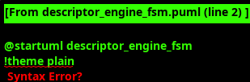

<!-- RTL Design Sherpa Documentation Header -->
<table>
<tr>
<td width="80">
  <a href="https://github.com/sean-galloway/RTLDesignSherpa">
    
  </a>
</td>
<td>
  <strong>RTL Design Sherpa</strong> · <em>Learning Hardware Design Through Practice</em><br>
  <sub>
    <a href="https://github.com/sean-galloway/RTLDesignSherpa">GitHub</a> ·
    <a href="https://github.com/sean-galloway/RTLDesignSherpa/blob/main/docs/DOCUMENTATION_INDEX.md">Documentation Index</a> ·
    <a href="https://github.com/sean-galloway/RTLDesignSherpa/blob/main/LICENSE">MIT License</a>
  </sub>
</td>
</tr>
</table>

---

<!-- End Header -->

### Descriptor Engine

#### Overview

The Descriptor Engine manages descriptor fetching and buffering operations with sophisticated dual-path processing for APB and CDA (Compute Direct Access packet) requests. The module implements a six-state state machine that handles descriptor address management, AXI read operations, descriptor parsing, and prefetch optimization with comprehensive stream boundary support and channel reset coordination.

**Delta Network Integration:**
- **CDA Interface:** The CDA (Compute Direct Access) packet interface receives CDA packets from HIVE-C via the Delta Network
- **Inband Descriptor Injection:** HIVE-C injects descriptors as CDA packets (TUSER=2'b01) through Delta Network virtual tile 16
- **Priority Processing:** CDA packets processed with higher priority than APB requests for low-latency descriptor delivery
- **Packet Type Validation:** CDA packets validated for TUSER=2'b01 before descriptor extraction


#### Key Features

- **Dual-Path Processing**: Handles both APB programming interface and CDA packet interface
- **Six-State State Machine**: Comprehensive descriptor lifecycle management
- **Stream Boundary Support**: Complete EOS/EOL/EOD field extraction and propagation
- **AXI Read Coordination**: Shared AXI interface with channel ID-based response routing
- **4-Deep Descriptor FIFO**: Maintains descriptor flow for continuous operation
- **Priority Handling**: CDA packets prioritized over APB requests
- **Channel Reset Support**: Graceful shutdown with proper AXI transaction completion
- **Monitor Integration**: Rich monitor events for descriptor processing visibility

#### Module Interface

##### Configuration Parameters

| Parameter | Default Value | Description |
|-----------|---------------|-------------|
| `CHANNEL_ID` | 0 | Static channel identifier for this engine instance |
| `NUM_CHANNELS` | 32 | Total number of channels in system |
| `CHAN_WIDTH` | `$clog2(NUM_CHANNELS)` | Width of channel address fields |
| `ADDR_WIDTH` | 64 | Address width for AXI transactions |
| `DATA_WIDTH` | 512 | Descriptor packet width |
| `AXI_ID_WIDTH` | 8 | AXI transaction ID width |

##### Clock and Reset Signals

| Signal Name | Type | Width | Direction | Required | Description |
|-------------|------|-------|-----------|----------|-------------|
| **clk** | logic | 1 | Input | Yes | System clock |
| **rst_n** | logic | 1 | Input | Yes | Active-low asynchronous reset |

##### APB Programming Interface

| Signal Name | Type | Width | Direction | Required | Description |
|-------------|------|-------|-----------|----------|-------------|
| **apb_valid** | logic | 1 | Input | Yes | APB request valid |
| **apb_ready** | logic | 1 | Output | Yes | APB request ready |
| **apb_addr** | logic | `ADDR_WIDTH` | Input | Yes | Descriptor address |

##### CDA Packet Interface (CDA Packets from HIVE-C via Delta Network)

**Note:** CDA (Compute Direct Access) interface receives CDA packets with TUSER=2'b01 from HIVE-C routed through Delta Network to RAPIDS virtual tile 16.

| Signal Name | Type | Width | Direction | Required | Description |
|-------------|------|-------|-----------|----------|-------------|
| **cda_valid** | logic | 1 | Input | Yes | CDA packet valid (from HIVE-C) |
| **cda_ready** | logic | 1 | Output | Yes | Ready to accept CDA packet |
| **cda_packet** | logic | `DATA_WIDTH` | Input | Yes | CDA packet data (256-bit descriptor) |
| **cda_channel** | logic | `CHAN_WIDTH` | Input | Yes | Channel identifier from CDA packet |

##### Scheduler Interface

| Signal Name | Type | Width | Direction | Required | Description |
|-------------|------|-------|-----------|----------|-------------|
| **descriptor_valid** | logic | 1 | Output | Yes | Descriptor available |
| **descriptor_ready** | logic | 1 | Input | Yes | Ready to accept descriptor |
| **descriptor_packet** | logic | `DATA_WIDTH` | Output | Yes | Descriptor data |
| **descriptor_same** | logic | 1 | Output | Yes | Same descriptor flag |
| **descriptor_error** | logic | 1 | Output | Yes | Descriptor error |
| **descriptor_is_cda** | logic | 1 | Output | Yes | CDA packet indicator |
| **descriptor_cda_channel** | logic | `CHAN_WIDTH` | Output | Yes | CDA channel identifier |
| **descriptor_eos** | logic | 1 | Output | Yes | End of Stream |
| **descriptor_eol** | logic | 1 | Output | Yes | End of Line |
| **descriptor_eod** | logic | 1 | Output | Yes | End of Data |
| **descriptor_type** | logic | 2 | Output | Yes | Packet type |

##### Configuration Interface

| Signal Name | Type | Width | Direction | Required | Description |
|-------------|------|-------|-----------|----------|-------------|
| **cfg_addr0** | logic | `ADDR_WIDTH` | Input | Yes | Address range 0 base |
| **cfg_addr1** | logic | `ADDR_WIDTH` | Input | Yes | Address range 1 base |
| **cfg_channel_reset** | logic | 1 | Input | Yes | Dynamic channel reset request |

##### Status Interface

| Signal Name | Type | Width | Direction | Required | Description |
|-------------|------|-------|-----------|----------|-------------|
| **descriptor_engine_idle** | logic | 1 | Output | Yes | Engine idle status indicator |

##### Shared AXI4 Master Read Interface (512-bit)

| Signal Name | Type | Width | Direction | Required | Description |
|-------------|------|-------|-----------|----------|-------------|
| **ar_valid** | logic | 1 | Output | Yes | Read address valid |
| **ar_ready** | logic | 1 | Input | Yes | Read address ready (arbitrated) |
| **ar_addr** | logic | `ADDR_WIDTH` | Output | Yes | Read address |
| **ar_len** | logic | 8 | Output | Yes | Burst length - 1 (always 0) |
| **ar_size** | logic | 3 | Output | Yes | Transfer size (3'b110 for 64 bytes) |
| **ar_burst** | logic | 2 | Output | Yes | Burst type (2'b01 INCR) |
| **ar_id** | logic | `AXI_ID_WIDTH` | Output | Yes | Transaction ID (channel-based) |
| **ar_lock** | logic | 1 | Output | Yes | Lock type (always 0) |
| **ar_cache** | logic | 4 | Output | Yes | Cache attributes |
| **ar_prot** | logic | 3 | Output | Yes | Protection attributes |
| **ar_qos** | logic | 4 | Output | Yes | Quality of service |
| **ar_region** | logic | 4 | Output | Yes | Region identifier |
| **r_valid** | logic | 1 | Input | Yes | Read data valid |
| **r_ready** | logic | 1 | Output | Yes | Read data ready |
| **r_data** | logic | `DATA_WIDTH` | Input | Yes | Read data |
| **r_resp** | logic | 2 | Input | Yes | Read response |
| **r_last** | logic | 1 | Input | Yes | Read last |
| **r_id** | logic | `AXI_ID_WIDTH` | Input | Yes | Read ID |

##### Monitor Bus Interface

| Signal Name | Type | Width | Direction | Required | Description |
|-------------|------|-------|-----------|----------|-------------|
| **mon_valid** | logic | 1 | Output | Yes | Monitor packet valid |
| **mon_ready** | logic | 1 | Input | Yes | Monitor ready to accept packet |
| **mon_packet** | logic | 64 | Output | Yes | Monitor packet data |

#### Descriptor Packet Format

##### Control Fields

| Field | Bits | Width | Description | Values |
|-------|------|-------|-------------|---------|
| **c0de** | [191:180] | 12 | Code field | Implementation specific |
| **tbd** | [179:165] | 15 | To be defined | Reserved |
| **eos** | [164] | 1 | End of Stream marker | 1=EOS, 0=Normal |
| **eol** | [163] | 1 | End of Line marker | 1=EOL, 0=Normal |
| **eod** | [162] | 1 | End of Data marker | 1=EOD, 0=Normal |
| **type** | [161:160] | 2 | Packet type | See table below |

##### Packet Type Encoding

| Type | Value | Description |
|------|-------|-------------|
| **FC Tile** | 2'b00 | Flow Control Tile packets |
| **TS Data** | 2'b01 | Time Series Data packets |
| **Risc-V** | 2'b10 | RISC-V processor packets |
| **RAW Data** | 2'b11 | Raw data packets |

##### Address and Data Fields

| Field | Bits | Width | Description |
|-------|------|-------|-------------|
| **Next Descriptor** | [159:128], [127:96] | 64 | Next descriptor address |
| **Data Address** | [95:64], [63:32] | 64 | Data transfer address |
| **Data Length** | [31:0] | 32 | Data transfer length |
| **Program 0 Address** | [287:256], [255:224] | 64 | Program 0 write address |
| **Program 0 Data** | [223:192] | 32 | Program 0 write data |
| **Program 1 Address** | [351:320], [319:288] | 64 | Program 1 write address |
| **Program 1 Data** | [383:352] | 32 | Program 1 write data |

#### State Machine Operation

##### State Definitions

| State | Description |
|-------|-------------|
| **IDLE** | Ready for APB or CDA requests, monitor operation exclusivity |
| **ISSUE_ADDR** | Issue AXI read transaction for APB requests |
| **WAIT_DATA** | Wait for AXI read completion with channel ID matching |
| **COMPLETE** | Process descriptor data and generate output |
| **ERROR** | Handle errors with recovery capability |

##### Priority Processing

The Descriptor Engine implements sophisticated priority processing:

1. **CDA Packet Priority**: CDA packets from HIVE-C always processed before APB requests
   - **Rationale:** Low-latency descriptor injection from HIVE-C control processor
   - **Mechanism:** CDA packets bypass APB queue when both interfaces active
2. **Operation Exclusivity**: Only one operation type active at a time
3. **Channel Reset Coordination**: Graceful shutdown with AXI completion

**Delta Network Integration Benefits:**
- **Zero-polling overhead:** HIVE-C pushes descriptors via CDA packets instead of RAPIDS polling memory
- **Sub-microsecond latency:** CDA packets traverse Delta Network in ~10-20 cycles
- **Priority-based scheduling:** CDA packet TID field carries descriptor priority (0=highest, 15=lowest)

#### Architecture

#### Descriptor Engine FSM

The Descriptor Engine implements a sophisticated six-state finite state machine that orchestrates descriptor fetching and processing operations with dual-path support for both APB programming interface requests and CDA packet interface operations. The FSM manages the complete descriptor lifecycle from initial request validation through AXI read transactions, descriptor parsing, and final output generation.



**Key States:**
- **DESC_IDLE**: Ready for APB or CDA requests with operation exclusivity monitoring
- **DESC_AXI_READ**: Issues AXI read transactions for APB descriptor fetch requests
- **DESC_WAIT_READ**: Waits for AXI read completion with channel ID-based response routing
- **DESC_CHECK**: Validates descriptor content and extracts stream boundary information
- **DESC_LOAD**: Processes descriptor data and generates enhanced output with metadata
- **DESC_ERROR**: Handles error conditions with comprehensive recovery capabilities

The FSM implements intelligent priority processing where CDA packets always take precedence over APB requests, ensuring optimal network responsiveness. Stream boundary support includes complete EOS/EOL/EOD field extraction and propagation, while the 4-deep descriptor FIFO maintains continuous operation flow. Channel reset coordination provides graceful shutdown capabilities, completing any in-flight AXI transactions before asserting idle status for system-level reset coordination.

##### FIFO Management

###### APB Request Skid Buffer

```systemverilog
// APB request skid buffer (2-deep)
gaxi_skid_buffer #(
    .DATA_WIDTH(ADDR_WIDTH),
    .DEPTH(2),
    .INSTANCE_NAME("APB_REQ_SKID")
) i_apb_request_skid_buffer (
    .axi_aclk(clk),
    .axi_aresetn(rst_n),
    .wr_valid(apb_valid),
    .wr_ready(apb_ready),
    .wr_data(apb_addr),
    .rd_valid(w_apb_skid_valid_out),
    .rd_ready(w_apb_skid_ready_out),
    .rd_data(w_apb_skid_dout),
    .count(),
    .rd_count()
);
```

###### CDA Packet Skid Buffer

```systemverilog
// CDA packet skid buffer (4-deep)
gaxi_skid_buffer #(
    .DATA_WIDTH(DATA_WIDTH + CHAN_WIDTH),
    .DEPTH(4),
    .INSTANCE_NAME("CDA_PKT_SKID")
) i_cda_packet_skid_buffer (
    .axi_aclk(clk),
    .axi_aresetn(rst_n),
    .wr_valid(cda_valid),
    .wr_ready(cda_ready),
    .wr_data({cda_packet, cda_channel}),
    .rd_valid(w_cda_skid_valid_out),
    .rd_ready(w_cda_skid_ready_out),
    .rd_data(w_cda_skid_dout),
    .count(),
    .rd_count()
);
```

###### Descriptor Output FIFO

```systemverilog
// Descriptor output FIFO (4-deep)
gaxi_skid_buffer #(
    .DATA_WIDTH($bits(enhanced_descriptor_t)),
    .DEPTH(4),
    .INSTANCE_NAME("DESC_FIFO")
) i_descriptor_fifo (
    .axi_aclk(clk),
    .axi_aresetn(rst_n),
    .wr_valid(w_desc_fifo_wr_valid),
    .wr_ready(w_desc_fifo_wr_ready),
    .wr_data(w_desc_fifo_wr_data),
    .rd_valid(w_desc_fifo_rd_valid),
    .rd_ready(w_desc_fifo_rd_ready),
    .rd_data(w_desc_fifo_rd_data),
    .count(),
    .rd_count()
);
```

#### Monitor Events

##### Event Generation

```systemverilog
// Monitor event types:
// - CORE_COMPL_DESCRIPTOR_LOADED: Descriptor processing completed
// - Network_STREAM_END: EOS boundary detected
// - Custom EOL/EOD events: Stream boundary processing
// - CORE_ERR_DESCRIPTOR_BAD_ADDR: Address validation failed
// - AXI_ERR_RESP_SLVERR: AXI slave error
// - AXI_ERR_RESP_DECERR: AXI decode error
```

#### Performance Characteristics

##### Processing Rates
- **Descriptor Throughput**: 1 descriptor per cycle when FIFO space available
- **AXI Read Latency**: 10-20 cycles depending on arbitration and memory response
- **CDA Processing**: 1-2 cycles for direct processing without AXI
- **Validation Overhead**: <1 cycle for comprehensive validation

##### Resource Utilization
- **Skid Buffers**: 2-deep APB + 4-deep CDA + 4-deep output = 10 total entries
- **State Machine**: 6 states with efficient encoding
- **AXI Interface**: Standard AXI4 signals with channel ID embedding
- **Validation Logic**: Minimal overhead for address and stream boundary checking
