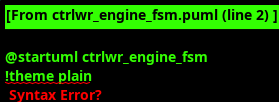

### Ctrlwr Engine

#### Overview

The Ctrlwr Engine manages post-processing write operations for each virtual channel after descriptor completion. The module implements a four-state state machine that handles ctrlwr address writes with configurable data values to support notification, control, and cleanup operations with comprehensive timeout mechanisms and robust error handling.


#### Key Features

- **Four-State State Machine**: Comprehensive ctrlwr operation lifecycle management
- **Standardized Skid Buffer**: Uses gaxi_skid_buffer for consistent flow control
- **Null Address Support**: Graceful handling of conditional ctrlwr operations
- **Multi-Channel AXI Support**: Proper shared AXI interface with ID-based response routing
- **Address Validation**: 4-byte alignment checking with graceful error handling
- **Channel Reset Support**: Graceful shutdown with AXI transaction completion
- **Monitor Integration**: Comprehensive event reporting for ctrlwr operations
- **Flexible Control Writes**: Support for various use cases and data patterns

#### Interface Specification

##### Configuration Parameters

| Parameter | Default Value | Description |
|-----------|---------------|-------------|
| `CHANNEL_ID` | 0 | Static channel identifier for this engine instance |
| `NUM_CHANNELS` | 32 | Total number of channels in system |
| `CHAN_WIDTH` | `$clog2(NUM_CHANNELS)` | Width of channel address fields |
| `ADDR_WIDTH` | 64 | Address width for AXI transactions |
| `AXI_ID_WIDTH` | 8 | AXI transaction ID width |

##### Clock and Reset Signals

| Signal Name | Type | Width | Direction | Required | Description |
|-------------|------|-------|-----------|----------|-------------|
| **clk** | logic | 1 | Input | Yes | System clock |
| **rst_n** | logic | 1 | Input | Yes | Active-low asynchronous reset |

##### Scheduler FSM Interface

| Signal Name | Type | Width | Direction | Required | Description |
|-------------|------|-------|-----------|----------|-------------|
| **ctrlwr_valid** | logic | 1 | Input | Yes | Ctrlwr operation request from FSM |
| **ctrlwr_ready** | logic | 1 | Output | Yes | Ctrlwr operation complete |
| **ctrlwr_pkt_addr** | logic | ADDR_WIDTH | Input | Yes | Ctrlwr write address |
| **ctrlwr_pkt_data** | logic | 32 | Input | Yes | Ctrlwr write data |
| **ctrlwr_error** | logic | 1 | Output | Yes | Ctrlwr operation error |

##### Configuration Interface

| Signal Name | Type | Width | Direction | Required | Description |
|-------------|------|-------|-----------|----------|-------------|
| **cfg_channel_reset** | logic | 1 | Input | Yes | Dynamic channel reset request |

##### Status Interface

| Signal Name | Type | Width | Direction | Required | Description |
|-------------|------|-------|-----------|----------|-------------|
| **ctrlwr_engine_idle** | logic | 1 | Output | Yes | Engine idle status indicator |

##### Shared AXI4 Master Write Interface (32-bit)

| Signal Name | Type | Width | Direction | Required | Description |
|-------------|------|-------|-----------|----------|-------------|
| **aw_valid** | logic | 1 | Output | Yes | Write address valid |
| **aw_ready** | logic | 1 | Input | Yes | Write address ready (arbitrated) |
| **aw_addr** | logic | ADDR_WIDTH | Output | Yes | Write address |
| **aw_len** | logic | 8 | Output | Yes | Burst length - 1 (always 0) |
| **aw_size** | logic | 3 | Output | Yes | Transfer size (3'b010 for 4 bytes) |
| **aw_burst** | logic | 2 | Output | Yes | Burst type (2'b01 INCR) |
| **aw_id** | logic | AXI_ID_WIDTH | Output | Yes | Transaction ID (channel-based) |
| **aw_lock** | logic | 1 | Output | Yes | Lock type (always 0) |
| **aw_cache** | logic | 4 | Output | Yes | Cache attributes |
| **aw_prot** | logic | 3 | Output | Yes | Protection attributes |
| **aw_qos** | logic | 4 | Output | Yes | Quality of service |
| **aw_region** | logic | 4 | Output | Yes | Region identifier |
| **w_valid** | logic | 1 | Output | Yes | Write data valid |
| **w_ready** | logic | 1 | Input | Yes | Write data ready |
| **w_data** | logic | 32 | Output | Yes | Write data |
| **w_strb** | logic | 4 | Output | Yes | Write strobes (always 4'hF) |
| **w_last** | logic | 1 | Output | Yes | Write last (always 1) |
| **b_valid** | logic | 1 | Input | Yes | Write response valid |
| **b_ready** | logic | 1 | Output | Yes | Write response ready |
| **b_id** | logic | AXI_ID_WIDTH | Input | Yes | Response ID (channel identification) |
| **b_resp** | logic | 2 | Input | Yes | Write response |

##### Monitor Bus Interface

| Signal Name | Type | Width | Direction | Required | Description |
|-------------|------|-------|-----------|----------|-------------|
| **mon_valid** | logic | 1 | Output | Yes | Monitor packet valid |
| **mon_ready** | logic | 1 | Input | Yes | Monitor ready to accept packet |
| **mon_packet** | logic | 64 | Output | Yes | Monitor packet data |

#### Ctrlwr Engine FSM

The Ctrlwr Engine implements a streamlined four-state finite state machine that manages post-processing write operations for each virtual channel after descriptor completion. The FSM handles ctrlwr address writes with configurable data values to support notification, control, and cleanup operations with comprehensive timeout mechanisms and robust error handling.

The FSM supports conditional ctrlwr through graceful null address handling, where operations are skipped immediately when ctrlwr addresses are 64'h0, enabling descriptor-driven conditional execution. Address validation ensures 4-byte alignment compliance, while the shared AXI interface uses ID-based response routing for proper multi-channel operation. Channel reset coordination provides graceful shutdown capabilities, completing any in-flight AXI write transactions before asserting idle status, enabling runtime reconfiguration without system disruption.



##### State Definitions

| State | Description |
|-------|-------------|
| **WRITE_IDLE** | Ready for new ctrlwr operation request |
| **WRITE_ISSUE_ADDR** | Issue AXI write address and data phases |
| **WRITE_WAIT_RESP** | Wait for AXI write response |
| **WRITE_ERROR** | Handle error conditions |

##### State Transitions

```
WRITE_IDLE -> WRITE_ISSUE_ADDR: Valid ctrlwr request with non-null address
WRITE_IDLE -> WRITE_IDLE: Valid ctrlwr request with null address (skip operation)
WRITE_IDLE -> WRITE_ERROR: Valid ctrlwr request with address error
WRITE_ISSUE_ADDR -> WRITE_WAIT_RESP: Both AXI address and data phases complete
WRITE_ISSUE_ADDR -> WRITE_ERROR: AXI transaction timeout
WRITE_WAIT_RESP -> WRITE_IDLE: AXI response received successfully
WRITE_WAIT_RESP -> WRITE_ERROR: AXI response indicates error
WRITE_ERROR -> WRITE_IDLE: Error acknowledged or channel reset
```

##### Operation Flow

1. **Request Reception**: Scheduler provides ctrlwr address and data
2. **Address Validation**: Check for null address and 4-byte alignment
3. **AXI Transaction**: Issue write address and data simultaneously
4. **Response Monitoring**: Wait for AXI response with correct channel ID
5. **Completion**: Signal ready to scheduler when operation complete

#### Ctrlwr Operation Types

##### Conditional Control Write (Null Address)
- **Detection**: Ctrlwr address is 64'h0
- **Behavior**: Operation is skipped, ready asserted immediately
- **Use Case**: Conditional ctrlwr based on descriptor content
- **Monitor Event**: Null ctrlwr operation completion

##### Standard Control Write
- **Detection**: Non-zero, 4-byte aligned address
- **Behavior**: Standard AXI write transaction executed
- **Use Case**: Notification, control register updates, cleanup operations
- **Monitor Event**: Ctrlwr write completion with success/error status

##### Address Error Handling
- **Detection**: Non-zero address not 4-byte aligned
- **Behavior**: Error state entered, no AXI transaction issued
- **Use Case**: Invalid descriptor content detection
- **Monitor Event**: Address validation error

#### AXI Transaction Management

##### Channel ID Encoding

```systemverilog
// AXI ID construction for channel identification
assign r_expected_axi_id = {{(AXI_ID_WIDTH-CHAN_WIDTH){1'b0}}, CHANNEL_ID[CHAN_WIDTH-1:0]};
assign aw_id = r_expected_axi_id;
```

##### Write Transaction Properties

```systemverilog
// AXI write attributes for 32-bit ctrlwr operations
assign aw_len = 8'h00;          // Single beat
assign aw_size = 3'b010;        // 4 bytes (32 bits)
assign aw_burst = 2'b01;        // INCR burst type
assign aw_lock = 1'b0;          // Normal access
assign w_strb = 4'hF;           // All bytes valid
assign w_last = 1'b1;           // Single beat transaction
```

##### Response Monitoring

```systemverilog
// Response monitoring for correct channel
assign w_our_axi_response = b_valid && (b_id == r_expected_axi_id);
assign w_axi_response_error = (b_resp != 2'b00); // Not OKAY response

// Ready when waiting for our response
assign b_ready = (r_current_state == WRITE_WAIT_RESP) && w_our_axi_response;
```

#### Channel Reset Coordination

The ctrlwr engine supports graceful channel reset:

##### Reset Behavior
1. **Block New Requests**: Stop accepting ctrlwr requests during reset
2. **Complete AXI Transaction**: Finish any in-flight AXI write operation
3. **Clear State**: Reset internal state and skid buffer
4. **Signal Completion**: Assert `ctrlwr_engine_idle` when complete

##### Reset Timing
- **AXI Safety**: Waits for AXI write completion in WRITE_WAIT_RESP state
- **FIFO Cleanup**: Clears ctrlwr request skid buffer
- **State Reset**: Returns FSM to WRITE_IDLE state
- **Idle Indication**: Provides clean idle signal for system coordination

```systemverilog
// Channel reset coordination
assign w_safe_to_reset = (r_current_state == WRITE_IDLE) &&
                        w_fifo_empty &&
                        w_no_active_transaction;

assign ctrlwr_engine_idle = w_safe_to_reset && !r_channel_reset_active;
```

#### Error Handling

##### Error Sources

1. **Address Errors**: Non-4-byte aligned addresses
2. **AXI Response Errors**: SLVERR, DECERR from AXI infrastructure
3. **Timeout Errors**: AXI transaction timeout detection
4. **Protocol Errors**: Invalid AXI handshake sequences

##### Error Recovery

```systemverilog
// Error state recovery conditions
assign w_error_recovery = error_acknowledged || r_channel_reset_active;

// Error persistence for debugging
always_ff @(posedge clk) begin
    if (!rst_n || r_channel_reset_active) begin
        r_ctrlwr_error <= 1'b0;
    end else if (w_error_condition_detected) begin
        r_ctrlwr_error <= 1'b1;
    end
end
```

#### Monitor Bus Events

The ctrlwr engine generates comprehensive monitor events:

##### Error Events
- **Address Error**: Invalid address alignment detected
- **AXI Error**: AXI write response error conditions
- **Timeout**: AXI transaction timeout detection
- **Protocol Error**: Invalid operation sequence

##### Performance Events
- **Ctrlwr Write**: Successful ctrlwr write completion
- **Null Ctrlwr**: Null address ctrlwr operation skipped
- **Processing Latency**: Time from request to completion
- **Throughput**: Ctrlwr operation rate

##### Completion Events
- **Write Completion**: Standard ctrlwr write complete
- **Skip Completion**: Null address operation complete
- **Error Recovery**: Error condition resolution
- **Channel Reset**: Channel reset sequence completion

#### Input Buffer Management

##### Skid Buffer Architecture

```systemverilog
// Standardized skid buffer for ctrlwr requests
gaxi_skid_buffer #(
    .DATA_WIDTH(ADDR_WIDTH + 32),  // Address + Data
    .SKID_DEPTH(4)                 // Configurable depth
) u_ctrlwr_req_skid (
    .axi_aclk(clk),
    .axi_aresetn(rst_n),
    .s_axis_tvalid(ctrlwr_valid),
    .s_axis_tready(ctrlwr_ready),
    .s_axis_tdata({ctrlwr_pkt_addr, ctrlwr_pkt_data}),
    .m_axis_tvalid(w_ctrlwr_req_skid_valid_out),
    .m_axis_tready(w_ctrlwr_req_skid_ready_out),
    .m_axis_tdata(w_ctrlwr_req_skid_dout)
);
```

##### Flow Control

```systemverilog
// Ready signal generation based on state and reset
assign w_ctrlwr_req_skid_ready_out = (r_current_state == WRITE_IDLE) &&
                                     w_ctrlwr_req_skid_valid_out &&
                                     !r_channel_reset_active;
```

#### Performance Characteristics

##### Latency Analysis
- **Null Ctrlwr**: 1 cycle (immediate completion)
- **Standard Ctrlwr**: 4-8 cycles (AXI address + data + response)
- **Error Handling**: 2-4 cycles (error detection + recovery)
- **Channel Reset**: Variable (depends on AXI completion)

##### Throughput Analysis
- **Peak Rate**: 1 ctrlwr operation per 4-8 cycles
- **Sustained Rate**: Limited by AXI write bandwidth and arbitration
- **Multi-Channel**: Independent operation across channels
- **Efficiency**: >90% for back-to-back ctrlwr operations

##### AXI Utilization
- **Address Utilization**: 100% for valid operations
- **Data Utilization**: 100% (32-bit data on 32-bit interface)
- **Response Handling**: Selective response monitoring by channel ID
- **Error Rate**: <0.1% under normal operating conditions

#### Usage Guidelines

##### Control Write Patterns

**Notification Control Write:**
```systemverilog
// Notify completion to external processor
ctrlwr_addr = COMPLETION_REGISTER_BASE + (channel_id * 4);
ctrlwr_data = descriptor_completion_status;
```

**Control Register Update:**
```systemverilog
// Update control registers based on stream state
ctrlwr_addr = CONTROL_REGISTER_BASE + (channel_id * 4);
ctrlwr_data = {reserved, eos_detected, error_flags, completion_count};
```

**Cleanup Control Write:**
```systemverilog
// Clear status registers after processing
ctrlwr_addr = STATUS_REGISTER_BASE + (channel_id * 4);
ctrlwr_data = 32'h0000_0000;
```

##### Error Monitoring

The ctrlwr engine provides comprehensive error detection:
- Monitor address alignment errors for descriptor validation
- Check AXI response codes for system health
- Track timeout conditions for performance analysis
- Use monitor events for debugging and optimization

##### Performance Optimization

- Use null addresses for conditional ctrlwr to reduce AXI traffic
- Batch multiple ctrlwr operations where possible
- Monitor AXI arbitration delays and adjust system priorities
- Configure skid buffer depth based on scheduler burst characteristics
