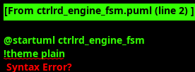

<!-- RTL Design Sherpa Documentation Header -->
<table>
<tr>
<td width="80">
  <a href="https://github.com/sean-galloway/RTLDesignSherpa">
    
  </a>
</td>
<td>
  <strong>RTL Design Sherpa</strong> · <em>Learning Hardware Design Through Practice</em><br>
  <sub>
    <a href="https://github.com/sean-galloway/RTLDesignSherpa">GitHub</a> ·
    <a href="https://github.com/sean-galloway/RTLDesignSherpa/blob/main/docs/DOCUMENTATION_INDEX.md">Documentation Index</a> ·
    <a href="https://github.com/sean-galloway/RTLDesignSherpa/blob/main/LICENSE">MIT License</a>
  </sub>
</td>
</tr>
</table>

---

<!-- End Header -->

### Ctrlrd Engine

#### Overview

The Ctrlrd Engine manages pre-processing read operations for each virtual channel before descriptor execution. The module implements a retry-capable read-and-compare mechanism that polls a control address until the read value matches an expected value, or a maximum retry count is exceeded. This enables synchronization, flag polling, and pre-condition validation before data operations begin.


#### Key Features

- **Read-and-Compare Mechanism**: Automatic retry until read data matches expected value
- **Configurable Retry Count**: Up to 511 retries via `cfg_ctrlrd_max_try[8:0]`
- **Mask Support**: Flexible bit-wise masking for partial value comparison
- **1µs Timeout Counter**: Microsecond-resolution timeout using scheduler_group 1µs tick
- **Standardized Skid Buffer**: Uses gaxi_skid_buffer for consistent flow control
- **Null Address Support**: Graceful handling of conditional ctrlrd operations
- **AXI4 Read Interface**: Standard 32-bit AXI4-Lite read transactions
- **Channel Reset Support**: Graceful shutdown with AXI transaction completion
- **Monitor Integration**: Comprehensive event reporting for ctrlrd operations

#### Interface Specification

##### Configuration Parameters

| Parameter | Default Value | Description |
|-----------|---------------|-------------|
| `CHANNEL_ID` | 0 | Static channel identifier for this engine instance |
| `NUM_CHANNELS` | 32 | Total number of channels in system |
| `CHAN_WIDTH` | `$clog2(NUM_CHANNELS)` | Width of channel address fields |
| `ADDR_WIDTH` | 64 | Address width for AXI transactions |
| `AXI_ID_WIDTH` | 8 | AXI transaction ID width |

##### Clock and Reset Signals

| Signal Name | Type | Width | Direction | Required | Description |
|-------------|------|-------|-----------|----------|-------------|
| **clk** | logic | 1 | Input | Yes | System clock |
| **rst_n** | logic | 1 | Input | Yes | Active-low asynchronous reset |

##### Scheduler FSM Interface

| Signal Name | Type | Width | Direction | Required | Description |
|-------------|------|-------|-----------|----------|-------------|
| **ctrlrd_valid** | logic | 1 | Input | Yes | Ctrlrd operation request from scheduler |
| **ctrlrd_ready** | logic | 1 | Output | Yes | Ctrlrd operation complete (match or error) |
| **ctrlrd_pkt_addr** | logic | ADDR_WIDTH | Input | Yes | Ctrlrd read address |
| **ctrlrd_pkt_data** | logic | 32 | Input | Yes | Ctrlrd expected/comparison data |
| **ctrlrd_pkt_mask** | logic | 32 | Input | Yes | Ctrlrd bit mask for comparison |
| **ctrlrd_error** | logic | 1 | Output | Yes | Ctrlrd operation error (valid with ctrlrd_ready) |
| **ctrlrd_result** | logic | 32 | Output | Yes | Ctrlrd actual read result data |

##### Configuration Interface

| Signal Name | Type | Width | Direction | Required | Description |
|-------------|------|-------|-----------|----------|-------------|
| **cfg_ctrlrd_max_try** | logic | 9 | Input | Yes | Maximum retry count (0-511) |
| **cfg_channel_reset** | logic | 1 | Input | Yes | Dynamic channel reset request |
| **tick_1us** | logic | 1 | Input | Yes | 1 microsecond tick from scheduler_group |

##### Status Interface

| Signal Name | Type | Width | Direction | Required | Description |
|-------------|------|-------|-----------|----------|-------------|
| **ctrlrd_engine_idle** | logic | 1 | Output | Yes | Engine idle status indicator |
| **ctrlrd_retry_count** | logic | 9 | Output | Yes | Current retry count value |

##### Shared AXI4 Read Interface (32-bit)

| Signal Name | Type | Width | Direction | Required | Description |
|-------------|------|-------|-----------|----------|-------------|
| **ar_valid** | logic | 1 | Output | Yes | Read address valid |
| **ar_ready** | logic | 1 | Input | Yes | Read address ready (arbitrated) |
| **ar_addr** | logic | ADDR_WIDTH | Output | Yes | Read address |
| **ar_len** | logic | 8 | Output | Yes | Burst length - 1 (always 0) |
| **ar_size** | logic | 3 | Output | Yes | Transfer size (3'b010 for 4 bytes) |
| **ar_burst** | logic | 2 | Output | Yes | Burst type (2'b01 INCR) |
| **ar_id** | logic | AXI_ID_WIDTH | Output | Yes | Transaction ID (channel-based) |
| **ar_lock** | logic | 1 | Output | Yes | Lock type (always 0) |
| **ar_cache** | logic | 4 | Output | Yes | Cache attributes |
| **ar_prot** | logic | 3 | Output | Yes | Protection attributes |
| **ar_qos** | logic | 4 | Output | Yes | Quality of service |
| **ar_region** | logic | 4 | Output | Yes | Region identifier |
| **r_valid** | logic | 1 | Input | Yes | Read data valid |
| **r_ready** | logic | 1 | Output | Yes | Read data ready |
| **r_data** | logic | 32 | Input | Yes | Read data |
| **r_resp** | logic | 2 | Input | Yes | Read response |
| **r_last** | logic | 1 | Input | Yes | Read last indicator |
| **r_id** | logic | AXI_ID_WIDTH | Input | Yes | Response ID (channel identification) |

##### Monitor Bus Interface

| Signal Name | Type | Width | Direction | Required | Description |
|-------------|------|-------|-----------|----------|-------------|
| **mon_valid** | logic | 1 | Output | Yes | Monitor packet valid |
| **mon_ready** | logic | 1 | Input | Yes | Monitor ready to accept packet |
| **mon_packet** | logic | 64 | Output | Yes | Monitor packet data |

#### Ctrlrd Engine FSM

The Ctrlrd Engine implements a retry-capable read-compare-retry finite state machine that manages control read operations before descriptor execution.



##### State Definitions

| State | Description |
|-------|-------------|
| **READ_IDLE** | Ready for new ctrlrd operation request |
| **READ_ISSUE_ADDR** | Issue AXI read address phase |
| **READ_WAIT_DATA** | Wait for AXI read data response |
| **READ_COMPARE** | Compare read data with expected value |
| **READ_RETRY_WAIT** | Wait 1µs before retry attempt |
| **READ_MATCH** | Read data matched expected value (success) |
| **READ_ERROR** | Handle error conditions (max retries or AXI error) |

##### State Transitions

```
READ_IDLE -> READ_ISSUE_ADDR: Valid ctrlrd request with non-null address
READ_IDLE -> READ_MATCH: Valid ctrlrd request with null address (skip operation)
READ_ISSUE_ADDR -> READ_WAIT_DATA: AXI address phase complete
READ_WAIT_DATA -> READ_COMPARE: AXI read data received
READ_WAIT_DATA -> READ_ERROR: AXI response error (SLVERR, DECERR)
READ_COMPARE -> READ_MATCH: Read data matches expected value (success)
READ_COMPARE -> READ_RETRY_WAIT: Mismatch and retries remaining
READ_COMPARE -> READ_ERROR: Mismatch and max retries exceeded
READ_RETRY_WAIT -> READ_ISSUE_ADDR: 1µs elapsed, retry read
READ_MATCH -> READ_IDLE: Success acknowledged by scheduler
READ_ERROR -> READ_IDLE: Error acknowledged or channel reset
```

##### Operation Flow

1. **Request Reception**: Scheduler provides ctrlrd address, expected data, and mask
2. **Address Validation**: Check for null address (skip operation if 64'h0)
3. **AXI Read Transaction**: Issue read address and wait for data
4. **Data Comparison**: Compare `(r_data & mask) == (expected_data & mask)`
5. **Match Success**: Assert `ctrlrd_ready` without `ctrlrd_error`
6. **Mismatch Handling**:
   - If retries remaining: Wait 1µs, retry read
   - If max retries exceeded: Assert `ctrlrd_ready` with `ctrlrd_error`

#### Retry Mechanism

##### Retry Counter Management

```systemverilog
// Retry counter (0 to cfg_ctrlrd_max_try)
logic [8:0] r_retry_count;
logic w_retries_remaining;

assign w_retries_remaining = (r_retry_count < cfg_ctrlrd_max_try);

// Increment on each retry attempt
if (r_current_state == READ_COMPARE && !w_data_match && w_retries_remaining) begin
    r_retry_count <= r_retry_count + 1;
end

// Reset on new operation or match
if (r_current_state == READ_IDLE || r_current_state == READ_MATCH) begin
    r_retry_count <= 9'h0;
end
```

##### 1µs Retry Delay

```systemverilog
// 1µs delay between retry attempts
// tick_1us provided by scheduler_group counter_freq_invariant
logic r_retry_wait_complete;

always_ff @(posedge clk) begin
    if (!rst_n) begin
        r_retry_wait_complete <= 1'b0;
    end else if (r_current_state == READ_RETRY_WAIT) begin
        if (tick_1us) begin
            r_retry_wait_complete <= 1'b1;
        end
    end else begin
        r_retry_wait_complete <= 1'b0;
    end
end

// Transition to retry after 1µs
if (r_current_state == READ_RETRY_WAIT && r_retry_wait_complete) begin
    w_next_state = READ_ISSUE_ADDR;
end
```

#### Data Comparison Logic

##### Masked Comparison

```systemverilog
// Compare with mask support
logic [31:0] w_masked_expected;
logic [31:0] w_masked_actual;
logic w_data_match;

assign w_masked_expected = r_expected_data & r_mask;
assign w_masked_actual = r_axi_read_data & r_mask;
assign w_data_match = (w_masked_expected == w_masked_actual);

// Comparison in READ_COMPARE state
if (r_current_state == READ_COMPARE) begin
    if (w_data_match) begin
        w_next_state = READ_MATCH;  // Success
    end else if (w_retries_remaining) begin
        w_next_state = READ_RETRY_WAIT;  // Retry after 1µs
    end else begin
        w_next_state = READ_ERROR;  // Max retries exceeded
    end
end
```

##### Null Address Handling

```systemverilog
// Null address detection (skip operation)
logic w_null_address;
assign w_null_address = (r_ctrlrd_addr == 64'h0);

// Skip to READ_MATCH immediately for null addresses
if ((r_current_state == READ_IDLE) && ctrlrd_valid && w_null_address) begin
    w_next_state = READ_MATCH;  // Skip operation, no error
end
```

#### AXI Transaction Management

##### Channel ID Encoding

```systemverilog
// AXI ID construction for channel identification
assign r_expected_axi_id = {{(AXI_ID_WIDTH-CHAN_WIDTH){1'b0}}, CHANNEL_ID[CHAN_WIDTH-1:0]};
assign ar_id = r_expected_axi_id;
```

##### Read Transaction Properties

```systemverilog
// AXI read attributes for 32-bit ctrlrd operations
assign ar_len = 8'h00;          // Single beat
assign ar_size = 3'b010;        // 4 bytes (32 bits)
assign ar_burst = 2'b01;        // INCR burst type
assign ar_lock = 1'b0;          // Normal access
assign ar_cache = 4'b0000;      // Device non-bufferable
assign ar_prot = 3'b000;        // Unprivileged, non-secure, data
assign ar_qos = 4'h0;           // No QoS
assign ar_region = 4'h0;        // Default region
```

##### Response Monitoring

```systemverilog
// Response monitoring for correct channel
assign w_our_axi_response = r_valid && (r_id == r_expected_axi_id);
assign w_axi_response_error = (r_resp != 2'b00); // Not OKAY response

// Ready when waiting for our response
assign r_ready = (r_current_state == READ_WAIT_DATA) && w_our_axi_response;

// Error detection
if (r_current_state == READ_WAIT_DATA && w_our_axi_response) begin
    if (w_axi_response_error) begin
        w_next_state = READ_ERROR;  // AXI error (SLVERR, DECERR)
    end else begin
        r_axi_read_data <= r_data;
        w_next_state = READ_COMPARE;
    end
end
```

#### Channel Reset Coordination

The ctrlrd engine supports graceful channel reset:

##### Reset Behavior

1. **Block New Requests**: Stop accepting ctrlrd requests during reset
2. **Complete AXI Transaction**: Finish any in-flight AXI read operation
3. **Clear State**: Reset internal state and skid buffer
4. **Signal Completion**: Assert `ctrlrd_engine_idle` when complete

##### Reset Timing

```systemverilog
// Channel reset coordination
assign w_safe_to_reset = (r_current_state == READ_IDLE) &&
                        w_fifo_empty &&
                        w_no_active_transaction;

assign ctrlrd_engine_idle = w_safe_to_reset && !r_channel_reset_active;
```

#### Error Handling

##### Error Sources

1. **AXI Response Errors**: SLVERR, DECERR from AXI infrastructure
2. **Max Retries Exceeded**: Read data never matched expected value
3. **Timeout Errors**: Combined with retry count for overall timeout
4. **Protocol Errors**: Invalid AXI handshake sequences

##### Error Recovery

```systemverilog
// Error state outputs
assign ctrlrd_ready = (r_current_state == READ_MATCH) ||
                     (r_current_state == READ_ERROR);
assign ctrlrd_error = (r_current_state == READ_ERROR);

// Error recovery on acknowledgment
if (r_current_state == READ_ERROR && ctrlrd_ready && ctrlrd_valid) begin
    w_next_state = READ_IDLE;
end

// Or on channel reset
if (r_channel_reset_active && r_current_state == READ_ERROR) begin
    w_next_state = READ_IDLE;
end
```

#### Monitor Bus Events

The ctrlrd engine generates comprehensive monitor events:

##### Error Events
- **AXI Read Error**: AXI read response error (SLVERR, DECERR)
- **Max Retries Exceeded**: Retry count exceeded without match
- **Timeout**: Overall operation timeout
- **Protocol Error**: Invalid operation sequence

##### Performance Events
- **Ctrlrd Match**: Successful read-compare match
- **Retry Count**: Number of retry attempts before success
- **Null Ctrlrd**: Null address ctrlrd operation skipped
- **Processing Latency**: Time from request to completion

##### Completion Events
- **Match Completion**: Read data matched expected value
- **Skip Completion**: Null address operation complete
- **Error Recovery**: Error condition resolution
- **Channel Reset**: Channel reset sequence completion

#### Input Buffer Management

##### Skid Buffer Architecture

```systemverilog
// Standardized skid buffer for ctrlrd requests
gaxi_skid_buffer #(
    .DATA_WIDTH(ADDR_WIDTH + 32 + 32),  // Address + Data + Mask
    .SKID_DEPTH(4)                      // Configurable depth
) u_ctrlrd_req_skid (
    .axi_aclk(clk),
    .axi_aresetn(rst_n),
    .s_axis_tvalid(ctrlrd_valid),
    .s_axis_tready(ctrlrd_ready),
    .s_axis_tdata({ctrlrd_pkt_addr, ctrlrd_pkt_data, ctrlrd_pkt_mask}),
    .m_axis_tvalid(w_ctrlrd_req_skid_valid_out),
    .m_axis_tready(w_ctrlrd_req_skid_ready_out),
    .m_axis_tdata(w_ctrlrd_req_skid_dout)
);
```

##### Flow Control

```systemverilog
// Ready signal generation based on state and reset
assign w_ctrlrd_req_skid_ready_out = (r_current_state == READ_IDLE) &&
                                     w_ctrlrd_req_skid_valid_out &&
                                     !r_channel_reset_active;
```

#### Performance Characteristics

##### Latency Analysis
- **Null Ctrlrd**: 1 cycle (immediate completion)
- **Match on First Try**: 6-10 cycles (AXI address + data + compare)
- **Match After Retries**: (6-10 + N x 1µs) where N = retry count
- **Max Retries Exceeded**: (6-10 + cfg_ctrlrd_max_try x 1µs) + error handling

##### Retry Behavior
- **1µs Delay**: Fixed 1 microsecond delay between retry attempts
- **Max Retries**: Configurable 0-511 via `cfg_ctrlrd_max_try[8:0]`
- **Total Timeout**: Up to 511µs maximum retry duration
- **Success Rate**: Depends on external flag update frequency

##### AXI Utilization
- **Address Utilization**: 100% for valid operations
- **Data Utilization**: 100% (32-bit data on 32-bit interface)
- **Response Handling**: Selective response monitoring by channel ID
- **Retry Overhead**: 1µs minimum between attempts (prevents bus saturation)

#### Usage Guidelines

##### Control Read Patterns

**Flag Polling:**
```systemverilog
// Poll for ready flag before descriptor execution
ctrlrd_addr = STATUS_REGISTER_BASE + (channel_id * 4);
ctrlrd_data = 32'h0000_0001;  // Expect bit 0 set
ctrlrd_mask = 32'h0000_0001;  // Check only bit 0
```

**Multi-bit Status Check:**
```systemverilog
// Check multiple status bits before proceeding
ctrlrd_addr = CONTROL_REGISTER_BASE + (channel_id * 4);
ctrlrd_data = 32'h0000_00F0;  // Expect bits [7:4] all set
ctrlrd_mask = 32'h0000_00F0;  // Check only bits [7:4]
```

**Synchronization Check:**
```systemverilog
// Wait for external synchronization event
ctrlrd_addr = SYNC_REGISTER_BASE;
ctrlrd_data = EXPECTED_SYNC_VALUE;
ctrlrd_mask = 32'hFFFF_FFFF;  // Check all bits
```

##### Retry Configuration

Configure retry count based on expected flag update frequency:

```systemverilog
// Fast flags (updated every few microseconds)
cfg_ctrlrd_max_try = 9'd10;   // 10µs maximum wait

// Medium flags (updated every ~100µs)
cfg_ctrlrd_max_try = 9'd100;  // 100µs maximum wait

// Slow flags (updated every millisecond)
cfg_ctrlrd_max_try = 9'd511;  // 511µs maximum wait (max supported)
```

##### Error Monitoring

The ctrlrd engine provides comprehensive error detection:
- Monitor AXI response codes for bus errors
- Track retry count for performance analysis
- Check for max retries exceeded to detect stuck conditions
- Use monitor events for debugging and optimization

##### Performance Optimization

- Use appropriate masks to check only relevant bits
- Configure retry count based on expected flag update frequency
- Monitor retry statistics to optimize polling intervals
- Use null addresses for conditional ctrlrd to reduce AXI traffic

#### Integration with Scheduler Group

##### 1µs Counter Integration

The scheduler_group provides a shared 1µs tick signal to all ctrlrd engines:

```systemverilog
// At scheduler_group level (scheduler_group.sv)
counter_freq_invariant #(
    .WIDTH(32),
    .FREQ_HZ(1_000_000)  // 1 MHz = 1µs period
) u_1us_counter (
    .clk(clk),
    .rst_n(rst_n),
    .tick(tick_1us)  // Shared 1µs tick to all ctrlrd engines
);

// Broadcast to all channels
for (genvar i = 0; i < NUM_CHANNELS; i++) begin
    assign ctrlrd_engine[i].tick_1us = tick_1us;
end
```

##### Channel Array Structure

```systemverilog
// Scheduler group instantiates ctrlrd engines for each channel
generate
    for (genvar i = 0; i < NUM_CHANNELS; i++) begin : gen_ctrlrd_engines
        ctrlrd_engine #(
            .CHANNEL_ID(i),
            .NUM_CHANNELS(NUM_CHANNELS),
            .ADDR_WIDTH(ADDR_WIDTH),
            .AXI_ID_WIDTH(AXI_ID_WIDTH)
        ) u_ctrlrd_engine (
            .clk(clk),
            .rst_n(rst_n),

            // From scheduler
            .ctrlrd_valid(scheduler[i].ctrlrd_valid),
            .ctrlrd_ready(scheduler[i].ctrlrd_ready),
            .ctrlrd_pkt_addr(scheduler[i].ctrlrd_addr),
            .ctrlrd_pkt_data(scheduler[i].ctrlrd_data),
            .ctrlrd_pkt_mask(scheduler[i].ctrlrd_mask),
            .ctrlrd_error(scheduler[i].ctrlrd_error),
            .ctrlrd_result(scheduler[i].ctrlrd_result),

            // Configuration
            .cfg_ctrlrd_max_try(cfg_ctrlrd_max_try[i]),
            .cfg_channel_reset(cfg_channel_reset[i]),
            .tick_1us(tick_1us),  // Shared 1µs tick

            // Shared AXI read interface (arbitrated)
            .ar_valid(ctrlrd_ar_valid[i]),
            .ar_ready(ctrlrd_ar_ready[i]),
            // ... AXI signals ...

            // Monitor bus
            .mon_valid(ctrlrd_mon_valid[i]),
            .mon_ready(ctrlrd_mon_ready[i]),
            .mon_packet(ctrlrd_mon_packet[i])
        );
    end
endgenerate
```

This ctrlrd engine architecture provides robust flag polling and synchronization capabilities with configurable retry mechanisms and comprehensive error handling.
