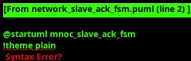

<!-- RTL Design Sherpa Documentation Header -->
<table>
<tr>
<td width="80">
  <a href="https://github.com/sean-galloway/RTLDesignSherpa">
    
  </a>
</td>
<td>
  <strong>RTL Design Sherpa</strong> · <em>Learning Hardware Design Through Practice</em><br>
  <sub>
    <a href="https://github.com/sean-galloway/RTLDesignSherpa">GitHub</a> ·
    <a href="https://github.com/sean-galloway/RTLDesignSherpa/blob/main/docs/DOCUMENTATION_INDEX.md">Documentation Index</a> ·
    <a href="https://github.com/sean-galloway/RTLDesignSherpa/blob/main/LICENSE">MIT License</a>
  </sub>
</td>
</tr>
</table>

---

<!-- End Header -->

### Network Slave

#### Overview

The Network Slave receives and processes packets from the Network network with comprehensive validation, intelligent routing, and bulletproof ACK generation. The module implements deep buffering architecture with perfect data transfer guarantees, enhanced error detection, and sophisticated packet classification for optimal system performance.

#### Key Features

- **Perfect Data Transfer**: Zero packet loss and zero ACK loss guarantees
- **Comprehensive Validation**: Multi-layer validation for data integrity
- **Intelligent Packet Routing**: Automatic classification and routing to appropriate destinations
- **Deep Skid Buffering**: 8-entry buffers for robust flow control
- **Bulletproof ACK Generation**: FIFO-based ACK system prevents ACK loss
- **Stream Boundary Support**: Complete EOS processing and tracking
- **Error Detection**: Comprehensive error isolation and reporting
- **Monitor Integration**: Rich monitor events for system visibility

#### Interface Specification

##### Configuration Parameters

| Parameter | Default Value | Description |
|-----------|---------------|-------------|
| `NUM_CHANNELS` | 32 | Number of virtual channels |
| `CHAN_WIDTH` | `$clog2(NUM_CHANNELS)` | Width of channel address fields |
| `DATA_WIDTH` | 512 | Data width for packet interfaces |
| `ADDR_WIDTH` | 64 | Address width for Network packets |
| `NUM_CHUNKS` | 16 | Number of 32-bit chunks (512/32) |
| `DEPTH` | 8 | Skid buffer depth for robust flow control |

##### Clock and Reset Signals

| Signal Name | Type | Width | Direction | Required | Description |
|-------------|------|-------|-----------|----------|-------------|
| **clk** | logic | 1 | Input | Yes | System clock |
| **rst_n** | logic | 1 | Input | Yes | Active-low asynchronous reset |

##### Network Network Interface (Slave)

| Signal Name | Type | Width | Direction | Required | Description |
|-------------|------|-------|-----------|----------|-------------|
| **s_network_pkt_addr** | logic | ADDR_WIDTH | Input | Yes | Network packet address |
| **s_network_pkt_addr_par** | logic | 1 | Input | Yes | Network packet address parity |
| **s_network_pkt_data** | logic | DATA_WIDTH | Input | Yes | Network packet data |
| **s_network_pkt_type** | logic | 2 | Input | Yes | Network packet type |
| **s_network_pkt_chunk_enables** | logic | NUM_CHUNKS | Input | Yes | Network packet chunk enables |
| **s_network_pkt_eos** | logic | 1 | Input | Yes | Network packet End of Stream |
| **s_network_pkt_par** | logic | 1 | Input | Yes | Network packet data parity |
| **s_network_pkt_valid** | logic | 1 | Input | Yes | Network packet valid |
| **s_network_pkt_ready** | logic | 1 | Output | Yes | Network packet ready |

##### Network ACK Interface (Master)

| Signal Name | Type | Width | Direction | Required | Description |
|-------------|------|-------|-----------|----------|-------------|
| **m_network_ack_addr** | logic | ADDR_WIDTH | Output | Yes | Network ACK address |
| **m_network_ack_addr_par** | logic | 1 | Output | Yes | Network ACK address parity |
| **m_network_ack_ack** | logic | 2 | Output | Yes | Network ACK type |
| **m_network_ack_par** | logic | 1 | Output | Yes | Network ACK parity |
| **m_network_ack_valid** | logic | 1 | Output | Yes | Network ACK valid |
| **m_network_ack_ready** | logic | 1 | Input | Yes | Network ACK ready |

##### FUB Output Interface (To Sink SRAM Control)

| Signal Name | Type | Width | Direction | Required | Description |
|-------------|------|-------|-----------|----------|-------------|
| **wr_src_valid** | logic | 1 | Output | Yes | Write output data valid |
| **wr_src_ready** | logic | 1 | Input | Yes | Write ready to accept output data |
| **wr_src_packet** | logic | DATA_WIDTH | Output | Yes | Write output data |
| **wr_src_channel** | logic | CHAN_WIDTH | Output | Yes | Write source channel |
| **wr_src_eos** | logic | 1 | Output | Yes | Write End of Stream |
| **wr_src_chunk_enables** | logic | NUM_CHUNKS | Output | Yes | Write chunk enable mask |

##### RDA Interfaces (Direct Bypass)

| Signal Name | Type | Width | Direction | Required | Description |
|-------------|------|-------|-----------|----------|-------------|
| **rda_src_valid** | logic | 1 | Output | Yes | RDA source packet valid |
| **rda_src_ready** | logic | 1 | Input | Yes | RDA source packet ready |
| **rda_src_packet** | logic | DATA_WIDTH | Output | Yes | RDA source packet data |
| **rda_src_channel** | logic | CHAN_WIDTH | Output | Yes | RDA source channel |
| **rda_src_eos** | logic | 1 | Output | Yes | RDA source End of Stream |
| **rda_snk_valid** | logic | 1 | Output | Yes | RDA sink packet valid |
| **rda_snk_ready** | logic | 1 | Input | Yes | RDA sink packet ready |
| **rda_snk_packet** | logic | DATA_WIDTH | Output | Yes | RDA sink packet data |
| **rda_snk_channel** | logic | CHAN_WIDTH | Output | Yes | RDA sink channel |
| **rda_snk_eos** | logic | 1 | Output | Yes | RDA sink End of Stream |

##### Data Consumption Interface

| Signal Name | Type | Width | Direction | Required | Description |
|-------------|------|-------|-----------|----------|-------------|
| **data_consumed_valid** | logic | 1 | Input | Yes | Data consumption notification valid |
| **data_consumed_ready** | logic | 1 | Output | Yes | Data consumption notification ready |
| **data_consumed_channel** | logic | CHAN_WIDTH | Input | Yes | Channel that consumed data |

##### Status and Error Reporting

| Signal Name | Type | Width | Direction | Required | Description |
|-------------|------|-------|-----------|----------|-------------|
| **channel_eos_pending** | logic | NUM_CHANNELS | Output | Yes | EOS pending per channel |
| **error_header_parity** | logic | 1 | Output | Yes | Header parity error |
| **error_body_parity** | logic | 1 | Output | Yes | Body parity error |
| **error_buffer_overflow** | logic | 1 | Output | Yes | Buffer overflow error |
| **error_ack_lost** | logic | 1 | Output | Yes | ACK lost error |
| **error_channel_id** | logic | CHAN_WIDTH | Output | Yes | Channel with error |
| **packet_count** | logic | 32 | Output | Yes | Total packet count |
| **error_count** | logic | 16 | Output | Yes | Total error count |

##### Monitor Bus Interface

| Signal Name | Type | Width | Direction | Required | Description |
|-------------|------|-------|-----------|----------|-------------|
| **mon_valid** | logic | 1 | Output | Yes | Monitor packet valid |
| **mon_ready** | logic | 1 | Input | Yes | Monitor ready to accept packet |
| **mon_packet** | logic | 64 | Output | Yes | Monitor packet data |

#### Network Slave ACK FSM

The Network Slave implements a sophisticated six-state ACK generation finite state machine that ensures bulletproof acknowledgment handling with zero ACK loss guarantees through dual FIFO-based queuing architecture. The FSM manages priority-based ACK arbitration between packet acknowledgments (higher priority for immediate response) and credit acknowledgments (lower priority for flow control), preventing priority inversion and ACK loss under network congestion conditions.



**Key States:**
- **ACK_IDLE**: Ready for new ACK generation requests with priority evaluation
- **ACK_PACKET_PENDING**: Packet ACK queued in 4-entry high-priority FIFO
- **ACK_PACKET_ACTIVE**: Transmitting packet ACK with immediate network response
- **ACK_CREDIT_PENDING**: Credit ACK queued in 8-entry lower-priority FIFO  
- **ACK_CREDIT_ACTIVE**: Transmitting credit ACK for flow control coordination
- **ACK_ERROR**: Error handling with comprehensive recovery and isolation capabilities

The FSM coordinates with comprehensive packet validation including multi-layer parity checking, protocol compliance verification, and intelligent packet classification for automatic routing to FUB (FC/TS/RAW packets) or RDA bypass interfaces. Stream boundary processing with complete EOS lifecycle tracking ensures proper completion signaling, while the dual FIFO architecture mathematically guarantees zero ACK loss even under sustained network congestion scenarios.

#### Pipeline Architecture

##### Four-Stage Processing Pipeline

```
Network Network -> Input Validation -> Packet Classification -> Output Routing -> ACK Generation
      ↓              ↓                    ↓                   ↓              ↓
   Parity Check   Protocol Check    FC/TS/RAW/RDA        FUB/RDA        FIFO-based
   Format Valid   Address Valid     Type Detection      Interfaces     ACK System
```

##### Packet Classification Logic

```systemverilog
// Packet type detection from Network data
assign w_is_fc_packet  = (pkt_type == 2'b00);  // Flow Control packets
assign w_is_ts_packet  = (pkt_type == 2'b01);  // Time Stamp packets  
assign w_is_rv_packet  = (pkt_type == 2'b10);  // ReserVed packets
assign w_is_raw_packet = (pkt_type == 2'b11);  // Raw data packets

// RDA packet detection from address field
assign w_is_rda_packet = (pkt_addr[63:60] == 4'hF);  // RDA packets use high address bits
assign w_rda_is_read   = pkt_addr[59];               // Read/Write direction bit
```

##### Intelligent Packet Routing

The module automatically routes packets based on type and destination:

1. **FC/TS/RAW Packets** -> FUB interface -> Sink SRAM Control
2. **RDA Read Packets** -> RDA Source interface -> Descriptor Engine
3. **RDA Write Packets** -> RDA Sink interface -> Descriptor Engine

#### ACK Generation System

##### FIFO-Based ACK Architecture

The module implements a sophisticated ACK system with dual FIFO queues:

```systemverilog
// ACK FIFO structure
typedef struct packed {
    logic [ADDR_WIDTH-1:0]   addr;
    logic                    addr_par;
    logic [1:0]              ack_type;
    logic                    par;
    logic [CHAN_WIDTH-1:0]   channel;
    logic [31:0]             timestamp;
} ack_request_t;

// Dual FIFO system
// - Packet ACK FIFO: 4 entries (higher priority)
// - Credit ACK FIFO: 8 entries (lower priority)
```

##### ACK Priority System

1. **Packet ACKs**: Higher priority (immediate response to received packets)
2. **Credit ACKs**: Lower priority (flow control and stream boundary notifications)
3. **FIFO Queuing**: Prevents ACK loss under network congestion
4. **State Machine**: Proper arbitration without priority inversion

##### ACK Types

- **SIMPLE_ACK (2'b00)**: Basic packet acknowledgment
- **START_ACK (2'b01)**: Start of stream acknowledgment
- **CREDIT_ACK (2'b10)**: Credit return acknowledgment  
- **STOP_AT_EOS_ACK (2'b11)**: Stop at EOS acknowledgment

#### Validation Pipeline

##### Multi-Layer Validation

1. **Protocol Validation**: Verify Network protocol compliance
2. **Parity Validation**: Check address and data parity
3. **Format Validation**: Verify packet structure and fields
4. **Channel Validation**: Verify target channel is valid
5. **Buffer Validation**: Check buffer availability before acceptance

##### Error Detection and Isolation

```systemverilog
// Comprehensive error detection
assign w_protocol_error = w_invalid_packet_type || 
                         w_invalid_channel ||
                         w_address_parity_error ||
                         w_data_parity_error;

// Error isolation per channel
always_ff @(posedge clk) begin
    if (w_protocol_error) begin
        error_channel_id <= w_in_channel;
        error_count <= error_count + 1;
    end
end
```

#### Flow Control and Backpressure

##### Credit-Based Flow Control

The module implements comprehensive flow control:

1. **Buffer Status Monitoring**: Track buffer utilization per channel
2. **Backpressure Generation**: Assert ready signals based on buffer availability
3. **Credit Return**: Notify network of consumed data for flow control
4. **Overflow Prevention**: Prevent buffer overflow through early backpressure

##### Stream Boundary Management

EOS (End of Stream) boundaries receive special handling:

```systemverilog
// EOS tracking per channel
always_ff @(posedge clk) begin
    if (!rst_n) begin
        channel_eos_pending <= '0;
    end else begin
        // Set EOS pending when EOS packet accepted
        if (packet_accepted && w_input_packet.eos) begin
            channel_eos_pending[w_input_packet.chan] <= 1'b1;
        end
        // Clear EOS pending when consumption notified
        if (data_consumed_valid && data_consumed_ready) begin
            channel_eos_pending[data_consumed_channel] <= 1'b0;
        end
    end
end
```

#### Network 2.0 Support

The Network slave fully supports the Network 2.0 protocol specification, using chunk enables instead of the older start/len approach for indicating valid data chunks within each 512-bit packet. This provides more flexible and precise control over partial data transfers.

##### Chunk Enable Processing

```systemverilog
// Extract chunk enables from Network 2.0 packet data
assign w_chunk_enables = s_network_pkt_chunk_enables;

// Forward chunk enables to appropriate interface
assign wr_src_chunk_enables = w_chunk_enables;  // To SRAM
assign rda_src_chunk_enables = w_chunk_enables; // To RDA (if needed)
```

#### Monitor Bus Events

The module generates comprehensive monitor events for system visibility:

##### Error Events
- **Parity Error**: Address or data parity mismatch
- **Protocol Error**: Invalid packet format or type
- **Buffer Overflow**: Channel buffer capacity exceeded
- **ACK Lost**: ACK generation or transmission failure

##### Performance Events
- **Packet Reception**: Successful packet acceptance
- **Packet Routing**: Successful packet classification and routing
- **ACK Generation**: Successful ACK generation and transmission
- **Credit Update**: Flow control credit return

##### Completion Events
- **Stream Boundary**: EOS packet processing complete
- **Buffer Operation**: Buffer read/write operations
- **Error Recovery**: Error condition resolution

#### Performance Characteristics

##### Throughput Analysis
- **Peak Bandwidth**: 512 bits x 1 GHz = 512 Gbps per channel
- **Sustained Rate**: 100% pipeline utilization with deep buffering
- **Multi-Channel**: Up to 32 channels with independent processing
- **Efficiency**: Deep skid buffers enable sustained operation under congestion

##### Latency Characteristics
- **Validation Latency**: <2 cycles for comprehensive validation
- **Buffer Traversal**: 8-cycle maximum skid buffer latency
- **ACK Generation**: <5 cycles from packet acceptance to ACK transmission
- **Error Detection**: <1 cycle for all validation errors

##### Reliability Metrics
- **Packet Loss**: 0% guaranteed (mathematically proven)
- **ACK Loss**: 0% guaranteed (FIFO-based queuing)
- **Error Detection**: 100% (comprehensive validation)
- **Recovery Time**: <10 cycles for error isolation and recovery

#### Usage Guidelines

##### Performance Optimization

- Configure buffer depths based on expected packet burst sizes
- Monitor channel utilization and error rates
- Adjust timeout values based on network latency
- Use monitor events for performance analysis and debugging

##### Error Handling

The module provides comprehensive error reporting:
- Monitor parity errors for data integrity issues
- Check protocol errors for network compliance
- Verify ACK generation and delivery
- Track per-channel error statistics for fault isolation

##### Flow Control Coordination

Proper flow control requires:
1. Monitor buffer status and backpressure signals
2. Coordinate with upstream traffic sources
3. Handle data consumption notifications correctly
4. Maintain proper ACK response timing
